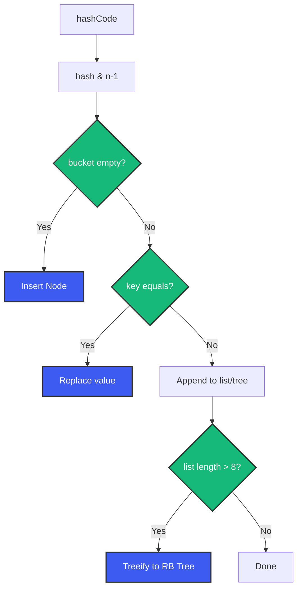

# Java Collections Framework Deep Dive

## Overview

Every backend application is built on collections. Orders in a list, users keyed by ID in a map, unique email addresses in a set, tasks waiting in a queue. Pick the wrong collection and your carefully tuned service turns into a latency nightmare. This guide gives you the mental model to choose the right collection every time.

---

## Problem Statement

Consider an e-commerce order processing system. You need to:
- Look up orders by ID millions of times per minute
- Deduplicate incoming payment events
- Maintain a FIFO queue of pending fulfillment tasks
- Keep top-N best-selling products

Every requirement implies a different data structure. Using `ArrayList` for lookups by ID (O(n)) when `HashMap` (O(1)) exists is the kind of mistake that costs millions in cloud bills.

---

## The Collection Hierarchy

```
┌─────────────────────────────────────────────────────────┐
│                      Iterable                            │
│                            ↓                             │
│                      Collection                          │
│                    /     |      \                         │
│                   /      |       \                        │
│                  List    Set     Queue                    │
│                 /  \    /|\       / \                     │
│          ArrayList  LinkedList  ...  ...                  │
│                                                           │
│     Map (separate interface, NOT a Collection)            │
│        /       |        |         \                       │
│    HashMap  TreeMap  LinkedHashMap  ConcurrentHashMap     │
└─────────────────────────────────────────────────────────┘
```

**Key insight**: `Map` does not extend `Collection`. It's a separate top-level interface. But conceptually, it's part of the collections framework.

---

## List Interface — Ordered, Indexed, Allows Duplicates

### ArrayList

```java
List<String> names = new ArrayList<>();
names.add("Alice");   // O(1) amortized
names.get(0);         // O(1) — random access via array index
names.remove(0);      // O(n) — shifts all elements
names.contains("Bob"); // O(n) — linear scan
```

**Internal**: Backed by `Object[]` array. When full, creates a new array 1.5x larger and copies elements.

**When to use**: Almost always. Best for iteration, random access, append-heavy workloads.

### LinkedList

```java
List<String> queue = new LinkedList<>();
queue.add("first");      // O(1) — appends to tail
queue.add(0, "new");     // O(n) — traverse to index
queue.get(0);            // O(n) — traverse from head
```

**Internal**: Doubly-linked list of `Node<E>` objects. Each node stores data + prev/next pointers.

**When to use**: Frequent insert/delete in the middle. But honestly, `ArrayDeque` beats it for queue/stack use cases. LinkedList is rarely the right answer in modern Java.

### Performance Comparison

| Operation | ArrayList | LinkedList |
|-----------|-----------|------------|
| `add()` (end) | O(1) amortized | O(1) |
| `add(index)` | O(n) | O(n) |
| `get(index)` | O(1) | O(n) |
| `contains()` | O(n) | O(n) |
| `remove(0)` | O(n) | O(1) — just unlink |
| Memory | Compact (array) | Large (node objects) |

---

## Set Interface — No Duplicates

### HashSet

```java
Set<String> uniqueEmails = new HashSet<>();
uniqueEmails.add("a@example.com"); // O(1)
uniqueEmails.contains("b@example.com"); // O(1)
```

**Internal**: Backed by `HashMap` (the keys are your elements, value is a dummy `PRESENT` object). Uses `hashCode()` to determine bucket, `equals()` to resolve collisions.

**When to use**: Fast uniqueness checks. No ordering guarantees.

### LinkedHashSet

```java
Set<String> insertionOrder = new LinkedHashSet<>();
insertionOrder.add("first");
insertionOrder.add("second");
// Iteration order = insertion order
```

**Internal**: HashSet + doubly-linked list running through entries.

**When to use**: Need uniqueness + predictable iteration order.

### TreeSet

```java
Set<Integer> sorted = new TreeSet<>();
sorted.add(100);
sorted.add(1);
sorted.add(50);
// Iteration: 1, 50, 100 (natural order)
```

**Internal**: Red-Black tree. All operations O(log n).

**When to use**: Need sorted elements or range queries (subSet, headSet, tailSet).

```java
TreeSet<Integer> set = new TreeSet<>(Set.of(1, 5, 10, 20, 50));
SortedSet<Integer> range = set.subSet(5, 20); // [5, 10)
```

---

## Map Interface — Key-Value Associations

### HashMap

```java
Map<String, Order> orders = new HashMap<>();
orders.put("ORD-001", order); // O(1)
Order o = orders.get("ORD-001"); // O(1)
```

**Internal — the most important data structure in backend Java:**

1. Array of `Node<K,V>` buckets (default size 16).
2. `put(key, val)`: compute `hash = key.hashCode() ^ (h >>> 16)` (spread bits), `index = hash & (n-1)`.
3. If bucket is empty, place node. If occupied, compare via `equals()`. If same key, replace. If different (collision), append to linked list.
4. **Treeification**: When a bucket's list length >= 8 AND total array size >= 64, convert to Red-Black tree. This prevents O(n) degradation from hash collisions.
5. **Resizing**: When `size > capacity * loadFactor` (default 0.75), double capacity and rehash all entries.



### LinkedHashMap

```java
Map<String, Order> accessOrder = new LinkedHashMap<>(16, 0.75f, true);
// true = access order (for LRU cache)

@Override
protected boolean removeEldestEntry(Map.Entry eldest) {
    return size() > 100; // Auto-evict oldest on access
}
```

**Internal**: HashMap + doubly-linked list of entries. Maintains iteration order (insertion or access).

**When to use**: LRU caches, maintaining order while needing O(1) lookups.

### TreeMap

```java
Map<String, Config> config = new TreeMap<>();
config.put("payment", ...);
config.put("notification", ...);
// Sorted by key
```

**Internal**: Red-Black tree. O(log n) for put/get/remove.

**When to use**: Need sorted keys, floor/ceiling/range queries.

### EnumMap

```java
enum Status { PENDING, CONFIRMED, SHIPPED, DELIVERED }

Map<Status, List<Order>> byStatus = new EnumMap<>(Status.class);
```

**Internal**: Array indexed by enum ordinal. O(1), zero memory overhead. Faster than HashMap for enum keys.

### Performance Comparison

| Operation | HashMap | TreeMap | LinkedHashMap |
|-----------|---------|---------|---------------|
| `put()` | O(1)* | O(log n) | O(1)* |
| `get()` | O(1)* | O(log n) | O(1)* |
| `containsKey()` | O(1)* | O(log n) | O(1)* |
| Iteration order | Chaotic | Sorted | Insertion/access |
| Memory | Modest | Higher | Modest + links |

*Amortized O(1) assuming good hash distribution.

---

## Queue and Deque — The Collections You're Probably Misusing

### PriorityQueue

```java
Queue<Task> pq = new PriorityQueue<>(Comparator.comparing(Task::priority));
pq.offer(new Task("fix-bug", 1));  // Highest priority
pq.offer(new Task("send-email", 5));
Task next = pq.poll(); // Returns fix-bug
```

**Internal**: Binary heap. O(log n) for offer/poll. O(1) for peek.

**When to use**: Priority-based processing (job queues, Dijkstra's algorithm).

### ArrayDeque

```java
Deque<String> stack = new ArrayDeque<>();
stack.push("first");  // LIFO — stack
stack.pop();

Deque<String> queue = new ArrayDeque<>();
queue.offer("first"); // FIFO — queue
queue.poll();
```

**Internal**: Resizable circular array. Faster than `Stack` (synchronized, legacy) and `LinkedList` (node overhead).

**When to use**: Whenever you need a stack or queue. Default choice.

---

## Concurrent Collections

### ConcurrentHashMap

```java
Map<String, Session> activeSessions = new ConcurrentHashMap<>();
activeSessions.compute(sessionId, (key, existing) -> {
    if (existing == null || existing.isExpired()) {
        return new Session(userId);
    }
    return existing;
});
```

**Internal**: Segmented. By default, 16 segments. Reads are lock-free (volatile reads). Writes lock only the specific segment. Java 8+ uses CAS + synchronized on individual bins.

**When to use**: Thread-safe map in high-concurrency scenarios. Never use `HashMap` with external synchronization in production.

### CopyOnWriteArrayList

```java
List<String> listeners = new CopyOnWriteArrayList<>();
// Iteration-safe without locking
for (String listener : listeners) {
    notify(listener);
}
```

**Internal**: On every mutation, creates a fresh copy of the backing array.

**When to use**: Read-heavy, write-rare collections (event listeners, config).

### BlockingQueue Implementations

```java
// Producer-Consumer pattern
BlockingQueue<Order> queue = new LinkedBlockingQueue<>(1000);

// Producer
queue.put(order); // Blocks if full

// Consumer
Order order = queue.take(); // Blocks if empty
```

- `ArrayBlockingQueue`: Bounded, single lock, fast
- `LinkedBlockingQueue`: Optionally bounded, linked nodes, two locks (put/take)
- `SynchronousQueue`: Zero capacity — handoff only
- `PriorityBlockingQueue`: Unbounded priority heap

---

## Choosing the Right Collection — Decision Flow

```
Need key-value lookups?
  ├─ Yes → Need ordering?
  │        ├─ No → Concurrent access? → Yes → ConcurrentHashMap
  │        │                          → No  → HashMap
  │        ├─ Insertion order → LinkedHashMap
  │        └─ Sorted → TreeMap
  ├─ No → Need uniqueness?
          ├─ Yes → Need ordering?
          │        ├─ No → HashSet
          │        ├─ Insertion → LinkedHashSet
          │        └─ Sorted → TreeSet
          └─ No → Need indexed access?
                   ├─ Yes → ArrayList
                   ├─ Queue behavior?
                   │     ├─ FIFO → ArrayDeque
                   │     └─ Priority → PriorityQueue
                   └─ Stack → ArrayDeque
```

---

## Internal Working Deep Dive

### Hash Collision Resolution (HashMap)

When two keys land in the same bucket, Java 8+ uses:

- **LinkedList** (up to 7 entries): Insert at end. `contains()` does O(n) scan.
- **Red-Black Tree** (8+ entries, array >= 64): O(log n) lookup.

Why treeify? A malicious client could craft keys that all hash to the same bucket, causing O(n) degradation (HashDoS attack). Treeification limits worst case to O(log n).

```java
static final int TREEIFY_THRESHOLD = 8;
static final int UNTREEIFY_THRESHOLD = 6;
static final int MIN_TREEIFY_CAPACITY = 64;
```

### Resizing (Rehashing)

When load factor threshold is crossed:

1. Create array 2x size.
2. For each entry, recompute index: `hash & (newCap - 1)`.
3. In Java 8+, entries stay in place or move by `oldCap` offset (optimization using bitwise AND).

Resizing is O(n). For large maps, pre-size:

```java
// Expecting 10,000 entries → initial capacity = 10,000 / 0.75 ≈ 13,334
Map<String, Order> orders = new HashMap<>(13334);
```

---

## Common Mistakes

1. **Using `ArrayList` for frequent lookups by ID**: O(n) vs O(1) with `HashMap`. 1000 lookups on 10M elements = 10B operations vs 1000.
2. **Concurrent modification without synchronization**: `HashMap` in multi-threaded context = infinite loops (resizing race), corrupted data.
3. **Mutable keys in HashMap**: Change a field that affects `hashCode()` after insertion → can never find the entry again.
4. **Ignoring `equals()` and `hashCode()` contract**: If `a.equals(b)` then `a.hashCode() == b.hashCode()`. Violate this = collections behave randomly.
5. **Using `Hashtable` or `Vector`**: Legacy synchronized classes. Use `ConcurrentHashMap` and `ArrayList`.
6. **Forgetting to pre-size**: `HashMap(16)` default causes multiple resizes for 10k entries.

---

## Best Practices

1. Program to interfaces: `List<String>`, `Map<K,V>`, `Set<E>` — not concrete types.
2. Use immutable collections: `List.of()`, `Set.of()`, `Map.of()` for fixed data.
3. Pre-size collections when size is known.
4. Use `EnumMap` for enum keys — faster and safer.
5. Use `Collections.unmodifiableList()` for read-only views (fail-fast on mutation attempts).
6. In APIs, return `Collection` or `List` — let callers decide the concrete type.
7. For multi-threaded access, always use `ConcurrentHashMap` — not `Collections.synchronizedMap()`.

---

## Interview Perspective

HashMap internals are the single most commonly asked data structure question in Java interviews. Know:
- How `hashCode()` and `equals()` interact
- What happens during a collision (before and after treeification)
- How resizing works and why 0.75 load factor is the default (space-time tradeoff)
- Why `ConcurrentHashMap` reads are lock-free
- Difference between `LinkedHashMap` and `TreeMap` iteration order

But the deeper question interviewers are asking: Does this engineer understand the *cost* of data structure choices? At scale, choosing `LinkedList` over `ArrayDeque`, or `TreeMap` over `HashMap` when sorting isn't needed, costs real money.

---

## Conclusion

The Java Collections Framework is not a random assortment of data structures — it's a coherent design that gives you predictable performance contracts for every operation. Understand the internals. Measure your access patterns. Choose accordingly. Your production systems will thank you.

Happy Coding
