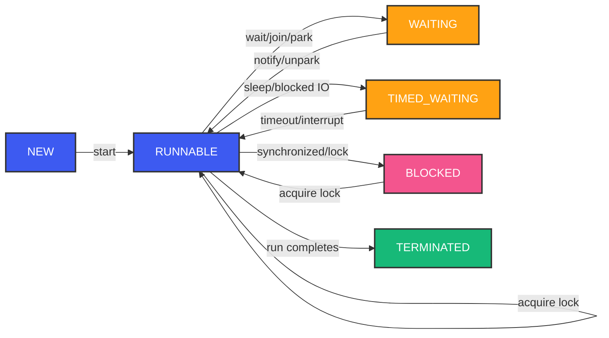
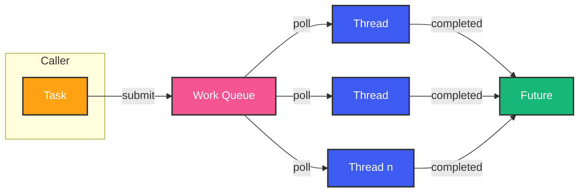

# Java Concurrency and Multithreading

## Overview

Concurrency is where backend engineering separates from application programming. A single-threaded application can handle maybe one request at a time. A well-tuned concurrent system handles thousands simultaneously without corrupting data. This guide builds your mental model from threads through locks, executors, and into modern virtual threads.

---

## Problem Statement

You're building a payment processing system. Multiple threads check account balances, deduct amounts, and credit merchants. Without proper concurrency control, two threads might read the same balance simultaneously, both approve the payment, and the account goes negative. Or worse — you lose money.

Concurrency is hard because:
- Threads execute in unpredictable order
- CPU caches create stale views of memory
- Compilers and JITs reorder instructions
- Race conditions reproduce unreliably (only in production, at 3 AM, during peak traffic)

---

## Thread Lifecycle

A Java thread has six states:



**NEW**: Created but not started. `new Thread(() -> ...)`.

**RUNNABLE**: Eligible for CPU. The OS scheduler decides when it actually runs.

**BLOCKED**: Waiting to acquire a monitor lock (synchronized block).

**WAITING**: Indefinite wait (`wait()`, `join()`, `LockSupport.park()`).

**TIMED_WAITING**: Time-bounded wait (`sleep(ms)`, `wait(timeout)`).

**TERMINATED**: `run()` completed or threw uncaught exception.

---

## The Foundation: Thread

```java
// Way 1: Extend Thread (avoid — locks you into inheritance)
class PaymentThread extends Thread {
    @Override
    public void run() {
        processPayment();
    }
}

// Way 2: Implement Runnable (preferred — decouples task from execution)
Runnable task = () -> processPayment();
new Thread(task).start();

// Way 3: Callable + Future (returns result, can throw)
Callable<PaymentResult> callable = () -> processPayment();
ExecutorService executor = Executors.newFixedThreadPool(10);
Future<PaymentResult> future = executor.submit(callable);
PaymentResult result = future.get(); // blocks until done
```

**Key insight**: Never create raw threads in production code. Always use an `ExecutorService`. Raw threads are expensive (~1MB stack per thread), hard to manage, and easy to leak.

---

## Synchronization Primitives

### `synchronized` — The Simple Lock

```java
public class Account {
    private long balance;

    public synchronized void deposit(long amount) {
        balance += amount;
    }

    public synchronized void withdraw(long amount) {
        if (balance >= amount) balance -= amount;
    }
}
```

**WHAT**: Mutual exclusion — only one thread executes the synchronized block at a time.

**WHY**: `balance += amount` is NOT atomic. It's: read balance, add amount, write balance. Two threads interleaving here = lost update.

**HOW**: Every Java object has a monitor. `synchronized` acquires the monitor. Other threads block until release.

**Internal**: Biased locking → lightweight locking (CAS) → heavyweight locking (OS mutex). The JVM escalates locks as contention increases.

### `volatile` — Visibility, Not Atomicity

```java
public class FlagHolder {
    private volatile boolean running = true;

    public void stop() { running = false; }

    public void work() {
        while (running) { /* do work */ }
    }
}
```

**WHAT**: Reads of `volatile` always see the latest write, even from another thread.

**WHY**: Without `volatile`, a thread might cache `running = true` in its register/CPU cache and never see the update from another thread.

**Limitation**: `volatile` provides visibility but NOT atomicity. `volatile int count++;` is still broken (read-increment-write is not atomic).

### The `synchronized` vs `volatile` Decision

| Aspect | synchronized | volatile |
|--------|-------------|----------|
| Mutual exclusion | Yes | No |
| Visibility | Yes | Yes |
| Atomicity | Yes | No (single read/write only) |
| Performance | Costly (lock) | Cheap (memory barrier) |
| Use case | Compound actions | Status flags, completed markers |

---

## Locks

### ReentrantLock

```java
Lock lock = new ReentrantLock();
lock.lock();
try {
    // critical section
    balance -= amount;
} finally {
    lock.unlock(); // ALWAYS in finally
}
```

**More flexible than `synchronized`**:
- `tryLock()`: attempt without blocking forever
- `lockInterruptibly()`: respond to interruption
- Fairness: `new ReentrantLock(true)` for FIFO ordering (rarely needed — hurts throughput)

### ReadWriteLock

```java
ReadWriteLock rw = new ReentrantReadWriteLock();

// Readers — concurrent (no mutual exclusion among readers)
rw.readLock().lock();
try {
    return account.getBalance();
} finally {
    rw.readLock().unlock();
}

// Writer — exclusive
rw.writeLock().lock();
try {
    account.deposit(amount);
} finally {
    rw.writeLock().unlock();
}
```

**When**: Read-heavy workloads. Multiple readers can read simultaneously. Writer gets exclusive access. Much higher throughput than a single `synchronized` for read-dominant data.

### StampedLock (Java 8+)

```java
StampedLock sl = new StampedLock();

// Optimistic read — totally lock-free! But must validate
long stamp = sl.tryOptimisticRead();
double balance = account.balance;
if (!sl.validate(stamp)) {
    // Someone wrote during our read — retry with pessimistic
    stamp = sl.readLock();
    try {
        balance = account.balance;
    } finally {
        sl.unlockRead(stamp);
    }
}
```

**Optimistic reads**: Assume no writer interferes. Read without lock, then validate. If collision, retry with regular read lock. Much faster under low contention.

---

## ExecutorService and ThreadPoolExecutor



### ThreadPoolExecutor Configuration

```java
ThreadPoolExecutor executor = new ThreadPoolExecutor(
    10,       // corePoolSize — threads kept alive even idle
    50,       // maxPoolSize — can grow to this
    60,       // keepAliveTime — idle threads beyond core die after
    TimeUnit.SECONDS,
    new LinkedBlockingQueue<>(100), // work queue
    new ThreadPoolExecutor.CallerRunsPolicy() // rejection policy
);
```

**The thread pool flow**:
1. Task submitted → if pool < corePoolSize, create new thread.
2. If pool at core, queue the task.
3. If queue full AND pool < maxPoolSize, create new thread.
4. If queue full AND pool at max → rejection policy.

**Rejection policies**:
- `AbortPolicy` (default): Throws `RejectedExecutionException`
- `CallerRunsPolicy`: Runs task in caller's thread (backpressure)
- `DiscardPolicy`: Silently discards
- `DiscardOldestPolicy`: Discards oldest queued task

### Sizing Thread Pools

For **CPU-bound** work:
```
Threads ≈ Runtime.getRuntime().availableProcessors() + 1
```

For **I/O-bound** work:
```
Threads ≈ availableProcessors * (1 + waitTime / serviceTime)
```

If each request takes 10ms of CPU and 90ms waiting for DB, then 10 threads can keep the CPU saturated (1 + 90/10 = 10). More threads = more concurrent I/O.

---

## ForkJoinPool

```java
ForkJoinPool pool = new ForkJoinPool(4);

int[] data = new int[1_000_000];
int sum = pool.invoke(new SumTask(data, 0, data.length));
```

ForkJoinPool is `ForkJoinPool.commonPool()` — the pool used by parallel streams. It uses **work-stealing**: idle threads steal tasks from busy threads' queues. This balances load automatically.

```java
class SumTask extends RecursiveTask<Integer> {
    private static final int THRESHOLD = 10_000;
    private final int[] data;
    private final int start, end;

    @Override
    protected Integer compute() {
        if (end - start <= THRESHOLD) {
            int sum = 0;
            for (int i = start; i < end; i++) sum += data[i];
            return sum;
        }
        int mid = (start + end) / 2;
        SumTask left = new SumTask(data, start, mid);
        SumTask right = new SumTask(data, mid, end);
        left.fork();            // Queue left for other threads
        int rightSum = right.compute(); // Compute right in current thread
        int leftSum = left.join();      // Wait for left
        return leftSum + rightSum;
    }
}
```

---

## CompletableFuture

```java
CompletableFuture<PaymentResult> future =
    CompletableFuture.supplyAsync(() -> processPayment(order))
        .thenApply(result -> enrichWithFraudCheck(result))
        .thenAccept(finalResult -> notifyUser(finalResult))
        .exceptionally(throwable -> {
            log.error("Payment failed", throwable);
            return fallbackResult;
        });
```

**WHAT**: Composable asynchronous programming. Chain dependent operations without blocking.

**WHY**: Thread-per-request wastes threads on waiting. `CompletableFuture` lets threads do useful work while I/O completes.

**Key methods**:
- `supplyAsync()`: Run async, return result
- `thenApply()`: Transform result (like `map` in streams)
- `thenCompose()`: Flatten `Future<Future<R>>` (like `flatMap`)
- `thenCombine()`: Combine two independent futures
- `allOf()`: Wait for all to complete
- `anyOf()`: First one to complete wins

```java
// E-commerce order pipeline — no blocking
CompletableFuture<Payment> payment = CompletableFuture
    .supplyAsync(() -> paymentGateway.charge(order));

CompletableFuture<Inventory> inventory = CompletableFuture
    .supplyAsync(() -> inventoryService.reserve(order));

CompletableFuture<Shipping> shipping = payment
    .thenCombine(inventory, (pay, inv) ->
        shippingService.schedule(pay, inv));

shipping.thenAccept(ship ->
    notificationService.sendConfirmation(order, ship));
```

---

## Atomics

```java
AtomicLong totalRevenue = new AtomicLong(0);
totalRevenue.addAndGet(amount); // Atomic increment

// Lock-free compare-and-swap
long prev, next;
do {
    prev = counter.get();
    next = prev + 1;
} while (!counter.compareAndSet(prev, next));
```

**Internal**: Uses `Unsafe.compareAndSwapObject()` which maps to CPU-level CAS instruction (CMPXCHG on x86). No locks, no context switching.

**Classes**: `AtomicInteger`, `AtomicLong`, `AtomicBoolean`, `AtomicReference`, `LongAdder` (higher throughput under contention).

**LongAdder vs AtomicLong**: `AtomicLong` uses CAS which can cause cache line bouncing under high contention. `LongAdder` maintains multiple counters (one per CPU), reducing contention. Use `LongAdder` for high-contention counters.

---

## False Sharing

```java
// Padded to prevent false sharing
@Contended // JVM annotation (requires -XX:-RestrictContended)
class Counter {
    volatile long count1;
    long p1, p2, p3, p4, p5, p6, p7; // padding
    volatile long count2;
}
```

**WHAT**: CPU cache lines are 64 bytes. If `count1` and `count2` share a cache line, writing to `count1` invalidates `count2`'s cache line on other cores. Even though they're independent fields.

**WHY**: False sharing can destroy throughput. Two threads writing to different fields that happen to be in the same cache line cause constant cache invalidation.

**Fix**: Pad fields to 64 bytes, or use `@Contended` annotation (JVM-specific).

---

## Happens-Before

The Java Memory Model defines **happens-before** rules — guarantees about when one thread's action is visible to another:

1. **Program order**: Within a thread, each action happens-before the next in program order.
2. **Monitor lock**: Unlock of a synchronized block happens-before every subsequent lock of the same monitor.
3. **Volatile**: Write to a volatile field happens-before every subsequent read.
4. **Thread start**: `thread.start()` happens-before any action in the started thread.
5. **Thread join**: All actions in a thread happen-before `thread.join()` returns.
6. **Transitivity**: If A happens-before B, and B happens-before C, then A happens-before C.

**Why this matters**: Without happens-before, the JIT and CPU are free to reorder instructions, and CPU caches don't have to flush. `synchronized` and `volatile` insert memory barriers that prevent reordering and flush caches.

---

## Common Concurrency Pitfalls

### Deadlock

Thread A holds lock 1, waits for lock 2. Thread B holds lock 2, waits for lock 1.

```java
// Deadlock-prone
synchronized (accountFrom) {
    synchronized (accountTo) {
        transfer(amount);
    }
}
```

**Fix**: Always acquire locks in the same global order. Or use `tryLock()` with timeout.

### Livelock

Threads are not blocked but keep reacting to each other. Like two people in a hallway stepping left and right repeatedly.

**Fix**: Add random delay before retry.

### Starvation

Low-priority threads never get CPU time because high-priority threads dominate.

**Fix**: Avoid thread priorities (JVM-dictated). Use fair locks if needed.

### Race Condition

Two threads read-share state, compute, write back — without synchronization. Lost update.

**Fix**: Use atomic classes, locks, or synchronized blocks.

---

## Virtual Threads (Project Loom, Java 21+)

```java
try (var executor = Executors.newVirtualThreadPerTaskExecutor()) {
    List<Future<Response>> futures = requests.stream()
        .map(req -> executor.submit(() -> callService(req)))
        .toList();

    for (var future : futures) {
        processResponse(future.get());
    }
}
```

**WHAT**: Lightweight threads (M:N mapping). Millions of virtual threads on a handful of OS threads.

**WHY**: Write simple synchronous code (thread-per-request) without the overhead. No need for CompletableFuture, reactive frameworks, or async/await.

**When to use**: I/O-heavy workloads (HTTP calls, DB queries, file reads). Not for CPU-bound work.

**Limitation**: Pin-to-carrier issues (synchronized blocks, native frames). The JVM is addressing these.

---

## Best Practices

1. Never create threads manually. Use `ExecutorService` or virtual threads.
2. Always unlock in `finally` blocks.
3. Prefer `ConcurrentHashMap` over `synchronized(Map)`.
4. Use `LongAdder` for high-contention counters.
5. Size thread pools explicitly — don't rely on defaults.
6. Use `CompletableFuture` for async pipelines — cleaner than manual thread management.
7. Document thread safety guarantees in your classes (`@ThreadSafe`, `@NotThreadSafe`).
8. Test concurrent code with stress tests (jcstress, Thread stress testers).

---

## Common Mistakes

1. **Double-checked locking without volatile**: The instance may be partially constructed.
2. **Using `synchronized` on method when atomic operation suffices**: `AtomicInteger.incrementAndGet()` vs `synchronized increment()`.
3. **Thread pool explosion**: Every async operation creates its own pool. Share pools globally.
4. **`Thread.sleep()` for synchronization**: Spinning wastes CPU. Use `wait/notify`, locks, or `CountDownLatch`.
5. **Ignoring interrupt signals**: `InterruptedException` means "stop what you're doing and clean up."
6. **Mutable shared state without synchronization**: Start with immutable objects.

---

## Interview Perspective

Concurrency interviews test whether you can reason about interleaving:

- "What happens when two threads call `put()` on a HashMap simultaneously?" (answer: possible infinite loop in resize, data loss)
- "Explain the happens-before relationship created by `synchronized`"
- "How would you implement a thread-safe counter with maximum throughput?" (LongAdder, or striped counters)
- "Virtual threads vs reactive: when would you choose each?"
- "How does `ConcurrentHashMap` achieve lock-free reads?"

The best answers show real production experience: "We had a deadlock in production because of lock ordering. We fixed it by introducing a global lock ordering protocol documented in our architecture decisions."

---

## Conclusion

Java's concurrency model has evolved from raw threads through high-level executors and into virtual threads. The principles remain the same: control access to shared mutable state, understand happens-before guarantees, and measure before optimizing. Master concurrency, and you stop fearing production incidents at 3 AM.

Happy Coding
