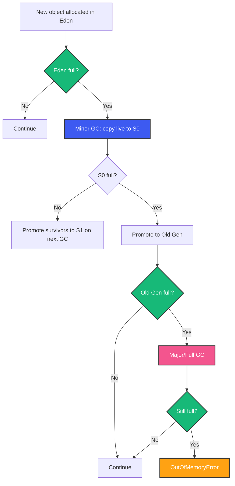
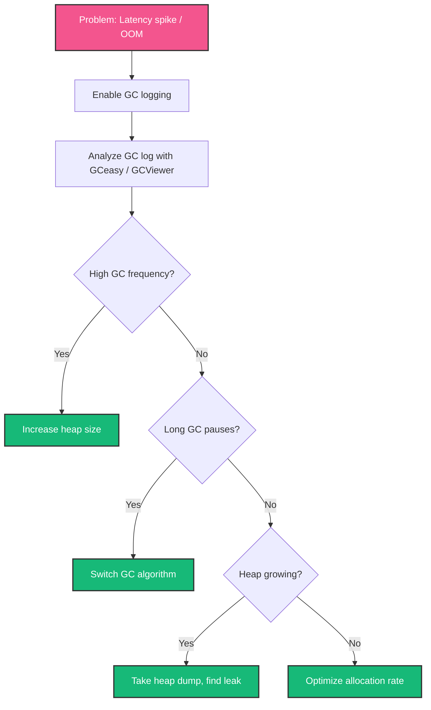

# Java Memory Management and JVM Memory Model

## Overview

Memory management is the superpower that made Java successful — and the source of its most mysterious production issues. Why did your service suddenly die with `OutOfMemoryError` at 2 AM? Why is your heap growing even though you're releasing references? How does G1 decide which objects to collect?

This guide answers those questions from first principles: what lives where, how GC works, and how to diagnose memory problems in production.

---

## Problem Statement

You're running a payment service. Everything works in staging. In production, after 48 hours of peak traffic, you see:
- Latency spikes from 10ms to 2 seconds
- Full GC events every 5 minutes
- Eventually: `java.lang.OutOfMemoryError: Java heap space`

The app restarts. 48 hours later, same pattern. This is a memory leak or a GC tuning problem. Either way, you need to understand JVM memory to fix it.

---

## JVM Memory Regions

```
┌──────────────────────────────────────────┐
│           JVM Process Memory              │
├──────────────────────────────────────────┤
│  Heap                                    │
│  ┌──────────┬──────────┬──────────────┐  │
│  │ Young    │ Young    │    Old       │  │
│  │ (Eden)   │ (S0/S1) │  (Tenured)   │  │
│  └──────────┴──────────┴──────────────┘  │
├──────────────────────────────────────────┤
│  Metaspace (was PermGen)                  │
│  Class metadata, method data, interned    │
│  strings (partially), static fields       │
├──────────────────────────────────────────┤
│  Thread Stacks (1 per thread, ~1MB each)  │
│  Local variables, operand stack, frames   │
├──────────────────────────────────────────┤
│  Code Cache                               │
│  JIT-compiled native code                 │
├──────────────────────────────────────────┤
│  Off-heap (DirectByteBuffer, MappedFile)  │
│  NIO buffers, memory-mapped files         │
└──────────────────────────────────────────┘

classDef green fill:#17b978,stroke:#333,stroke-width:2px,color:#fff
classDef blue fill:#3d5af1,stroke:#333,stroke-width:2px,color:#fff
classDef pink fill:#f3558e,stroke:#333,stroke-width:2px,color:#fff
classDef yellow fill:#FFA213,stroke:#333,stroke-width:2px,color:#fff
```

### Heap (The Big One)

All Java objects live here. Divided into generations:

- **Young Generation**: New objects. Small, dies fast (most objects are short-lived).
  - **Eden**: Most objects allocated here.
  - **Survivor Spaces (S0, S1)**: Objects that survived one GC cycle. Copied between S0 and S1.
- **Old Generation (Tenured)**: Objects that survived many Young GC cycles.

**Default heap size**: Based on physical memory (min 1/64, max 1/4 of physical RAM or 1GB on 64-bit).

### Metaspace (Was PermGen)

Class metadata (class definitions, method data, bytecode). Removed PermGen (Java 7) because resizing required Full GC. Metaspace uses native memory and grows automatically.

**Leak risk**: Classloader leaks. Each redeploy in Tomcat creates a new classloader. If old classes aren't GC'd, Metaspace fills up.

### Thread Stacks

Each thread gets a stack (default ~1MB on 64-bit). 1000 threads = 1GB of stack memory. Virtual threads (Java 21+) allocate tiny stacks (~10KB).

```
Thread Stack Frame:
┌─────────────────────────────┐
│ Local variables             │
│ Operand stack                │
│ Frame data (return addr)    │
└─────────────────────────────┘
```

### Code Cache

JIT-compiled native code. When a method runs enough times, C1 or C2 compiles it to native assembly and stores it here.

### Off-Heap

DirectByteBuffer, mapped files. Not managed by GC. Must be explicitly freed. Common cause of native memory OOM.

---

## Object Layout in Memory

A Java object in HotSpot looks like:

```
|--------------- 64-bit JVM (with compressed OOPs) --------------|
|  Mark Word (8 bytes) | Klass Pointer (4 bytes) | Fields ...   |
|  Hash, GC age, lock  |  Pointer to class meta  | Actual data  |
```

- **Mark Word**: Contains identity hashcode, GC age (4-bit), biased locking info, lock state.
- **Klass Pointer**: Points to the class metadata in Metaspace. Usually 4 bytes (compressed OOPs enabled by default for heaps < 32GB).
- **Fields**: Instance fields. Primitive fields inline. Object references are 4 bytes (compressed).

**Alignment**: Objects are aligned to 8-byte boundaries. If object is 20 bytes, JVM adds 4 bytes padding. This is why class field ordering matters for memory efficiency — put long/double fields first.

---

## Garbage Collection Algorithms

### Mark-Sweep

1. **Mark**: Trace all reachable objects from GC roots (thread stacks, static fields, JNI handles).
2. **Sweep**: Scan heap, reclaim unmarked objects.

**Problem**: Fragmentation. Free memory is scattered, may not find contiguous space for large objects.

### Mark-Compact

1. **Mark**: Same as above.
2. **Compact**: Slide live objects together, eliminating gaps.

**Problem**: Requires moving all live objects — pause time proportional to live set size.

### Copying (Used in Young GC)

1. Divide into two spaces (S0, S1).
2. Copy live objects from Eden + S0 to S1.
3. Eden and S0 are now empty. Swap S0/S1 labels.

**Problem**: Wastes half the space. But collection is fast — only processes live objects.

### Generational GC Flow



---

## GC Implementations

### Serial GC

Single-threaded. Pauses the world (STW). For single-CPU, small heaps (< 100MB).

### Parallel GC (Throughput Collector)

Multi-threaded Young GC. Default in Java 8. Maximizes throughput. Longer STW pauses. Good for batch processing.

```
-XX:+UseParallelGC
-XX:ParallelGCThreads=<N>
```

### G1 GC (Default since Java 9)

Divides heap into 2048 regions (~1MB each). Collects regions with most garbage first.

```bash
-XX:+UseG1GC
-XX:MaxGCPauseMillis=200    # Target pause time
-XX:G1HeapRegionSize=4m    # Region size
```

**How G1 works**:
1. Young GC: Copy live objects from Eden regions to Survivor regions.
2. Concurrent Marking: Mark live objects while app runs (concurrent).
3. Mixed GC: Collect both young and old regions with most garbage.
4. **Remembered Sets**: Each region tracks pointers from outside. Avoids full-heap scan.
5. **SATB (Snapshot-At-The-Beginning)**: Concurrent marking uses SATB to handle concurrent mutations.

**Tuning**: Set pause time target. G1 adjusts Young generation size to meet it. Smaller target = smaller Young = more overhead.

### ZGC (Java 15+, Production in 17)

```bash
-XX:+UseZGC
-XX:ZAllocationSpikeTolerance=2.0
```

Sub-millisecond pauses regardless of heap size (tested up to 16TB). Uses colored pointers (bits in the pointer itself for metadata), load barriers, and concurrent compaction.

**Key insight**: ZGC achieves <1ms pauses because nearly everything is concurrent. Only the initial mark and final mark are STW, and those handle only GC roots — a tiny set.

### Shenandoah

```bash
-XX:+UseShenandoahGC
```

Like ZGC, but uses Brooks pointers (forwarding pointer in object header) instead of colored pointers.

### When to Use What

| GC | Pause Time | Throughput | Heap Size | Use Case |
|----|-----------|------------|-----------|----------|
| Serial | Long | Low | <100MB | Dev, tiny apps |
| Parallel | Medium | Highest | <4GB | Batch, analytics |
| G1 | ~100ms | High | <100GB | Default server |
| ZGC | <1ms | High | Any | Low-latency, large heap |
| Shenandoah | <10ms | High | Any | Low-latency, consistent |

---

## Common Memory Leak Patterns

### Pattern 1: ClassLoader Leak

```java
// Every redeploy creates a new classloader
// If old classloader can't be GC'd → Metaspace leak
public class HotDeployLeak {
    static final List<Class<?>> cache = new ArrayList<>();

    public void register(Class<?> clazz) {
        cache.add(clazz); // Holds reference to classloader
    }
}
```

**Detection**: `Metaspace` fills up after redeploys.

### Pattern 2: ThreadLocal Leak

```java
public class RequestContext {
    private static final ThreadLocal<Context> current = new ThreadLocal<>();

    public static void set(Context ctx) { current.set(ctx); }
    // Forgot to remove()! In thread pools, thread is reused
    // → previous request's Context remains
}
```

**Fix**: Always `ThreadLocal.remove()` in finally blocks.

### Pattern 3: Static Collection Growth

```java
// Every order ever processed stays in memory
public class OrderCache {
    private static final Map<String, Order> ALL_ORDERS = new ConcurrentHashMap<>();

    public static void cache(Order order) {
        ALL_ORDERS.put(order.id(), order);
    }
    // No eviction → O(n) growth → OOM
}
```

### Pattern 4: Unclosed Resources

```java
public void processFile(String path) throws IOException {
    InputStream is = new FileInputStream(path);
    // Read file but never close → DirectByteBuffer leak (off-heap)
}
```

**Fix**: Always use try-with-resources.

### Pattern 5: Circular References with Finalizers

`finalize()` creates circular references that prevent GC. Don't use finalizers. Use `Cleaner` if you must clean native resources.

---

## Memory Diagnosis Tools

### JVM Flags for GC Logging

```bash
-Xlog:gc*:file=gc.log:time,level,tags
-Xlog:gc+heap=debug
-Xlog:gc+age=trace
```

### jmap (Heap Dump)

```bash
jmap -dump:live,format=b,file=heap.hprof <pid>
jhsdb jmap --binaryheap --pid <pid>  # Java 9+
```

### jhat / Eclipse MAT

Analyze heap dumps:
- **MAT Leak Suspects Report**: Automatically finds the biggest problems
- **Dominator Tree**: Which objects retain the most memory
- **GC Roots**: Find what references your "leaked" objects

### jstat (Real-time GC Monitoring)

```bash
jstat -gcutil <pid> 1000  # GC stats every second
```

### JFR (Java Flight Recorder)

```bash
-XX:StartFlightRecording=duration=60s,filename=recording.jfr
```

Records GC events, allocation stalls, thread CPU, lock contention. Built-in, low overhead.

---

## GC Tuning — A Systematic Approach



**Don't tune GC unless you have a problem**. Modern JVMs (G1, ZGC) work well out-of-box. If you must tune:

1. **Set heap size**: `-Xms4g -Xmx4g` (start with 4GB for typical service).
2. **Set pause time target**: `-XX:MaxGCPauseMillis=100` for G1.
3. **If Young GC is too frequent**: Increase NewRatio (`-XX:NewRatio=3` means Old:Young = 3:1).
4. **If allocation is spiky**: Increase Eden (`-XX:SurvivorRatio=8` → Eden:S0 = 8:1).
5. **If concurrent GC can't keep up (G1)**: Increase `-XX:G1ConcRefinementThreads` or `-XX:G1HeapRegionSize`.

---

## Best Practices

1. **Start with `-Xms == -Xmx`**: No heap resizing. Prevents allocation jitter.
2. **Enable GC logging in production**: `-Xlog:gc*` — you can't diagnose without it.
3. **Use ZGC or G1 for latency-sensitive services**: Don't use Parallel GC for web services.
4. **Profile allocation rate with async-profiler**: Fix allocations, not GC. Most perf issues are allocation-heavy code.
5. **Pre-size collections**: `HashMap(10000)` avoids resize overhead.
6. **Avoid premature GC tuning**: Understand your live set size first (heap dump → MAT).
7. **Test GC settings under load**: A 10-minute warmup isn't enough. Run for hours.
8. **Monitor off-heap memory**: Native memory tracking (`-XX:NativeMemoryTracking=detail`).

---

## Common Mistakes

1. **Setting `-Xmx` too high for a container**: JVM uses `-XX:+UseContainerSupport` (default since Java 10) but verify.
2. **Ignoring Metaspace**: Classloader leaks from hot-reload frameworks.
3. **Calling `System.gc()`**: Triggers Full GC. Only useful in rare cases (RMI, DirectBuffer cleanup).
4. **Not pre-warming**: GC behavior during warmup is different from steady state.
5. **Using `-Xmn` without understanding**: Forces a fixed Young Gen size. Let G1 manage it.

---

## Interview Perspective

Memory management questions separate junior from senior engineers:

- "Explain the object layout in HotSpot" (mark word, klass pointer, compressed OOPs)
- "How does G1 decide which regions to collect?" (most garbage first, using SATB and remembered sets)
- "What is a concurrent mode failure in G1?" (GC can't keep up with allocation rate — increase heap or GC threads)
- "How would you investigate a memory leak in production?" (heap dump → MAT dominator tree → GC roots)
- "Explain the difference between a strong, soft, weak, and phantom reference" (and when you'd use each)

---

## Conclusion

Java's automatic memory management is a double-edged sword. It frees you from manual free() calls but introduces complex behavior under pressure. Understanding object layout, GC algorithms, and diagnostic tools transforms memory management from a black art into an engineering discipline. When your service runs for months without a Full GC, you'll know you've mastered it.

Happy Coding
