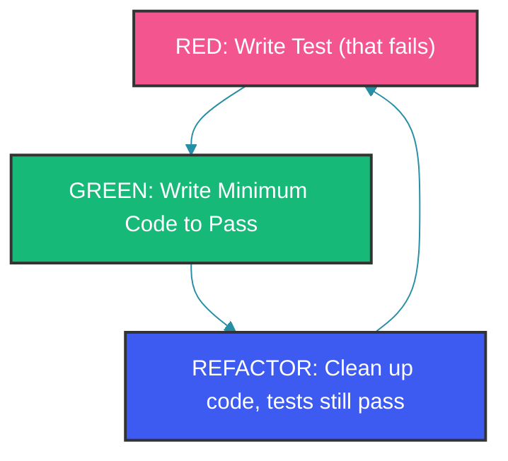

# Test-Driven Development

## Overview

Test-Driven Development (TDD) is a software development methodology where tests are written before production code. The cycle is simple: write a failing test (Red), make it pass with the minimum code (Green), then improve the code (Refactor). This guide covers the TDD cycle in detail with real-world Java examples.

---

## The TDD Cycle: Red-Green-Refactor



The TDD cycle is a tight feedback loop that typically runs in minutes. In the **Red** phase, you write a test that fails—usually because the production code doesn't exist yet. In the **Green** phase, you write the simplest possible code to make the test pass, even if it's just returning a constant. In the **Refactor** phase, you clean up the code while the tests keep passing, ensuring you never break working functionality.

---

## Step-by-Step TDD Example: Shopping Cart

### Step 1 (RED): Write a Failing Test

```java
// ShoppingCartTest.java
class ShoppingCartTest {

    @Test
    @DisplayName("Empty cart should have zero items")
    void emptyCartHasZeroItems() {
        ShoppingCart cart = new ShoppingCart();

        int itemCount = cart.getItemCount();

        assertEquals(0, itemCount);
    }
}
```

At this point, `ShoppingCart` doesn't exist. The test fails to compile.

**RED output:**
```
ShoppingCartTest.java:7: error: cannot find symbol
  symbol:   class ShoppingCart
```

### Step 2 (GREEN): Write Minimum Code to Pass

```java
// ShoppingCart.java
public class ShoppingCart {

    public int getItemCount() {
        return 0;  // Minimum to pass the test
    }
}
```

**GREEN output:**
```
Tests passed: 1 of 1
```

### Step 3 (RED): Write the Next Test

```java
@Test
@DisplayName("Cart should return item count after adding items")
void cartReturnsItemCount() {
    ShoppingCart cart = new ShoppingCart();
    cart.addItem(new CartItem("Apple", 2));

    assertEquals(1, cart.getItemCount());
}
```

### Step 4 (GREEN): Implement

```java
public class ShoppingCart {
    private final List<CartItem> items = new ArrayList<>();

    public int getItemCount() {
        return items.size();
    }

    public void addItem(CartItem item) {
        items.add(item);
    }
}
```

### Step 5 (RED): Test Total Calculation

```java
@Test
@DisplayName("Cart should calculate total price")
void cartCalculatesTotalPrice() {
    ShoppingCart cart = new ShoppingCart();
    cart.addItem(new CartItem("Apple", 2, 1.50));

    double total = cart.calculateTotal();

    assertEquals(3.00, total, 0.001);
}
```

### Step 6 (GREEN): Implement

```java
public class ShoppingCart {
    private final List<CartItem> items = new ArrayList<>();

    public int getItemCount() {
        return items.size();
    }

    public void addItem(CartItem item) {
        items.add(item);
    }

    public double calculateTotal() {
        return items.stream()
            .mapToDouble(item -> item.getPrice() * item.getQuantity())
            .sum();
    }
}
```

### Step 7 (REFACTOR): Clean Up

```java
// Refactored ShoppingCart
public class ShoppingCart {
    private final List<CartItem> items = new ArrayList<>();

    public void addItem(CartItem item) {
        validateItem(item);
        items.add(item);
    }

    public int getItemCount() {
        return items.size();
    }

    public double calculateTotal() {
        return items.stream()
            .mapToDouble(this::calculateItemTotal)
            .sum();
    }

    public boolean isEmpty() {
        return items.isEmpty();
    }

    private double calculateItemTotal(CartItem item) {
        return item.getPrice() * item.getQuantity();
    }

    private void validateItem(CartItem item) {
        if (item == null) {
            throw new IllegalArgumentException("Item cannot be null");
        }
    }
}
```

---

## Real-World Example: Order Processing Service

### Complete TDD Flow

```java
// Step 1: Test for placing an order
class OrderServiceTest {

    private OrderService orderService;
    private InventoryService inventoryService;
    private PaymentService paymentService;

    @BeforeEach
    void setup() {
        inventoryService = mock(InventoryService.class);
        paymentService = mock(PaymentService.class);
        orderService = new OrderService(inventoryService, paymentService);
    }

    @Test
    @DisplayName("Should place order when inventory available and payment succeeds")
    void shouldPlaceOrderSuccessfully() {
        // Given
        OrderRequest request = new OrderRequest(
            "customer-1",
            List.of(new OrderItem("item-1", 2)),
            "PAYMENT_METHOD_123"
        );

        when(inventoryService.checkAvailability("item-1", 2))
            .thenReturn(true);
        when(paymentService.charge("customer-1", 100.00))
            .thenReturn(new PaymentReceipt("txn-001"));

        // When
        OrderConfirmation confirmation = orderService.placeOrder(request);

        // Then
        assertNotNull(confirmation);
        assertNotNull(confirmation.getOrderId());
        verify(inventoryService).reserveItem("item-1", 2);
        verify(paymentService).charge("customer-1", 100.00);
    }

    @Test
    @DisplayName("Should throw exception when inventory unavailable")
    void shouldRejectOrderWhenNoInventory() {
        // Given
        OrderRequest request = new OrderRequest(
            "customer-1",
            List.of(new OrderItem("item-1", 2)),
            "PAYMENT_METHOD_123"
        );

        when(inventoryService.checkAvailability("item-1", 2))
            .thenReturn(false);

        // When & Then
        assertThrows(InsufficientInventoryException.class,
            () -> orderService.placeOrder(request));

        verify(paymentService, never()).charge(any(), anyDouble());
    }
}
```

### Production Code (Developed After Tests)

```java
public class OrderService {

    private final InventoryService inventoryService;
    private final PaymentService paymentService;

    public OrderService(InventoryService inventoryService,
                        PaymentService paymentService) {
        this.inventoryService = inventoryService;
        this.paymentService = paymentService;
    }

    public OrderConfirmation placeOrder(OrderRequest request) {
        for (OrderItem item : request.items()) {
            if (!inventoryService.checkAvailability(item.sku(), item.quantity())) {
                throw new InsufficientInventoryException(
                    "Insufficient inventory for: " + item.sku());
            }
        }

        for (OrderItem item : request.items()) {
            inventoryService.reserveItem(item.sku(), item.quantity());
        }

        double total = calculateTotal(request.items());
        PaymentReceipt receipt = paymentService.charge(
            request.customerId(), total);

        return new OrderConfirmation(
            generateOrderId(),
            receipt.transactionId(),
            request.items()
        );
    }

    private double calculateTotal(List<OrderItem> items) {
        return items.stream()
            .mapToDouble(i -> i.price() * i.quantity())
            .sum();
    }

    private String generateOrderId() {
        return "ORD-" + UUID.randomUUID().toString().substring(0, 8).toUpperCase();
    }
}
```

Notice how the test for the happy path (inventory available, payment succeeds) and the failure path (no inventory) were written before a single line of production code. This ensures the `OrderService` design emerges from the test requirements rather being guessed upfront. The mock-based tests also forced the `OrderService` to accept its dependencies through the constructor—a clean DI-friendly design that emerged naturally from TDD.

---

## TDD Best Practices

### 1. One Assertion Per Test (Concept)

```java
// WRONG: Multiple unrelated assertions
@Test
void testOrderManyThings() {
    Order order = new Order();
    order.addItem(new CartItem("A", 1));
    assertEquals(1, order.getItemCount());
    order.addItem(new CartItem("B", 2));
    // Hard to tell which assertion failed
    assertEquals(3, order.getItemCount());
    order.applyDiscount(0.1);
    assertEquals(2.7, order.calculateTotal(), 0.001);
}

// CORRECT: One concept per test
@Test
void emptyCartHasZeroItems() { ... }

@Test
void addingItemIncreasesCount() { ... }

@Test
void discountReducesTotal() { ... }
```

### 2. Test the Behavior, Not the Implementation

```java
// WRONG: Testing implementation details
@Test
void shouldUseArrayList() {
    ShoppingCart cart = new ShoppingCart();
    assertTrue(cart.getItems() instanceof ArrayList);
}

// CORRECT: Testing behavior
@Test
void shouldMaintainInsertionOrder() {
    ShoppingCart cart = new ShoppingCart();
    cart.addItem(new CartItem("A", 1));
    cart.addItem(new CartItem("B", 1));
    assertEquals("A", cart.getItems().get(0).getName());
    assertEquals("B", cart.getItems().get(1).getName());
}
```

### 3. Keep Tests Fast

```java
// WRONG: Slow test with external dependencies
@Test
void testDatabaseIntegration() {
    // Starts embedded database
    // Loads fixtures
    // Queries and verifies
    // Takes 30 seconds
}

// CORRECT: Fast unit test with mocks
@Test
void testServiceLogic() {
    OrderService service = new OrderService(mock(InventoryService.class), ...);
    OrderConfirmation result = service.placeOrder(request);
    assertNotNull(result);
}
```

---

## When TDD is Difficult

### Legacy Code

```java
// Legacy code with no tests and tangled dependencies
public class OrderProcessor {
    public void process(Order order) {
        // 200 lines of mixed logic
        // Direct database access
        // Static method calls
        // File system operations
    }
}

// Approach: Characterization tests first
@Test
void characterizeExistingBehavior() {
    // Don't modify existing behavior
    // Write tests that document current behavior
    // Then refactor with safety net
}
```

### UI/Frontend Code

```java
// TDD for complex UI is challenging
// Focus on testing business logic separately
// Use integration tests sparingly
```

---

## Common Mistakes

### Mistake 1: Writing Too Many Tests at Once

```java
// WRONG: Writing multiple tests before any implementation
@Test void testA() { ... } // All three tests fail
@Test void testB() { ... }
@Test void testC() { ... }

// CORRECT: One failing test at a time
@Test void testA() { ... }  // Write, implement, pass
// Then write testB, implement, pass
```

### Mistake 2: Production Code in Tests

```java
// WRONG: Complex logic in tests
@Test
void testDiscountCalculation() {
    double expected = 0.0;
    for (int i = 0; i < items.size(); i++) {
        expected += items.get(i).getPrice() * 0.9;  // Duplicated logic
    }
    assertEquals(expected, cart.calculateDiscountedTotal());
}

// CORRECT: Pre-computed expected values
@Test
void testDiscountCalculation() {
    cart.addItem(new CartItem("A", 1, 100.00));
    assertEquals(90.00, cart.calculateDiscountedTotal(0.1));
}
```

---

## Summary

TDD is a discipline that produces well-tested, cleanly designed code through a tight feedback loop. Write one failing test (Red), implement the minimum code to pass (Green), then refactor (Refactor). The key is small, rapid iterations—never write code without a test driving it, and never write more code than needed to make a test pass.

---

## References

- [Kent Beck - Test-Driven Development: By Example](https://www.amazon.com/Test-Driven-Development-Kent-Beck/dp/0321146530)
- [Martin Fowler - TDD](https://martinfowler.com/bliki/TestDrivenDevelopment.html)
- [Uncle Bob - The Three Laws of TDD](https://blog.cleancoder.com/uncle-bob/2014/12/17/TheCyclesOfTDD.html)
- [Growing Object-Oriented Software, Guided by Tests](https://www.amazon.com/Growing-Object-Oriented-Software-Guided-Tests/dp/0321503627)

Happy Coding
