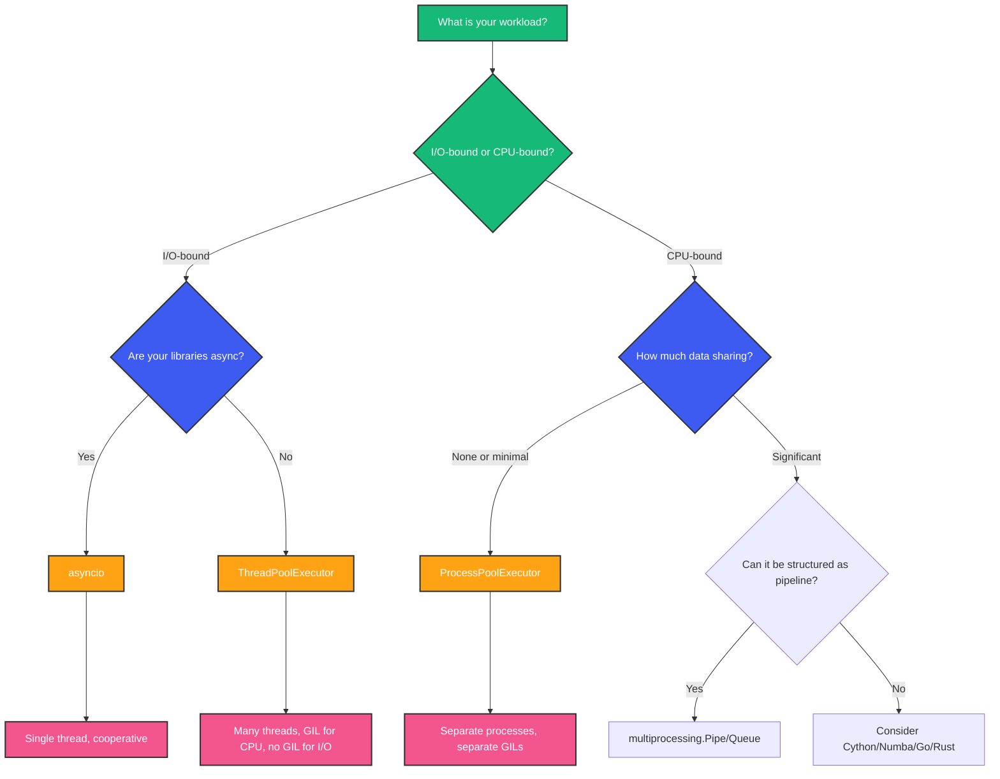
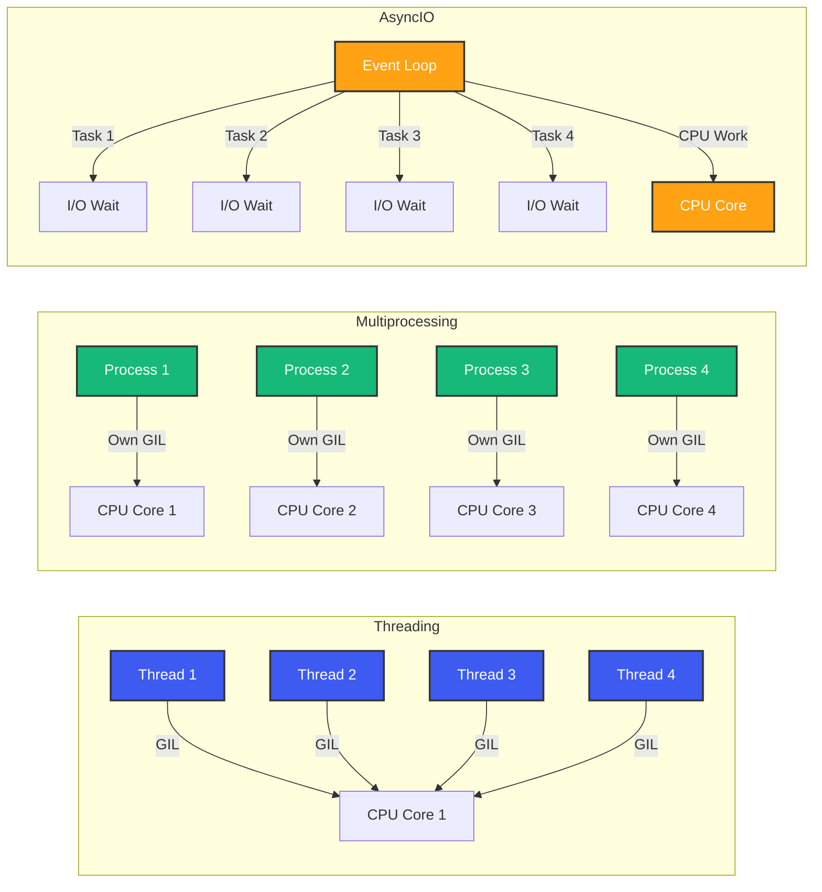

# Python Concurrency: Threading, Multiprocessing, and AsyncIO

## Overview

You have a Python backend service. It makes 10 database queries per request, calls 3 external APIs, processes some data, and returns a response. Each request takes 500ms. With a single thread, you can handle 2 requests per second. You need 200. How do you get there?

The answer is concurrency. But Python gives you three different tools -- threading, multiprocessing, and asyncio -- and picking the wrong one will make your service slower, not faster. This guide gives you the mental model to choose correctly.

## Mental Model: The Three Tools

Think of each concurrency model as a different tool for a different job:

```
                    ┌─────────────────────────────────────┐
                    │        Python Concurrency           │
                    ├──────────────┬──────────────────────┤
                    │   I/O-Bound  │     CPU-Bound        │
                    ├──────────────┼──────────────────────┤
                    │   asyncio    │  multiprocessing     │
                    │   threading  │  (C extensions)      │
                    └──────────────┴──────────────────────┘
```

- **Threading**: Many threads, one GIL. Good for blocking I/O. Bad for CPU.
- **Multiprocessing**: Separate processes, separate GILs. Good for CPU. Heavy overhead.
- **Asyncio**: One thread, cooperative multitasking. Best for I/O. Requires async-aware code.

## The GIL: The Elephant in the Room

```c
// Simplified GIL logic in CPython (ceval.c)
static PyThread_type_lock gil_lock;

void take_gil(PyThreadState *tstate) {
    for (;;) {
        if (PyThread_acquire_lock(gil_lock, NOWAIT)) {
            // Got the GIL
            break;
        }
        // Release GIL after ~100 bytecode instructions (check_interval)
        // Allow other threads to run
        PyThread_release_lock(gil_lock);
        // Wait a bit, then try again
        PyThread_acquire_lock(gil_lock, WAIT);
    }
}
```

The Global Interpreter Lock is a mutex that prevents multiple threads from executing Python bytecode simultaneously. It exists because CPython's memory management (reference counting) is not thread-safe. Without the GIL, every object increment/decrement would need an atomic operation, destroying single-threaded performance.

**The critical distinction**: The GIL is released during I/O operations. When your thread calls `read()`, `write()`, `send()`, `recv()`, or a C extension that explicitly releases it, another thread can run.

## Threading

### What

Threads are lightweight processes within the same OS process, sharing memory space.

### Why

Threads let you handle multiple blocking I/O operations concurrently. While one thread waits for a network response, another can execute Python code.

### How

```python
import threading
import time
import requests
from collections.abc import Callable

def fetch_url(url: str) -> dict:
    response = requests.get(url, timeout=10)
    return response.json()

def threaded_fetch(urls: list[str]) -> list[dict]:
    results: list[dict] = [None] * len(urls)  # type: ignore
    threads: list[threading.Thread] = []

    def fetch_and_store(idx: int, url: str) -> None:
        results[idx] = fetch_url(url)

    for i, url in enumerate(urls):
        t = threading.Thread(target=fetch_and_store, args=(i, url))
        threads.append(t)
        t.start()

    for t in threads:
        t.join()

    return results

# ThreadPoolExecutor - the practical way
from concurrent.futures import ThreadPoolExecutor, as_completed

def thread_pool_fetch(urls: list[str]) -> list[dict]:
    results: list[dict] = []
    with ThreadPoolExecutor(max_workers=10) as executor:
        futures = [executor.submit(fetch_url, url) for url in urls]
        for future in as_completed(futures):
            results.append(future.result())
    return results
```

### When

- Blocking I/O with libraries that are not async-aware (e.g., `requests`, `boto3`, `psycopg2` sync)
- You need to parallelize I/O but cannot rewrite code for async
- Simple background task execution

### The Problem Threads Cannot Solve

```python
import threading
import time

def cpu_heavy(n: int) -> int:
    result = 0
    for i in range(n):
        result += i ** 2
    return result

start = time.perf_counter()
threads = [
    threading.Thread(target=cpu_heavy, args=(10_000_000,))
    for _ in range(4)
]
for t in threads:
    t.start()
for t in threads:
    t.join()
print(f"Threaded CPU: {time.perf_counter() - start:.2f}s")
# Slower than sequential! GIL contention adds overhead.
```

CPU-bound threads do not speed up. They actually slow down due to GIL contention.

## Multiprocessing

### What

Separate OS processes, each with its own Python interpreter, memory space, and GIL.

### Why

Bypasses the GIL entirely. Each process runs on a separate CPU core. True parallelism for CPU-bound work.

### How

```python
import multiprocessing as mp
from concurrent.futures import ProcessPoolExecutor
import time

def cpu_heavy(n: int) -> int:
    result = 0
    for i in range(n):
        result += i ** 2
    return result

def multiprocess_compute(values: list[int]) -> list[int]:
    with ProcessPoolExecutor(max_workers=mp.cpu_count()) as executor:
        results = list(executor.map(cpu_heavy, values))
    return results

if __name__ == "__main__":
    start = time.perf_counter()
    results = multiprocess_compute([10_000_000] * 4)
    print(f"Multiprocess CPU: {time.perf_counter() - start:.2f}s")
    # ~4x faster on 4 cores
```

### Shared Memory: The Tricky Part

```python
import multiprocessing as mp
from multiprocessing import shared_memory
import numpy as np

def worker(name: str, shape: tuple[int, int], dtype: type) -> None:
    existing_shm = shared_memory.SharedMemory(name=name)
    arr = np.ndarray(shape, dtype=dtype, buffer=existing_shm.buf)
    arr *= 2  # Modify in place
    existing_shm.close()

def main() -> None:
    data = np.array([[1, 2, 3], [4, 5, 6]], dtype=np.float64)
    shm = shared_memory.SharedMemory(create=True, size=data.nbytes)
    shared_arr = np.ndarray(data.shape, dtype=data.dtype, buffer=shm.buf)
    shared_arr[:] = data[:]

    p = mp.Process(target=worker, args=(shm.name, data.shape, data.dtype))
    p.start()
    p.join()

    print(shared_arr)  # Modified by worker
    shm.close()
    shm.unlink()
```

### When

- CPU-bound computation (data processing, ML inference, image processing)
- You need to bypass the GIL
- The work is embarassingly parallel (no shared state)

### Downsides

- **Startup cost**: Each process starts a new Python interpreter (300-500ms overhead)
- **Memory overhead**: Each process has its own memory space (50-100MB per process)
- **Serialization cost**: Data must be pickled to pass between processes
- **Shared state is hard**: No shared memory by default; need explicit `multiprocessing.Value`, `Array`, or `shared_memory`

## AsyncIO

### What

Single-threaded, single-process concurrency using an event loop that switches between tasks at `await` points.

### Why

Zero thread overhead. No GIL contention. Handles 10,000+ concurrent connections efficiently.

### How

```python
import asyncio
import httpx
import time

async def fetch_url(client: httpx.AsyncClient, url: str) -> dict:
    response = await client.get(url)
    return response.json()

async def main() -> None:
    urls = [f"https://api.example.com/users/{i}" for i in range(100)]

    async with httpx.AsyncClient() as client:
        tasks = [fetch_url(client, url) for url in urls]
        results = await asyncio.gather(*tasks)

    print(f"Fetched {len(results)} URLs")

# The event loop
if __name__ == "__main__":
    start = time.perf_counter()
    asyncio.run(main())
    print(f"Async: {time.perf_counter() - start:.2f}s")
```

### The Event Loop

```python
# Simplified event loop behavior
class SimplifiedEventLoop:
    def __init__(self) -> None:
        self._ready: list[asyncio.Task] = []

    def run_until_complete(self, coro: asyncio.Task) -> None:
        coro.send(None)  # Start the coroutine
        while self._ready:
            task = self._ready.pop(0)
            try:
                task.send(None)  # Resume at next await point
            except StopIteration:
                pass  # Task completed

# Real asyncio uses epoll/kqueue/IOCP to wait for I/O events
```

When a coroutine hits `await`, it yields control back to the event loop. The event loop can resume it later when the I/O operation completes. This is cooperative multitasking -- tasks must voluntarily yield.

### Async Context Managers

```python
from contextlib import asynccontextmanager
from collections.abc import AsyncIterator
import aiofiles

@asynccontextmanager
async def open_file(path: str) -> AsyncIterator[aiofiles.threadpool.text.AsyncTextIOWrapper]:
    f = await aiofiles.open(path)
    try:
        yield f
    finally:
        await f.close()

async def read_config() -> str:
    async with open_file("config.json") as f:
        return await f.read()
```

### When

- I/O-bound workloads (HTTP, database, file operations)
- High-concurrency servers (WebSockets, streaming, real-time APIs)
- Microservices with many external dependencies

### Gotchas

- All code in the call stack must be async (or run in executor)
- CPU-bound work blocks the event loop
- Debugging is harder (stack traces are less clear)
- Need async-compatible libraries (httpx, aiohttp, asyncpg, databases)

## Choosing the Right Model



## Comparison Diagram



## Practical Backend Scenarios

### Scenario 1: Web Server

```python
from fastapi import FastAPI
import httpx
import asyncio

app = FastAPI()

# WRONG: blocking call in async endpoint
@app.get("/wrong")
def get_data():
    import requests
    resp = requests.get("https://api.example.com/data")  # Blocks event loop!
    return resp.json()

# RIGHT: async all the way
@app.get("/right")
async def get_data():
    async with httpx.AsyncClient() as client:
        resp = await client.get("https://api.example.com/data")
        return resp.json()

# ... but if you MUST use a sync library:
@app.get("/workaround")
async def get_data_with_executor():
    loop = asyncio.get_running_loop()
    # Runs in thread pool, doesn't block event loop
    result = await loop.run_in_executor(None, blocking_io_call)
    return result
```

### Scenario 2: Data Pipeline

```python
import asyncio
from concurrent.futures import ProcessPoolExecutor
import hashlib

# I/O part: fetch data from multiple sources
async def fetch_sources() -> list[bytes]:
    async with httpx.AsyncClient() as client:
        tasks = [
            client.get("https://source1.example.com/data"),
            client.get("https://source2.example.com/data"),
        ]
        responses = await asyncio.gather(*tasks)
        return [r.content for r in responses]

# CPU part: hash computation
def compute_hashes(data_chunks: list[bytes]) -> list[str]:
    return [hashlib.sha256(chunk).hexdigest() for chunk in data_chunks]

async def pipeline() -> list[str]:
    # Phase 1: I/O -- async
    data = await fetch_sources()

    # Phase 2: CPU -- multiprocessing via executor
    loop = asyncio.get_running_loop()
    with ProcessPoolExecutor() as pool:
        hashes = await loop.run_in_executor(pool, compute_hashes, data)

    return hashes
```

### Scenario 3: Database Migrations with Threading

```python
from concurrent.futures import ThreadPoolExecutor, as_completed
import psycopg2

def migrate_table(table_name: str, batch_size: int = 1000) -> int:
    conn = psycopg2.connect("postgres://localhost/db")
    cur = conn.cursor()
    cur.execute(f"UPDATE {table_name} SET processed = true WHERE processed = false")
    count = cur.rowcount
    conn.commit()
    cur.close()
    conn.close()
    return count

def run_migrations(tables: list[str]) -> dict[str, int]:
    results: dict[str, int] = {}
    with ThreadPoolExecutor(max_workers=4) as executor:
        futures = {executor.submit(migrate_table, t): t for t in tables}
        for future in as_completed(futures):
            table = futures[future]
            results[table] = future.result()
    return results
```

## Async Patterns and Pitfalls

### Pattern: Task Groups (Python 3.11+)

```python
import asyncio

async def process_many(items: list[str]) -> list[str]:
    results: list[str] = []
    async with asyncio.TaskGroup() as tg:
        tasks = [tg.create_task(process_one(item)) for item in items]
    for task in tasks:
        results.append(task.result())
    return results

async def process_one(item: str) -> str:
    await asyncio.sleep(0.1)
    return item.upper()
```

### Pitfall: Blocking the Event Loop

```python
import asyncio
import time

async def bad_coroutine():
    time.sleep(5)  # BLOCKS! Never do this in async code
    return "done"

async def good_coroutine():
    await asyncio.sleep(5)  # Yields control, allows other tasks to run
    return "done"
```

### Pitfall: Forgetting to Await

```python
async def main():
    asyncio.create_task(background_work())  # Task is created but never awaited
    # The program exits before background_work completes!
    await asyncio.sleep(0.1)  # Not enough time

async def background_work():
    await asyncio.sleep(5)
    print("Done!")
```

## Best Practices

- **Default to asyncio** for new I/O-bound services. Threading is a compatibility bridge.
- **Use `ThreadPoolExecutor`** only when libraries lack async support.
- **Use `ProcessPoolExecutor`** for CPU work, but keep data passing minimal.
- **Always use `max_workers`** with thread/process pools. Defaults can be unbounded.
- **Never block the event loop**. No `time.sleep`, no `requests.get`, no sync file I/O in async code.
- **Set `asyncio.run(…)` as entry point**. Python 3.10+ only.
- **Use `TaskGroup`** (3.11+) instead of manual task management.
- **Combine models** when your pipeline has both I/O and CPU stages.

## Common Mistakes

- **Using threads for CPU work**: 4 threads on 4 cores will be slower than 1 thread due to GIL contention.
- **Using multiprocessing for I/O**: 100 processes for 100 API calls is massive overhead.
- **Mixing sync and async carelessly**: Calling a sync function in an async endpoint blocks all other requests.
- **Not setting `max_workers`**: ThreadPoolExecutor default is `min(32, os.cpu_count() + 4)`, which may be too high for your use case.
- **Ignoring startup/shutdown**: Failing to close pools, connections, and executors properly.

## Interview Perspective

Be ready to explain:

1. **What is the GIL and why does it exist?** Reference counting thread safety, single-threaded performance tradeoff.
2. **When would you use threading vs asyncio?** Threading for blocking sync libraries, asyncio for async-native code.
3. **How does asyncio achieve concurrency?** Event loop + coroutines + await points.
4. **What happens if you call a CPU-bound function in an async endpoint?** The entire event loop blocks.
5. **How would you parallelize a task that is both I/O and CPU heavy?** Async for I/O, `run_in_executor` with `ProcessPoolExecutor` for CPU.
6. **Can two threads run Python code simultaneously?** No, due to the GIL. But they can overlap I/O wait.

## Summary

| Property | Threading | Multiprocessing | AsyncIO |
|----------|-----------|-----------------|---------|
| Parallelism | None (GIL) | Full | None |
| Concurrency | Yes | Yes | Yes |
| Best for | Blocking I/O | CPU work | Async I/O |
| Overhead | Low | High | Minimal |
| Shared state | Easy | Hard | Easy |
| Debugging | Medium | Hard | Medium |
| Python version | All | All | 3.5+ |

Python gives you three concurrency tools. The skill is not knowing how each works -- it is knowing which to use for your specific workload. Match the tool to the problem, and you get simple, fast code. Mismatch them, and you get complexity without performance.

Happy Coding
