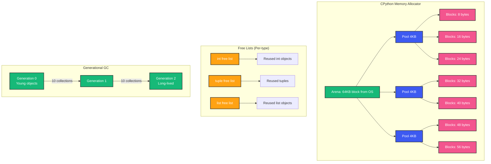

# Python Memory Management and Garbage Collection

## Overview

Your production service is running fine. Then memory usage starts climbing. Not a leak -- just slow, steady growth. After 48 hours, the OOM killer terminates your process. Restart. Repeat. You have a memory management problem, and you need to understand Python's allocator and garbage collector to fix it.

Python manages memory differently from languages like Go or Java. It uses reference counting as its primary strategy, with a generational garbage collector to clean up cycles. Understanding this two-tier system is essential for building memory-efficient backend services.

## Mental Model: Two Collectors, One House

Think of Python's memory management as a house with two cleaners:

1. **Reference Counting**: The daily cleaner. Every time an object is created, a counter increments. Every time a reference is removed, it decrements. When it hits zero, the object is immediately removed. Immediate, predictable, but misses cycles.

2. **Generational GC**: The weekly deep clean. It walks through all objects, finds unreachable cycles (objects that reference each other but are not referenced by anything else), and frees them. Slower, but catches what reference counting misses.

## Python Memory Architecture



### Arenas, Pools, and Blocks

CPython's allocator (`Objects/obmalloc.c`) uses a three-level hierarchy for objects under 512 bytes:

```python
import sys

# Object size including overhead
print(sys.getsizeof(object()))      # 32 bytes (bare PyObject)
print(sys.getsizeof([]))            # 56 bytes (empty list)
print(sys.getsizeof({}))            # 64 bytes (empty dict)
print(sys.getsizeof(""))            # 49 bytes (empty string)
print(sys.getsizeof(42))            # 28 bytes (small int)
```

**Arena**: 64KB memory block obtained from the OS via `mmap` or `malloc`. Multiple arenas are linked together.

**Pool**: 4KB chunk within an arena, divided into same-sized blocks. All blocks in a pool are the same size.

**Block**: The actual memory for a Python object. Sizes range from 8 bytes to 512 bytes in 16-byte increments (size classes 0-63).

```c
// Size class mapping
// szidx | size | blocks per pool
//   0   |  8   |  512
//   1   |  16  |  256
//   2   |  24  |  170
//  ...
//   63  |  512 |  8

struct pool_header {
    uint32_t refcount;           // Used blocks
    uint32_t freeblocks;         // Free blocks
    struct pool_header *nextpool; // Linked list pointer
    uint32_t szidx;             // Size class index
    unsigned char *freeblock;    // Next free block
};
```

**Why three levels?** System `malloc` is optimized for general-purpose allocation, not for the pattern of creating and destroying millions of small, same-sized objects. The pool allocator avoids fragmentation and speeds up allocation by grouping same-sized objects.

### Free Lists

Beyond the general allocator, CPython maintains free lists for specific types:

```python
# When you delete a list, its PyListObject is cached
# When you create a new list, it reuses the cached object

import sys

lists = [[], [], []]
print(sys.getsizeof(lists[0]))  # 56 bytes

del lists[0]  # Object goes to free list, NOT freed to OS
del lists[1]  # Same
del lists[2]  # Same

new_list = []  # Reuses from free list -- faster allocation!
```

The free list avoids the overhead of calling the system allocator and deallocator for frequently-created types: ints, tuples, lists, and dicts.

## Reference Counting in Detail

### How It Works

Every `PyObject` has a `ob_refcnt` field:

```python
import sys

class User:
    pass

user = User()
print(sys.getrefcount(user))  # 2 (user reference + getrefcount argument)

users = [user]
print(sys.getrefcount(user))  # 3 (user + users list element)

del users
print(sys.getrefcount(user))  # 2 (back to user + argument)

del user
# refcount reaches 0, memory freed
```

```c
#define Py_INCREF(op) ((PyObject*)(op))->ob_refcnt++
#define Py_DECREF(op) \
    if (((PyObject*)(op))->ob_refcnt-- == 0) { \
        _Py_Dealloc((PyObject*)(op)); \
    }
```

### When References Are Incremented

```python
a = []      # refcount = 1
b = a       # refcount = 2 (new reference)
c = [a]     # refcount = 3 (list element)
d = {"a": a} # refcount = 4 (dict value)

def func(x):  # refcount = 5 (function argument)
    pass

func(a)     # Temporary increment while in function
```

### When References Are Decremented

```python
a = []
b = a
del b       # refcount = 1
a = None    # refcount = 0 → FREED immediately

# Also decremented when:
# - Variable goes out of scope
# - Container is deleted or modified
# - Function returns
# - Exception is raised
```

### The Cycle Problem

```python
import sys

class Node:
    def __init__(self) -> None:
        self.ref: Node | None = None

a = Node()
b = Node()
a.ref = b  # b.refcount = 2
b.ref = a  # a.refcount = 2

del a  # a.refcount = 1 (b.ref still points to a)
del b  # b.refcount = 1 (a.ref still points to b)
       # BOTH ARE LEAKED -- cannot be freed by reference counting
```

## Generational Garbage Collection

### When the GC Runs

```python
import gc

# Get current thresholds
print(gc.get_threshold())  # (700, 10, 10)

# Generation 0: collected when allocations - deallocations > 700
# Generation 1: collected when gen 0 count > 10
# Generation 2: collected when gen 1 count > 10

# Manual collection
gc.collect()       # Full collection
gc.collect(0)      # Just generation 0
```

### How the GC Works

```python
import gc

# Enable debugging
gc.set_debug(gc.DEBUG_STATS | gc.DEBUG_SAVEALL)

class Circular:
    def __init__(self) -> None:
        self.other: Circular | None = None

# Create cycles
for _ in range(1000):
    a = Circular()
    b = Circular()
    a.other = b
    b.other = a

# Collect
unreachable = gc.collect()
print(f"Collected {unreachable} objects")

# View collected objects (with DEBUG_SAVEALL)
for obj in gc.garbage:
    print(type(obj))
```

The GC algorithm:

```
1. Move all objects tracked by GC into generation list
2. Find objects in generation(s) to collect
3. Compute "roots" -- objects definitely reachable
   (globals, stack frames, registers)
4. Mark all objects reachable from roots
5. Sweep: free unmarked objects
6. Move surviving objects to next generation
```

### The Zero-Sized Object Optimization

```python
# Python interns SOME objects for efficiency:

# Small integers (-5 to 256) are singletons
a = 256
b = 256
print(a is b)  # True -- same object

a = 257
b = 257
print(a is b)  # False -- different objects (usually)

# Short strings are interned
a = "hello"
b = "hello"
print(a is b)  # True (CPython interns short strings during compilation)

# Longer strings are not interned
a = "hello_world_this_is_long"
b = "hello_world_this_is_long"
print(a is b)  # Implementation-dependent (can be True or False)
```

## Weak References

```python
import weakref

class Cache:
    def __init__(self) -> None:
        self._data: dict[str, weakref.ref] = {}

    def store(self, key: str, value: object) -> None:
        self._data[key] = weakref.ref(value)

    def retrieve(self, key: str) -> object | None:
        ref = self._data.get(key)
        if ref is not None:
            return ref()
        return None

# Without weakref, caches prevent object deallocation
# With weakref, objects can be freed while still cached

import sys

class ExpensiveObject:
    def __init__(self, name: str) -> None:
        self.name = name

obj = ExpensiveObject("data")
r = weakref.ref(obj)
print(r())  # <ExpensiveObject object at 0x...>
del obj
print(r())  # None -- object was freed
```

**Use cases**: Caches, observers, parent references in trees.

## Memory Leaks in Backend Services

### Leak 1: Caching Without Eviction

```python
# LEAK: Unbounded cache
user_cache: dict[str, dict] = {}

def get_user(user_id: str) -> dict:
    if user_id not in user_cache:
        user_cache[user_id] = fetch_from_db(user_id)
    return user_cache[user_id]

# FIX: Use LRU cache with max size
from functools import lru_cache

@lru_cache(maxsize=1000)
def get_user(user_id: str) -> dict:
    return fetch_from_db(user_id)
```

### Leak 2: Closures Capturing Large Objects

```python
# LEAK: Closure holds reference to large data
def create_processors(data: list[dict]) -> list:
    processors = []
    for item in data:
        def process():
            return expensive_transform(item)  # item captured by closure
        processors.append(process)
    return processors

# FIX: Use default argument binding to copy what you need
def create_processors_fixed(data: list[dict]) -> list:
    processors = []
    for item in data:
        def process(item=item):  # item is bound by value here
            return expensive_transform(item)
        processors.append(process)
    return processors
```

### Leak 3: Global Accumulators

```python
# LEAK: Global list grows unbounded
errors: list[dict] = []

def process_request(data: dict) -> None:
    try:
        # ... processing
        pass
    except Exception as e:
        errors.append({"error": str(e), "data": data})  # Never cleaned!

# FIX: Structured logging + bounded queue, not global accumulation
```

### Leak 4: Circular References with `__del__`

```python
# LEAK: __del__ prevents GC from collecting cycles
class Resource:
    def __init__(self, name: str) -> None:
        self.name = name
        self.other: Resource | None = None

    def __del__(self) -> None:
        print(f"Cleanup {self.name}")

a = Resource("A")
b = Resource("B")
a.other = b
b.other = a

del a
del b
# GC cannot collect this cycle because __del__ exists!
# Python moves these to gc.garbage and never frees them.

# FIX: Avoid __del__ in objects that can form cycles.
# Use context managers or explicit cleanup methods instead.
```

## Memory Profiling Tools

### tracemalloc

```python
import tracemalloc

tracemalloc.start()

# Your code
data = [{"id": i, "name": f"user_{i}"} for i in range(100_000)]

snapshot = tracemalloc.take_snapshot()
top_stats = snapshot.statistics("lineno")

for stat in top_stats[:10]:
    print(stat)
```

### objgraph

```python
# pip install objgraph
import objgraph

class LargeObject:
    def __init__(self) -> None:
        self.data = bytearray(1024 * 1024)  # 1MB

objects = [LargeObject() for _ in range(100)]

# Show most common types
objgraph.show_most_common_types(limit=10)

# Find reference chains
obj = objects[50]
objgraph.show_backrefs(obj, max_depth=5, filename="backrefs.png")
```

### memory_profiler

```python
# pip install memory_profiler
# python -m memory_profiler script.py

@profile
def process_orders():
    orders = fetch_all_orders()  # Line by line memory
    result = []
    for order in orders:
        result.append(transform(order))
    return result
```

### pympler

```python
# pip install pympler
from pympler import tracker, muppy, summary

# Track memory over time
tr = tracker.SummaryTracker()
data = [{"id": i} for i in range(100_000)]
tr.print_diff()

# Summary of all objects
all_objects = muppy.get_objects()
summ = summary.summarize(all_objects)
summary.print_(summ)
```

## Memory Optimization Techniques

### Use `__slots__`

```python
import sys

class UserWithDict:
    def __init__(self, name: str, email: str) -> None:
        self.name = name
        self.email = email

class UserWithSlots:
    __slots__ = ("name", "email")
    def __init__(self, name: str, email: str) -> None:
        self.name = name
        self.email = email

# Memory comparison
d = UserWithDict("Alice", "alice@example.com")
s = UserWithSlots("Alice", "alice@example.com")

print(sys.getsizeof(d))  # 56 bytes
print(sys.getsizeof(d.__dict__))  # 120 bytes (extra!)
print(sys.getsizeof(s))  # 56 bytes (no __dict__)
```

### Use `array` for Numeric Data

```python
import sys
from array import array

# List of floats
float_list = [0.0] * 1_000_000
print(sys.getsizeof(float_list))  # 8,000,056 bytes (~8MB)

# Array of floats
float_array = array("d", [0.0]) * 1_000_000
print(sys.getsizeof(float_array))  # 8,000,056 bytes (~8MB)

# BUT: list stores PyObject pointers, array stores raw C doubles
# array uses ~8 bytes per element, list uses 8 bytes pointer + 24 bytes PyFloatObject = 32 bytes
# ~4x memory savings
```

### Use `struct` for Binary Protocols

```python
import struct
from dataclasses import dataclass
import sys

# Python object per record (wasteful for 1M records)
@dataclass
class SensorReading:
    timestamp: int  # 28 bytes
    value: float    # 24 bytes
    sensor_id: int  # 28 bytes
# ~80 bytes + dict overhead

# Packed binary format
packed = struct.pack("!Q d I", 1234567890, 23.5, 42)
print(sys.getsizeof(packed))  # 20 bytes
# unpack: timestamp, value, sensor_id = struct.unpack("!Q d I", packed)
```

### Use `__slots__` + `__init_subclass__` for Domain Models

```python
class DomainModel:
    __slots__ = ()

    def __init_subclass__(cls) -> None:
        super().__init_subclass__()
        # Could auto-generate slots from type hints

class Order(DomainModel):
    __slots__ = ("id", "user_id", "total", "items")

    def __init__(self, id: str, user_id: str, total: float, items: list[str]) -> None:
        self.id = id
        self.user_id = user_id
        self.total = total
        self.items = items
```

## GC Tuning

```python
import gc

# Disable GC entirely (for batch processing)
gc.disable()

# ... do work without GC overhead ...
result = process_millions_of_items()

# Collect at known points
gc.enable()
gc.collect()

# Adjust thresholds for memory-sensitive apps
# If you have many short-lived objects, lower gen 0 threshold
gc.set_threshold(500, 5, 5)

# For long-running services with steady state
gc.set_threshold(100000, 100, 100)  # Collect less often after warmup

# Check GC stats
print(gc.get_stats())
# [{'collections': 47, 'collected': 123450, 'uncollectable': 0},
#  {'collections': 3, 'collected': 150, 'uncollectable': 0},
#  {'collections': 1, 'collected': 20, 'uncollectable': 0}]
```

## Common Mistakes

- **Holding references in caches**: Unbounded caches grow until OOM. Always set `maxsize`.
- **Circular references with `__del__`**: Creates uncollectable garbage. Use context managers.
- **Assuming `del` frees memory**: `del` decrements refcount. If another reference exists, object lives.
- **Global mutable state**: Module-level lists/dicts that grow over time.
- **Thread-local storage leaks**: Thread locals persist until thread dies (problem with thread pools).
- **Not profiling memory**: Guessing which objects consume the most memory almost always wrong.

## Interview Perspective

- **How does reference counting work?** Immediate deallocation when refcount hits zero. Each PyObject tracks active references.
- **What problem does the GC solve?** Reference cycles. Objects that reference each other but are not reachable.
- **What are the GC generations?** Gen 0 (young, frequent), Gen 1 (survivors), Gen 2 (old, infrequent).
- **What is `gc.garbage`?** Uncollectable objects (those with `__del__` in cycles).
- **How would you find a memory leak?** `tracemalloc` for allocation tracking, `objgraph` for reference chains, `gc.get_objects()` for live objects.
- **When would you disable the GC?** Batch processing where you control object lifecycle manually.

## Summary

Python's memory management is a two-tier system: fast, deterministic reference counting handles most objects, while the generational GC cleans up cycles. Understanding this architecture helps you write memory-efficient backend services that handle millions of objects without leaking or thrashing.

The key insight: Python trades some memory efficiency for programmer productivity. Your job is to know where the tradeoffs are -- `__slots__` for large datasets, weak references for caches, array/struct for numeric data, and always profiling before optimizing.

Happy Coding
