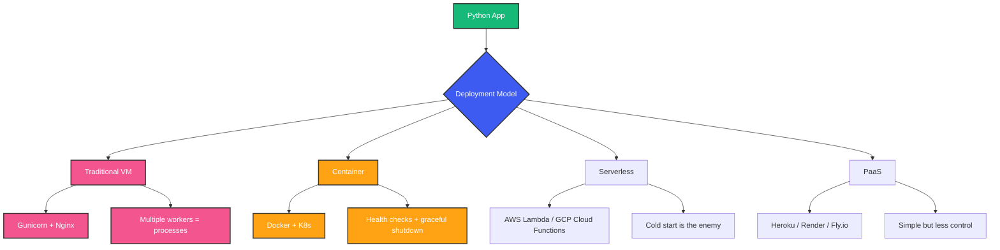

# Python for Backend Development

## Overview

You need to build a backend service that handles thousands of requests per second, talks to multiple databases, queues messages, and stays up for months. You heard Python is slow. Yet Stripe, Instagram, Spotify, and Dropbox all use Python in production at massive scale. This is not because they tolerate Python's limitations -- it's because they understand when and how to use Python effectively.

This guide is the mental model you need to evaluate Python for backend work. Not hype. Not benchmarks out of context. Real engineering tradeoffs.

## Mental Model: Python Is a Glue Platform

Think of Python not as a language to write your entire system in, but as the orchestration layer. Your Python service is a thin, expressive controller that delegates actual computation to:

- **Databases** (PostgreSQL, Redis) for data operations
- **Message queues** (Kafka, RabbitMQ) for async processing
- **C extensions** (NumPy, ORJSON) for CPU work
- **External services** (APIs, workers) for heavy lifting

Python wins where developer time is the bottleneck, not CPU time. For most backend services, that is 90% of the time.

## Why Python for Backend

### What Python Gets Right

```python
# Readability at scale
from dataclasses import dataclass
from typing import Self
import httpx

@dataclass(frozen=True)
class UserResponse:
    id: str
    email: str
    name: str

class UserService:
    def __init__(self, client: httpx.AsyncClient) -> None:
        self._client = client

    async def get_user(self, user_id: str) -> UserResponse:
        resp = await self._client.get(f"/users/{user_id}")
        resp.raise_for_status()
        data = resp.json()
        return UserResponse(**data)
```

- **Fast prototyping**: A working API endpoint in 5 lines
- **Ecosystem**: Every library you will ever need exists and is mature
- **Hiring**: Python developers are abundant
- **Operability**: Easy to debug, profile, and monitor in production

### What Python Gets Wrong

```python
# CPU-bound work will kill your throughput
def process_items(items: list[dict]) -> list[dict]:
    result = []
    for item in items:
        # heavy CPU computation
        transformed = expensive_transform(item)
        result.append(transformed)
    return result
```

- **GIL**: Only one thread executes Python bytecode at a time
- **Startup time**: Cold starts for serverless can be 1-3 seconds
- **Runtime performance**: 10-100x slower than Go/Rust for raw computation
- **Packaging**: Dependency management and deployment artifacts are painful

## The CPython Execution Model

Understanding CPython's execution model is essential for backend work. When you run `python app.py`, here is what happens:

```
Source Code (.py)
    |
    v
Parser (C)          -- tokenizes and builds AST
    |
    v
Compiler (C)        -- compiles AST to bytecode (.pyc)
    |
    v
Interpreter Loop   -- executes bytecode instruction by instruction
(C, in ceval.c)
    |
    v
Each instruction   -- GIL is held for the duration of each bytecode
```

The key insight: **every Python statement becomes multiple bytecode instructions**, and the GIL is released and re-acquired only at specific points (I/O, C extensions that release it). This is why CPU-bound Python is slow and why asyncio exists.

### The GIL: What It Actually Does

The Global Interpreter Lock prevents two threads from executing Python bytecode simultaneously. This means:

```python
import threading
import time

counter = 0

def increment(n: int) -> None:
    global counter
    for _ in range(n):
        counter += 1  # This is NOT atomic!

threads = [threading.Thread(target=increment, args=(10_000_000,)) for _ in range(4)]

for t in threads:
    t.start()
for t in threads:
    t.join()

print(counter)  # Not 40_000_000! Data corruption due to GIL scheduling
```

Wait -- I said the GIL prevents parallel execution, but above we see data corruption? Yes, because the GIL is released between bytecode instructions, and `counter += 1` compiles to multiple instructions (LOAD, ADD, STORE). The GIL prevents true parallelism, but threads still interleave at unpredictable points, causing race conditions.

## Language Features for Backend Development

### Type Hints

Type hints in Python 3.11+ are no longer optional for backend codebases. They catch bugs, serve as documentation, and enable IDE support.

```python
from collections.abc import Awaitable, Callable
from typing import TypeVar, ParamSpec

T = TypeVar("T")
P = ParamSpec("P")

def retry(
    max_attempts: int = 3,
) -> Callable[[Callable[P, Awaitable[T]]], Callable[P, Awaitable[T]]]:
    def decorator(func: Callable[P, Awaitable[T]]) -> Callable[P, Awaitable[T]]:
        async def wrapper(*args: P.args, **kwargs: P.kwargs) -> T:
            last_exception: Exception | None = None
            for attempt in range(max_attempts):
                try:
                    return await func(*args, **kwargs)
                except Exception as e:
                    last_exception = e
                    if attempt < max_attempts - 1:
                        await asyncio.sleep(2 ** attempt)
            raise last_exception  # type: ignore
        return wrapper
    return decorator
```

**What**: Static type annotations for Python.
**Why**: Catches type errors before runtime, documents interfaces, enables autocomplete.
**When**: Every Python backend project over 500 lines.

### Dataclasses

```python
from dataclasses import dataclass, field, asdict
from datetime import datetime
from uuid import uuid4, UUID

@dataclass
class Order:
    order_id: UUID = field(default_factory=uuid4)
    user_id: str
    items: list[str] = field(default_factory=list)
    total: float = 0.0
    created_at: datetime = field(default_factory=datetime.utcnow)

    def add_item(self, item: str, price: float) -> None:
        self.items.append(item)
        self.total += price
```

- `__init__`, `__repr__`, `__eq__` are auto-generated
- `frozen=True` makes instances immutable
- `asdict()` converts to dictionaries for serialization

### Async/Await

```python
import asyncio
import httpx
from collections.abc import Awaitable

async def fetch_url(client: httpx.AsyncClient, url: str) -> dict:
    response = await client.get(url)
    return response.json()

async def main() -> None:
    urls = [
        "https://api.example.com/users/1",
        "https://api.example.com/users/2",
        "https://api.example.com/users/3",
    ]
    async with httpx.AsyncClient() as client:
        tasks = [fetch_url(client, url) for url in urls]
        results = await asyncio.gather(*tasks)
    print(results)
```

**What**: Cooperative multitasking. Functions yield control at `await` points.
**Why**: Handle thousands of concurrent I/O operations with a single thread.
**When**: I/O-bound workloads (HTTP, database calls, file operations).

### Context Managers

```python
from contextlib import asynccontextmanager, contextmanager
from collections.abc import AsyncIterator, Iterator
import psycopg

@asynccontextmanager
async def get_db_connection() -> AsyncIterator[psycopg.AsyncConnection]:
    conn = await psycopg.AsyncConnection.connect("postgres://localhost/db")
    try:
        yield conn
    finally:
        await conn.close()

async def query_users() -> list[dict]:
    async with get_db_connection() as conn:
        async with conn.cursor() as cur:
            await cur.execute("SELECT id, name FROM users")
            return await cur.fetchall()
```

**What**: Objects that define setup and teardown logic via `__enter__`/`__exit__` or `__aenter__`/`__aexit__`.
**Why**: Guarantees resource cleanup (connections, files, locks) even on exceptions.

### Decorators

```python
import functools
import time
from collections.abc import Callable
from typing import Any, ParamSpec, TypeVar

P = ParamSpec("P")
T = TypeVar("T")

def timed(func: Callable[P, T]) -> Callable[P, T]:
    @functools.wraps(func)
    def wrapper(*args: P.args, **kwargs: P.kwargs) -> T:
        start = time.perf_counter()
        try:
            return func(*args, **kwargs)
        finally:
            elapsed = time.perf_counter() - start
            print(f"{func.__name__} took {elapsed:.3f}s")
    return wrapper

@timed
def process_payment(amount: float) -> str:
    time.sleep(0.1)  # simulate work
    return f"Processed ${amount}"
```

**What**: Functions that modify other functions or classes.
**Why**: Cross-cutting concerns (logging, timing, auth, caching) without code duplication.

## Web Frameworks

### FastAPI

```python
from fastapi import FastAPI, HTTPException, Depends
from pydantic import BaseModel
from typing import Annotated
import asyncpg

app = FastAPI()

class UserCreate(BaseModel):
    email: str
    name: str

class UserResponse(BaseModel):
    id: int
    email: str
    name: str

async def get_db():
    conn = await asyncpg.connect("postgres://localhost/db")
    try:
        yield conn
    finally:
        await conn.close()

@app.post("/users", response_model=UserResponse)
async def create_user(
    user: UserCreate,
    db: Annotated[asyncpg.Connection, Depends(get_db)],
) -> UserResponse:
    row = await db.fetchrow(
        "INSERT INTO users (email, name) VALUES ($1, $2) RETURNING id, email, name",
        user.email, user.name,
    )
    return UserResponse(**row)
```

**Best for**: JSON APIs, async-first, automatic OpenAPI docs, type validation.

### Django

```python
# settings.py
INSTALLED_APPS = [
    "django.contrib.admin",
    "django.contrib.auth",
    "rest_framework",
    "myapp",
]

DATABASES = {
    "default": {
        "ENGINE": "django.db.backends.postgresql",
        "NAME": "mydb",
    }
}

# models.py
from django.db import models

class Order(models.Model):
    user = models.ForeignKey("auth.User", on_delete=models.CASCADE)
    total = models.DecimalField(max_digits=10, decimal_places=2)
    created_at = models.DateTimeField(auto_now_add=True)

# views.py
from rest_framework import viewsets, serializers

class OrderSerializer(serializers.ModelSerializer):
    class Meta:
        model = Order
        fields = "__all__"

class OrderViewSet(viewsets.ModelViewSet):
    queryset = Order.objects.select_related("user").all()
    serializer_class = OrderSerializer
```

**Best for**: Monolithic apps, admin panels, ORM-heavy workloads, battery-included.

### Flask

```python
from flask import Flask, jsonify, request
from flask_sqlalchemy import SQLAlchemy

app = Flask(__name__)
db = SQLAlchemy(app)

class Product(db.Model):
    id = db.Column(db.Integer, primary_key=True)
    name = db.Column(db.String(100), nullable=False)
    price = db.Column(db.Float, nullable=False)

@app.route("/products", methods=["GET"])
def list_products():
    products = Product.query.all()
    return jsonify([{"id": p.id, "name": p.name, "price": p.price} for p in products])
```

**Best for**: Small services, microservices, prototyping, when you need minimal framework overhead.

## Async vs Sync: When to Use What

```python
import asyncio
import time
import httpx

# Synchronous -- one request at a time
def sync_fetch(urls: list[str]) -> list[dict]:
    results = []
    with httpx.Client() as client:
        for url in urls:
            resp = client.get(url)
            results.append(resp.json())
    return results

# Asynchronous -- concurrent requests
async def async_fetch(urls: list[str]) -> list[dict]:
    async with httpx.AsyncClient() as client:
        tasks = [client.get(url) for url in urls]
        responses = await asyncio.gather(*tasks)
        return [r.json() for r in responses]

# 5 seconds vs 1 second for 5 sequential API calls
```

**Sync is fine when**:
- Request volume is low (< 100 RPS)
- Each request is CPU-light and I/O-light
- You use thread-per-request servers (Gunicorn with sync workers)

**Async is necessary when**:
- You need high concurrency (1000+ concurrent connections)
- Your workload is I/O-heavy (many database/API calls per request)
- You're building real-time services (WebSockets, streaming)

## Deployment Models



```python
# Production-ready Gunicorn config
# gunicorn.conf.py
import multiprocessing

bind = "0.0.0.0:8000"
workers = multiprocessing.cpu_count() * 2 + 1
worker_class = "uvicorn.workers.UvicornWorker"
timeout = 30
keepalive = 5
max_requests = 1000
max_requests_jitter = 50
preload_app = True
```

## Performance Patterns

### Connection Pooling

```python
import asyncpg
from typing import Any

class DatabasePool:
    def __init__(self, dsn: str, min_size: int = 5, max_size: int = 20):
        self._dsn = dsn
        self._min = min_size
        self._max = max_size
        self._pool: asyncpg.Pool | None = None

    async def start(self) -> None:
        self._pool = await asyncpg.create_pool(
            self._dsn, min_size=self._min, max_size=self._max
        )

    async def fetch(self, query: str, *args: Any) -> list[asyncpg.Record]:
        assert self._pool is not None
        async with self._pool.acquire() as conn:
            return await conn.fetch(query, *args)

    async def stop(self) -> None:
        if self._pool:
            await self._pool.close()
```

### Caching with Decorators

```python
import functools
import time
from collections.abc import Callable, Hashable
from typing import Any, TypeVar

F = TypeVar("F", bound=Callable[..., Any])

def ttl_cache(seconds: int = 60) -> Callable[[F], F]:
    def decorator(func: F) -> F:
        cache: dict[tuple[Hashable, ...], tuple[float, Any]] = {}

        @functools.wraps(func)
        def wrapper(*args: Any, **kwargs: Any) -> Any:
            key = (args, tuple(sorted(kwargs.items())))
            now = time.monotonic()
            if key in cache:
                expires, value = cache[key]
                if now < expires:
                    return value
            result = func(*args, **kwargs)
            cache[key] = (now + seconds, result)
            return result
        return wrapper  # type: ignore
    return decorator
```

## Best Practices

- Use `async` for I/O, `multiprocessing` for CPU, threads only for blocking I/O wrappers
- Always type hint public APIs -- it is documentation that cannot go stale
- Use connection pooling for databases, Redis, and HTTP clients
- Profile before optimizing. `cProfile` and `py-spy` are your friends
- Use `__slots__` for classes that create millions of instances
- Prefer `ORJSON` or `msgspec` over standard `json` for high-throughput endpoints
- Use health checks and graceful shutdown in containers
- Pin dependency versions and use lockfiles

## Common Mistakes

- **Using threads for CPU work**: The GIL prevents parallelism. Use `multiprocessing` or delegate to a different service.
- **Ignoring async**: Building sync endpoints that make multiple serial I/O calls in an async framework.
- **No connection pooling**: Opening a new database connection per request will kill your database under load.
- **Global mutable state**: Module-level variables that get mutated create hard-to-find bugs with multiple workers.
- **Over-engineering**: Not every service needs microservices, event sourcing, or async. Match complexity to requirements.

## Interview Perspective

When interviewing for Python backend roles, be prepared to discuss:

- **GIL**: Explain what it is, why it exists, and its impact on threading vs multiprocessing
- **Async vs sync**: When you would choose each and why
- **Memory management**: Reference counting, garbage collection, and __slots__
- **Framework comparison**: FastAPI vs Django vs Flask and their use cases
- **Performance**: How you would profile and optimize a slow endpoint
- **Deployment**: WSGI vs ASGI, Gunicorn, Uvicorn, containerization

## Summary

Python is an excellent choice for backend development when you understand its strengths and limitations. Use it as a glue platform that orchestrates databases, queues, and external services. Embrace async for I/O, use type hints, profile before optimizing, and always match your concurrency model to your workload.

The language will not be the bottleneck for 95% of backend services. Developer productivity, ecosystem maturity, and operational simplicity will matter more.

Happy Coding
