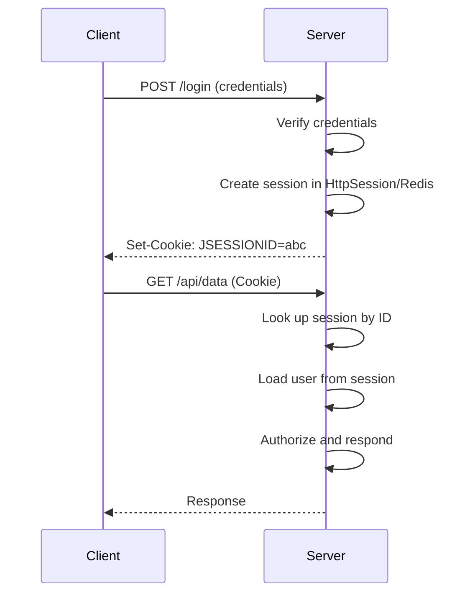
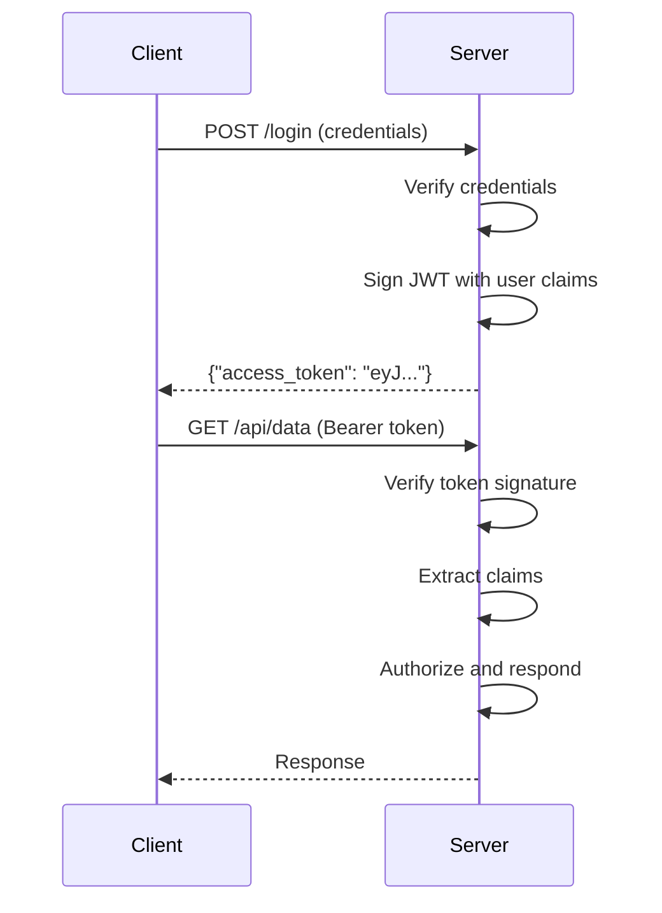

# Session vs Token Authentication

## Overview

Authentication strategies fall into two broad categories: session-based (stateful) and token-based (stateless). Each approach makes fundamentally different trade-offs around performance, scalability, security, and developer complexity. This guide provides a detailed comparison with implementation patterns for both approaches in Spring Boot.

---

## Session-Based Authentication: How It Works

In session-based authentication, the server stores session state and issues a session identifier to the client:



### Implementation in Spring Boot

Session-based configuration with `IF_REQUIRED` creation policy. The `sessionFixation().migrateSession()` call protects against session fixation attacks by issuing a new session ID after login. `maximumSessions(1)` limits concurrent logins per user:

```java
@Configuration
@EnableWebSecurity
public class SessionAuthSecurityConfig {

    @Bean
    public SecurityFilterChain securityFilterChain(HttpSecurity http) throws Exception {
        http
            .sessionManagement(session -> session
                .sessionCreationPolicy(SessionCreationPolicy.IF_REQUIRED)
                .sessionFixation().migrateSession()
                .maximumSessions(1)
                .maxSessionsPreventsLogin(false)
            )
            .formLogin(login -> login
                .loginPage("/login")
                .defaultSuccessUrl("/dashboard")
                .permitAll()
            )
            .authorizeHttpRequests(auth -> auth
                .requestMatchers("/admin/**").hasRole("ADMIN")
                .anyRequest().authenticated()
            );
        
        return http.build();
    }
}
```

### Session Storage Options

**In-Memory (default, not for production)**:

```yaml
server.servlet.session:
  timeout: 30m
  tracking-modes: cookie
  cookie:
    secure: true
    http-only: true
    same-site: strict
```

**Redis for distributed sessions**:

For production deployments, the default in-memory session storage does not scale beyond a single instance. Spring Session backed by Redis provides a shared session store that all application instances can access:

```xml
<dependency>
    <groupId>org.springframework.session</groupId>
    <artifactId>spring-session-data-redis</artifactId>
</dependency>
```

```java
@Configuration
@EnableRedisHttpSession(maximumSessions = 1)
public class RedisSessionConfig {

    @Bean
    public LettuceConnectionFactory redisConnectionFactory() {
        return new LettuceConnectionFactory("localhost", 6379);
    }
}
```

With Redis-backed sessions, any server in the cluster can serve any client's session.

---

## Token-Based Authentication: How It Works

In token-based authentication, the authentication data is encoded directly into the token:



### Implementation in Spring Boot

Token-based configuration is stateless — no session is created or stored. CSRF protection is disabled because bearer tokens in headers are not subject to CSRF attacks (the browser does not automatically attach them to cross-origin requests):

```java
@Configuration
@EnableWebSecurity
public class TokenAuthSecurityConfig {

    @Autowired
    private JwtAuthenticationFilter jwtFilter;

    @Bean
    public SecurityFilterChain securityFilterChain(HttpSecurity http) throws Exception {
        http
            .sessionManagement(session -> session
                .sessionCreationPolicy(SessionCreationPolicy.STATELESS)
            )
            .csrf(csrf -> csrf.disable())  // Stateless APIs don't need CSRF
            .addFilterBefore(jwtFilter, UsernamePasswordAuthenticationFilter.class)
            .authorizeHttpRequests(auth -> auth
                .requestMatchers("/auth/**").permitAll()
                .requestMatchers("/admin/**").hasRole("ADMIN")
                .anyRequest().authenticated()
            );
        
        return http.build();
    }
}
```

### Token Storage on Client

For browser-based applications, store tokens in `httpOnly` cookies rather than `localStorage`. An `httpOnly` cookie is inaccessible to JavaScript, so an XSS vulnerability cannot steal the token:

```java
// Storing in httpOnly cookie (recommended for web apps)
@PostMapping("/auth/login")
public ResponseEntity<Void> login(@RequestBody LoginRequest request, 
                                  HttpServletResponse response) {
    AuthResult result = authService.authenticate(request);
    
    Cookie accessTokenCookie = new Cookie("access_token", result.getAccessToken());
    accessTokenCookie.setHttpOnly(true);
    accessTokenCookie.setSecure(true);
    accessTokenCookie.setPath("/");
    accessTokenCookie.setMaxAge(900);  // 15 minutes
    accessTokenCookie.setAttribute("SameSite", "Strict");
    response.addCookie(accessTokenCookie);
    
    return ResponseEntity.ok().build();
}
```

---

## Deep Comparison

### 1. Performance Characteristics

Session-based lookup is constant time (O(1)) but requires a network round-trip to Redis in distributed setups. Token-based verification is CPU-bound (signature verification) but requires no network call:

```text
Request latency (with Redis session):
  HTTP receive: 0.1ms
  Redis GET:   0.5ms
  Auth check:  0.1ms
  Business:    5.0ms
  Total:       5.7ms
```

```text
Request latency (with RS256 JWT):
  HTTP receive:       0.1ms
  JWT parse:          0.3ms
  RSA verification:   0.8ms
  Claims extraction:  0.1ms
  Business:           5.0ms
  Total:              6.3ms
```

### 2. Scalability

Session-based requires sticky sessions or shared session storage. Spring Cloud LoadBalancer can be configured with sticky sessions based on the `JSESSIONID` cookie:

```java
// Spring Cloud LoadBalancer with sticky sessions
spring:
  cloud:
    loadbalancer:
      cache:
        enabled: true
      sticky-session:
        enabled: true
        cookie-name: "JSESSIONID"
```

Token-based scales horizontally without any coordination — any instance can verify the token independently using the shared public key:

```java
// Any instance can verify the token independently
@Bean
public JwtDecoder jwtDecoder() {
    return NimbusJwtDecoder.withPublicKey(publicKey).build();
    // No shared state needed between instances
}
```

### 3. Security Properties

| Aspect | Session | Token (JWT) |
|--------|---------|-------------|
| Revocation | Immediate (delete session) | Not possible until expiration |
| CSRF protection | Built-in (synchronizer token) | Not needed (Bearer header) |
| XSS impact | Session cookie is httpOnly | Token in localStorage is vulnerable |
| Token theft window | Session is short-lived | Until token expires |
| Logout mechanism | Session.invalidate() | Requires blocklist |

### 4. Storage Requirements

Session-based systems need storage proportional to active users. Redis must be sized to hold all active sessions:

```java
// Session memory calculation
// Active users: 100,000
// Session size: ~500 bytes (user object + metadata)
// Total memory: 100,000 * 500 = 50 MB

// In Redis with replication:
redis:
  maxmemory: 256mb
  maxmemory-policy: allkeys-lru  # Evict old sessions if memory full
```

Token-based systems need no server-side storage, though a blocklist for revoked tokens may require some Redis capacity:

```java
// No session storage infrastructure needed
// But you may need a blocklist for logout:
redis:
  maxmemory: 64mb  # Only for blocklisted tokens
```

---

## Hybrid Approach: Best of Both Worlds

Use short-lived access tokens (stateless) with session-backed refresh tokens (stateful for revocation). The access token provides fast stateless verification for most requests. The refresh token, stored server-side, enables immediate revocation:

```java
@Service
public class HybridAuthService {

    private final JwtTokenProvider tokenProvider;
    private final SessionRefreshTokenStore sessionStore;

    public AuthResponse login(String username, String password) {
        User user = authenticate(username, password);

        // Stateless access token (5 minutes)
        String accessToken = tokenProvider.generateAccessToken(user, Duration.ofMinutes(5));

        // Stateful refresh token stored in session
        String refreshToken = sessionStore.createSession(user.getId(), Duration.ofDays(7));

        return new AuthResponse(accessToken, refreshToken);
    }

    public AuthResponse refresh(String refreshToken) {
        // Validate refresh token against server-side session
        Session session = sessionStore.validateAndRotate(refreshToken);
        if (session == null) {
            throw new InvalidTokenException("Session expired or revoked");
        }

        String newAccessToken = tokenProvider.generateAccessToken(
            session.getUser(), Duration.ofMinutes(5)
        );

        return new AuthResponse(newAccessToken, session.getToken());
    }

    public void logout(String refreshToken) {
        sessionStore.invalidateSession(refreshToken);
    }
}
```

---

## Common Mistakes

### Mistake 1: Using Default Session Storage in Production

The default `ConcurrentHashMap`-based session storage does not survive restarts or scale across instances:

```java
// WRONG: Default in-memory sessions don't scale
@SpringBootApplication
public class Application {
    // Uses ConcurrentHashMap-based session storage
    // Sessions are lost on restart
    // Sessions don't survive load balancer failover
}

// CORRECT: Use Redis for distributed sessions
@Configuration
@EnableRedisHttpSession
public class SessionConfig {
    // Sessions persist across restarts
    // All instances share the same session store
}
```

### Mistake 2: Exposing JWT in Storage Vulnerable to XSS

`localStorage` is accessible to any JavaScript running on the same origin, making it vulnerable to XSS attacks:

```javascript
// WRONG: JWT in localStorage is readable by JavaScript
localStorage.setItem('access_token', token);
// Any XSS vulnerability leaks the token permanently

// CORRECT: Use httpOnly cookie for browser apps
document.cookie = "access_token=" + token + 
  "; HttpOnly; Secure; SameSite=Strict; Path=/";
```

### Mistake 3: Not Handling Token Refresh Gracefully

Without a refresh mechanism, users are logged out abruptly when their short-lived token expires:

```java
// WRONG: No refresh mechanism
// User gets logged out after 15 minutes with no warning

// CORRECT: Implement token refresh
@PostMapping("/auth/refresh")
public ResponseEntity<AuthResponse> refresh(HttpServletRequest request) {
    String refreshToken = extractRefreshToken(request);
    try {
        AuthResponse response = authService.refresh(refreshToken);
        return ResponseEntity.ok(response);
    } catch (ExpiredRefreshTokenException e) {
        return ResponseEntity.status(401)
            .body(new AuthResponse(null, null, "Session expired, please login again"));
    }
}
```

---

## Decision Framework

Choose session auth when:
- You need immediate revocation (admin bans, password changes)
- Your application is a traditional server-rendered web app
- You have existing session infrastructure (Redis cluster)
- CSRF protection is built into your framework

Choose token auth when:
- You need to scale horizontally without shared state
- Your clients are mobile apps or SPAs
- You have microservices that need to verify independently
- You want to reduce infrastructure complexity

---

## Summary

Session auth provides stronger security controls (immediate revocation, logout) at the cost of infrastructure complexity. Token auth offers better scalability and simpler client integration but sacrifices the ability to revoke access immediately. A hybrid approach with short-lived access tokens and session-backed refresh tokens often provides the optimal balance.

---

## References

- [Spring Session Documentation](https://docs.spring.io/spring-session/reference/)
- [OWASP Session Management Cheat Sheet](https://cheatsheetseries.owasp.org/cheatsheets/Session_Management_Cheat_Sheet.html)
- [RFC 6265 - HTTP Cookies](https://tools.ietf.org/html/rfc6265)
- [Spring Security Architecture](https://spring.io/guides/topicals/spring-security-architecture)

Happy Coding
