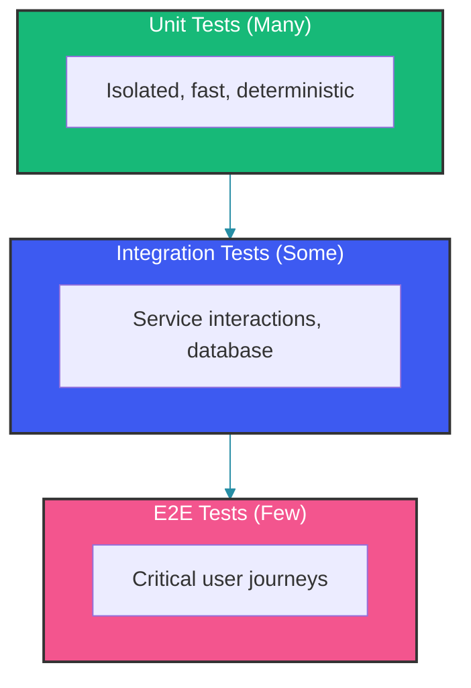

# CI Pipeline Testing Strategy

## Overview

A well-designed CI pipeline runs the right tests at the right time, providing fast feedback while maintaining quality. This guide covers test stage organization, parallel execution strategies, flaky test handling, and quality gates that prevent defective code from reaching production.

---

## Test Pyramid in CI



### CI Stage Mapping

| Stage | Tests | Time | Frequency | Fail Fast |
|-------|-------|------|-----------|-----------|
| 1. Commit | Unit tests | 1-2 min | Every push | Yes |
| 2. Component | Slice tests | 3-5 min | Every push | Yes |
| 3. Integration | Integration tests | 10-15 min | Every push | Yes |
| 4. Contract | Pact verification | 5 min | Every push | Yes |
| 5. E2E | End-to-end | 30-60 min | Merged PRs | No |
| 6. Performance | Load tests | 30+ min | Nightly | No |

---

## Pipeline Configuration

### GitHub Actions

```yaml
name: CI Pipeline

on:
  push:
    branches: [main, develop]
  pull_request:
    branches: [main]

jobs:
  # Stage 1: Unit Tests (fastest feedback)
  unit-tests:
    runs-on: ubuntu-latest
    strategy:
      matrix:
        java: [17, 21]
    steps:
      - uses: actions/checkout@v4
      - uses: actions/setup-java@v4
        with:
          java-version: ${{ matrix.java }}
          distribution: 'temurin'
          cache: maven
      - name: Run unit tests
        run: mvn test -pl '!integration-tests,!e2e-tests' -Dgroups="unit"
      - name: Upload test results
        uses: actions/upload-artifact@v3
        if: always()
        with:
          name: unit-test-results-${{ matrix.java }}
          path: '**/target/surefire-reports/*.xml'

  # Stage 2: Integration Tests (with Testcontainers)
  integration-tests:
    needs: unit-tests
    runs-on: ubuntu-latest
    steps:
      - uses: actions/checkout@v4
      - uses: actions/setup-java@v4
        with:
          java-version: 17
          distribution: 'temurin'
      - name: Run integration tests
        run: mvn verify -pl integration-tests -Dgroups="integration"
      - name: Upload test report
        uses: actions/upload-artifact@v3
        if: always()
        with:
          name: integration-test-report
          path: integration-tests/target/site/

  # Stage 3: Contract Tests
  contract-tests:
    needs: unit-tests
    runs-on: ubuntu-latest
    steps:
      - uses: actions/checkout@v4
      - uses: actions/setup-java@v4
      - name: Verify provider pacts
        run: mvn pact:verify
        env:
          PACT_BROKER_URL: ${{ secrets.PACT_BROKER_URL }}
      - name: Can I Deploy?
        run: |
          pact-broker can-i-deploy \
            --pacticipant ${{ github.event.repository.name }} \
            --version ${{ github.sha }} \
            --to-environment production
        env:
          PACT_BROKER_URL: ${{ secrets.PACT_BROKER_URL }}

  # Stage 4: Static Analysis
  static-analysis:
    runs-on: ubuntu-latest
    steps:
      - uses: actions/checkout@v4
      - uses: actions/setup-java@v4
      - name: SonarCloud Scan
        run: mvn sonar:sonar -Dsonar.qualitygate.wait=true
        env:
          SONAR_TOKEN: ${{ secrets.SONAR_TOKEN }}

  # Stage 5: Security Scan
  security:
    runs-on: ubuntu-latest
    steps:
      - uses: actions/checkout@v4
      - name: OWASP Dependency Check
        run: mvn dependency-check:check -DfailBuildOnCVSS=7
      - name: Snyk Scan
        uses: snyk/actions/maven@master
        env:
          SNYK_TOKEN: ${{ secrets.SNYK_TOKEN }}

  # Stage 6: Quality Gate
  quality-gate:
    needs:
      - unit-tests
      - integration-tests
      - contract-tests
      - static-analysis
      - security
    runs-on: ubuntu-latest
    if: always()
    steps:
      - name: Check all tests passed
        run: |
          # Fail if any required stage failed
          echo "All quality gates passed. Ready for deployment."
```

---

## Parallel Execution

### Maven Parallel Execution

```bash
# Run tests in parallel by module
mvn test -T 4  # 4 threads

# Run tests in parallel by test class
mvn test -Dparallel=classes -DperCoreThreadCount=true

# Run tests in parallel with fixed thread count
mvn test -Dparallel=methods -DthreadCount=8
```

### Test Splitting Strategy

```yaml
# Split tests across multiple CI runners
name: Parallel Test Execution

jobs:
  test:
    strategy:
      matrix:
        # Split into 4 parallel groups
        ci-node: [0, 1, 2, 3]
    steps:
      - uses: actions/checkout@v4
      - uses: actions/setup-java@v4
      
      - name: Run test group
        run: |
          mvn test \
            -Dgroups="unit" \
            -Djunit.chunks=${{ strategy.job-total }} \
            -Djunit.chunk=${{ matrix.ci-node }}
```

### Test Grouping Configuration

```java
// JUnit 5 Tag-based grouping
@Tag("unit")
@Tag("fast")
class UserServiceTest { }

@Tag("integration")
@Tag("slow")
class UserRepositoryTest { }

// Run only unit tests:
// mvn test -Dgroups="unit"

// Run unit AND integration (both groups):
// mvn test -Dgroups="unit|integration"

// Run tests tagged with "fast" AND "unit":
// mvn test -Dgroups="unit&fast"
```

---

## Test Result Aggregation

```xml
<!-- Aggregate test results from multiple modules -->
<plugin>
    <groupId>org.apache.maven.plugins</groupId>
    <artifactId>maven-surefire-report-plugin</artifactId>
    <version>3.2.5</version>
    <configuration>
        <aggregate>true</aggregate>
        <linkXRef>false</linkXRef>
    </configuration>
</plugin>
```

### Publishing Results

```yaml
# Publish JUnit results to GitHub
- name: Publish Unit Test Results
  uses: dorny/test-reporter@v1
  if: always()
  with:
    name: Test Results
    path: '**/target/surefire-reports/*.xml'
    reporter: java-junit
    fail-on-error: true
```

---

## Quality Gates

### SonarQube Quality Gate

```properties
# sonar-project.properties
sonar.qualitygate.wait=true
sonar.coverage.jacoco.xmlReportPaths=**/target/site/jacoco/jacoco.xml
sonar.coverage.exclusions=**/*Configuration.java,**/*Application.java
sonar.exclusions=**/generated/**
```

### Custom Quality Gate Script

```java
// Verify quality gate programmatically
public class QualityGateChecker {

    private final int minUnitTestCount = 500;
    private final double minLineCoverage = 80.0;
    private final int maxCriticalViolations = 0;

    public boolean checkQualityGate(TestSummary summary, CoverageReport coverage) {
        boolean unitTestsPassed = summary.getUnitTestCount() >= minUnitTestCount;
        boolean coveragePassed = coverage.getLineCoverage() >= minLineCoverage;
        boolean violationsPassed = coverage.getCriticalViolations() <= maxCriticalViolations;

        StringBuilder report = new StringBuilder();
        report.append("=== Quality Gate ===\n");
        report.append(String.format("Unit tests: %d/%d %s%n",
            summary.getUnitTestCount(), minUnitTestCount,
            unitTestsPassed ? "PASS" : "FAIL"));
        report.append(String.format("Coverage: %.1f%%/%.0f%% %s%n",
            coverage.getLineCoverage(), minLineCoverage,
            coveragePassed ? "PASS" : "FAIL"));
        report.append(String.format("Critical violations: %d/%d %s%n",
            coverage.getCriticalViolations(), maxCriticalViolations,
            violationsPassed ? "PASS" : "FAIL"));

        System.out.println(report.toString());
        return unitTestsPassed && coveragePassed && violationsPassed;
    }
}
```

---

## Flaky Test Management in CI

### Retry Strategy

```xml
<!-- Surefire retry for flaky tests -->
<plugin>
    <groupId>org.apache.maven.plugins</groupId>
    <artifactId>maven-surefire-plugin</artifactId>
    <version>3.2.5</version>
    <configuration>
        <rerunFailingTestsCount>2</rerunFailingTestsCount>
        <statelessTestsetReporter
            implementation="org.apache.maven.plugin.surefire.extensions.junit5.JUnit5Xml30StatelessReporter">
            <usePhrasedFileName>true</usePhrasedFileName>
            <usePhrasedTestSuiteFileName>true</usePhrasedTestSuiteFileName>
        </statelessTestsetReporter>
    </configuration>
</plugin>
```

### Flaky Test Detection

```yaml
# Run tests multiple times to detect flakiness
name: Flaky Test Detector

on:
  schedule:
    - cron: '0 6 * * 1'  # Every Monday

jobs:
  flaky-detection:
    runs-on: ubuntu-latest
    steps:
      - uses: actions/checkout@v4
      - name: Run tests 5 times
        run: |
          for i in 1 2 3 4 5; do
            echo "=== Run $i ==="
            mvn test -Dgroups="unit" -Dmaven.test.failure.ignore=true
          done
      - name: Analyze flaky tests
        run: python analyze_flaky_tests.py target/surefire-reports/
```

---

## Fast Feedback Strategies

### 1. Parallel Module Build

```yaml
# Build independent modules in parallel
- name: Build in parallel
  run: mvn install -DskipTests -T 4
- name: Test in parallel
  run: mvn test -T 4
```

### 2. Test Impact Analysis

```java
// Only run tests affected by code changes
public class TestSelector {

    private final Set<String> changedFiles;

    public Set<Class<?>> selectTests(Set<String> changes) {
        Set<Class<?>> affectedTests = new HashSet<>();

        for (String file : changes) {
            // Find which tests exercise this file
            Set<Class<?>> tests = impactAnalyzer.findAffectedTests(file);
            affectedTests.addAll(tests);
        }

        return affectedTests;
    }
}
```

### 3. Layer-Based Execution

```mermaid
gantt
    title Layer-Based Test Execution Timeline
    dateFormat X
    axisFormat %S s
    section Test Stages
    Unit Tests (fast)    :0, 5
    Component Tests (medium) :5, 10
    Integration Tests (slower) :10, 25
    Contract Tests       :25, 35
```



---

## Common Mistakes

### Mistake 1: Running All Tests in Sequence

```yaml
# WRONG: Sequential execution (slow)
- run: mvn test     # All tests in one job
- run: mvn verify

# CORRECT: Parallel stages
jobs:
  unit-tests: ...
  integration-tests: ...
  contract-tests: ...
```

### Mistake 2: Ignoring Test Results on Failure

```yaml
# WRONG: Ignoring failures
- run: mvn test || true  # Never fails the pipeline

# CORRECT: Fail on test failure
- run: mvn test
# Pipeline stops if tests fail
```

### Mistake 3: No Test Splitting

```yaml
# WRONG: All tests in one runner
- run: mvn test  # Run time: 45 minutes

# CORRECT: Split across runners
strategy:
  matrix:
    shard: [1, 2, 3, 4]
- run: mvn test -Djunit.shard=${{ matrix.shard }}
# Run time: 12 minutes per runner
```

---

## Summary

A well-structured CI pipeline runs tests in stages based on their speed and scope. Unit tests provide the fastest feedback, followed by integration and contract tests. E2E and performance tests run in the background or on schedule. Use parallel execution, test splitting, and quality gates to maintain fast feedback while ensuring code quality.

---

## References

- [GitHub Actions Documentation](https://docs.github.com/en/actions)
- [Maven Surefire Plugin](https://maven.apache.org/surefire/maven-surefire-plugin/)
- [Test Automation in CI/CD](https://martinfowler.com/articles/practical-test-pyramid.html)
- [Google Testing on the Toilet](https://testing.googleblog.com/)

Happy Coding
