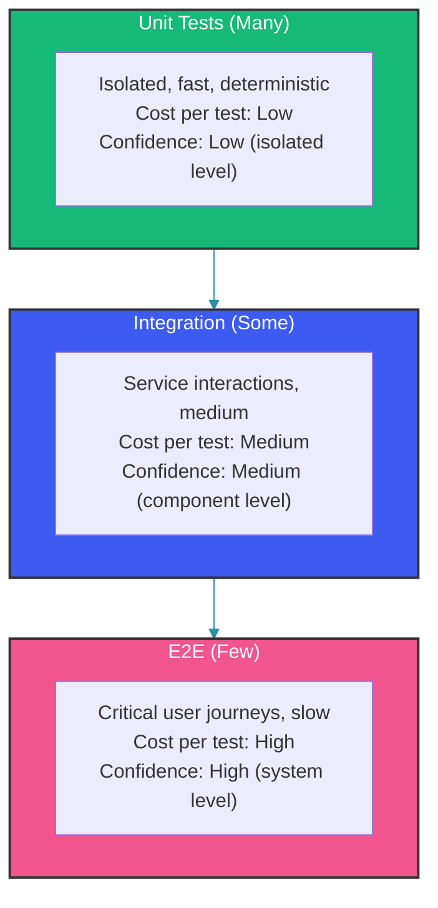
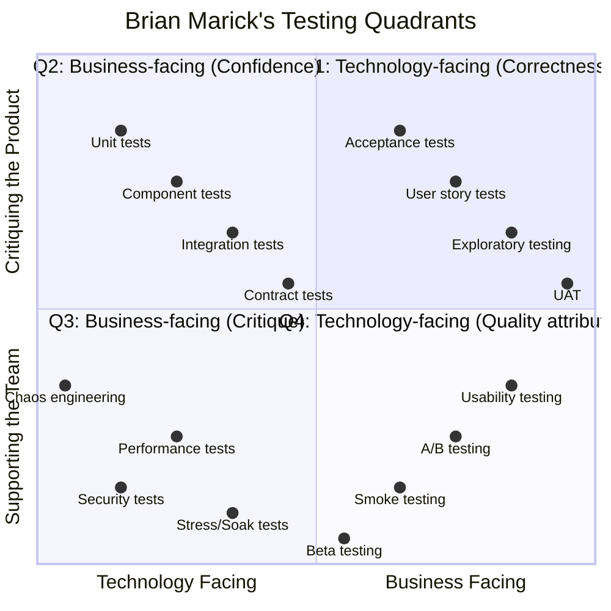
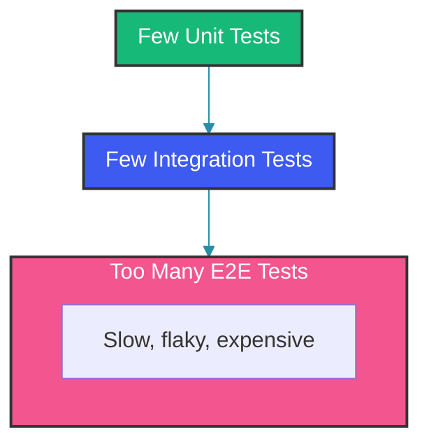
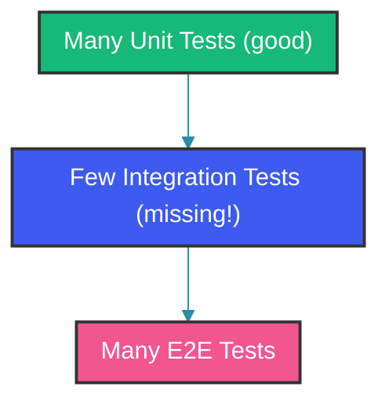
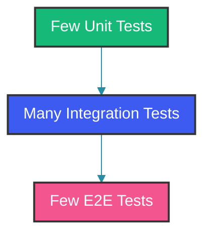

# Software Testing Strategy Overview

## Overview

A testing strategy defines what to test, how to test it, and when to run each type of test. The goal is to maximize defect detection while minimizing execution time and maintenance cost. This guide covers the test pyramid, testing quadrants, and how to build a balanced test suite that provides fast feedback and high confidence.

---

## The Test Pyramid

The test pyramid describes test distribution across different levels:



### Why the Pyramid?

| Aspect | Unit (Base) | Integration (Middle) | E2E (Top) |
|--------|-------------|---------------------|-----------|
| Speed | Milliseconds | Seconds | Minutes |
| Flakiness | Low | Medium | High |
| Debugging | Immediate | Moderate | Complex |
| Maintenance | Low | Medium | High |
| Confidence per test | Low (isolated) | Medium | High (system) |
| Number of tests | 1000s | 100s | 10s |

Goal: Pareto-distribute effort: 70% unit, 20% integration, 10% E2E.

---

## Testing Quadrants

Brian Marick's testing quadrants organize tests by purpose (business vs. technology facing, supporting vs. critiquing):



---

## Building a Balanced Test Suite

### Layer 1: Unit Tests (70%)

Test individual classes and methods in isolation:

```java
// Service layer test
@ExtendWith(MockitoExtension.class)
class OrderServiceUnitTest {

    @Mock
    private OrderRepository orderRepository;

    @Mock
    private InventoryClient inventoryClient;

    @InjectMocks
    private OrderService orderService;

    @Test
    void shouldCalculateOrderTotal() {
        Order order = new Order();
        order.addItem(new OrderItem("SKU-001", 2, 25.00));

        double total = order.calculateTotal();

        assertEquals(50.00, total, 0.001);
    }
}
```

The unit test above uses Mockito to mock external dependencies (`OrderRepository`, `InventoryClient`) while testing only the `OrderService` logic. This keeps the test fast (milliseconds) and deterministic since no database or network calls are involved. The `@InjectMocks` annotation automatically injects the mocks into the service constructor.

### Layer 2: Integration Tests (20%)

Test service interactions with real infrastructure:

```java
// Repository test with Testcontainers
@DataJpaTest
@AutoConfigureTestDatabase(replace = AutoConfigureTestDatabase.Replace.NONE)
@Testcontainers
class OrderRepositoryIntegrationTest {

    @Container
    static PostgreSQLContainer<?> postgres = new PostgreSQLContainer<>("postgres:15-alpine");

    @Autowired
    private OrderRepository orderRepository;

    @Test
    void shouldPersistOrderWithItems() {
        Order order = new Order("customer-1");
        order.addItem(new OrderItem("SKU-001", 2, 25.00));

        Order saved = orderRepository.save(order);

        assertNotNull(saved.getId());
        assertThat(orderRepository.findById(saved.getId())).isPresent();
    }
}
```

Integration tests like this one use Testcontainers to spin up a real PostgreSQL instance, ensuring the SQL dialect and constraints match production exactly. The `@DataJpaTest` annotation loads only JPA-related beans, keeping the context lightweight. The trade-off is slower execution (seconds vs milliseconds) but higher confidence in database interactions.

### Layer 3: Contract Tests (5%)

Verify API compatibility between services:

```java
@Provider("OrderService")
@PactBroker
@SpringBootTest(webEnvironment = SpringBootTest.WebEnvironment.RANDOM_PORT)
class OrderServiceContractTest {

    @LocalServerPort
    private int port;

    @BeforeEach
    void setup(PactVerificationContext context) {
        context.setTarget(new HttpTestTarget("localhost", port));
    }

    @TestTemplate
    @ExtendWith(PactVerificationInvocationContextProvider.class)
    void verify(PactVerificationContext context) {
        context.verifyInteraction();
    }
}
```

Contract tests sit between integration and E2E on the pyramid. They verify that the provider API satisfies all consumer expectations without deploying the entire system. The `@State` annotations on the provider side set up specific data scenarios before each verification, ensuring deterministic results.

### Layer 4: E2E Tests (5%)

Test complete user journeys across all services:

```java
@SpringBootTest(webEnvironment = SpringBootTest.WebEnvironment.RANDOM_PORT)
class OrderE2ETest {

    @Autowired
    private TestRestTemplate restTemplate;

    @Test
    void completeOrderFlow() {
        // 1. Create user
        UserResponse user = restTemplate.postForObject(
            "/api/users", new CreateUserRequest("alice", "alice@test.com"),
            UserResponse.class);

        // 2. Add product to cart
        CartResponse cart = restTemplate.postForObject(
            "/api/cart/" + user.getId(),
            new AddItemRequest("SKU-001", 2),
            CartResponse.class);

        // 3. Checkout
        OrderResponse order = restTemplate.postForObject(
            "/api/orders",
            new CreateOrderRequest(user.getId(), cart.getId()),
            OrderResponse.class);

        assertNotNull(order.getOrderId());
        assertEquals("CONFIRMED", order.getStatus());
    }
}
```

E2E tests provide the highest confidence at the system level but are slow, flaky, and expensive to maintain. Use them sparingly for critical user journeys only. The pattern above chains multiple API calls to simulate a real user flow—note that failures at any step require debugging across service boundaries.

---

## Test Execution Strategy

```yaml
# Smart test execution based on change scope
# If only service layer changes:
#   Run: unit tests for the service + its integration tests
# If API changes:
#   Run: contract tests + E2E for affected flows
# If CI pipeline:
#   Run: all tests in stages (fastest first)

stages:
  - stage: Commit Tests
    tests: Unit tests only
    threshold: Fail on any failure
    time: < 2 minutes

  - stage: Component Tests
    tests: Slice tests (@WebMvcTest, @DataJpaTest, @JsonTest)
    threshold: Fail on any failure
    time: < 5 minutes

  - stage: Integration Tests
    tests: Full context tests, Testcontainers
    threshold: Fail on any failure
    time: < 15 minutes

  - stage: Contract Tests
    tests: Pact verification
    threshold: Fail on any incompatibility
    time: < 5 minutes

  - stage: E2E Tests
    tests: Full user journeys in staging
    threshold: < 2% failure rate
    time: < 60 minutes

  - stage: Performance
    tests: Load, stress, soak
    threshold: P95 < 2s, error rate < 0.1%
    time: < 30 minutes (load), nightly (soak)
```

---

## Testing Metrics and SLAs

```java
public class TestingMetrics {

    // Test suite health metrics
    record TestSuiteHealth(
        int totalTests,
        int unitTests,
        int integrationTests,
        int e2eTests,
        double passRate,
        double flakyRate,
        double coverageLine,
        double coverageBranch,
        Duration averageDuration
    ) {
        public boolean isHealthy() {
            return passRate >= 0.995 &&        // 99.5% pass rate
                   flakyRate <= 0.01 &&         // <1% flaky
                   coverageLine >= 0.80 &&      // 80% line coverage
                   coverageBranch >= 0.70 &&    // 70% branch coverage
                   averageDuration.toMinutes() <= 15;  // <15 min average
        }
    }

    // Test distribution targets
    record TestDistribution(
        int total,
        double unitRatio,      // 0.70
        double integrationRatio, // 0.20
        double contractRatio,   // 0.05
        double e2eRatio         // 0.05
    ) {
        public boolean isBalanced() {
            return Math.abs(unitRatio - 0.70) < 0.10 &&
                   Math.abs(integrationRatio - 0.20) < 0.10;
        }
    }
}
```

The `TestingMetrics` class above defines SLAs for the test suite. The `passRate` threshold of 99.5% ensures that no more than 0.5% of tests fail due to real regressions. The `flakyRate` threshold of <1% prevents unreliable tests from eroding trust. Monitoring these metrics in CI helps teams detect when the test pyramid is getting unbalanced or when flakiness is creeping in.

---

## Common Testing Anti-Patterns

### 1. Ice Cream Cone (Inverted Pyramid)

Too many E2E tests, too few unit tests:



**Fix**: Add more unit tests, reduce E2E scope.

### 2. Hourglass Pattern

Many unit and E2E tests, but few integration tests:



**Fix**: Add integration tests to fill the gap.

### 3. Diamond Pattern

Too many integration tests, too few unit and E2E tests:



**Fix**: Integration tests are slow. Move logic to unit tests.

---

## Choosing the Right Strategy

| Application Type | Focus | Key Tests |
|-----------------|-------|-----------|
| Microservice | Contract + Integration | Pact, Testcontainers |
| Monolith API | Integration + Unit | @WebMvcTest, @DataJpaTest |
| Batch Processing | Unit + Integration | Job processing, database |
| Real-time Stream | Unit + Integration | Kafka/event processing |
| Library/SDK | Unit (almost all) | Edge cases, API contracts |

---

## Summary

A balanced testing strategy follows the test pyramid: many fast, reliable unit tests at the base; fewer, slower E2E tests at the top. Integration and contract tests fill the middle. Match your testing distribution to your application type, automate tests in CI with stage-based execution, and monitor test health metrics (pass rate, flakiness, coverage, duration).

---

## References

- [Martin Fowler - TestPyramid](https://martinfowler.com/bliki/TestPyramid.html)
- [Brian Marick - Testing Quadrants](https://www.exampler.com/testing-com/writings/talks/testing-quadrants.pdf)
- [Google Testing Blog](https://testing.googleblog.com/)
- [Practical Test Pyramid](https://martinfowler.com/articles/practical-test-pyramid.html)
- [ThoughtWorks - Testing Strategy](https://www.thoughtworks.com/insights/blog/testing-strategy)

Happy Coding
