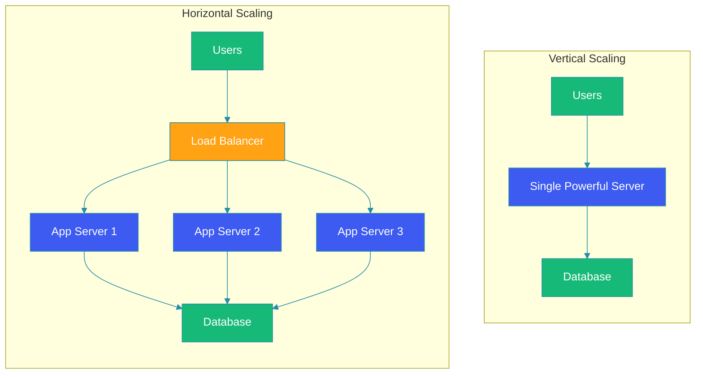

# Scalability Introduction

## Overview

Scalability is the ability of a system to handle increased load by adding resources, without compromising performance or availability. In today's digital landscape, where applications can experience unpredictable traffic spikes and exponential growth, scalability isn't just a nice-to-have feature—it's a fundamental requirement for survival.

This introduction explores the core concepts of scalability, why it matters, and the foundational principles that guide scalable system design. We'll examine different scaling approaches, trade-offs, and real-world considerations that every system architect should understand.

## Problem Statement

Modern applications face several scalability challenges:
- Unpredictable user traffic patterns (viral content, seasonal spikes, marketing campaigns)
- Exponential data growth requiring efficient storage and retrieval
- Increasing complexity of features and integrations
- Global user bases demanding low-latency experiences
- Business requirements for continuous availability and performance

Without proper scalability planning, systems can experience:
- Performance degradation during peak usage
- Complete system failures under high load
- Poor user experience leading to customer churn
- Lost revenue opportunities during critical periods
- Emergency scaling efforts that are costly and error-prone

## Types of Scalability

### Vertical Scaling (Scaling Up)

Vertical scaling involves increasing the capacity of a single server or node by adding more resources:
- CPU: Adding more cores or faster processors
- Memory: Increasing RAM capacity
- Storage: Using faster disks (SSD vs HDD) or larger capacity
- Network: Upgrading network interface cards or bandwidth

**Advantages:**
- Simplicity: No changes to application architecture required
- Lower latency: All resources are on the same machine
- Consistency: No data distribution challenges
- Reduced complexity: Simpler deployment and monitoring

**Disadvantages:**
- Hardware limits: Physical constraints on how much you can upgrade a single machine
- Cost inefficiency: High-end hardware costs increase exponentially
- Single point of failure: If the machine fails, the entire system goes down
- Downtime during upgrades: Often requires system restarts
- Limited geographic distribution: Can't place resources closer to users

### Horizontal Scaling (Scaling Out)

Horizontal scaling involves adding more machines or nodes to your system and distributing the workload across them:
- Adding more servers to a cluster
- Distributing data across multiple databases
- Load balancing requests across multiple instances
- Microservices architecture with independent services

**Advantages:**
- Theoretically unlimited scaling: Can keep adding nodes as needed
- Better fault tolerance: Failure of one node doesn't cripple the system
- Cost-effective: Commodity hardware is often cheaper than high-end systems
- Geographic distribution: Can place nodes closer to users for lower latency
- Rolling upgrades: Can update nodes individually without system downtime

**Disadvantages:**
- Increased complexity: Requires load balancing, data distribution, and consistency mechanisms
- Network overhead: Communication between nodes adds latency
- Data consistency challenges: Maintaining consistency across distributed systems
- Complex monitoring and debugging: More components to track
- Potential for uneven load distribution: Requires sophisticated load balancing

## Architecture Diagram

## Scaling Dimensions

### Load Scalability
The ability to handle increasing numbers of requests or users:
- Requests per second (RPS)
- Concurrent users
- Transactions per minute
- API call volume

### Data Scalability
The ability to manage growing volumes of data:
- Storage capacity requirements
- Dataset size for processing
- Backup and recovery time
- Archive and retention policies

### Geographic Scalability
The ability to serve users from different locations effectively:
- Multi-region deployments
- CDN integration
- Edge computing capabilities
- Localization and compliance requirements

### Administrative Scalability
The ability to manage the system as it grows:
- Team size and expertise requirements
- Operational complexity
- Deployment frequency and risk
- Monitoring and alerting effectiveness

## Key Principles of Scalable Design

### 1. Statelessness
Design components to be stateless whenever possible, storing session data externally (in databases, caches, or distributed stores). This allows any instance to handle any request, making horizontal scaling trivial.

### 2. Loose Coupling
Minimize dependencies between components so they can be scaled independently. Use well-defined interfaces, APIs, and asynchronous communication patterns.

### 3. Horizontal Partitioning
Split data and workload across multiple nodes based on keys or ranges (sharding). This distributes load and prevents any single node from becoming a bottleneck.

### 4. Caching Strategy
Implement multi-level caching (application-level, database-level, CDN) to reduce load on backend systems and improve response times for frequently accessed data.

### 5. Asynchronous Processing
Use message queues, event streaming, and background jobs to decouple request handling from time-consuming operations, allowing better resource utilization and peak load handling.

### 6. Observability
Build comprehensive monitoring, logging, and tracing capabilities to understand system behavior under load and identify bottlenecks before they cause issues.

### 7. Graceful Degradation
Design systems to maintain core functionality even when under stress, possibly reducing non-essential features rather than failing completely.

## Scaling Strategies

### Reactive Scaling (Auto-scaling)
Automatically adjust resources based on real-time metrics:
- CPU utilization thresholds
- Memory consumption levels
- Request queue depths
- Response time SLA violations
- Custom business metrics

### Predictive Scaling
Anticipate load patterns using historical data and machine learning:
- Daily/weekly traffic patterns
- Seasonal trends
- Marketing campaign schedules
- Product launch calendars

### Manual Scaling
Human-driven scaling decisions based on:
- Operational expertise
- Business context understanding
- Risk assessment
- Cost optimization considerations

## Database Scalability Considerations

### Read Scaling
- Database replicas for read-heavy workloads
- Read-through caching strategies
- Materialized views for complex queries
- Search engine integration for text-heavy queries

### Write Scaling
- Sharding strategies (range-based, hash-based, directory-based)
- Write-ahead logging optimization
- Batch processing for non-real-time writes
- Conflict resolution strategies for distributed writes

### Consistency Models
- Strong consistency (ACID transactions)
- Eventual consistency (BASE properties)
- Read-after-write consistency
- Monotonic reads/writes
- Choose the right model based on business requirements

## Network and Infrastructure Considerations

### Load Balancing
- Layer 4 (TCP/UDP) vs Layer 7 (HTTP) load balancers
- Algorithms: Round-robin, least connections, IP hash, weighted distribution
- Health checks and circuit breaker patterns
- SSL termination and certificate management

### Content Delivery
- CDN integration for static assets
- Dynamic content acceleration
- Geographic load balancing (GSLB)
- Edge computing for computation close to users

### Database Connectivity
- Connection pooling strategies
- Read/write splitting
- Database proxy layers
- Network optimization and compression

## Cost Considerations

### Right-sizing
- Match resource types to workload characteristics
- Use spot/preemptible instances for fault-tolerant workloads
- Implement autoscaling policies that balance performance and cost
- Regularly review and optimize resource allocation

### Architecture Economics
- Serverless vs container vs VM trade-offs
- Managed services vs self-operated infrastructure
- Data transfer and egress costs
- Storage tiering based on access patterns

### Optimization Opportunities
- Identify and eliminate over-provisioned resources
- Optimize database queries and indexing
- Implement efficient caching strategies
- Use compression and data deduplication where applicable

## Common Anti-patterns to Avoid

### 1. Premature Optimization
Don't optimize for scale before understanding actual usage patterns. Start simple, measure, then scale where needed.

### 2. Ignoring the Fallacies of Distributed Computing
Remember that network is unreliable, latency is zero, bandwidth is infinite, etc. Design accordingly.

### 3. Over-engineering Simple Problems
Not every application needs web-scale architecture from day one. Match complexity to actual requirements.

### 4. Neglecting Observability
You can't scale what you can't measure. Invest in monitoring, logging, and tracing early.

### 5. Creating Single Points of Failure
Even in scalable systems, watch for hidden dependencies that can become bottlenecks.

### 6. Ignoring Data Gravity
Consider where your data lives and the cost of moving it. Sometimes it's better to move computation to data rather than vice versa.

## Best Practices

### 1. Design for Failure
Assume components will fail and design graceful degradation and recovery mechanisms.

### 2. Measure Everything
Instrument your code, infrastructure, and business metrics to make data-driven scaling decisions.

### 3. Automate Religiously
Automate deployment, scaling, monitoring, and recovery processes to reduce human error and increase speed.

### 4. Test at Scale
Use load testing, chaos engineering, and game days to validate your scaling assumptions before production.

### 5. Plan for Observability
Build tracing, logging, and metrics collection into your applications from the start, not as an afterthought.

### 6. Consider the Entire Stack
Scalability isn't just about application servers—consider databases, caches, queues, networks, and third-party services.

### 7. Document Assumptions
Clearly document your scaling assumptions, limits, and break points so teams understand system boundaries.

## Summary

Scalability is a multifaceted challenge that requires thoughtful architectural decisions, continuous monitoring, and adaptive strategies. The key to successful scalability lies not in choosing between vertical and horizontal scaling, but in understanding when and how to apply each approach effectively.

Remember that scalability is a journey, not a destination. As your application grows and evolves, your scaling strategies must evolve with it. Start with solid fundamentals, measure relentlessly, and be prepared to adapt your approach as you learn what works best for your specific use case.

The most scalable systems aren't necessarily the most complex ones—they're the ones that are well-understood, properly monitored, and designed with clear scaling principles in mind.

## References

* [Amazon Builders' Library: Scalability Best Practices](https://aws.amazon.com/builders-library/)
* [Google Site Reliability Engineering Book](https://sre.google/sre-book/table-of-contents/)
* [Martin Fowler's Articles on Scalability](https://martinfowler.com/architecture/)
* [Netflix Tech Blog on Scalability](https://netflixtechblog.com/)
* [CNCF Cloud Native Patterns](https://github.com/cncf/toc/blob/main/DEMOGRAPHICS.md)