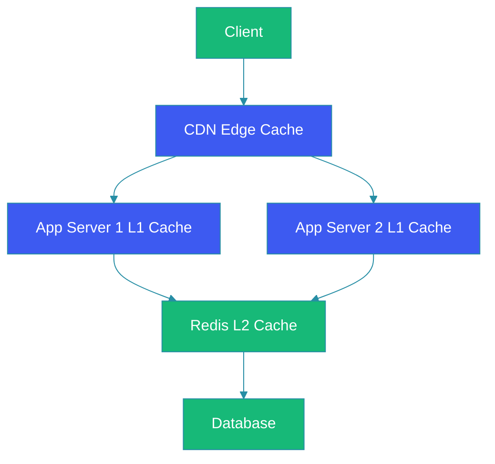

# Caching Strategies

## Overview

Caching is one of the most powerful optimization techniques in system design, storing frequently accessed data in fast storage layers to reduce latency, decrease database load, and improve application throughput. When implemented correctly, caching can provide orders of magnitude performance improvements—serving cached data in microseconds compared to milliseconds or seconds from primary data stores.

This guide explores caching fundamentals, multi-level caching architectures, common cache patterns, eviction policies, and practical implementation strategies for building high-performance systems.

## Problem Statement

Modern applications face challenges that effective caching solves:

**Database load reduction**: Every database query has a cost—in CPU, I/O, and network resources. Repeated identical queries waste these resources on data that hasn't changed.

**Latency reduction**: Database queries, especially complex joins or aggregations, can take hundreds of milliseconds. Caching can serve the same data in microseconds.

**Availability improvement**: Caches can serve data during database outages, providing degraded but functional service.

**Performance consistency**: Without caching, performance varies dramatically with database load. Caching provides consistent response times.

**Cost optimization**: Reducing database queries reduces infrastructure costs, especially important for cloud databases with per-query pricing.

## Caching Layers

### Level 1: Application Cache (In-Memory)

The fastest cache layer, stored within the application process:

**Characteristics**:
- Sub-microsecond access times
- Limited by application memory
- Not shared across instances
- Lost on application restart
- Suitable for static data and hot keys

**Implementation**:
```java
private final Cache<String, User> userCache = Caffeine.newBuilder()
    .maximumSize(10_000)
    .expireAfterWrite(10, TimeUnit.MINUTES)
    .build();
```

### Level 2: Distributed Cache (Redis/Memcached)

Shared cache across application instances:

**Characteristics**:
- Sub-millisecond access times
- Scales beyond single machine memory
- Shared across application instances
- Persistent across application restarts
- Network latency overhead

**Implementation**:
```java
@Cacheable(value = "users", key = "#userId", cacheManager = "redisCacheManager")
public User getUser(String userId) {
    return userRepository.findById(userId);
}
```

### Level 3: Database Query Cache

Caching query results at the database level:

**Characteristics**:
- Reduces repeated identical queries
- Database-managed
- Limited invalidation granularity
- Appropriate for read-heavy, static data

### Level 4: CDN Caching

Content Delivery Networks cache static assets at edge locations:

**Characteristics**:
- Geographic distribution
- Serves static assets (images, videos, CSS, JS)
- Reduces origin server load
- Offloads bandwidth from primary infrastructure

## Cache Patterns

### Cache-Aside (Lazy Loading)

The most common pattern where the cache is populated on demand:

```
Read Operation:
1. Check cache
2. If cache miss, query database
3. Store result in cache
4. Return data

Write Operation:
1. Write to database
2. Invalidate or update cache
```

**Implementation**:
```java
public User getUser(String userId) {
    String cacheKey = "user:" + userId;
    
    // Try cache first
    User user = cache.get(cacheKey);
    if (user != null) {
        return user;
    }
    
    // Cache miss - load from database
    user = userRepository.findById(userId);
    if (user != null) {
        cache.set(cacheKey, user, CACHE_TTL);
    }
    return user;
}
```

**Advantages**:
- On-demand caching—no unnecessary loading
- Cache failures don't prevent database access
- Scales well with read-heavy workloads

**Disadvantages**:
- Cache miss causes initial request penalty
- Potential for stale data without proper invalidation

### Read-Through Cache

The cache automatically loads from the database on misses:

```
1. Request cache for data
2. Cache checks if it has data
3. If miss, cache loads from database
4. Returns data to caller
```

**Implementation**:
```java
LoadingCache<String, User> userCache = Caffeine.newBuilder()
    .maximumSize(10_000)
    .expireAfterWrite(10, TimeUnit.MINUTES)
    .build(key -> userRepository.findById(key));
```

**Advantages**:
- Cleaner code—no cache miss handling
- Consistent loading patterns
- Better for multi-threaded access

**Disadvantages**:
- Cache is coupled to database logic
- All data must go through cache

### Write-Through Cache

Data is written to cache and database simultaneously:

```
1. Write to cache
2. Write to database
3. Confirm both succeeded
```

**Implementation**:
```java
public void saveUser(User user) {
    cache.set("user:" + user.getId(), user);
    userRepository.save(user);
}
```

**Advantages**:
- Strong consistency between cache and database
- No cache miss on subsequent reads
- Better for write-heavy workloads

**Disadvantages**:
- Slower write operations
- Cache can become bottleneck

### Write-Behind Cache (Write-Back)

Data is written to cache immediately, then asynchronously written to database:

```
1. Write to cache
2. Return success
3. Asynchronously write to database
```

**Advantages**:
- Fast write operations
- Better write throughput
- Batch database writes

**Disadvantages**:
- Risk of data loss if cache fails before database write
- Complexity in handling failures
- Eventual consistency

### Cache-Aside with Refresh-Ahead

Pre-refresh cache entries before expiration:

```
1. Background refresher monitors cache
2. Refreshes entries approaching expiration
3. Before they expire
```

**Implementation**:
```java
LoadingCache<String, User> userCache = Caffeine.newBuilder()
    .maximumSize(10_000)
    .refreshAfterWrite(5, TimeUnit.MINUTES)
    .build(key -> userRepository.findById(key));
```

**Advantages**:
- Reduces cache miss penalties
- Smoother performance
- Handles Thundering Herd

## Cache Invalidation

Invalidation is critical—stale data can cause serious problems:

### Invalid on Write

Remove related cache entries when data changes:

```java
public void updateUser(User user) {
    userRepository.save(user);
    cache.invalidate("user:" + user.getId());
}
```

### TTL-Based Expiration

Set expiration times based on data volatility:

```java
// Static reference data - longer TTL
cache.set(key, data, Duration.ofHours(24));

// User preferences - medium TTL  
cache.set(key, data, Duration.ofHours(1));

// Real-time data - short TTL
cache.set(key, data, Duration.ofMinutes(5));
```

### Version-Based Invalidation

Use version numbers to invalidate:

```java
// Store version with data
cache.set(key, data, version);

// On invalidation, increment version
metadata.set(key + ":version", version + 1);

// Check version on read
if (cache.get(key + ":version") < metadata.get(key + ":version")) {
    cache.invalidate(key);
}
```

### Event-Driven Invalidation

Invalidate on data change events:

```java
@EventListener
public void onUserUpdated(UserUpdatedEvent event) {
    cache.invalidate("user:" + event.getUserId());
    cache.invalidate("user:list:" + event.getUserId());
    cache.invalidate("user:search:" + event.getUserId());
}
```

## Eviction Policies

### LRU (Least Recently Used)

Evicts least recently accessed items first:

```java
Cache<String, User> cache = Caffeine.newBuilder()
    .maximumSize(10_000)
    .build();
```

**Best for**: General-purpose caching with temporal access patterns.

### LFU (Least Frequently Used)

Evicts least frequently accessed items:

```java
Cache<String, User> cache = Caffeine.newBuilder()
    .maximumWeight(100_000)
    .weigher((key, user) -> key.length() + user.toString().length())
    .build();
```

**Best for**: Access patterns where frequency matters more than recency.

### TTL (Time-Based)

Evicts based on expiration time:

```java
Cache<String, User> cache = Caffeine.newBuilder()
    .expireAfterWrite(10, TimeUnit.MINUTES)
    .build();
```

**Best for**: Data that should be fresh regardless of access patterns.

### Random Replacement

Evicts randomly:

**Use when**: Access patterns are uniform and eviction policy overhead isn't justified.

## Performance Considerations

### Cache Hit Ratio

The primary metric for cache effectiveness:

```
Hit Ratio = Hits / (Hits + Misses)
```

**Target**: 95%+ hit ratio for well-tuned caches.

### Thundering Herd Problem

When many requests wait for cache reload simultaneously:

**Solution**: Use request coalescing or probabilistic early expiration.

```java
LoadingCache<String, User> userCache = Caffeine.newBuilder()
    .refreshAfterWrite(5, TimeUnit.MINUTES)
    .build(key -> {
        // First request does the work
        return userRepository.findById(key);
    });
```

### Cache Contention

Multiple threads competing for cache access:

**Solutions**:
- Use local caches for hot keys
- Implement request batching
- Add random jitter to TTLs

### Memory Management

Cache size directly impacts performance:

**Formula**: Optimal size = (requests per second) × (average response time) × (desired hit ratio buffer)

```java
Cache<String, User> cache = Caffeine.newBuilder()
    .maximumSize(10_000)          // Hard limit
    .softValuePolicy(SoftValuePolicy.lru())  // Allow overflow to GC
    .build();
```

## Architecture Diagram



## Multi-Level Caching Implementation

### Spring Boot with Redis + Caffeine

```java
@Configuration
public class CacheConfig {

    @Bean
    public CacheManager cacheManager(RedisTemplate<String, Object> redisTemplate) {
        // Caffeine for local cache
        CacheManager localCacheManager = new CaffeineCacheManager() {
            @Override
            protected Cache createCaffeineCache(String name) {
                return Caffeine.newBuilder()
                    .maximumSize(10_000)
                    .expireAfterWrite(5, TimeUnit.MINUTES)
                    .recordStats()
                    .build();
            }
        };

        // Redis for distributed cache
        CacheManager redisCacheManager = new RedisCacheManager(redisTemplate);

        return new CompositeCacheManager(localCacheManager, redisCacheManager);
    }
}
```

### Eviction Coordination

When using multi-level caches, ensure proper invalidation:

```java
public void evictAll(String key) {
    // Evict local cache (this instance)
    localCache.invalidate(key);
    
    // Evict distributed cache
    redisTemplate.delete(key);
    
    // Publish invalidation event
    redisTemplate.convertAndSend("cache:invalidate", key);
}

@PostConstruct
public void subscribeToInvalidation() {
    redisTemplate.listen().onMessage(message -> {
        localCache.invalidate(message.getBody());
    });
}
```

## Monitoring and Metrics

### Key Metrics

```java
StatsCounter stats = cache.stats();

double hitRate = stats.hitRate();
double missRate = 1.0 - hitRate;
long hitCount = stats.hitCount();
long missCount = stats.missCount();
EvictionStats eviction = stats.eviction();
```

### Cache Hit Ratio Alerts

```yaml
alerts:
  - name: cache_hit_ratio_degraded
    condition: hit_ratio < 0.80
    severity: warning
  - name: cache_miss_spike  
    condition: miss_count > threshold * 2
    severity: critical
```

### Monitoring Tools

- **Redis**: INFO command, MONITOR, MEMORY stats
- **Caffeine**: Stats() method with hit/miss statistics
- **Application metrics**: Micrometer cache metrics

## Best Practices

1. **Start with cache-aside**: The simplest pattern with the best characteristics for most use cases.

2. **Use multiple cache levels**: Combine local and distributed caches for optimal performance.

3. **Set appropriate TTLs**: Match TTL to data volatility—shorter for dynamic data.

4. **Monitor hit ratios**: Aim for 95%+ hit ratios; investigate below 80%.

5. **Invalidate properly**: Use event-driven invalidation or version-based approaches.

6. **Handle Thundering Herd**: Use refresh-ahead or request coalescing.

7. **Size cache appropriately**: Calculate based on working set size and access patterns.

## Common Mistakes

1. **Cache without invalidation strategy**: Stale data causes user-facing bugs.

2. **Unlimited cache growth**: Memory exhaustion causes OOM errors.

3. **Very long TTLs for dynamic data**: Users see stale information.

4. **Ignoring cache miss costs**: First access is slow without warming.

5. **Caching uncacheable data**: Data that changes frequently shouldn't be cached.

6. **Missing cache monitoring**: Not knowing if cache is working.

7. **Storing large objects**: Large values consume memory and increase latency.

## Summary

Effective caching is one of the highest-impact optimizations in system design. The key is understanding your data access patterns and choosing the right combination of caching patterns, eviction policies, and cache layers. Start with simple cache-aside patterns, add multiple cache levels as needed, and focus on achieving high hit ratios through appropriate sizing and TTL tuning.

Remember that caching introduces complexity—additional code paths, potential for stale data, and infrastructure requirements. Balance the performance benefits against these costs, and always implement proper monitoring to validate that caching is achieving its goals.

---

## References

- [Caffeine Cache Documentation](https://github.com/ben-manes/caffeine)
- [Redis Documentation](https://redis.io/docs/)
- [AWS ElastiCache Best Practices](https://docs.aws.amazon.com/elasticache/)
- [Google Cloud Caching Patterns](https://cloud.google.com/appengine/docs/standard/java11/using-cache)
