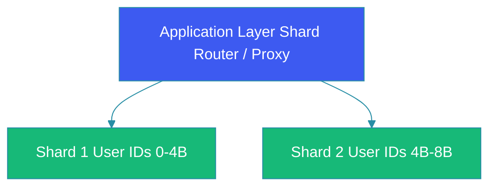
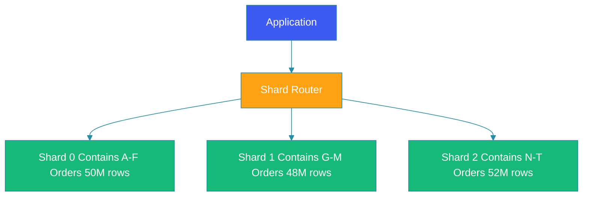

# Database Sharding

## Overview

Database sharding is a horizontal partitioning technique that splits a database into smaller, more manageable pieces called shards. Each shard contains a subset of the total data, allowing the database to scale horizontally across multiple servers. When vertical scaling (bigger hardware) reaches its limits, sharding becomes essential for handling massive data volumes and transaction rates.

This guide explores sharding fundamentals, key selection strategies, sharding algorithms, rebalancing approaches, and practical implementation considerations for building scalable database architectures.

## Problem Statement

As applications grow, databases face critical challenges:

**Storage Limits**: Single database servers have hardware limits—maximum storage capacity, I/O throughput, and connection limits. At scale, one server cannot hold all data.

**Performance Degradation**: As tables grow larger, query performance degrades. Indexes become larger, and full table scans take longer.

**Connection Limits**: Database connections are limited resources. High-traffic applications exhaust connection pools.

**Write Bottlenecks**: Write-heavy workloads cannot scale beyond a single writer. All writes go through one server.

**Availability Risks**: Single points of failure can take down the entire application.

Sharding addresses these issues by distributing data across multiple database servers.

## Sharding Architecture

### Horizontal vs Vertical Scaling

**Vertical Scaling**: Adding more CPU, RAM, storage to a single database server. Eventually hits hardware limits.

**Horizontal Scaling (Sharding)**: Distributing data across multiple servers. Theoretically unlimited scaling.

### Shard Architecture



## Sharding Strategies

### 1. Range-Based Sharding

Data is partitioned based on value ranges:

```
Shard 1: IDs 1-1,000,000
Shard 2: IDs 1,000,001-2,000,000
Shard 3: IDs 2,000,001-3,000,000
Shard 4: IDs 3,000,001-4,000,000
```

**Implementation**:
```sql
-- Shard 1
SELECT * FROM orders WHERE order_id BETWEEN 1 AND 1000000;

-- Shard 2
SELECT * FROM orders WHERE order_id BETWEEN 1000001 AND 2000000;
```

**Advantages**:
- Simple implementation
- Range queries are efficient within shards
- Easy to understand and manage

**Disadvantages**:
- **Hot spots**: Popular content in certain ranges causes uneven load
- Poor for data with skewed access patterns
- Adding shards requires migrating significant data

### 2. Hash-Based Sharding

Uses a hash function to determine shard placement:

```
shard = hash(key) % number_of_shards
```

**Example**:
```
hash(user_id) % 4 = 0 → Shard 1
hash(user_id) % 4 = 1 → Shard 2  
hash(user_id) % 4 = 2 → Shard 3
hash(user_id) % 4 = 3 → Shard 4
```

**Implementation**:
```java
int shardNumber = (userId.hashCode() & 0x7FFFFFFF) % shardCount;
String tableName = "orders_" + shardNumber;
```

**Advantages**:
- Better data distribution
- Reduces hot spotting
- Simpler resharding

**Disadvantages**:
- Range queries span multiple shards
- Requires scatter-gather for aggregations

### 3. Directory-Based Sharding

Maintains a lookup service that tracks where data resides:

```java
@Singleton
public class ShardLocator {
    private Map<String, Integer> keyToShard = new ConcurrentHashMap<>();
    
    public int getShard(String key) {
        return keyToShard.computeIfAbsent(key, this::computeShard);
    }
    
    private int computeShard(String key) {
        return lookupService.getShardForKey(key);
    }
}
```

**Advantages**:
- Most flexible—can move data without changing keys
- Handles adding/sharding without migration
- Can balance based on actual load

**Disadvantages**:
- Additional infrastructure (lookup service)
- Lookup service becomes single point of failure
- Performance overhead of lookups

### 4. Geo-Based Sharding

Partitioning based on geographic regions:

```
Shard US-East: Users in USA, Canada
Shard EU-West: Users in Europe
Shard AP-South: Users in Asia, Australia
```

**Advantages**:
- Low latency for regional users
- Data residency compliance
- Natural sharding by user location

**Disadvantages**:
- Users can change locations
- Cross-region queries are expensive

## Key Selection

The shard key is the most critical decision:

### Characteristics of Good Shard Keys

1. **High cardinality**: Many distinct values to distribute load
2. **Even access pattern**: Not skewed toward specific values
3. **Query locality**: Queries target single shards
4. **Stable**: Rarely changing

### Common Shard Keys

**User ID**: Good for user-centric applications—most queries are user-specific.

**Order ID**: For order systems—good distribution but cross-user queries are scatter-gather.

**Created Date**: For time-series data—good for append-heavy workloads.

**Geographic Region**: For location-based applications—enables data residency.

### Examples

```java
// Shard by user_id - most queries are per-user
public String getShardKey(Order order) {
    return order.getUserId();
}

// Shard by date - for time-series
public String getShardKey(Metric metric) {
    return metric.getTimestamp().toLocalDate().toString();
}

// Compound key - for complex access patterns
public String getShardKey(Event event) {
    return event.getTenantId() + "_" + event.getEventDate();
}
```

## Shard Implementation Patterns

### Application-Level Sharding

Application determines shard directly:

```java
public List<Order> getUserOrders(String userId) {
    int shard = getShardNumber(userId);
    return jdbcTemplate.query(
        "SELECT * FROM orders_" + shard + " WHERE user_id = ?",
        orderMapper,
        userId
    );
}

private int getShardNumber(String key) {
    return (key.hashCode() & 0x7FFFFFFF) % SHARD_COUNT;
}
```

### Proxy-Based Sharding

Using a database proxy (Vitess, ProxySQL, PgBouncer):

```yaml
# vitess configuration
shards:
  - keyspace: orders
    shard: 0
    db_name: orders_0
  - keyspace: orders
    shard: 1
    db_name: orders_1
```

Advantages:
- Application doesn't need to know about sharding
- Centralized management
- Transparent to application code

### Database-Native Sharding

Using databases with built-in sharding:

- **Cassandra**: Built-in partitioning
- **CockroachDB**: Distributed SQL
- **Vitess**: MySQL sharding middleware

## Cross-Shard Queries

Queries that touch multiple shards require special handling:

### Scatter-Gather Pattern

```java
public List<Product> searchProducts(String query) {
    List<Product> results = new ArrayList<>();
    
    // Query all shards
    for (int i = 0; i < shardCount; i++) {
        results.addAll(searchShard(i, query));
    }
    
    // Merge and rank results
    return rankResults(results, query);
}
```

### Limitations

- **Joins**: Cross-shard joins are expensive
- **Transactions**: Distributed transactions have overhead
- **Aggregations**: Must aggregate in application or use parallelscatter-gather

### Mitigation Strategies

```java
// Denormalization - store redundant data for query patterns
public class Product {
    private String productId;
    private String categoryId; // Denormalized for category queries
    private String categoryName; // Cached to avoid category lookup
}

// Fan-out writes
public void saveProduct(Product product) {
    // Save to primary shard
    db.save(product);
    
    // Async update search index
    searchIndex.index(product);
}
```

## Re-Sharding

Adding shards without downtime:

### Strategy 1: Double Writing

```java
// Write to old and new configurations during migration
public void save(Entity entity) {
    if (isMigrating(entity.getKey())) {
        oldDb.save(entity);
    }
    newDb.save(entity);
}
```

### Strategy 2: Read from Both

```java
public Entity get(String key) {
    // Prioritize new
    Entity entity = newDb.find(key);
    if (entity == null) {
        entity = oldDb.find(key);
        if (entity != null) {
            newDb.save(entity);
        }
    }
    return entity;
}
```

### Strategy 3: Virtual Shards

```
Physical Shards: 4
Virtual Shards: 1024 (256 per physical)

Shard mapping evolves:
- Start: All virtual to 4 physical
- Add physical: Redistribute virtual
```

## Rebalancing

Moving data between shards for load balancing:

### Automated Rebalancing

```java
@Component
public class Rebalancer {
    
    public void rebalance() {
        Map<Shard, LoadMetric> loads = measureShardLoads();
        
        // If any shard overloaded, move some data
        for (Shard shard : loads.keySet()) {
            if (loads.get(shard).isOverloaded()) {
                moveDataTo(shard, findUnderloadedShard());
            }
        }
    }
}
```

### Considerations

- Rebalancing causes I/O load
- Performance impact during move
- Need to maintain consistency
- Usually scheduled during low traffic

## Architecture Diagram



Each shard runs on separate server:
- Independent CPU, Memory, I/O
- Can have replicas for HA
- Independent backups

## Consistency Considerations

### Replication + Sharding


### Trade-offs

| Consistency | Availability | Performance |
|-------------|-------------|-------------|
| Strong      | Lower       | Higher      |
| Eventual   | Higher     | Lower       |

### Handling Failures

```java
public <T> T withRetry(String key, Function<Shard, T> operation) {
    Shard primary = getShard(key);
    
    try {
        return operation.apply(primary);
    } catch (ConnectionException e) {
        // Try replica
        Shard replica = primary.getReplica();
        if (replica != null) {
            return operation.apply(replica);
        }
        throw e;
    }
}
```

## Monitoring and Metrics

### Key Metrics

```java
// Per-shard metrics
public class ShardMetrics {
    private long queryCount;
    private long writeCount;
    private double cpuUtilization;
    private long dataSizeBytes;
    private long connectionCount;
    private double latencyP99;
}
```

### Alerts

```yaml
alerts:
  - name: shard_imbalance
    condition: largest_shard.size > smallest_shard.size * 1.5
    severity: warning
    
  - name: shard_cpu_high
    condition: cpu_utilization > 80
    severity: warning
    
  - name: shard_connection_limit
    condition: connections > max_connections * 0.9
    severity: critical
```

## Best Practices

1. **Choose shard key carefully**: This is your most important decision. Test with production-like data distribution.

2. **Start with fewer shards**: Easier to split than to combine. Don't over-shard early.

3. **Plan for growth**: Leave capacity for future shards. Consider geographic distribution.

4. **Minimize cross-shard queries**: Design data model to support query locality.

5. **Denormalize for access patterns**: Duplicate data across shards when needed.

6. **Monitor for hotspots**: Even hash-based sharding can have hot keys.

7. **Automate rebalancing**: Use virtual shards or automated tools.

## Common Mistakes

1. **Choosing wrong shard key**: Causes hotspots or cross-shard queries.

2. **Over-sharding early**: Added complexity before needed.

3. **No cross-shard strategy**: Scatter-gather kills performance.

4. **Ignoring rebalancing**: Uneven growth causes issues.

5. **Not handling shard failure**: No backup plan for shard downtime.

6. **Forgetting about joins**: Cross-shard joins are problematic.

7. **No migration strategy**: Can't add shards without downtime.

## Summary

Database sharding is essential for applications that outgrow single-database scalability. The key is selecting the right shard key that provides even distribution and supports access patterns. Start with hash-based sharding for general use cases, and use range-based only when you have clear, even ranges.

Remember that sharding adds significant complexity: cross-shard queries, distributed transactions, and data migration. Only shard when you've exhausted vertical scaling and read replication options. The complexity cost is only worth it for truly large-scale applications.

---

## References

- [Vitess Documentation](https://vitess.io/docs/)
- [Cassandra Architecture](https://cassandra.apache.org/doc/)
- [Google Cloud Spanner](https://cloud.google.com/spanner)
- [Amazon Aurora Sharding](https://docs.aws.amazon.com/amazon-aurora/)