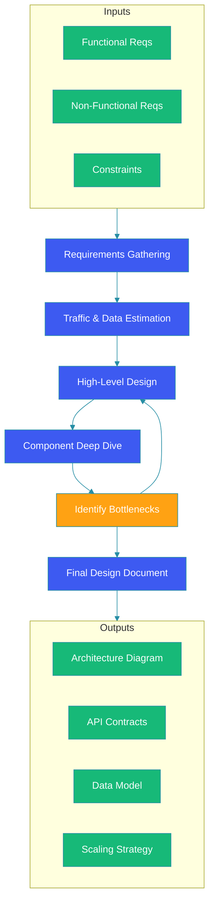

# What is System Design?

## Overview

System design is the process of defining the architecture, components, modules, interfaces, and data flow of a system to satisfy specified requirements. It bridges the gap between requirements gathering and implementation, translating functional and non-functional needs into a blueprint for engineering teams.

A well-designed system balances competing concerns — performance, cost, complexity, and time-to-market — while anticipating future growth. Whether you are designing a simple CRUD application or a globally distributed platform serving billions of users, the fundamental principles remain the same.

This blog introduces the core concepts of system design, explains why it matters, outlines the design process, and sets the foundation for the deep dives that follow in this series.

---

## Problem Statement

Modern software systems face challenges that make deliberate design essential:

- **Scale unpredictability**: Traffic can spike from thousands to millions of users overnight
- **Distributed complexity**: Components fail independently, networks are unreliable, latency is non-zero
- **Competing requirements**: Low latency vs. strong consistency, high availability vs. cost efficiency
- **Team coordination**: Multiple teams build interdependent services that must work together reliably
- **Evolving requirements**: Business needs change; systems must adapt without rewriting everything

Without a systematic design approach, teams end up with fragile systems that are hard to debug, expensive to operate, and impossible to scale.

---

## Key Goals of System Design

### Scalability

The ability to handle increasing load by adding resources. A scalable system maintains performance as user count, data volume, or request rate grows.

```java
// Stateless service example — each instance can handle any request
@RestController
public class UserService {

    @GetMapping("/users/{userId}")
    public ResponseEntity<User> getUser(@PathVariable String userId) {
        // Stateless: no session data on this server
        User user = userRepository.findById(userId);
        return ResponseEntity.ok(user);
    }
}
```

### Reliability

The system continues to work correctly despite failures of individual components. Measured through SLIs (Service Level Indicators) like uptime, error rate, and latency percentiles.

### Availability

The proportion of time a system is operational and accessible. Typically expressed as "nines" — 99.9% (three nines) means ~8.77 hours of downtime per year; 99.999% (five nines) means ~5.26 minutes.

### Maintainability

The ease with which the system can be modified, extended, tested, and debugged. Good documentation, clean abstractions, and consistent patterns are essential.

### Performance

Response time, throughput, and resource efficiency. Performance goals are expressed as SLOs (Service Level Objectives), e.g., "p99 latency under 200ms."

---

## System Design Process



### Step 1: Requirements Gathering

Understand what the system must do (functional) and how it should behave (non-functional).

**Functional requirements**: Create user profiles, post tweets, process payments, etc.
**Non-functional requirements**: Latency targets, availability SLAs, durability guarantees, compliance needs.

### Step 2: Traffic & Data Estimation

Estimate the scale the system must handle: daily active users, requests per second, storage requirements, network bandwidth. Use back-of-the-envelope calculations with known reference values (covered in a later blog).

### Step 3: High-Level Design

Sketch the architecture diagram identifying major components: clients, load balancers, API gateways, application services, databases, caches, message queues, and CDNs.

### Step 4: Component Deep Dive

For each major component, specify:
- Data model and schema design
- API contract and interaction pattern
- Technology choices and trade-offs
- Data flow and error handling

### Step 5: Identify & Address Bottlenecks

Analyze the design for single points of failure, hot spots, latency issues, and scaling limits. Iterate on the design to address these concerns.

### Step 6: Document the Design

Produce architecture diagrams, sequence flows, API specifications, and operational runbooks that the team can implement.

---

## Code Example: Simple System Design Artifact

```java
// API Contract Example — the design artifact for a URL Shortener
@RestController
@RequestMapping("/api/v1")
public class UrlShortenerController {

    private final UrlShortenerService service;

    @PostMapping("/shorten")
    public ResponseEntity<ShortenResponse> shorten(
            @Valid @RequestBody ShortenRequest request) {
        String shortCode = service.createShortUrl(request.getLongUrl(),
                request.getTtlSeconds());
        URI location = URI.create("/api/v1/" + shortCode);
        return ResponseEntity.created(location)
                .body(new ShortenResponse(shortCode));
    }

    @GetMapping("/{code}")
    public ResponseEntity<Void> redirect(
            @PathVariable String code) {
        String longUrl = service.resolveUrl(code);
        return ResponseEntity.status(HttpStatus.FOUND)
                .location(URI.create(longUrl))
                .build();
    }
}

// Data Model Design Artifact
@Entity
@Table(name = "url_mappings",
       indexes = @Index(columnList = "shortCode", unique = true))
public class UrlMapping {

    @Id
    @GeneratedValue(strategy = GenerationType.SEQUENCE)
    private Long id;

    @Column(nullable = false, length = 10, unique = true)
    private String shortCode;

    @Column(nullable = false, length = 2048)
    private String longUrl;

    @Column(nullable = false)
    private Instant createdAt;

    @Column(nullable = false)
    private Instant expiresAt;

    // getters, setters, equals, hashCode
}
```

---

## Best Practices

- **Start simple, iterate**: Begin with the simplest design that meets requirements, then optimize based on data
- **Document decisions**: Record trade-offs and rationale so future engineers understand why things are the way they are
- **Design for failure**: Assume every component can fail and build resilient patterns (retries, circuit breakers, fallbacks)
- **Use well-known patterns**: Prefer established solutions (load balancers, queues, caches) over custom-built alternatives
- **Involve operations early**: Consider deployment, monitoring, alerting, and debugging from the start

---

## Common Mistakes

- **Over-engineering**: Designing for Google-scale when you have 100 users adds complexity without benefit
- **Ignoring non-functional requirements**: Focusing only on features while neglecting latency, availability, and security
- **Premature optimization**: Optimizing before measuring leads to wasted effort and increased complexity
- **Skipping estimation**: Making architectural decisions without understanding data volumes and traffic patterns
- **Neglecting the data layer**: Assuming the database will handle everything without considering indexing, partitioning, or caching

---

## Summary

System design is the blueprint for building robust, scalable, and maintainable software systems. It transforms abstract requirements into concrete architecture decisions, balancing trade-offs across performance, cost, complexity, and time.

The core goals — scalability, reliability, availability, maintainability, and performance — guide every decision. The design process moves from requirements through estimation, high-level architecture, detailed component design, bottleneck analysis, and finally documentation.

Mastering system design is a journey of understanding patterns, practicing with real-world scenarios, and learning from operational experience. The following blogs in this series will dive deep into each concept, pattern, and technology.

---

## References

- [Designing Data-Intensive Applications — Martin Kleppmann](https://dataintensive.net/)
- [System Design Interview — Alex Xu](https://amazon.com/dp/1736049119)
- [AWS Well-Architected Framework](https://aws.amazon.com/architecture/well-architected/)
- [Google Site Reliability Engineering Book](https://sre.google/sre-book/table-of-contents/)
- [Microsoft Azure Architecture Center](https://docs.microsoft.com/en-us/azure/architecture/)
