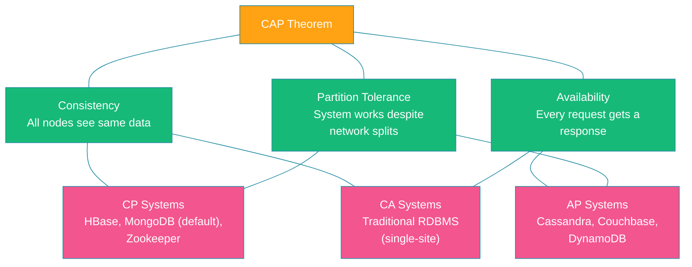
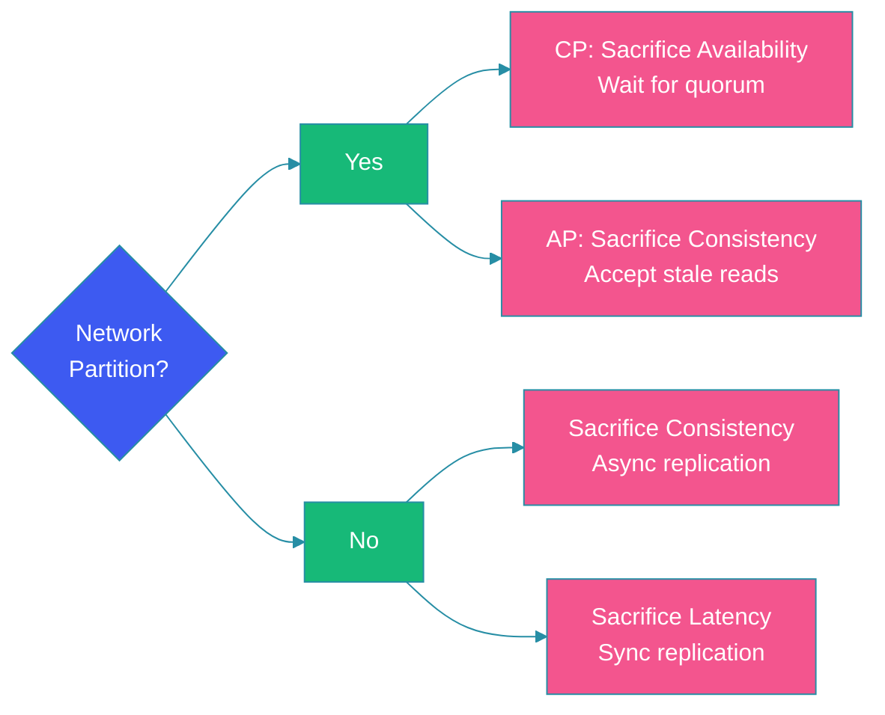

# CAP Theorem

## Overview

The CAP theorem, also known as Brewer's theorem, states that a distributed data store can provide at most two of the following three guarantees simultaneously: Consistency, Availability, and Partition Tolerance. Formulated by Eric Brewer in 2000 and formally proved by Gilbert and Lynch in 2002, this theorem is a foundational concept in distributed systems design.

Understanding CAP is crucial for making informed architectural decisions. Every distributed system must choose which two properties to prioritize, and this choice fundamentally shapes the system's behavior, performance characteristics, and operational complexity.

This blog explains each property in detail, explores the trade-offs between CP, AP, and CA systems with real-world examples, and introduces the PACELC extension for more nuanced analysis.

---

## Problem Statement

In a distributed system running across multiple nodes connected by a network:

- **Network failures are inevitable**: Packets get lost, switches fail, partitions occur
- **Latency is non-zero**: Messages between nodes take time, creating windows of inconsistency
- **Node failures happen**: Servers crash, processes hang, disks fill up

When a network partition splits nodes into groups that cannot communicate, the system faces a dilemma: should it continue serving requests (Availability) even if it means returning stale data (sacrificing Consistency), or should it refuse responses until the partition heals (ensuring Consistency but sacrificing Availability)?

This fundamental trade-off is what the CAP theorem captures.

---

## The CAP Triangle



---

## The Three Properties Explained

### Consistency (C)

Every read receives the most recent write or an error. All nodes in the system see the same data at the same time — a linearizable view.

```java
// Strongly consistent write — ensures all replicas are updated
public class ConsistentWriteService {

    private final List<DatabaseNode> nodes;
    private final int requiredAcks;

    public WriteResult write(String key, String value) {
        int successCount = 0;
        for (DatabaseNode node : nodes) {
            try {
                node.write(key, value);
                successCount++;
            } catch (NetworkException e) {
                // node is unreachable
            }
        }
        // In a CP system, fail the write if not all nodes acknowledge
        if (successCount < requiredAcks) {
            throw new WriteException("Write failed: not enough acknowledgments");
        }
        return WriteResult.success();
    }
}
```

Consistency ensures that clients see a single, up-to-date view of the data, even if they connect to different replicas.

### Availability (A)

Every non-failing node returns a response to every request, within a reasonable time, without guaranteeing it contains the most recent write.

```java
// Highly available read — returns data even if some replicas are stale
public class AvailableReadService {

    private final List<DatabaseNode> replicas;

    public String read(String key) {
        for (DatabaseNode replica : replicas) {
            try {
                // Return first successful response
                return replica.read(key);
            } catch (TimeoutException | NetworkException e) {
                // Try next replica
                continue;
            }
        }
        // In an AP system, return stale data rather than an error
        return cache.get(key); // potentially stale
    }
}
```

Availability prioritizes responding to every request, even during network problems, at the cost of potentially returning stale data.

### Partition Tolerance (P)

The system continues to operate despite an arbitrary number of messages being dropped or delayed by the network between nodes. In practice, since network partitions are unavoidable in distributed systems, you cannot sacrifice P — you must choose between C and A when a partition occurs.

---

## CP vs AP vs CA Systems

### CP Systems (Consistency + Partition Tolerance)

When a partition occurs, CP systems stop accepting writes or reads on nodes that cannot reach the majority, maintaining consistency at the cost of availability.

| System | Use Case | How It Handles Partitions |
|--------|----------|---------------------------|
| **HBase** | Analytics, time-series data | Regions unavailable if ZooKeeper quorum lost |
| **MongoDB** (default) | Document stores | Primary steps down; secondary rejects writes |
| **ZooKeeper** | Coordination, locking | Majority quorum required; minority nodes become read-only |
| **etcd** | Configuration, service discovery | Requires quorum for all operations |

### AP Systems (Availability + Partition Tolerance)

AP systems continue to accept reads and writes on all nodes during a partition, resolving conflicts later through techniques like version vectors or conflict-free replicated data types (CRDTs).

| System | Use Case | How It Handles Partitions |
|--------|----------|---------------------------|
| **Cassandra** | Large-scale write-heavy workloads | All nodes accept writes; last-write-wins conflict resolution |
| **DynamoDB** | Shopping carts, session management | Multi-region replication with eventual consistency |
| **Couchbase** | Mobile, IoT, real-time apps | Cross-datacenter replication with conflict resolution |
| **Riak** | User profiles, content management | Vector clocks for conflict resolution |

### CA Systems (Consistency + Availability)

CA systems provide both consistency and availability but cannot tolerate partitions. Traditional single-site databases operating on a local network (where partitions are assumed not to happen) are CA. In a distributed context, CA systems effectively sacrifice partition tolerance, meaning they may fail entirely during a network partition.

| System | Use Case | Limitation |
|--------|----------|------------|
| **PostgreSQL** (single-node) | OLTP, financial transactions | No built-in partition tolerance |
| **MySQL** (single-node) | Traditional web applications | Not designed for network partitions |
| **Oracle RAC** | Enterprise workloads | Assumes reliable cluster interconnect |

---

## Real-World Architecture Trade-Offs

```java
// Spring Boot configuration demonstrating CAP trade-off
@Configuration
public class CapTradeoffConfig {

    @Bean
    @ConditionalOnProperty(name = "consistency.model", havingValue = "strong")
    public DataSource strongConsistencyDataSource() {
        // Single writer with synchronous replication
        return DataSourceBuilder.create()
                .url("jdbc:postgresql://primary:5432/db?sslmode=require")
                .username("app_user")
                .password("${DB_PASSWORD}")
                .build();
    }

    @Bean
    @ConditionalOnProperty(name = "consistency.model", havingValue = "eventual")
    public DataSource eventualConsistencyDataSource() {
        // Multiple replicas with async replication
        HikariDataSource ds = new HikariDataSource();
        ds.setJdbcUrl("jdbc:postgresql://localhost:5432/db");
        ds.setReadOnly(true);
        // Points to a read replica — may be slightly stale
        return ds;
    }
}
```

---

## The PACELC Extension

The CAP theorem only addresses behavior during partitions. The PACELC extension, proposed by Daniel Abadi, provides a more complete picture:

- **P**artition → choose between **A**vailability and **C**onsistency
- **E**lse (no partition) → choose between **L**atency and **C**onsistency

This extension recognizes that even in normal operation, there's a trade-off between reducing latency (by allowing stale reads from nearby replicas) and ensuring consistency (by reading from the primary).



---

## Code Example: Configurable CAP Trade-off

```java
@Service
public class TradeOffAwareService {

    private final DynamoDbClient dynamoDb;
    private final String tableName;

    // AP-oriented configuration
    public Item readEventuallyConsistent(String pk, String sk) {
        return dynamoDb.getItem(GetItemRequest.builder()
                .tableName(tableName)
                .key(Map.of("PK", AttributeValue.fromS(pk),
                            "SK", AttributeValue.fromS(sk)))
                .consistentRead(false)      // AP: eventual consistency
                .build()
        ).item();
    }

    // CP-oriented configuration
    public Item readStronglyConsistent(String pk, String sk) {
        return dynamoDb.getItem(GetItemRequest.builder()
                .tableName(tableName)
                .key(Map.of("PK", AttributeValue.fromS(pk),
                            "SK", AttributeValue.fromS(sk)))
                .consistentRead(true)       // CP: strong consistency
                .build()
        ).item();
    }
}
```

---

## Best Practices

- **Understand your domain**: Banking transactions need CP; social media feeds can tolerate AP
- **Design for partition tolerance**: Always assume network partitions will happen; never design a truly CA distributed system
- **Use eventual consistency where acceptable**: It provides better availability and lower latency for most read workloads
- **Offer configurable consistency**: DynamoDB and Cassandra allow per-request consistency choices
- **Monitor your consistency SLAs**: Track staleness metrics to verify your system meets business requirements

---

## Common Mistakes

- **Claiming a system is "all three"**: CAP is a trade-off; no distributed system provides C, A, and P simultaneously
- **Ignoring PACELC**: Focusing only on partition behavior while ignoring normal-operation trade-offs leads to suboptimal designs
- **Assuming CA systems are viable in distributed environments**: Network partitions are inevitable; CA systems fail or become unavailable during partitions
- **Equating consistency in CAP with ACID consistency**: CAP consistency is about linearizability; ACID consistency is about data integrity rules
- **Treating CAP as binary**: Many systems offer tunable consistency levels between strong and eventual

---

## Summary

The CAP theorem is a fundamental constraint in distributed systems: you can choose at most two of Consistency, Availability, and Partition Tolerance. Since partitions are unavoidable in any distributed system, the practical choice is between CP and AP during failures.

The PACELC extension adds nuance by acknowledging that even during normal operation, there is a trade-off between latency and consistency. Real-world systems like HBase (CP), Cassandra (AP), and PostgreSQL (CA in single-node) exemplify these choices.

Smart system design involves selecting the right CAP trade-off for each component based on business requirements, not applying a single model uniformly across the entire architecture.

---

## References

- [Brewer's CAP Theorem — Eric Brewer](https://www.infoq.com/articles/cap-twelve-years-later-how-the-rules-have-changed/)
- [Gilbert & Lynch Proof of CAP Theorem](https://www.comp.nus.edu.sg/~gilbert/pubs/BrewersConjecture-SigAct.pdf)
- [PACELC Theorem — Daniel Abadi](https://cs-people.bu.edu/abadi/papers/abadi-pacelc.pdf)
- [DynamoDB Consistency Models](https://docs.aws.amazon.com/amazondynamodb/latest/developerguide/HowItWorks.ReadConsistency.html)
- [Cassandra Tunable Consistency](https://docs.datastax.com/en/cassandra-oss/3.0/cassandra/dml/dmlConfigConsistency.html)
