# ACID vs BASE

## Overview

Transaction models define how databases handle operations that must succeed or fail as a unit. Two dominant paradigms exist: ACID, which prioritizes strict consistency guarantees, and BASE, which favors availability and scalability over immediate consistency.

Understanding both models is essential for making correct architectural decisions. Financial systems require ACID guarantees to prevent money from disappearing. Social media feeds can happily operate with BASE, accepting that a post might take seconds to appear for all followers.

This blog explores both models in depth, provides concrete examples of when to use each, and helps you navigate the trade-offs between consistency and scale.

---

## Problem Statement

Traditional relational databases enforce strict transaction guarantees through ACID properties. However, as systems scaled horizontally across multiple data centers, achieving ACID compliance became prohibitively expensive in terms of latency and availability.

The rise of NoSQL databases introduced BASE as an alternative philosophy: relax consistency guarantees to achieve higher availability, better performance, and linear scalability. The challenge is knowing which model fits your use case — and when to mix both within the same system.

---

## ACID Properties

### Atomicity

A transaction is all-or-nothing. If any part of the transaction fails, the entire transaction is rolled back, leaving the database in its original state.

```java
@Transactional
public void transferFunds(Long fromAccount, Long toAccount, BigDecimal amount) {
    Account source = accountRepository.findById(fromAccount)
            .orElseThrow(() -> new AccountNotFoundException(fromAccount));
    Account target = accountRepository.findById(toAccount)
            .orElseThrow(() -> new AccountNotFoundException(toAccount));

    source.debit(amount);  // If this succeeds but below fails...
    target.credit(amount); // ...both are rolled back

    accountRepository.save(source);
    accountRepository.save(target);
    // Either both succeed or neither is persisted
}
```

### Consistency

A transaction brings the database from one valid state to another. All data must satisfy defined constraints, triggers, and rules. Consistency here refers to data integrity, not the CAP definition.

### Isolation

Concurrent transactions do not interfere with each other. The standard defines four isolation levels:

| Level | Dirty Read | Non-repeatable Read | Phantom Read |
|-------|-----------|-------------------|--------------|
| READ UNCOMMITTED | Possible | Possible | Possible |
| READ COMMITTED | Prevented | Possible | Possible |
| REPEATABLE READ | Prevented | Prevented | Possible |
| SERIALIZABLE | Prevented | Prevented | Prevented |

```java
// Pessimistic locking for strong isolation
@Transactional(isolation = Isolation.SERIALIZABLE)
public void reserveInventory(Long productId, int quantity) {
    Product product = productRepository.findByIdWithLock(productId);
    if (product.getAvailableQuantity() >= quantity) {
        product.reduceQuantity(quantity);
        productRepository.save(product);
    } else {
        throw new InsufficientInventoryException(productId, quantity);
    }
}
```

### Durability

Once a transaction commits, its changes persist even in the event of a system failure. This is typically achieved through write-ahead logging (WAL) and replication.

---

## BASE Properties

### Basically Available

The system guarantees availability — every request receives a response, even if it may be stale. There is no guarantee that every node is reachable, but the system continues operating.

```java
// In a DBMS context, "advisory" locks are an application-level construct, not database ACID.
// Example: Redis for distributed locking
@Service
public class BasicallyAvailableService {

    private final StringRedisTemplate redis;

    public String getValue(String key) {
        // Always returns a response, even if the value might be stale
        String value = redis.opsForValue().get(key);
        if (value == null) {
            // Fall back to cache or return a default
            value = localCache.get(key);
        }
        return value;
    }

    public void setValue(String key, String value) {
        // Asynchronous replication — don't wait for all replicas
        CompletableFuture.runAsync(() -> replicateToOtherNodes(key, value));
    }
}
```

### Soft State

The system state may change over time without input, as nodes reconcile data through background processes. There is no guarantee of immediate consistency after a write.

### Eventual Consistency

Given enough time without new updates, all replicas will converge to the same value. This is the defining characteristic of BASE — the system will become consistent eventually, just not immediately.

---

## Comparison Diagram

```mermaid
flowchart LR
    classDef acid fill:#3d5af1,stroke:#278ea5,color:#fff
    classDef base fill:#f3558e,stroke:#278ea5,color:#fff
    classDef char fill:#17b978,stroke:#278ea5,color:#fff

    subgraph ACID["ACID Model"]
        direction TB
        A1["Atomicity
        All or nothing"]:::acid
        A2["Consistency
        Integrity constraints"]:::acid
        A3["Isolation
        Concurrent safety"]:::acid
        A4["Durability
        Persist after commit"]:::acid
    end

    subgraph BASE["BASE Model"]
        direction TB
        B1["Basically Available
        Always responds"]:::base
        B2["Soft State
        State can change"]:::base
        B3["Eventual Consistency
        Converges over time"]:::base
    end

    subgraph Tradeoffs["Key Tradeoffs"]
        T1["Strong Consistency"]:::char
        T2["vs"]:::char
        T3["High Availability"]:::char
        T4["Low Latency Writes"]:::char
        T5["vs"]:::char
        T6["Data Integrity"]:::char
        T7["Horizontal Scaling"]:::char
        T8["vs"]:::char
        T9["Transaction Guarantees"]:::char
    end

    ACID --- Tradeoffs
    Tradeoffs --- BASE

    linkStyle default stroke:#278ea5
```



---

## When to Use ACID

### Financial Systems
Banking, payments, billing — any system where money is at stake demands atomic transactions and strong consistency.

```java
@Service
public class PaymentService {

    @Transactional
    public PaymentResult processPayment(Long userId, Long merchantId, BigDecimal amount) {
        // All or nothing: debit user, credit merchant, create audit record
        Wallet userWallet = walletRepository.findByUserIdWithLock(userId);
        Wallet merchantWallet = walletRepository.findByUserIdWithLock(merchantId);

        userWallet.debit(amount);
        merchantWallet.credit(amount);

        PaymentAudit audit = new PaymentAudit(userId, merchantId, amount);
        auditRepository.save(audit);

        // If any step fails, everything rolls back
        return PaymentResult.success(audit.getId());
    }
}
```

### Inventory & Booking Systems
Over-selling a product or double-booking a room requires strong isolation.

### Regulatory & Compliance
Audit trails, data lineage, and reporting accuracy require consistent snapshots.

---

## When to Use BASE

### Social Media Feeds
Whether a post appears immediately for all 10,000 followers doesn't matter — eventual visibility is acceptable.

### Session Management
User sessions can tolerate slightly stale data; availability is far more important.

### Analytics & Logging
Log data is append-heavy, and losing writes due to consistency locks is worse than occasional duplicates.

### Product Catalogs
Catalog changes propagated with a few seconds delay are acceptable for most e-commerce platforms.

---

## Code Example: Mixing ACID and BASE

```java
@Configuration
public class HybridDataConfig {

    // ACID for critical transactions
    @Primary
    @Bean(name = "primaryDataSource")
    @ConfigurationProperties(prefix = "spring.datasource.primary")
    public DataSource primaryDataSource() {
        return DataSourceBuilder.create()
                .url("jdbc:postgresql://primary:5432/payments")
                .build();
    }

    // BASE for read-heavy, eventually consistent workloads
    @Bean(name = "analyticsDataSource")
    @ConfigurationProperties(prefix = "spring.datasource.analytics")
    public DataSource analyticsDataSource() {
        return DataSourceBuilder.create()
                .url("jdbc:postgresql://analytics-replica:5432/analytics")
                .build();
    }
}

@Service
public class OrderService {

    @Transactional("primaryDataSource")
    public Order createOrder(OrderRequest request) {
        // ACID guarantee for the order itself
        Order order = new Order(request);
        orderRepository.save(order);
        return order;
    }

    public void logPageView(Long userId, String page) {
        // BASE — fire-and-forget analytics event
        analyticsTemplate.save(new PageView(userId, page, Instant.now()));
    }
}
```

---

## Best Practices

- **Use ACID for writes, BASE for reads**: Many systems use ACID-compliant writes but allow eventually consistent reads for scale
- **Choose isolation level carefully**: Serializable isolation provides the strongest guarantees but hurts concurrency
- **Understand your staleness budget**: How stale can data be before it causes business harm? That determines your BASE tolerance
- **Hybrid architectures work well**: Use ACID for the critical path and BASE for analytics, recommendations, and reporting
- **Test with concurrent access**: Verify your chosen model handles real-world contention patterns correctly

---

## Common Mistakes

- **Using ACID when BASE suffices**: Adding transactional overhead to social feeds reduces performance without benefit
- **Assuming BASE means no consistency**: Eventual consistency still guarantees convergence; it just doesn't guarantee immediacy
- **Ignoring read-your-writes consistency**: Users expect to see their own writes immediately; this requires read-after-write guarantees even in BASE systems
- **Setting isolation too high**: Serializing all transactions kills throughput; choose the weakest level that prevents correctness issues
- **Mixing models without boundaries**: Clearly define which data requires ACID and which can tolerate BASE; leaking ACID expectations into BASE code causes subtle bugs

---

## Summary

ACID and BASE represent opposing philosophies for transaction guarantees in database systems. ACID prioritizes correctness through atomic, consistent, isolated, and durable transactions, making it essential for financial systems, inventory management, and any domain where data integrity is paramount.

BASE prioritizes availability and scalability, accepting eventual consistency in exchange for the ability to operate across distributed nodes without coordination overhead. It powers most modern web applications at scale.

The best architecture often uses both: ACID for the critical transaction path and BASE for read-heavy, analytics, or secondary workloads. Understanding the trade-offs enables you to choose the right tool for each part of your system.

---

## References

- [ACID Semantics — IBM](https://www.ibm.com/docs/en/cics-ts/5.4?topic=processing-acid-properties)
- [BASE: An Acid Alternative — Dan Pritchett](https://queue.acm.org/detail.cfm?id=1394128)
- [Designing Data-Intensive Applications — Martin Kleppmann](https://dataintensive.net/)
- [PostgreSQL Transaction Isolation](https://www.postgresql.org/docs/current/transaction-iso.html)
- [DynamoDB: Eventually Consistent Reads](https://docs.aws.amazon.com/amazondynamodb/latest/developerguide/HowItWorks.ReadConsistency.html)
