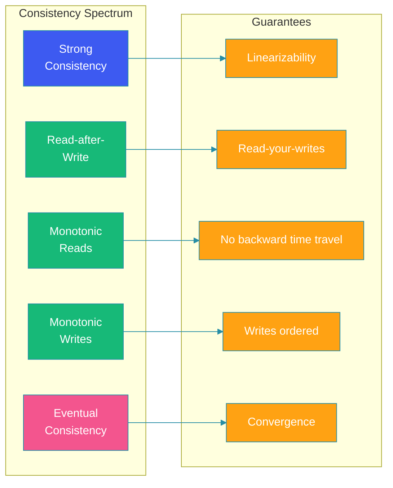
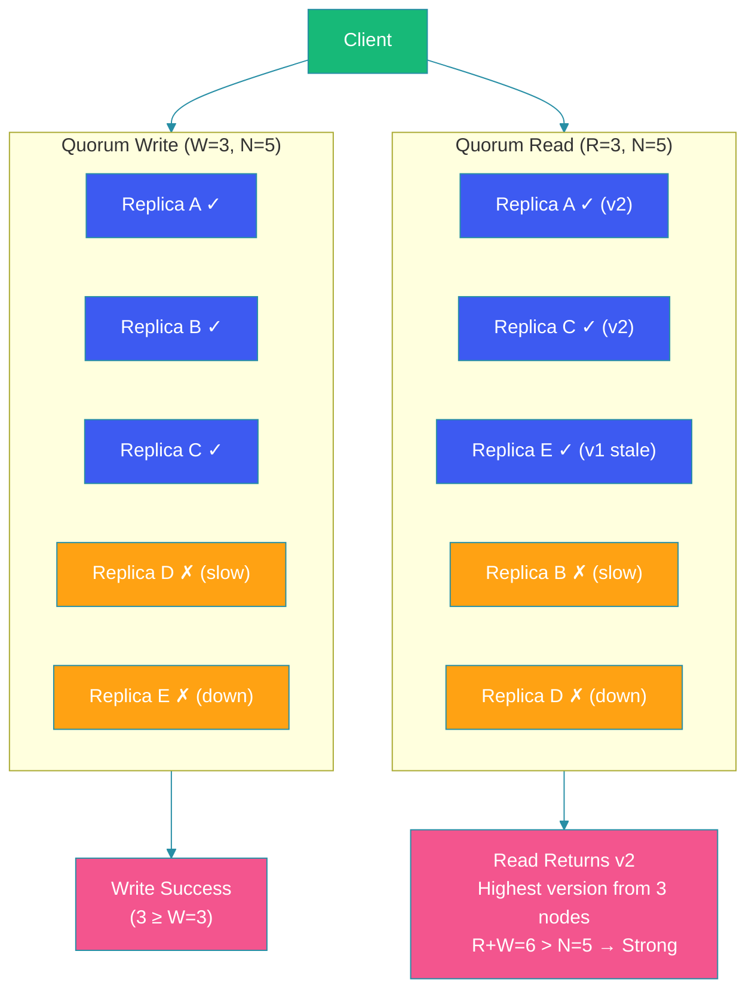

# Consistency Patterns

## Overview

Consistency patterns define how and when updates to data become visible to different readers in a distributed system. Choosing the right consistency model is one of the most consequential decisions in system design — it affects correctness, user experience, latency, availability, and operational complexity.

No single consistency model fits all scenarios. Strong consistency is essential for financial transactions but imposes latency penalties. Eventual consistency enables high availability but can confuse users who see stale data. Between these extremes lies a spectrum of tunable patterns.

This blog explains the major consistency patterns, when to use each, and how to implement them in practice.

---

## Problem Statement

In a distributed system with multiple replicas, a write to one node must propagate to others. During propagation, different clients may see different versions of the data. The questions to answer are:

- Should a read always return the latest write?
- Can a user see their own write immediately?
- Can a user's subsequent reads return older data than their first read?
- How many replicas must acknowledge a write before it's considered successful?

Different consistency patterns provide different answers, each with distinct trade-offs.

---

## Consistency Spectrum



---

## Strong Consistency

### How It Works

After a write completes, all subsequent reads (from any node) return that value. This is equivalent to having a single copy of the data.

```java
// Implementing strong consistency via quorum
@Service
public class StronglyConsistentStore {

    private final List<Replica> replicas;
    private final int readQuorum;  // R
    private final int writeQuorum; // W
    private final int totalNodes;  // N

    public StronglyConsistentStore(List<Replica> replicas, int N) {
        this.replicas = replicas;
        this.totalNodes = N;
        this.writeQuorum = N / 2 + 1; // majority
        this.readQuorum = N / 2 + 1;  // majority (R + W > N)
    }

    public void write(String key, String value) {
        int acks = 0;
        for (Replica replica : replicas) {
            try {
                replica.write(key, value);
                acks++;
            } catch (Exception e) { /* skip */ }
        }
        if (acks < writeQuorum) {
            throw new WriteException("Write quorum not reached");
        }
    }

    public String read(String key) {
        List<ReadResult> results = new ArrayList<>();
        for (Replica replica : replicas) {
            try {
                results.add(replica.read(key));
            } catch (Exception e) { /* skip */ }
        }
        if (results.size() < readQuorum) {
            throw new ReadException("Read quorum not reached");
        }
        // Return the value with the highest timestamp
        return results.stream()
                .max(Comparator.comparingLong(ReadResult::timestamp))
                .map(ReadResult::value)
                .orElseThrow(() -> new ReadException("No data found"));
    }
}
```

### When to Use
- Financial transactions (account balances)
- Inventory management (preventing overselling)
- User authentication (locking accounts)
- Distributed coordination (leader election)

### Costs
- Higher latency (must contact multiple nodes)
- Reduced availability during partitions (R + W > N may not be achievable)
- Lower throughput under contention

---

## Eventual Consistency

### How It Works

Given enough time without new updates, all replicas converge to the same value. There is no time bound on convergence — it's eventual.

```java
// DynamoDB's eventual consistent read
@Service
public class EventuallyConsistentStore {

    private final AmazonDynamoDB dynamoDB;

    public GetItemResult getItem(String tableName, String pk, String sk) {
        GetItemRequest request = GetItemRequest.builder()
                .tableName(tableName)
                .key(Map.of(
                    "PK", AttributeValue.fromS(pk),
                    "SK", AttributeValue.fromS(sk)
                ))
                .consistentRead(false) // eventual consistency
                .build();
        return dynamoDB.getItem(request);
    }

    public void putItem(String tableName, String pk, String sk, String value) {
        PutItemRequest request = PutItemRequest.builder()
                .tableName(tableName)
                .item(Map.of(
                    "PK", AttributeValue.fromS(pk),
                    "SK", AttributeValue.fromS(sk),
                    "value", AttributeValue.fromS(value)
                ))
                .build();
        dynamoDB.putItem(request); // returns immediately
    }
}
```

### When to Use
- Social media feeds (post visibility delays are acceptable)
- Product catalogs (propagation delays of seconds are fine)
- CDN caches (stale content is better than no content)
- Analytics and logging (no strong ordering needed)

---

## Read-After-Write Consistency

### How It Works

A user who modifies data will always see their own modification in subsequent reads. Other users may see stale data until convergence.

```java
@Service
public class ReadAfterWriteService {

    private final List<Replica> replicas;
    private final Cache<String, Boolean> writeCache;

    public void write(String userId, String key, String value) {
        replicas.get(0).write(key, value); // write to primary
        writeCache.put(userId + ":" + key, true); // mark write for this user
    }

    public String read(String userId, String key) {
        if (writeCache.getIfPresent(userId + ":" + key) != null) {
            // User wrote this data — read from primary
            return replicas.get(0).read(key);
        }
        // Other users can read from any replica
        return replicas.get(ThreadLocalRandom.current()
                .nextInt(replicas.size())).read(key);
    }
}
```

### When to Use
- User profile updates (user expects to see their changes immediately)
- Comment systems (user sees their comment right away)
- E-commerce cart (user expects cart items to appear instantly)

---

## Monotonic Reads

### How It Works

If a user reads a value, subsequent reads will never return an older value. This prevents the "time travel" problem where a user sees a newer value, then an older one.

```java
@Service
public class MonotonicReadService {

    private final ConcurrentHashMap<String, String> userTimestamps = new ConcurrentHashMap<>();

    public String read(String userId, String key) {
        // Hash the user to a specific replica to ensure monotonic reads
        int replicaIndex = Math.abs(userId.hashCode() % replicas.size());
        Replica replica = replicas.get(replicaIndex);
        String value = replica.read(key);
        // Update the last-seen version for this user-key pair
        userTimestamps.put(userId + ":" + key, value);
        return value;
    }

    public void readAll(String userId, List<String> keys) {
        // Pin user to a single replica for the entire batch read
        int replicaIndex = Math.abs(userId.hashCode() % replicas.size());
        Replica replica = replicas.get(replicaIndex);
        for (String key : keys) {
            String value = replica.read(key);
            System.out.println("User " + userId + " sees: " + key + " = " + value);
        }
    }
}
```

### When to Use
- Dashboard analytics (user navigating pages should see increasing metrics)
- Messaging apps (chat history should not show messages disappearing)
- News feeds (feed should not show older items after newer ones)

---

## Monotonic Writes

### How It Works

If a user writes to a key, subsequent writes by that user are applied in order. This prevents a later write from being visible before an earlier one.

```java
@Service
public class MonotonicWriteService {

    private final ConcurrentHashMap<String, Long> writeVersions = new ConcurrentHashMap<>();

    public void write(String userId, String key, String value) {
        long version = writeVersions.compute(userId + ":" + key,
                (k, v) -> v == null ? 1 : v + 1);
        Replica replica = replicas.get(0); // always write to primary
        replica.writeWithVersion(key, value, version);
    }
}
```

### When to Use
- Any system where write ordering affects correctness (counter updates, state machines)
- Event sourcing and CQRS patterns
- Append-only logs

---

## Quorum-Based Consistency

Quorum-based systems provide tunable consistency using three parameters:

- **N** = number of replicas
- **W** = number of replicas that must acknowledge a write
- **R** = number of replicas that must respond to a read

The relationship between W and R determines consistency:

| Condition | Behavior |
|-----------|----------|
| W + R > N | Strong consistency (overlapping quorums) |
| W = N, R = 1 | Strong writes, fast reads (CP) |
| W = 1, R = N | Fast writes, strong reads |
| W = 1, R = 1 | Eventual consistency (fastest) |



---

## Code Example: Configurable Quorum

```java
@Component
public class QuorumAwareStore {

    private final int N; // total replicas
    private final int W; // write quorum
    private final int R; // read quorum
    private final List<Replica> replicas;

    public QuorumAwareStore(@Value("${replica.count}") int N,
                            @Value("${replica.write-quorum}") int W,
                            @Value("${replica.read-quorum}") int R,
                            List<Replica> replicas) {
        this.N = N;
        this.W = W;
        this.R = R;
        this.replicas = replicas;
        validateQuorum();
    }

    private void validateQuorum() {
        if (W + R <= N) {
            throw new ConfigurationException(
                "W + R must be > N for strong consistency. Got W=" +
                W + ", R=" + R + ", N=" + N);
        }
    }

    public void put(String key, String value) {
        List<CompletableFuture<Void>> futures = replicas.stream()
                .map(r -> CompletableFuture.runAsync(() -> r.write(key, value)))
                .toList();
        // Wait for W acknowledgments
        long acked = futures.stream()
                .filter(f -> {
                    try { f.get(100, TimeUnit.MILLISECONDS); return true; }
                    catch (Exception e) { return false; }
                })
                .count();
        if (acked < W) {
            throw new QuorumNotMetException(
                String.format("Write quorum not met. Need %d, got %d", W, acked));
        }
    }
}
```

---

## Best Practices

- **Tune quorum per operation**: Use strong consistency for critical writes, eventual for reads that can tolerate staleness
- **Pin users to replicas**: Achieve read-after-write and monotonic reads by routing the same user consistently
- **Version your data**: Use timestamps or version vectors to detect conflicts and determine the latest value
- **Monitor staleness**: Track replication lag and set alerts when it exceeds acceptable bounds
- **Document your consistency guarantees**: Clearly specify what consistency each API endpoint provides

---

## Common Mistakes

- **Using strong consistency everywhere**: This kills availability and performance for workloads that don't need it
- **Assuming eventual consistency means no consistency**: Eventual consistency guarantees convergence but doesn't bound the time window
- **Ignoring read-after-write expectations**: Users expect to see their own writes; not providing this creates confusion
- **Setting quorum incorrectly**: W + R <= N means overlapping quorums are not guaranteed, weakening consistency
- **Neglecting clock skew**: Using wall-clock timestamps for ordering fails when clocks drift; use logical clocks or hybrid logical clocks

---

## Summary

Consistency patterns form a spectrum from strong to eventual, with intermediate patterns filling practical needs. Strong consistency provides linearizability but costs availability and latency. Eventual consistency maximizes availability but offers no timing guarantees.

Read-after-write, monotonic reads, and monotonic writes address specific user experience requirements without the full cost of strong consistency. Quorum-based systems provide tunable consistency by controlling the number of replicas that must participate in read and write operations.

The right consistency model depends on your specific business requirements, user expectations, and operational constraints. Most production systems use a combination of patterns — strong consistency for critical paths, eventual for scalable reads, and intermediate patterns where user experience demands it.

---

## References

- [Dynamo: Amazon's Highly Available Key-value Store](https://www.allthingsdistributed.com/files/amazon-dynamo-sosp2007.pdf)
- [Cassandra Tunable Consistency](https://docs.datastax.com/en/cassandra-oss/3.0/cassandra/dml/dmlConfigConsistency.html)
- [Linearizability: A Correctness Condition for Concurrent Objects](https://cs.brown.edu/~mph/HerlihyW90/p463-herlihy.pdf)
- [Logical Clocks and Vector Clocks](https://www.geeksforgeeks.org/vector-clocks-in-distributed-systems/)
- [Designing Data-Intensive Applications — Martin Kleppmann](https://dataintensive.net/)
