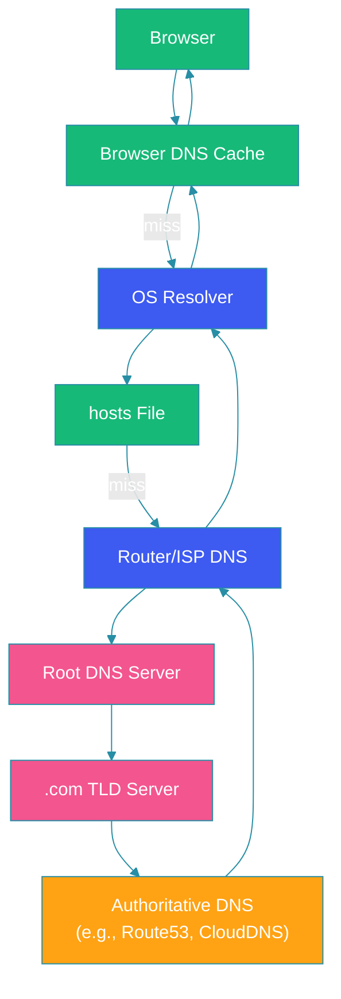
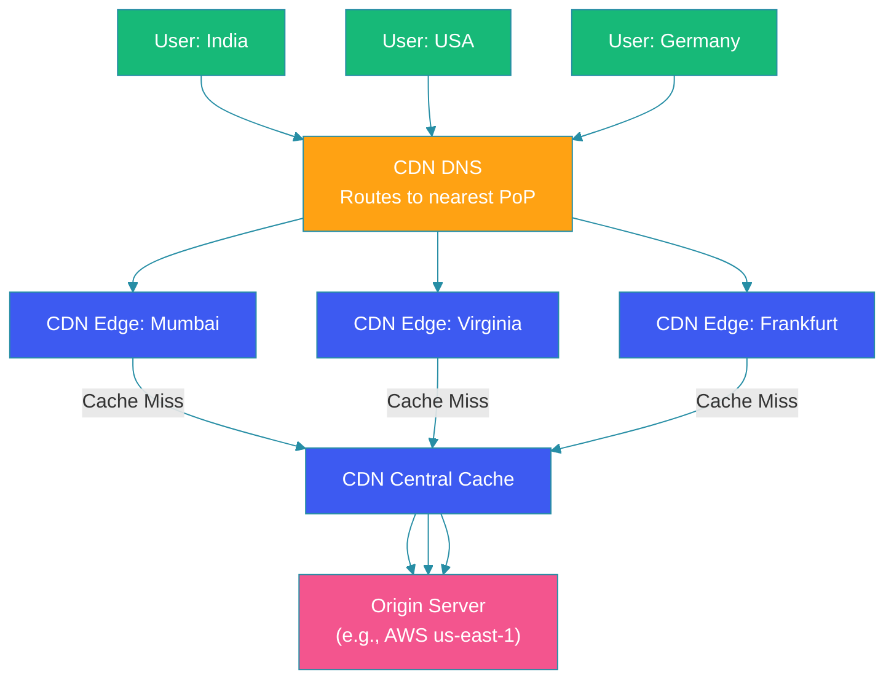

# DNS & HTTP Fundamentals

## Overview

DNS (Domain Name System) and HTTP (Hypertext Transfer Protocol) form the backbone of modern web communication. DNS translates human-readable domain names into machine-routable IP addresses, while HTTP governs how clients and servers exchange structured messages.

Understanding both protocols at a deep level is essential for designing performant, reliable, and secure distributed systems. DNS configuration mistakes can take down entire applications. HTTP version choices directly impact latency, throughput, and resource utilization.

This blog covers DNS resolution in detail, compares HTTP/1.1 through HTTP/3, and explains caching and CDN fundamentals.

---

## Problem Statement

When a user types a URL into a browser, an intricate chain of events must complete in under a second:

1. The browser must resolve the domain name to an IP address
2. It must establish a secure connection to the server
3. It must send a request and receive a response
4. The response must be rendered into a usable page

Each step involves multiple sub-steps, caching layers, and potential failure points. Poorly configured DNS or suboptimal HTTP settings can add hundreds of milliseconds of latency and degrade user experience.

---

## DNS Resolution: How It Works



### Step-by-Step DNS Resolution

1. **Browser Cache**: The browser checks its local DNS cache. If found (and not expired), the IP is returned immediately.
2. **OS Cache**: The operating system checks its resolver cache. On Windows, this is managed by the DNS Client service.
3. **Hosts File**: The OS checks the local hosts file for static mappings.
4. **Recursive Resolver**: The request goes to the ISP's or organization's DNS recursive resolver.
5. **Root Servers**: If the resolver doesn't have the answer, it queries a root nameserver, which returns the TLD (top-level domain) server address.
6. **TLD Server**: The resolver queries the TLD server (e.g., `.com`), which returns the authoritative nameserver.
7. **Authoritative Server**: The resolver queries the authoritative server (e.g., Route53, CloudDNS), which returns the actual IP record.
8. **Caching**: The result is cached at every level according to the TTL (time-to-live) value.

### DNS Record Types

| Type | Purpose | Example |
|------|---------|---------|
| **A** | Maps domain to IPv4 address | `example.com → 93.184.216.34` |
| **AAAA** | Maps domain to IPv6 address | `example.com → 2606:2800:220:1:248:1893:25c8:1946` |
| **CNAME** | Alias from one domain to another | `www.example.com → example.com` |
| **MX** | Mail exchange server | `example.com → mail.example.com (priority 10)` |
| **TXT** | Arbitrary text data (verification, SPF, DKIM) | `SPF: v=spf1 include:_spf.google.com ~all` |
| **NS** | Nameserver for the domain | `example.com → ns1.cloudflare.com` |

---

## HTTP Protocol Evolution

### HTTP/1.1 (1997)

```java
@Configuration
public class HttpClientConfig {

    @Bean
    public RestTemplate restTemplate() {
        // HTTP/1.1 default — one request per connection
        HttpComponentsClientHttpRequestFactory factory =
                new HttpComponentsClientHttpRequestFactory();

        // Connection pooling mitigates HTTP/1.1 limitations
        PoolingHttpClientConnectionManager cm =
                new PoolingHttpClientConnectionManager();
        cm.setMaxTotal(200);
        cm.setDefaultMaxPerRoute(20);

        factory.setHttpClient(HttpClients.custom()
                .setConnectionManager(cm)
                .build());

        return new RestTemplate(factory);
    }
}
```

**Key Characteristics**:
- Text-based protocol (headers in plain text)
- One request per TCP connection (pipelining was optional and rarely worked)
- Head-of-line blocking: a slow response blocks all subsequent requests on that connection

### HTTP/2 (2015)

**Key Characteristics**:
- Binary framing layer (multiplexed streams over a single TCP connection)
- Header compression (HPACK)
- Server push (server can proactively send resources)
- Stream prioritization

```java
// Netty-based HTTP/2 client
public class Http2Client {

    public CompletableFuture<String> fetch(String uri) {
        CompletableFuture<String> future = new CompletableFuture<>();

        HttpClient client = HttpClient.newBuilder()
                .version(HttpClient.Version.HTTP_2)
                .connectTimeout(Duration.ofSeconds(5))
                .build();

        HttpRequest request = HttpRequest.newBuilder()
                .uri(URI.create(uri))
                .GET()
                .build();

        client.sendAsync(request, HttpResponse.BodyHandlers.ofString())
                .thenAccept(response -> {
                    System.out.println("Version: " + response.version());
                    future.complete(response.body());
                })
                .exceptionally(ex -> {
                    future.completeExceptionally(ex);
                    return null;
                });

        return future;
    }
}
```

### HTTP/3 (2022)

**Key Characteristics**:
- Runs over QUIC (UDP-based transport), not TCP
- Eliminates TCP head-of-line blocking entirely
- 0-RTT connection establishment (reduces handshake latency)
- Built-in encryption (TLS 1.3 mandatory)
- Connection migration (survives IP address changes)

```java
// Java 11+ HttpClient with HTTP/3 via QUIC
public class Http3Client {

    public static void main(String[] args) throws Exception {
        // HTTP/3 is available when the underlying system supports it
        // Java's HttpClient will negotiate HTTP/3 via Alt-Svc header
        HttpClient client = HttpClient.newBuilder()
                .version(HttpClient.Version.HTTP_2) // negotiates upward to H3
                .build();

        HttpRequest request = HttpRequest.newBuilder()
                .uri(URI.create("https://blog.cloudflare.com/"))
                .GET()
                .build();

        HttpResponse<String> response = client.send(request,
                HttpResponse.BodyHandlers.ofString());

        System.out.println("Status: " + response.statusCode());
        // "HTTP/3" indicated in Alt-Svc headers
    }
}
```

### Protocol Comparison

| Feature | HTTP/1.1 | HTTP/2 | HTTP/3 |
|---------|----------|--------|--------|
| Transport | TCP | TCP | QUIC (UDP) |
| Multiplexing | No (limited pipelining) | Yes | Yes |
| Head-of-line blocking | Request level | TCP level | None |
| Header compression | No | HPACK | QPACK |
| Connection setup | 3-way handshake + TLS | 3-way handshake + TLS | 0-RTT or 1-RTT |
| Server push | No | Yes | Yes |
| Encryption | Optional (HTTPS) | Optional | Mandatory |

---

## Caching Headers

### Cache-Control Directives

```
Cache-Control: public, max-age=3600, stale-while-revalidate=86400
```

| Directive | Purpose |
|-----------|---------|
| `max-age=<seconds>` | How long the response is fresh from the time of request |
| `s-maxage=<seconds>` | Overrides max-age for shared caches (CDNs, proxies) |
| `public` | Response can be cached by any cache |
| `private` | Response only cached by browser (not CDNs) |
| `no-cache` | Must revalidate with server before using cached copy |
| `no-store` | Must not cache the response at all |
| `must-revalidate` | Once stale, must revalidate before serving |
| `stale-while-revalidate` | Serve stale content while fetching fresh version in background |

### ETag and Last-Modified

```java
@RestController
public class CachingController {

    @GetMapping("/api/resource/{id}")
    public ResponseEntity<Resource> getResource(
            @PathVariable String id,
            @RequestHeader(value = "If-None-Match", required = false) String ifNoneMatch) {

        Resource resource = resourceService.findById(id);
        String currentEtag = generateEtag(resource);

        // Client has the latest version
        if (currentEtag.equals(ifNoneMatch)) {
            return ResponseEntity.status(HttpStatus.NOT_MODIFIED).build();
        }

        return ResponseEntity.ok()
                .cacheControl(CacheControl.maxAge(Duration.ofHours(1))
                        .mustRevalidate()
                        .sMaxAge(Duration.ofMinutes(5)))
                .eTag(currentEtag)
                .lastModified(resource.getUpdatedAt().toEpochMilli())
                .body(resource);
    }

    private String generateEtag(Resource resource) {
        return Integer.toHexString(
                Objects.hash(resource.getId(), resource.getVersion()));
    }
}
```

---

## CDN Fundamentals

A Content Delivery Network (CDN) distributes content across geographically dispersed servers to reduce latency and offload origin servers.

### How CDNs Work



### CDN Cache Strategies

- **Push CDN**: Content is proactively uploaded to CDN nodes. Used for static assets that change infrequently.
- **Pull CDN**: CDN fetches content from the origin on cache miss. Used for dynamic or frequently updated content.

---

## Code Example: Spring Boot CDN Configuration

```java
@Configuration
public class CdnConfig {

    @Value("${cdn.base-url}")
    private String cdnBaseUrl;

    @Bean
    public WebMvcConfigurer cdnResourceHandler() {
        return new WebMvcConfigurer() {
            @Override
            public void addResourceHandlers(ResourceHandlerRegistry registry) {
                // Serve static resources through CDN URL
                registry.addResourceHandler("/static/**")
                        .resourceChain(true)
                        .addResolver(new CdnResourceResolver(cdnBaseUrl));
            }
        };
    }
}

class CdnResourceResolver extends AbstractResourceResolver {

    private final String cdnBaseUrl;

    CdnResourceResolver(String cdnBaseUrl) {
        this.cdnBaseUrl = cdnBaseUrl;
    }

    @Override
    protected Resource resolveResourceInternal(
            HttpServletRequest request, String requestPath,
            List<? extends Resource> locations, ResourceResolverChain chain) {
        // Return a redirect to the CDN URL
        return new UrlResource(cdnBaseUrl + "/" + requestPath);
    }
}
```

---

## Best Practices

- **Set appropriate TTLs**: Balance freshness vs. DNS lookup frequency. TTLs of 300-3600s are common for production
- **Use CNAME flattening**: Avoid CNAME chains that add latency to DNS resolution
- **Prefer HTTP/2 or HTTP/3**: Multiplexing significantly reduces page load times for modern web applications
- **Cache aggressively at CDN**: Offload origin servers and reduce latency for global users
- **Use Cache-Control wisely**: Set `stale-while-revalidate` to serve fast responses while refreshing in the background

---

## Common Mistakes

- **Too-short DNS TTLs**: TTLs under 60s increase resolver load and can cause DNS amplification attacks
- **Ignoring DNS propagation delays**: Changing DNS records takes time due to TTL caching; plan changes accordingly
- **Not using connection pooling**: HTTP/1.1 without pooling causes connection exhaustion under load
- **Serving dynamic content without CDN**: Even API responses benefit from edge caching with appropriate Cache-Control headers
- **Mixing HTTP versions without fallback**: Ensure clients can fall back gracefully if HTTP/2 or HTTP/3 connections fail

---

## Summary

DNS and HTTP are foundational to all web communication. DNS translates domain names to IP addresses through a hierarchical resolution process involving caching at multiple levels. Understanding DNS record types and TTL management is critical for system reliability and performance.

HTTP has evolved from HTTP/1.1's simple request-response model through HTTP/2's multiplexing to HTTP/3's QUIC-based transport, each version addressing the head-of-line blocking limitations of its predecessor.

CDNs leverage geographic distribution and intelligent caching to bring content closer to users, dramatically reducing latency for global audiences. Combined with proper caching headers, CDNs are essential infrastructure for modern web applications.

---

## References

- [DNS RFC 1035](https://datatracker.ietf.org/doc/html/rfc1035)
- [HTTP/2 RFC 7540](https://datatracker.ietf.org/doc/html/rfc7540)
- [HTTP/3 RFC 9114](https://datatracker.ietf.org/doc/html/rfc9114)
- [QUIC: A UDP-Based Multiplexed and Secure Transport](https://datatracker.ietf.org/doc/html/rfc9000)
- [Cloudflare Learning Center: What is DNS?](https://www.cloudflare.com/learning/dns/what-is-dns/)
- [AWS CloudFront Developer Guide](https://docs.aws.amazon.com/AmazonCloudFront/latest/DeveloperGuide/)
