# TCP vs UDP

## Overview

TCP (Transmission Control Protocol) and UDP (User Datagram Protocol) are the two primary transport layer protocols of the Internet protocol suite. They operate on top of IP and provide different service models to applications.

TCP provides a reliable, connection-oriented, byte-stream service with guaranteed delivery, ordering, and congestion control. UDP provides an unreliable, connectionless datagram service with minimal overhead and no delivery guarantees.

The choice between TCP and UDP is one of the most fundamental decisions in networked application design. This decision directly impacts reliability, latency, throughput, and application complexity.

---

## Problem Statement

Every networked application must answer: how should data be transported between client and server?

- **Reliability**: Must every packet arrive? Does ordering matter?
- **Latency**: Can we afford retransmission delays? Or is speed more important?
- **Overhead**: Can we spare bandwidth for headers and acknowledgments?
- **Connection state**: Should the server track per-client state?

TCP answers with strong guarantees and higher overhead. UDP answers with minimal guarantees and minimal overhead. The right choice depends entirely on the application's requirements.

---

## TCP: The Reliable Workhorse

### Three-Way Handshake

Before data exchange, TCP establishes a connection through a three-way handshake:

```mermaid
sequenceDiagram
    participant Client as "Client":::user
    participant Server as "Server":::server

    Client->>Server: SYN (seq=x)
    Note over Client,Server: Client sends SYN with initial sequence number
    Server->>Client: SYN-ACK (seq=y, ack=x+1)
    Note over Server,Client: Server responds with its own SYN and acknowledges client's SYN
    Client->>Server: ACK (seq=x+1, ack=y+1)
    Note over Client,Server: Client acknowledges server's SYN; connection established

    Note over Client,Server: Data Transfer Phase Begins
    Client->>Server: Data (seq=x+1, ack=y+1)
    Server->>Client: ACK (seq=y+1, ack=x+2)

    classDef user fill:#17b978,stroke:#278ea5,color:#fff
    classDef server fill:#3d5af1,stroke:#278ea5,color:#fff
    linkStyle default stroke:#278ea5
```

```java
// Java TCP Server
public class TcpEchoServer {

    public static void main(String[] args) throws IOException {
        try (ServerSocket serverSocket = new ServerSocket(8080)) {
            System.out.println("TCP Server listening on port 8080...");
            while (true) {
                try (Socket clientSocket = serverSocket.accept()) {
                    BufferedReader in = new BufferedReader(
                            new InputStreamReader(clientSocket.getInputStream()));
                    PrintWriter out = new PrintWriter(
                            clientSocket.getOutputStream(), true);

                    String inputLine;
                    while ((inputLine = in.readLine()) != null) {
                        System.out.println("Received: " + inputLine);
                        out.println("Echo: " + inputLine);
                    }
                }
            }
        }
    }
}
```

### Flow Control

TCP uses a sliding window mechanism to prevent a fast sender from overwhelming a slow receiver. The receiver advertises a window size indicating how much data it can buffer.

```
Sender                  Receiver
  |                        |
  |<--- Window Size = 4 -->|
  |----- Packet 1 ------->|
  |----- Packet 2 ------->|
  |----- Packet 3 ------->|
  |----- Packet 4 ------->|  Buffer full
  |                        |
  |<--- ACK 1 ------------|
  |<--- ACK 2 ------------|
  |<--- Window = 3 -------|  Receiver consumed 2 packets
  |----- Packet 5 ------->|
  |----- Packet 6 ------->|
```

### Congestion Control

TCP employs algorithms to detect and respond to network congestion:

| Algorithm | Purpose |
|-----------|---------|
| **Slow Start** | Begin with small window (1 MSS), double each RTT until threshold |
| **Congestion Avoidance** | After threshold, increase window linearly (AIMD) |
| **Fast Retransmit** | Retransmit after 3 duplicate ACKs without waiting for timeout |
| **Fast Recovery** | Reduce window by half on loss, then congestion avoidance |
| **CUBIC** | Modern algorithm optimized for high-bandwidth, long-distance links |

---

## UDP: The Lightweight Alternative

### Connectionless Communication

UDP provides a minimal transport layer — no handshake, no connection state, no acknowledgment, no ordering. Applications send datagrams that may arrive out of order, be duplicated, or be lost entirely.

```java
// Java UDP Server
public class UdpEchoServer {

    public static void main(String[] args) throws IOException {
        try (DatagramSocket socket = new DatagramSocket(8080)) {
            System.out.println("UDP Server listening on port 8080...");
            byte[] buffer = new byte[65507]; // max UDP payload

            while (true) {
                DatagramPacket packet = new DatagramPacket(buffer, buffer.length);
                socket.receive(packet); // blocks until a datagram arrives

                String received = new String(packet.getData(), 0, packet.getLength());
                System.out.println("Received: " + received);

                // Echo back to sender
                DatagramPacket response = new DatagramPacket(
                        packet.getData(), packet.getLength(),
                        packet.getAddress(), packet.getPort());
                socket.send(response);
            }
        }
    }
}
```

### Why Choose UDP?

- **Zero connection overhead**: No handshake, no teardown
- **No head-of-line blocking**: Lost packets don't delay subsequent packets
- **Lower per-packet overhead**: 8-byte header vs TCP's 20-byte minimum
- **Application-level control**: You decide retransmission strategy, ordering, and timing
- **Multicast/broadcast support**: UDP natively supports one-to-many communication

---

## Comparison Diagram

```mermaid
flowchart TB
    classDef proto fill:#3d5af1,stroke:#278ea5,color:#fff
    classDef feature fill:#17b978,stroke:#278ea5,color:#fff
    classDef negative fill:#f3558e,stroke:#278ea5,color:#fff
    classDef special fill:#FFA213,stroke:#278ea5,color:#fff

    Transport["Transport Layer"]:::special

    TCP["TCP"]:::proto
    UDP["UDP"]:::proto

    TCP_F1["Reliable delivery"]:::feature
    TCP_F2["In-order delivery"]:::feature
    TCP_F3["Flow control"]:::feature
    TCP_F4["Congestion control"]:::feature
    TCP_F5["Connection-oriented"]:::feature
    TCP_N1["Higher latency"]:::negative
    TCP_N2["20 bytes header"]:::negative
    TCP_N3["Head-of-line blocking"]:::negative

    UDP_F1["Low overhead (8B header)"]:::feature
    UDP_F2["Low latency"]:::feature
    UDP_F3["No HOL blocking"]:::feature
    UDP_F4["Multicast support"]:::feature
    UDP_N1["No delivery guarantee"]:::negative
    UDP_N2["No ordering guarantee"]:::negative
    UDP_N3["No congestion control"]:::negative

    Transport --> TCP
    Transport --> UDP

    TCP --> TCP_F1
    TCP --> TCP_F2
    TCP --> TCP_F3
    TCP --> TCP_F4
    TCP --> TCP_F5
    TCP --> TCP_N1
    TCP --> TCP_N2
    TCP --> TCP_N3

    UDP --> UDP_F1
    UDP --> UDP_F2
    UDP --> UDP_F3
    UDP --> UDP_F4
    UDP --> UDP_N1
    UDP --> UDP_N2
    UDP --> UDP_N3

    linkStyle default stroke:#278ea5
```



---

## When to Use TCP

### Web Traffic (HTTP/HTTPS)
Reliability is essential for loading pages, submitting forms, and rendering content correctly.

### Email (SMTP, IMAP, POP3)
Messages must arrive complete and in order. Missing packets would corrupt message content.

### File Transfer (FTP, SFTP)
File integrity requires every byte to arrive exactly once, in the correct order.

### Database Connections
SQL queries and results must be delivered reliably and in order.

```java
// TCP-based database connection
@Configuration
public class DatabaseConfig {

    @Bean
    public DataSource dataSource() {
        // TCP is the transport for JDBC connections
        HikariConfig config = new HikariConfig();
        config.setJdbcUrl("jdbc:postgresql://primary:5432/appdb");
        config.setUsername("app");
        config.setPassword(System.getenv("DB_PASSWORD"));
        config.setMaximumPoolSize(20);
        config.setConnectionTimeout(5000);
        config.setSocketTimeout(10000); // TCP socket timeout
        return new HikariDataSource(config);
    }
}
```

---

## When to Use UDP

### Video/Audio Streaming
Occasional packet loss causes brief glitches; retransmission would cause unacceptable latency.

### Online Gaming
Player position updates must arrive quickly; stale data is worse than no data.

### DNS Queries
Single-packet queries benefit from UDP's low overhead. TCP is used as fallback for large responses (DNS over TCP).

### VoIP (Voice over IP)
Real-time voice requires low latency; minor packet loss is tolerable.

### Network Monitoring (SNMP)
Monitoring data is frequently polled; lost packets are replaced by the next poll.

```java
// UDP-based metrics streaming
public class MetricsStreamer {

    private final DatagramSocket socket;
    private final InetSocketAddress collectorAddress;

    public MetricsStreamer(String collectorHost, int collectorPort) throws SocketException {
        this.socket = new DatagramSocket();
        this.collectorAddress = new InetSocketAddress(collectorHost, collectorPort);
    }

    public void sendMetric(String metricName, double value) {
        try {
            String payload = String.format("%s:%f:%d",
                    metricName, value, System.currentTimeMillis());
            byte[] data = payload.getBytes(StandardCharsets.UTF_8);
            DatagramPacket packet = new DatagramPacket(
                    data, data.length, collectorAddress);
            socket.send(packet);
            // Fire-and-forget: no acknowledgment, no retry
        } catch (IOException e) {
            // Log and discard — next metric will be sent shortly
            System.err.println("Failed to send metric: " + e.getMessage());
        }
    }

    public void close() {
        socket.close();
    }
}
```

---

## Choosing Between TCP and UDP

| Criteria | Choose TCP | Choose UDP |
|----------|-----------|------------|
| Data must arrive intact | ✓ | ✗ |
| Ordering matters | ✓ | ✗ |
| Low latency critical | ✗ | ✓ |
| Can tolerate some loss | ✗ | ✓ |
| Network is reliable (LAN) | Depends | ✓ |
| One-to-many communication | ✗ | ✓ |
| Large messages (>64KB) | ✓ | ✗ (MTU limited) |

---

## Code Example: Hybrid Approach

Some applications use both TCP and UDP for different purposes:

```java
@Service
public class HybridCommunicationService {

    private final TcpControlChannel tcpControl;
    private final UdpDataChannel udpData;

    public HybridCommunicationService() {
        this.tcpControl = new TcpControlChannel();
        this.udpData = new UdpDataChannel();
    }

    // Reliable commands over TCP
    public void sendCommand(String command) {
        tcpControl.send(command); // guaranteed delivery
    }

    // High-frequency data over UDP
    public void streamData(byte[] frame) {
        udpData.send(frame); // best-effort, low latency
    }

    public void startSession() {
        // Use TCP for session setup, then switch to UDP for data
        tcpControl.send("SESSION_START");
        String response = tcpControl.receive();
        if ("SESSION_ACK".equals(response)) {
            udpData.startStreaming();
        }
    }
}
```

---

## Best Practices

- **Use TCP for anything critical**: If you can't afford to lose data, TCP is the safe default
- **Use UDP + application-level reliability**: For high-performance needs, layer reliability (retransmission, sequencing) on top of UDP only where needed
- **Set reasonable timeouts**: TCP connections should have application-level timeouts even though TCP itself has built-in retransmission
- **Handle UDP packet loss gracefully**: Design your application to tolerate or compensate for lost datagrams
- **Consider QUIC as a modern alternative**: QUIC combines TCP's reliability with UDP's low latency and is used by HTTP/3

---

## Common Mistakes

- **Using TCP for real-time streaming**: Retransmission delays make TCP unsuitable for live video or audio
- **Assuming UDP is always faster**: On lossy networks, missing application-level reliability on UDP can create worse user experiences than TCP
- **Ignoring UDP MTU limits**: UDP datagrams larger than the path MTU (typically 1500 bytes) cause IP fragmentation or loss
- **Not handling UDP packet reordering**: Even on local networks, UDP packets can arrive out of order
- **Using TCP for multicast scenarios**: TCP is point-to-point; use UDP for one-to-many or many-to-many communication

---

## Summary

TCP and UDP serve fundamentally different purposes at the transport layer. TCP provides reliable, ordered, connection-oriented communication with flow and congestion control, making it ideal for web traffic, email, file transfer, and database connections. UDP provides lightweight, connectionless datagram delivery with minimal guarantees, making it ideal for streaming, gaming, DNS, and real-time communication.

The choice between them depends on your application's tolerance for data loss versus its need for low latency. Modern protocols like QUIC (used by HTTP/3) blur the line by providing TCP-like reliability over UDP, offering the best of both worlds.

Understanding TCP and UDP deeply is essential for designing networked systems that meet their performance and reliability requirements.

---

## References

- [TCP RFC 9293](https://datatracker.ietf.org/doc/html/rfc9293)
- [UDP RFC 768](https://datatracker.ietf.org/doc/html/rfc768)
- [TCP Congestion Control RFC 5681](https://datatracker.ietf.org/doc/html/rfc5681)
- [QUIC RFC 9000](https://datatracker.ietf.org/doc/html/rfc9000)
- [IBM: TCP vs UDP Comparison](https://www.ibm.com/docs/en/i/7.3?topic=concepts-user-datagram-protocol)
- [Cloudflare: What is TCP?](https://www.cloudflare.com/learning/ddos/glossary/tcp-ip/)
