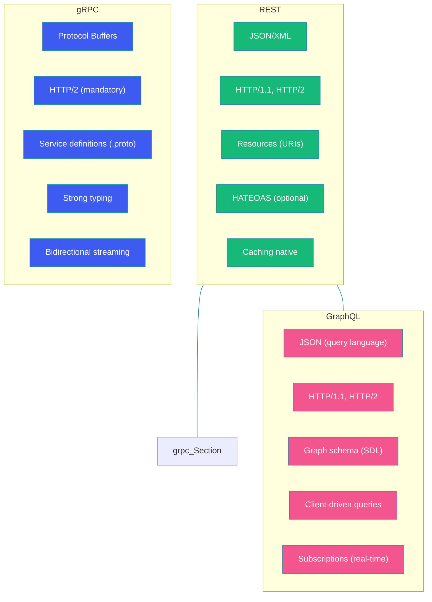

# REST vs gRPC vs GraphQL

## Overview

REST, gRPC, and GraphQL represent three major paradigms for building and consuming APIs. Each makes fundamentally different choices about how data is modeled, how clients interact with servers, how requests are transported, and how the interface evolves over time.

REST emphasizes resources and uniform interfaces. gRPC focuses on high-performance remote procedure calls with strong typing. GraphQL gives clients the power to request exactly the data they need through a single endpoint.

Choosing the right paradigm for your use case has far-reaching implications for developer productivity, runtime performance, API evolution, and client capabilities.

---

## Problem Statement

Modern applications face several challenges:

- **Multiple clients**: Web, mobile, IoT — each needs different data shapes
- **Network constraints**: Mobile apps need bandwidth-efficient protocols
- **Microservice complexity**: Hundreds of services need to communicate efficiently
- **Rapid iteration**: APIs must evolve without breaking existing clients
- **Performance requirements**: Low latency, high throughput, streaming support

No single API paradigm solves all these problems optimally. Understanding the trade-offs is essential for making the right choice.

---

## Comparison Overview



---

## REST: Resources & HTTP Methods

### Architecture

REST (Representational State Transfer) was formalized by Roy Fielding in 2000. It treats data as resources identified by URIs and manipulated through standard HTTP methods.

```java
// REST Controller Example
@RestController
@RequestMapping("/api/v1/users")
public class UserRestController {

    private final UserService userService;

    @GetMapping
    public ResponseEntity<List<UserResponse>> getAllUsers(
            @RequestParam(defaultValue = "0") int page,
            @RequestParam(defaultValue = "20") int size) {
        Page<User> users = userService.findAll(page, size);
        return ResponseEntity.ok(users.stream()
                .map(UserResponse::from)
                .toList());
    }

    @GetMapping("/{id}")
    public ResponseEntity<UserResponse> getUser(@PathVariable Long id) {
        return ResponseEntity.ok(
                UserResponse.from(userService.findById(id)));
    }

    @PostMapping
    public ResponseEntity<UserResponse> createUser(
            @Valid @RequestBody CreateUserRequest request) {
        User user = userService.create(request.toDomain());
        return ResponseEntity
                .created(URI.create("/api/v1/users/" + user.getId()))
                .body(UserResponse.from(user));
    }

    @PatchMapping("/{id}")
    public ResponseEntity<UserResponse> updateUser(
            @PathVariable Long id,
            @RequestBody Map<String, Object> updates) {
        User user = userService.partialUpdate(id, updates);
        return ResponseEntity.ok(UserResponse.from(user));
    }

    @DeleteMapping("/{id}")
    public ResponseEntity<Void> deleteUser(@PathVariable Long id) {
        userService.delete(id);
        return ResponseEntity.noContent().build();
    }
}
```

### When to Use REST

- Public APIs for third-party developers (familiar, widely supported)
- CRUD-heavy applications with clear resource models
- Systems requiring robust HTTP caching
- When simplicity and broad compatibility matter more than performance

---

## gRPC: High-Performance RPC

### Architecture

gRPC, originally developed by Google, uses Protocol Buffers for interface definition and serialization, and HTTP/2 for transport.

```protobuf
// proto/user_service.proto
syntax = "proto3";

package userservice;

service UserService {
    rpc GetUser (GetUserRequest) returns (User);
    rpc ListUsers (ListUsersRequest) returns (stream User);
    rpc CreateUser (CreateUserRequest) returns (User);
    rpc UpdateUsers (stream UserUpdate) returns (UpdateSummary);
}

message GetUserRequest {
    int64 user_id = 1;
}

message User {
    int64 id = 1;
    string name = 2;
    string email = 3;
    UserStatus status = 4;
    repeated string roles = 5;
}

enum UserStatus {
    ACTIVE = 0;
    INACTIVE = 1;
    SUSPENDED = 2;
}

message CreateUserRequest {
    string name = 1;
    string email = 2;
    repeated string roles = 3;
}

message ListUsersRequest {
    int32 page_size = 1;
    string page_token = 2;
}

message UserUpdate {
    int64 user_id = 1;
    string field_name = 2;
    string new_value = 3;
}

message UpdateSummary {
    int32 success_count = 1;
    int32 failure_count = 2;
    repeated string errors = 3;
}
```

```java
// gRPC Server Implementation
@GrpcService
public class UserGrpcService extends UserServiceGrpc.UserServiceImplBase {

    private final UserService userService;

    @Override
    public void getUser(GetUserRequest request,
                        StreamObserver<User> responseObserver) {
        try {
            User user = userService.findById(request.getUserId());
            User protoUser = User.newBuilder()
                    .setId(user.getId())
                    .setName(user.getName())
                    .setEmail(user.getEmail())
                    .addAllRoles(user.getRoles())
                    .build();
            responseObserver.onNext(protoUser);
            responseObserver.onCompleted();
        } catch (Exception e) {
            responseObserver.onError(
                    Status.NOT_FOUND.withDescription(e.getMessage())
                            .asRuntimeException());
        }
    }

    @Override
    public void listUsers(ListUsersRequest request,
                          StreamObserver<User> responseObserver) {
        userService.findAll(request.getPageSize())
                .forEach(user -> {
                    User protoUser = User.newBuilder()
                            .setId(user.getId())
                            .setName(user.getName())
                            .build();
                    responseObserver.onNext(protoUser);
                });
        responseObserver.onCompleted();
    }
}
```

### When to Use gRPC

- Internal microservice-to-microservice communication
- High-throughput, low-latency systems (financial trading, real-time analytics)
- Polyglot environments (gRPC generates clients for 11+ languages)
- Streaming data pipelines (bidirectional streaming)
- Mobile applications (binary serialization is bandwidth-efficient)

---

## GraphQL: Client-Driven Queries

### Architecture

GraphQL, developed by Facebook, exposes a single endpoint where clients specify exactly what data they need using a declarative query language.

```graphql
# Schema Definition
type User {
    id: ID!
    name: String!
    email: String!
    posts: [Post!]!
    followers: Int!
}

type Post {
    id: ID!
    title: String!
    content: String!
    createdAt: DateTime!
    author: User!
    comments: [Comment!]!
}

type Comment {
    id: ID!
    text: String!
    author: User!
}

type Query {
    user(id: ID!): User
    users(page: Int, limit: Int): [User!]!
    postsByUser(userId: ID!, limit: Int): [Post!]!
}

type Mutation {
    createUser(input: CreateUserInput!): User!
    updateUser(id: ID!, input: UpdateUserInput!): User!
    deleteUser(id: ID!): Boolean!
}

input CreateUserInput {
    name: String!
    email: String!
}
```

```java
// GraphQL Resolver in Spring Boot
@Component
public class UserGraphQLResolver implements GraphQLQueryResolver {

    private final UserService userService;
    private final PostService postService;

    public User user(Long id) {
        return userService.findById(id);
    }

    public List<User> users(int page, int limit) {
        return userService.findAll(page, limit);
    }
}

@Component
public class PostFieldResolver implements GraphQLResolver<User> {

    private final PostService postService;

    public List<Post> posts(User user, int limit) {
        return postService.findByUserId(user.getId(), limit);
    }
}

@Component
public class UserMutationResolver implements GraphQLMutationResolver {

    private final UserService userService;

    public User createUser(CreateUserInput input) {
        User user = new User(input.getName(), input.getEmail());
        user = userService.create(user);
        return user;
    }

    public User updateUser(Long id, UpdateUserInput input) {
        return userService.update(id, input);
    }

    public boolean deleteUser(Long id) {
        userService.delete(id);
        return true;
    }
}
```

### When to Use GraphQL

- Complex UIs that display data from multiple sources (dashboard, product pages)
- Mobile applications needing bandwidth-efficient data fetching
- Rapidly evolving frontends that need schema flexibility
- BFF (Backend For Frontend) pattern to avoid multiple API calls

---

## Side-by-Side Comparison

| Feature | REST | gRPC | GraphQL |
|---------|------|------|---------|
| **Data format** | JSON, XML, YAML | Protocol Buffers (binary) | JSON (queries), SDL (schema) |
| **Transport** | HTTP/1.1, HTTP/2 | HTTP/2 (mandatory) | HTTP/1.1, HTTP/2 |
| **Contract** | OpenAPI/Swagger | .proto files | SDL schema |
| **Caching** | Native HTTP caching | Not built-in | Per-query, needs custom |
| **Streaming** | SSE, WebSocket | Native bidirectional | Subscriptions |
| **Tooling** | Postman, cURL, Insomnia | grpcurl, protoc | GraphiQL, Apollo Studio |
| **Learning curve** | Low | Medium (protobuf, stubs) | Medium (schema, resolvers) |
| **Versioning** | URL/header versioning | Service versioning (package) | Schema evolution, deprecation |
| **Mutation** | POST, PUT, PATCH, DELETE | RPC methods | Mutations |
| **Payload size** | Larger (JSON text) | Smallest (binary) | Variable (client-specified) |

---

## Code Example: Choosing the Right Paradigm

```java
@Configuration
public class ApiParadigmConfig {

    // REST for public-facing APIs
    @Bean
    public RestTemplate restTemplate() {
        return new RestTemplate();
    }

    // gRPC for internal microservice communication
    @Bean
    public UserServiceGrpc.UserServiceBlockingStub userGrpcStub() {
        ManagedChannel channel = ManagedChannelBuilder
                .forAddress("user-service.internal", 50051)
                .usePlaintext()
                .build();
        return UserServiceGrpc.newBlockingStub(channel);
    }

    // GraphQL for complex client queries
    @Bean
    public GraphQL graphQL(GraphQLSchema schema) {
        return GraphQL.newGraphQL(schema)
                .instrumentation(new ApolloTracingInstrumentation())
                .build();
    }
}

// Hybrid approach: use all three
@Service
public class HybridApiService {

    // REST for external customers
    public ExternalUserResponse getUserRest(Long id) {
        return restTemplate.getForObject(
                "http://api.example.com/users/{id}",
                ExternalUserResponse.class, id);
    }

    // gRPC for internal service calls
    public InternalUser getUserGrpc(Long id) {
        GetUserRequest request = GetUserRequest.newBuilder()
                .setUserId(id).build();
        User protoUser = userGrpcStub.getUser(request);
        return InternalUser.fromProto(protoUser);
    }

    // GraphQL for dashboard data
    public DashboardData getDashboardData(Long userId) {
        String query = "{ user(id: " + userId + ") { name posts { title } } }";
        ExecutionResult result = graphQL.execute(query);
        return DashboardData.from(result.getData());
    }
}
```

---

## Best Practices

- **Use REST for public APIs**: Familiarity, tooling, and caching make REST the best choice for third-party developers
- **Use gRPC for internal services**: Strong typing, streaming, and performance benefits shine in service-to-service communication
- **Use GraphQL for complex client UIs**: When clients need data from multiple sources with varying shapes
- **Don't mix paradigms in the same service boundary**: Choose one paradigm per bounded context for consistency
- **Version your API from day one**: Whether via URL (REST), service package (gRPC), or schema deprecation (GraphQL)

---

## Common Mistakes

- **Over-fetching with REST**: N+1 queries or loading too much data in a single response
- **Under-fetching with REST**: Requiring multiple round trips to gather all needed data
- **Using gRPC for browser clients**: gRPC-Web has limitations; consider REST or GraphQL for browser-facing APIs
- **Creating deeply nested GraphQL queries**: Unbounded depth leads to performance issues (always implement query complexity analysis)
- **Ignoring HTTP/2 requirements for gRPC**: gRPC requires HTTP/2; load balancers must support it
- **Not implementing query cost analysis in GraphQL**: Malicious queries can overload the server

---

## Summary

REST, gRPC, and GraphQL each offer distinct trade-offs. REST provides simplicity, broad compatibility, and excellent caching, making it ideal for public APIs. gRPC delivers high performance, strong typing, and native streaming, making it perfect for internal microservice communication. GraphQL empowers clients with flexible queries from a single endpoint, ideal for complex UIs and mobile applications.

The best architectures often use a combination: REST for external APIs, gRPC for internal service mesh, and GraphQL as a BFF layer for frontend applications. Understanding each paradigm's strengths and weaknesses allows you to choose the right tool for each communication boundary.

---

## References

- [REST: Architectural Styles and the Design of Network-based Software Architectures — Roy Fielding](https://www.ics.uci.edu/~fielding/pubs/dissertation/top.htm)
- [gRPC Official Documentation](https://grpc.io/docs/)
- [GraphQL Specification](https://spec.graphql.org/)
- [Protocol Buffers Documentation](https://developers.google.com/protocol-buffers)
- [Apollo GraphQL Federation](https://www.apollographql.com/docs/federation/)
- [Google API Design Guide](https://cloud.google.com/apis/design)
