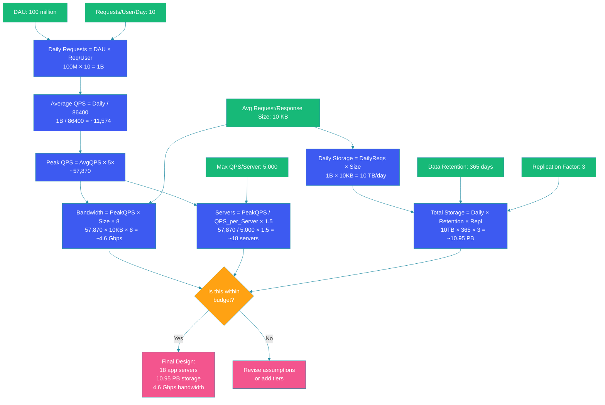

# Back-of-the-Envelope Calculations

## Overview

Back-of-the-envelope calculations are quick, approximate estimates used to reason about system capacity, resource requirements, and feasibility before diving into detailed design. They allow engineers to make informed architectural decisions without building prototypes.

In system design interviews and real-world planning, these estimates help answer critical questions: How many servers do we need? How much storage will we consume in a year? What bandwidth does our network require? What's the bottleneck?

This blog provides the reference values, formulas, and worked examples you need to perform these calculations confidently.

---

## Problem Statement

When designing a system, you need to answer questions like:

- How many requests per second will our API receive at peak?
- How much database storage will we need after one year?
- How many application servers should we provision?
- What's the required network bandwidth for replication?
- Will our cache hit ratio make caching worthwhile?

Without a systematic estimation approach, you either over-provision (wasting money) or under-provision (causing outages). Back-of-the-envelope calculations using known reference values give you quick, actionable answers.

---

## Reference Values

### Powers of 2

| Power | Approximate Value | Full Value |
|-------|------------------|------------|
| 2^10 | 1 Thousand | 1,024 |
| 2^20 | 1 Million | 1,048,576 |
| 2^30 | 1 Billion | 1,073,741,824 |
| 2^40 | 1 Trillion | 1,099,511,627,776 |
| 2^50 | 1 Quadrillion | 1,125,899,906,842,624 |

### Latency Numbers Every Programmer Should Know

```mermaid
flowchart TB
    classDef fast fill:#17b978,stroke:#278ea5,color:#fff
    classDef medium fill:#FFA213,stroke:#278ea5,color:#fff
    classDef slow fill:#f3558e,stroke:#278ea5,color:#fff
    classDef category fill:#3d5af1,stroke:#278ea5,color:#fff

    subgraph CPU["CPU Operations"]:::category
        L1["L1 cache reference: 0.5 ns"]:::fast
        L2["L2 cache reference: 7 ns"]:::fast
        Mutex["Mutex lock/unlock: 17 ns"]:::fast
        MainMem["Main memory reference: 100 ns"]:::medium
    end

    subgraph Disk["Disk Operations"]:::category
        SSD["SSD random read: 16 µs"]:::medium
        HDD["HDD random seek: 2 ms"]:::slow
        HDD_Seq["HDD sequential read (1 MB): 5 ms"]:::slow
    end

    subgraph Network["Network Operations"]:::category
        DC["Same datacenter round trip: 500 µs"]:::medium
        US_EU["US to Europe round trip: 150 ms"]:::slow
        US_JP["US to Japan round trip: 150 ms"]:::slow
        US_AU["US to Australia round trip: 200 ms"]:::slow
    end

    subgraph Derived["Derived Values"]:::category
        Compress1K["Compress 1 KB with Zippy: 10,000 ns = 10 µs"]:::fast
        Send1K["Send 1 KB over 1 Gbps: 10,000 ns = 10 µs"]:::fast
        Read1M_Seq["Read 1 MB sequentially from RAM: 250 µs"]:::fast
        Read1M_SSD["Read 1 MB sequentially from SSD: 1,000 µs = 1 ms"]:::medium
        Read1M_HDD["Read 1 MB sequentially from HDD: 20,000 µs = 20 ms"]:::slow
        Packet_US["Packet round trip US to EU: 150,000 µs = 150 ms"]:::slow
    end

    linkStyle default stroke:#278ea5
```

**Simplified Order of Magnitude (for quick estimation):**

| Operation | Time |
|-----------|------|
| L1 cache | 1 ns |
| Main memory | 100 ns |
| SSD random read | 100 µs |
| Same DC round trip | 500 µs |
| Cross-continent round trip | 100-200 ms |
| HDD seek | 10 ms |

---

## QPS (Queries Per Second) Calculation

### Daily Traffic Estimation

```java
public class QpsEstimator {

    public static long estimatePeakQPS(long dailyActiveUsers,
                                        double requestsPerUser,
                                        double peakToAverageRatio) {
        long dailyRequests = (long) (dailyActiveUsers * requestsPerUser);
        double averageQPS = dailyRequests / 86400.0; // seconds per day
        return (long) (averageQPS * peakToAverageRatio);
    }

    public static void main(String[] args) {
        // Twitter-like: 500M DAU, 5 requests/user/day, 5x peak
        long twitterQPS = estimatePeakQPS(500_000_000, 5, 5);
        System.out.println("Twitter peak QPS: ~" + twitterQPS);
        // Output: ~144,676

        // E-commerce: 10M DAU, 20 requests/user/day (browsing, search, cart), 10x peak
        long ecomQPS = estimatePeakQPS(10_000_000, 20, 10);
        System.out.println("E-commerce peak QPS: ~" + ecomQPS);
        // Output: ~23,148
    }
}
```

### Common Conversions

| Metric | Formula | Example |
|--------|---------|---------|
| Daily requests → QPS | Daily / 86,400 | 10M daily → ~116 QPS |
| Monthly active → DAU | MAU × 0.4 | 100M MAU → 40M DAU |
| Peak vs average | Average × (3-10×) | 1,000 avg → 5,000 peak |
| Concurrent users | DAU × 0.1× (active time fraction) | 10M DAU → ~100K concurrent |

---

## Storage Estimation

### Social Media Post Example

```java
public class StorageEstimator {

    record StorageBreakdown(long totalBytes, String readable) {
        @Override
        public String toString() {
            return readable;
        }
    }

    public static StorageBreakdown estimateStorage(
            long totalUsers,
            double postsPerUserPerDay,
            double avgPostSizeBytes,
            int retentionDays,
            int replicationFactor) {

        double dailyStorage = totalUsers * postsPerUserPerDay * avgPostSizeBytes;
        double totalStorage = dailyStorage * retentionDays * replicationFactor;

        return new StorageBreakdown(
                (long) totalStorage,
                formatBytes(totalStorage)
        );
    }

    private static String formatBytes(double bytes) {
        String[] units = {"B", "KB", "MB", "GB", "TB", "PB", "EB"};
        int unitIndex = 0;
        while (bytes >= 1024 && unitIndex < units.length - 1) {
            bytes /= 1024;
            unitIndex++;
        }
        return String.format("%.2f %s", bytes, units[unitIndex]);
    }

    public static void main(String[] args) {
        // Scenario: Instagram-like app
        // 500M users, 3 posts/user/day, 2 MB avg (with images), 365 days, 3x replication
        StorageBreakdown instagram = estimateStorage(
                500_000_000, 3, 2 * 1024 * 1024, 365, 3);
        System.out.println("Instagram yearly storage: " + instagram);
        // Output: ~3.06 EB

        // Scenario: Twitter-like text
        // 500M users, 5 tweets/user/day, 500 bytes avg, 365 days, 3x replication
        StorageBreakdown twitter = estimateStorage(
                500_000_000, 5, 500, 365, 3);
        System.out.println("Twitter yearly storage: " + twitter);
        // Output: ~1.27 TB

        // Per-second write rate
        long dailyPosts = 500_000_000L * 5; // 2.5B tweets/day
        // Multiply by replication writes
        long perSecond = (dailyPosts * 3) / 86400;
        System.out.println("Twitter write QPS (with replication): ~" + perSecond);
        // Output: ~173,611
    }
}
```

---

## Bandwidth Estimation

### Network Throughput

```java
public class BandwidthEstimator {

    public static double estimateBandwidthGbps(
            long requestsPerSecond,
            double avgResponseSizeBytes) {

        double bytesPerSecond = requestsPerSecond * avgResponseSizeBytes;
        double bitsPerSecond = bytesPerSecond * 8;
        return bitsPerSecond / 1_000_000_000.0; // Gbps
    }

    public static void main(String[] args) {
        // API gateway: 100K RPS, 50 KB average response
        double bandwidth = estimateBandwidthGbps(100_000, 50 * 1024);
        System.out.printf("Required bandwidth: %.2f Gbps%n", bandwidth);
        // Output: ~40.96 Gbps

        // Database replication: 10K writes/sec, 2 KB per write
        double replicationBW = estimateBandwidthGbps(10_000, 2 * 1024);
        System.out.printf("Replication traffic: %.4f Gbps%n", replicationBW);
        // Output: ~0.16 Gbps

        // CDN egress: 50K RPS, 200 KB average (images)
        double cdnBW = estimateBandwidthGbps(50_000, 200 * 1024);
        System.out.printf("CDN egress bandwidth: %.2f Gbps%n", cdnBW);
        // Output: ~81.92 Gbps
    }
}
```

---

## Server Capacity Estimation

### Servers Needed

```java
public class ServerEstimator {

    public static int estimateServers(
            long peakQPS,
            int maxQPSPerServer,
            double headroomFraction) {

        double rawServers = (double) peakQPS / maxQPSPerServer;
        return (int) Math.ceil(rawServers * (1 + headroomFraction));
    }

    public static void main(String[] args) {
        // Scenario: 150K peak QPS, 5K max per application server, 50% headroom
        int servers = estimateServers(150_000, 5000, 0.5);
        System.out.println("Application servers needed: " + servers);
        // Output: 45

        // Scenario: 50K peak write QPS, 10K max per DB primary, 100% headroom
        int dbNodes = estimateServers(50_000, 10_000, 1.0);
        System.out.println("Database nodes needed: " + dbNodes);
        // Output: 10

        // Using NLB with 10 Gbps per instance
        double peakBW_Gbps = 40.0; // from bandwidth estimation
        double bwPerNLB = 10.0;
        int nlbNodes = (int) Math.ceil(peakBW_Gbps / bwPerNLB * 1.5);
        System.out.println("Network load balancers needed: " + nlbNodes);
        // Output: 6
    }
}
```

---

## Complete Estimation Flow



---

## Quick Estimation Rules of Thumb

### Memory
- **100 MB** → fits in RAM of one cheap server
- **10 GB** → fits in RAM of one large server
- **1 TB** → needs SSD or distributed caching
- **1 PB** → needs distributed storage (Cassandra, S3)

### Network
- **1 Gbps link** → ~125 MB/s theoretical, ~100 MB/s practical
- **10 Gbps link** → ~1.25 GB/s theoretical, ~1 GB/s practical
- **CDN egress cost** → ~$0.02-0.08 per GB (varies by provider)

### Database
- **Single DB server** → handles ~5K-10K read QPS, ~1K-3K write QPS
- **Read replica** → typically 10-100 ms replication lag
- **Connection limit** → typically 200-500 per PostgreSQL instance

### Caching
- **Cache hit ratio** → 80-95% for well-designed workloads
- **Redis single instance** → ~100K-200K ops/sec
- **Memcached** → slightly higher ops/sec, less data structure support

---

## Code Example: Estimation Utility

```java
@Component
public class CapacityPlanner {

    public CapacityPlan estimate(CapacityRequest request) {
        double dailyRequests = request.dailyActiveUsers() * request.requestsPerUser();
        double averageQPS = dailyRequests / 86400.0;
        double peakQPS = averageQPS * request.peakMultiplier();

        double dailyStorageBytes = dailyRequests * request.avgPayloadBytes();
        double totalStorageBytes = dailyStorageBytes * request.retentionDays()
                * request.replicationFactor();

        double peakBandwidthGbps = peakQPS * request.avgPayloadBytes() * 8 / 1e9;

        int servers = (int) Math.ceil(peakQPS / request.maxQpsPerServer()
                * (1 + request.headroomFraction()));

        return new CapacityPlan(
                averageQPS,
                peakQPS,
                totalStorageBytes,
                peakBandwidthGbps,
                servers
        );
    }

    record CapacityRequest(
            long dailyActiveUsers,
            double requestsPerUser,
            double peakMultiplier,       // e.g., 5.0
            double avgPayloadBytes,
            int retentionDays,
            int replicationFactor,
            int maxQpsPerServer,
            double headroomFraction       // e.g., 0.5
    ) {}

    record CapacityPlan(
            double averageQPS,
            double peakQPS,
            double totalStorageBytes,
            double peakBandwidthGbps,
            int serversNeeded
    ) {
        String summary() {
            return String.format("""
                    QPS (avg): %.0f
                    QPS (peak): %.0f
                    Storage: %.2f TB
                    Bandwidth: %.2f Gbps
                    Servers: %d""",
                    averageQPS, peakQPS,
                    totalStorageBytes / (1024.0 * 1024 * 1024 * 1024),
                    peakBandwidthGbps,
                    serversNeeded);
        }
    }

    public static void main(String[] args) {
        CapacityPlanner planner = new CapacityPlanner();

        CapacityPlan plan = planner.estimate(new CapacityRequest(
                100_000_000L,        // 100M DAU
                10,                  // 10 requests/user/day
                5.0,                 // 5x peak
                10 * 1024,           // 10 KB avg payload
                365,                 // 1 year retention
                3,                   // 3x replication
                5000,                // 5K QPS per server
                0.5                  // 50% headroom
        ));

        System.out.println(plan.summary());
    }
}
```

---

## Best Practices

- **Round to powers of 10**: Work with orders of magnitude (10^3, 10^6, 10^9) for quick mental math
- **Always state assumptions**: Document DAU, requests per user, peak factor, and retention period so others can validate
- **Calculate peak, not just average**: Systems must handle peak load, which can be 5-20× average
- **Add headroom**: Provision 50-100% extra capacity for traffic spikes, growth, and failures
- **Include replication overhead**: Storage and bandwidth calculations must account for replication across nodes
- **Sanity-check your results**: 1M QPS on a single server is probably wrong; 1K QPS is probably right

---

## Common Mistakes

- **Using average instead of peak**: Provisioning for average load guarantees failure during traffic spikes
- **Forgetting replication factor**: Storage needed = raw data × replication count, not raw data alone
- **Ignoring network overhead**: Protocol headers, TLS, retransmissions add 5-10% bandwidth overhead
- **Assuming linear scaling**: Doubling servers doesn't double throughput due to coordination overhead
- **Neglecting background traffic**: Replication, backups, batch jobs, and monitoring consume bandwidth too
- **Estimating without reference points**: Use known latency numbers and throughput benchmarks rather than guessing

---

## Summary

Back-of-the-envelope calculations are an essential tool for system design. Using reference values for latency, throughput, and storage, you can quickly estimate traffic (QPS), storage requirements, bandwidth needs, and server count.

The key formula flow is: DAU × requests/user → daily requests → average QPS → peak QPS (with multiplier). Storage = daily data × retention × replication. Servers = peak QPS / capacity per server × headroom.

These estimates help you make early architectural decisions, identify bottlenecks, and communicate capacity needs to stakeholders — all without building anything. Practice with real-world scenarios to build intuition and speed.

---

## References

- [Latency Numbers Every Programmer Should Know — Jeff Dean](https://gist.github.com/jboner/2841832)
- [Google SRE Book: Managing Load](https://sre.google/sre-book/table-of-contents/)
- [Amazon Builders' Library: Capacity Planning](https://aws.amazon.com/builders-library/)
- [System Design Interview — Alex Xu (Ch. 1: Scale Estimation)](https://amazon.com/dp/1736049119)
- [High Scalability — Numbers Everyone Should Know](http://highscalability.com/blog/2011/1/26/google-pro-tip-use-back-of-the-envelope-calculations-to-choo.html)
