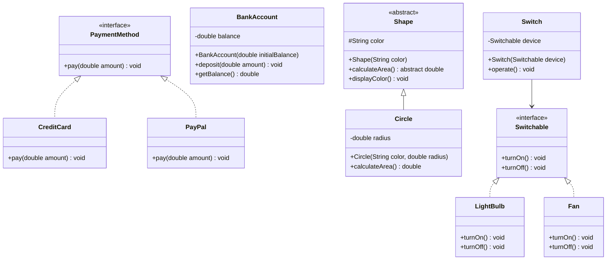

# OOP & SOLID Principles

## Overview

Object-Oriented Programming (OOP) is a programming paradigm that organizes software design around objects rather than functions and logic. The four pillars of OOP—Encapsulation, Inheritance, Polymorphism, and Abstraction—provide the foundation for writing modular, reusable, and maintainable code. SOLID principles extend these concepts with five design guidelines that help developers create systems that are easy to understand, maintain, and extend.

This blog covers both OOP fundamentals and SOLID principles with practical Java examples and class diagrams.

---

## Problem Statement

As software systems grow in complexity, poorly structured code leads to:

- **Rigidity**: One change cascades into many other changes
- **Fragility**: Changes break unrelated parts of the system
- **Immobility**: Code cannot be reused in other contexts
- **Viscosity**: Easy things are hard, hard things are harder

OOP and SOLID principles address these challenges by providing proven patterns for organizing code.

---

## Four Pillars of OOP

### Encapsulation

Encapsulation bundles data and methods operating on that data within a single unit (class), restricting direct access to internal state. It is achieved through access modifiers: `private`, `protected`, `public`, and `default`.

```java
public class BankAccount {
    private double balance;

    public BankAccount(double initialBalance) {
        this.balance = initialBalance;
    }

    public void deposit(double amount) {
        if (amount > 0) {
            balance += amount;
        }
    }

    public double getBalance() {
        return balance;
    }
}
```

### Inheritance

Inheritance allows a class to inherit properties and methods from another class, enabling code reuse and establishing a hierarchical relationship.

```java
public class Vehicle {
    protected String licensePlate;
    protected String brand;

    public Vehicle(String licensePlate, String brand) {
        this.licensePlate = licensePlate;
        this.brand = brand;
    }

    public void start() {
        System.out.println("Vehicle starting...");
    }
}

public class Car extends Vehicle {
    private int numberOfDoors;

    public Car(String licensePlate, String brand, int numberOfDoors) {
        super(licensePlate, brand);
        this.numberOfDoors = numberOfDoors;
    }

    @Override
    public void start() {
        System.out.println("Car engine starting...");
    }
}
```

### Polymorphism

Polymorphism allows objects of different types to be treated uniformly through a common interface. Java supports compile-time (method overloading) and runtime (method overriding) polymorphism.

```java
public interface PaymentMethod {
    void pay(double amount);
}

public class CreditCard implements PaymentMethod {
    @Override
    public void pay(double amount) {
        System.out.println("Paid " + amount + " via Credit Card");
    }
}

public class PayPal implements PaymentMethod {
    @Override
    public void pay(double amount) {
        System.out.println("Paid " + amount + " via PayPal");
    }
}

// Usage
PaymentMethod payment = new CreditCard();
payment.pay(100.0);  // Runtime polymorphism
```

### Abstraction

Abstraction hides implementation details and exposes only essential features. It is achieved through abstract classes and interfaces.

```java
public abstract class Shape {
    protected String color;

    public Shape(String color) {
        this.color = color;
    }

    public abstract double calculateArea();

    public void displayColor() {
        System.out.println("Color: " + color);
    }
}

public class Circle extends Shape {
    private double radius;

    public Circle(String color, double radius) {
        super(color);
        this.radius = radius;
    }

    @Override
    public double calculateArea() {
        return Math.PI * radius * radius;
    }
}
```

---

## SOLID Principles

### S - Single Responsibility Principle (SRP)

A class should have only one reason to change, meaning it should have only one responsibility.

```java
// Bad: Class handles both data and persistence
public class Invoice {
    private double amount;

    public void calculateTotal() { /* ... */ }
    public void saveToDatabase() { /* ... */ }
    public void sendEmail() { /* ... */ }
}

// Good: Separate concerns
public class Invoice {
    private double amount;
    public void calculateTotal() { /* ... */ }
}

public class InvoiceRepository {
    public void save(Invoice invoice) { /* ... */ }
}

public class EmailService {
    public void sendInvoice(Invoice invoice) { /* ... */ }
}
```

### O - Open/Closed Principle (OCP)

Classes should be open for extension but closed for modification. New functionality should be added through new code, not by changing existing code.

```java
public interface NotificationChannel {
    void send(String message, String recipient);
}

public class EmailChannel implements NotificationChannel {
    @Override
    public void send(String message, String recipient) {
        System.out.println("Email to " + recipient + ": " + message);
    }
}

public class SMSChannel implements NotificationChannel {
    @Override
    public void send(String message, String recipient) {
        System.out.println("SMS to " + recipient + ": " + message);
    }
}

// Extend without modifying
public class PushNotificationChannel implements NotificationChannel {
    @Override
    public void send(String message, String recipient) {
        System.out.println("Push notification to " + recipient + ": " + message);
    }
}

public class NotificationService {
    private List<NotificationChannel> channels;

    public NotificationService(List<NotificationChannel> channels) {
        this.channels = channels;
    }

    public void notify(String message, String recipient) {
        channels.forEach(ch -> ch.send(message, recipient));
    }
}
```

### L - Liskov Substitution Principle (LSP)

Derived classes must be substitutable for their base classes without altering the correctness of the program.

```java
// Bad: Violates LSP
public class Rectangle {
    protected int width;
    protected int height;

    public void setWidth(int width) { this.width = width; }
    public void setHeight(int height) { this.height = height; }
    public int getArea() { return width * height; }
}

public class Square extends Rectangle {
    @Override
    public void setWidth(int width) {
        super.setWidth(width);
        super.setHeight(width);  // Side effect breaks expectations
    }
}

// Good: Use abstraction
public interface Shape {
    int getArea();
}

public class Rectangle implements Shape {
    private int width;
    private int height;

    public Rectangle(int width, int height) {
        this.width = width;
        this.height = height;
    }

    @Override
    public int getArea() { return width * height; }
}

public class Square implements Shape {
    private int side;

    public Square(int side) {
        this.side = side;
    }

    @Override
    public int getArea() { return side * side; }
}
```

### I - Interface Segregation Principle (ISP)

Clients should not be forced to depend on interfaces they do not use. Many specific interfaces are better than one general-purpose interface.

```java
// Bad: Fat interface
public interface Worker {
    void work();
    void eat();
    void sleep();
}

public class Robot implements Worker {
    @Override
    public void work() { /* works */ }
    @Override
    public void eat() { /* not applicable */ }
    @Override
    public void sleep() { /* not applicable */ }
}

// Good: Segregated interfaces
public interface Workable {
    void work();
}

public interface Eatable {
    void eat();
}

public interface Sleepable {
    void sleep();
}

public class Human implements Workable, Eatable, Sleepable {
    @Override
    public void work() { /* works */ }
    @Override
    public void eat() { /* eats */ }
    @Override
    public void sleep() { /* sleeps */ }
}

public class Robot implements Workable {
    @Override
    public void work() { /* works */ }
}
```

### D - Dependency Inversion Principle (DIP)

High-level modules should not depend on low-level modules. Both should depend on abstractions. Abstractions should not depend on details; details should depend on abstractions.

```java
// Bad: High-level depends on low-level
public class LightBulb {
    public void turnOn() { /* ... */ }
    public void turnOff() { /* ... */ }
}

public class Switch {
    private LightBulb bulb;

    public Switch() {
        this.bulb = new LightBulb();  // Tight coupling
    }

    public void operate() {
        bulb.turnOn();
    }
}

// Good: Both depend on abstraction
public interface Switchable {
    void turnOn();
    void turnOff();
}

public class LightBulb implements Switchable {
    @Override
    public void turnOn() { System.out.println("Light on"); }
    @Override
    public void turnOff() { System.out.println("Light off"); }
}

public class Fan implements Switchable {
    @Override
    public void turnOn() { System.out.println("Fan on"); }
    @Override
    public void turnOff() { System.out.println("Fan off"); }
}

public class Switch {
    private Switchable device;

    public Switch(Switchable device) {
        this.device = device;
    }

    public void operate() {
        device.turnOn();
    }
}
```

---

## Class Diagram: OOP & SOLID in Practice



---

## Best Practices

- Favor composition over inheritance to reduce coupling and increase flexibility
- Keep classes small and focused on a single responsibility
- Program to interfaces, not implementations
- Use dependency injection to satisfy the Dependency Inversion Principle
- Apply the Open/Closed Principle through strategy and template method patterns
- Avoid deep inheritance hierarchies (max 3-4 levels)
- Write unit tests that verify LSP by testing through base class interfaces
- Use meaningful names that reflect the single responsibility of each class

---

## Common Mistakes

- Creating God classes that handle too many responsibilities, violating SRP
- Using inheritance for code reuse when composition would be more appropriate
- Making all fields public, breaking encapsulation
- Adding new functionality by modifying existing tested code instead of extending
- Creating deep inheritance trees that are fragile and hard to debug
- Neglecting unit tests for polymorphic behavior, leading to runtime surprises
- Over-engineering with unnecessary abstractions for simple use cases

---

## Summary

OOP and SOLID principles are foundational to building maintainable, scalable, and robust software. The four pillars of OOP—Encapsulation, Inheritance, Polymorphism, and Abstraction—provide the building blocks for object-oriented design, while SOLID principles guide developers in applying these concepts effectively. By following these principles, teams can create systems that accommodate change gracefully, reduce technical debt, and improve code readability and testability.

---

## References

- [Java Documentation - OOP Concepts](https://docs.oracle.com/javase/tutorial/java/concepts/)
- [Robert C. Martin - SOLID Principles](https://blog.cleancoder.com/uncle-bob/2020/10/18/Solid-Relevance.html)
- [Martin Fowler - Refactoring: Improving the Design of Existing Code](https://martinfowler.com/books/refactoring.html)
- [GoF Design Patterns - Gang of Four](https://en.wikipedia.org/wiki/Design_Patterns)
- [SOLID Principles Explained](https://www.baeldung.com/solid-principles)
