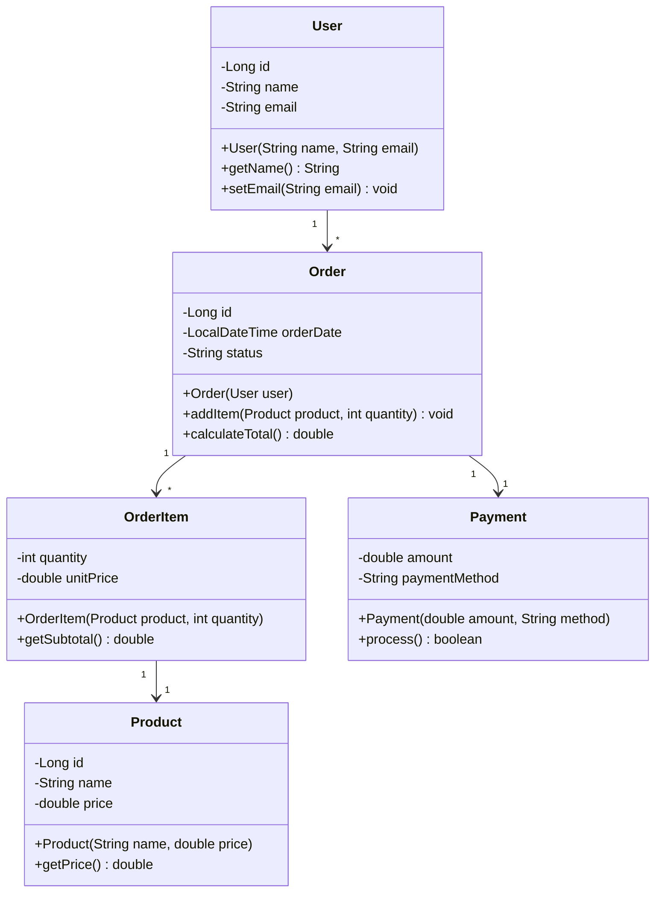
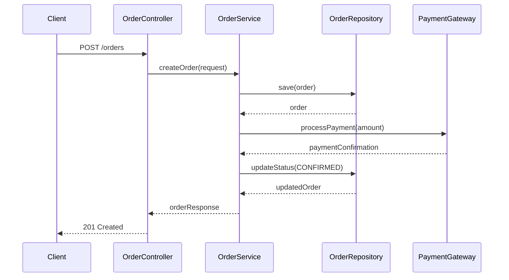
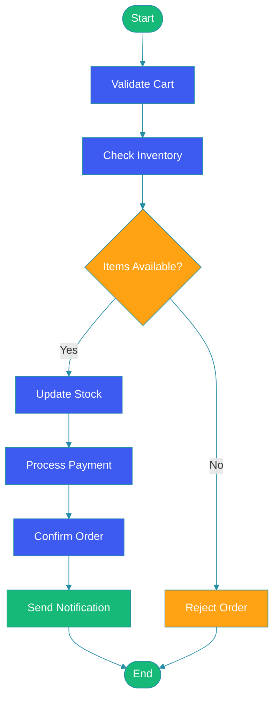
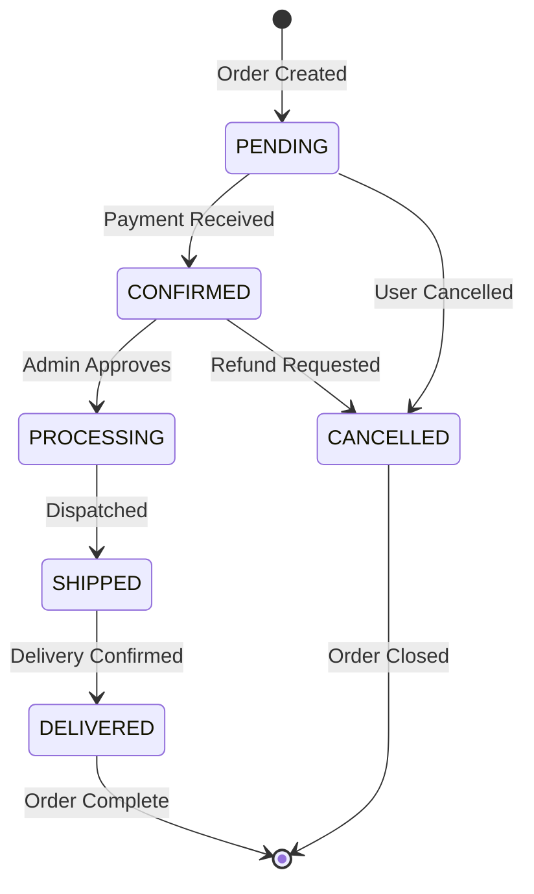
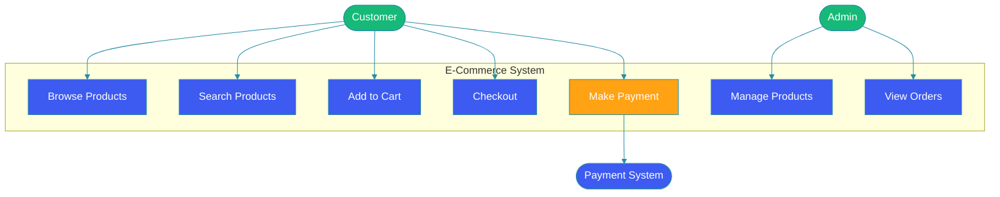

# UML Diagrams for System Design

## Overview

Unified Modeling Language (UML) is a standardized visual modeling language used in software engineering to specify, visualize, construct, and document software system artifacts. UML provides a rich set of diagram types that help developers communicate architecture, design decisions, and system behavior effectively.

This blog covers the five most important UML diagram types for system design: Class, Sequence, Activity, State, and Use Case diagrams. Each diagram type serves a unique purpose and provides different perspectives on the system being designed.

---

## Problem Statement

Complex software systems involve numerous components, interactions, and state transitions. Without a standardized visual language:

- Teams struggle to communicate design intent clearly
- Design flaws are discovered late in development
- Documentation becomes verbose and ambiguous
- Stakeholders have difficulty understanding technical decisions
- System behavior is interpreted differently by different team members

UML diagrams solve these problems by providing a common visual vocabulary for describing software architecture.

---

## Class Diagrams

Class diagrams model the static structure of a system by showing classes, their attributes, methods, and relationships. They are the most widely used UML diagram type.



### Relationships

| Relationship | Notation | Description |
|---|---|---|
| Association | `-->` | A uses B |
| Aggregation | `--o` | Has-A (weaker) |
| Composition | `--*` | Contains (stronger) |
| Inheritance | `<|--` | Is-A |
| Dependency | `..>` | Uses temporarily |
| Realization | `<|..` | Implements interface |

```java
public class User {
    private Long id;
    private String name;
    private String email;
    private List<Order> orders;

    public User(String name, String email) {
        this.name = name;
        this.email = email;
        this.orders = new ArrayList<>();
    }

    public void addOrder(Order order) {
        orders.add(order);
    }
}

public class Order {
    private Long id;
    private User user;
    private List<OrderItem> items;
    private Payment payment;
    private LocalDateTime orderDate;
    private String status;

    public Order(User user) {
        this.user = user;
        this.items = new ArrayList<>();
        this.orderDate = LocalDateTime.now();
        this.status = "PENDING";
    }

    public void addItem(Product product, int quantity) {
        items.add(new OrderItem(product, quantity));
    }

    public double calculateTotal() {
        return items.stream().mapToDouble(OrderItem::getSubtotal).sum();
    }
}
```

---

## Sequence Diagrams

Sequence diagrams show how objects interact over time, capturing the sequence of messages exchanged between components.



```java
@RestController
@RequestMapping("/api/orders")
public class OrderController {

    private final OrderService orderService;

    public OrderController(OrderService orderService) {
        this.orderService = orderService;
    }

    @PostMapping
    public ResponseEntity<OrderResponse> createOrder(@RequestBody OrderRequest request) {
        OrderResponse response = orderService.createOrder(request);
        return ResponseEntity.status(HttpStatus.CREATED).body(response);
    }
}

@Service
public class OrderService {

    private final OrderRepository orderRepository;
    private final PaymentGateway paymentGateway;

    public OrderService(OrderRepository orderRepository, PaymentGateway paymentGateway) {
        this.orderRepository = orderRepository;
        this.paymentGateway = paymentGateway;
    }

    public OrderResponse createOrder(OrderRequest request) {
        Order order = new Order(request.getUserId());
        request.getItems().forEach(item ->
            order.addItem(item.getProduct(), item.getQuantity())
        );

        Order savedOrder = orderRepository.save(order);
        PaymentConfirmation confirmation = paymentGateway.processPayment(
            savedOrder.calculateTotal()
        );

        savedOrder.setStatus("CONFIRMED");
        Order updatedOrder = orderRepository.save(savedOrder);
        return OrderResponse.from(updatedOrder);
    }
}
```

---

## Activity Diagrams

Activity diagrams model the flow of control from one activity to another, similar to flowcharts. They are useful for modeling business logic and workflow.



```java
public class OrderProcessingWorkflow {

    public OrderResult processOrder(Order order, InventoryService inventory,
                                     PaymentService payment, NotificationService notification) {

        // Validate cart
        if (order.getItems().isEmpty()) {
            return OrderResult.failure("Cart is empty");
        }

        // Check inventory
        for (OrderItem item : order.getItems()) {
            if (!inventory.isAvailable(item.getProduct(), item.getQuantity())) {
                return OrderResult.failure("Item not available: " + item.getProduct().getName());
            }
        }

        // Update stock
        inventory.reserve(order.getItems());

        // Process payment
        PaymentResult paymentResult = payment.charge(order.getUser(), order.calculateTotal());
        if (!paymentResult.isSuccess()) {
            inventory.release(order.getItems());
            return OrderResult.failure("Payment failed");
        }

        // Confirm and notify
        order.setStatus("CONFIRMED");
        notification.sendOrderConfirmation(order);

        return OrderResult.success(order);
    }
}
```

---

## State Diagrams

State diagrams model the different states an object can be in and the transitions between those states.



```java
public enum OrderState {
    PENDING, CONFIRMED, PROCESSING, SHIPPED, DELIVERED, CANCELLED
}

public class OrderStateMachine {

    private static final Map<OrderState, Set<OrderState>> transitions = new HashMap<>();

    static {
        transitions.put(OrderState.PENDING, Set.of(
            OrderState.CONFIRMED, OrderState.CANCELLED
        ));
        transitions.put(OrderState.CONFIRMED, Set.of(
            OrderState.PROCESSING, OrderState.CANCELLED
        ));
        transitions.put(OrderState.PROCESSING, Set.of(
            OrderState.SHIPPED
        ));
        transitions.put(OrderState.SHIPPED, Set.of(
            OrderState.DELIVERED
        ));
        transitions.put(OrderState.DELIVERED, Set.of());
        transitions.put(OrderState.CANCELLED, Set.of());
    }

    public OrderState transition(OrderState current, OrderState target) {
        Set<OrderState> allowed = transitions.get(current);
        if (allowed == null || !allowed.contains(target)) {
            throw new IllegalStateException(
                "Cannot transition from " + current + " to " + target
            );
        }
        return target;
    }
}
```

---

## Use Case Diagrams

Use case diagrams capture the functional requirements of a system from the user's perspective, showing actors and their interactions with the system.



```java
@RestController
@RequestMapping("/api")
public class ECommerceController {

    private final ProductService productService;
    private final CartService cartService;
    private final OrderService orderService;

    @GetMapping("/products")
    public List<Product> browseProducts() {
        return productService.getAllProducts();
    }

    @GetMapping("/products/search")
    public List<Product> searchProducts(@RequestParam String q) {
        return productService.search(q);
    }

    @PostMapping("/cart")
    public Cart addToCart(@RequestBody AddToCartRequest request) {
        return cartService.addItem(request.getUserId(), request.getProductId(), request.getQuantity());
    }

    @PostMapping("/orders")
    public Order checkout(@RequestBody CheckoutRequest request) {
        return orderService.placeOrder(request.getUserId());
    }
}
```

---

## Best Practices

- Choose the diagram type that best communicates the specific aspect of your system you are modeling
- Keep diagrams focused and avoid showing unnecessary detail in a single diagram
- Use consistent naming conventions across all diagrams
- Add diagrams to code reviews to improve communication about design changes
- Keep diagrams in version control alongside code so they stay in sync
- Use tools that support auto-generation of diagrams from code where possible
- Document the intended audience and purpose of each diagram

---

## Common Mistakes

- Mixing multiple diagram concerns in a single diagram, making it hard to read
- Creating overly detailed diagrams that are expensive to maintain
- Neglecting to update diagrams when code changes
- Using inconsistent terminology across different diagrams
- Assuming everyone on the team interprets diagram notation the same way
- Spending too much time perfecting diagrams instead of writing code
- Forgetting to include error cases and edge cases in sequence and state diagrams

---

## Summary

UML diagrams provide a standardized visual language for communicating software architecture and design. Class diagrams capture static structure, sequence diagrams model interactions over time, activity diagrams represent workflows, state diagrams track object lifecycles, and use case diagrams define system boundaries and user interactions. Using the right diagram at the right level of detail significantly improves team communication, design quality, and documentation maintainability.

---

## References

- [OMG UML Specification](https://www.omg.org/spec/UML/)
- [Mermaid Documentation](https://mermaid.js.org/)
- [Martin Fowler - UML Distilled](https://martinfowler.com/books/uml.html)
- [UML Diagrams Overview](https://www.uml-diagrams.org/)
- [Baeldung - Guide to UML](https://www.baeldung.com/uml)
