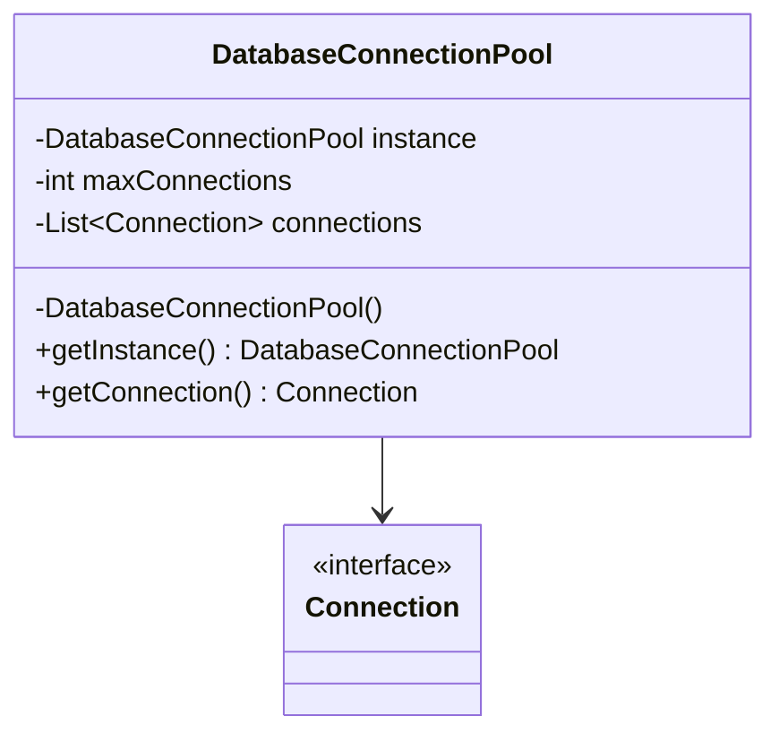
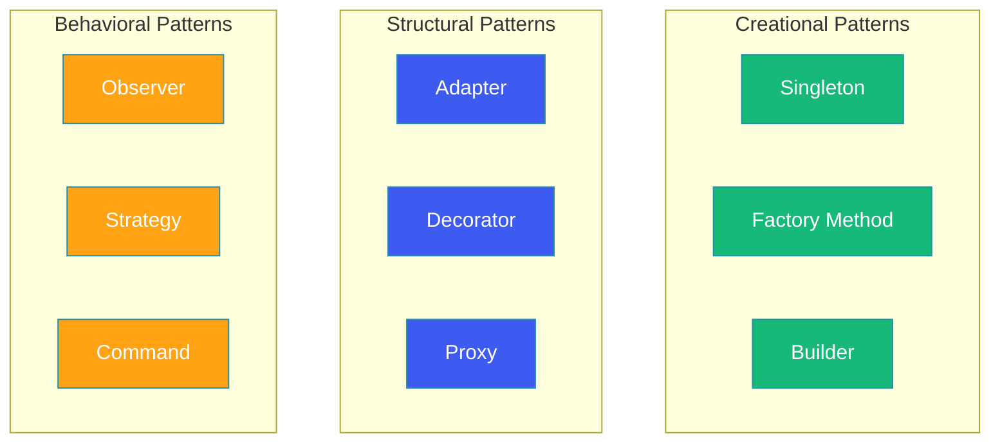

# GoF Design Patterns

## Overview

Design patterns are reusable solutions to commonly occurring problems in software design. The Gang of Four (GoF) catalog, introduced in 1994 by Erich Gamma, Richard Helm, Ralph Johnson, and John Vlissides, describes 23 patterns organized into three categories: Creational, Structural, and Behavioral. Mastering these patterns enables developers to communicate design intent efficiently, build maintainable systems, and avoid reinventing solutions.

This blog covers nine essential GoF patterns with practical Java examples and UML diagrams.

---

## Problem Statement

Developers frequently encounter recurring design problems:

- How do we ensure a class has only one instance?
- How do we create complex objects step by step?
- How do we make incompatible interfaces work together?
- How do we define a one-to-many dependency between objects?
- How do we encapsulate a request as an object?

Design patterns provide battle-tested solutions to these problems, backed by decades of industry experience.

---

## Creational Patterns

Creational patterns deal with object creation mechanisms, making the system independent of how objects are created, composed, and represented.

### Singleton Pattern

Ensures a class has only one instance and provides a global point of access to it.



```java
public class DatabaseConnectionPool {

    private static volatile DatabaseConnectionPool instance;
    private final List<Connection> connections = new ArrayList<>();
    private final int maxConnections = 10;

    private DatabaseConnectionPool() {
        for (int i = 0; i < maxConnections; i++) {
            connections.add(createConnection());
        }
    }

    public static DatabaseConnectionPool getInstance() {
        if (instance == null) {
            synchronized (DatabaseConnectionPool.class) {
                if (instance == null) {
                    instance = new DatabaseConnectionPool();
                }
            }
        }
        return instance;
    }

    public Connection getConnection() {
        if (connections.isEmpty()) {
            throw new RuntimeException("No available connections");
        }
        return connections.remove(0);
    }

    public void releaseConnection(Connection connection) {
        connections.add(connection);
    }

    private Connection createConnection() {
        return DriverManager.getConnection("jdbc:mysql://localhost:3306/mydb");
    }
}
```

### Factory Method Pattern

Defines an interface for creating an object but lets subclasses decide which class to instantiate.

```java
public interface Notification {
    void send(String message);
}

public class EmailNotification implements Notification {
    @Override
    public void send(String message) {
        System.out.println("Sending email: " + message);
    }
}

public class SMSNotification implements Notification {
    @Override
    public void send(String message) {
        System.out.println("Sending SMS: " + message);
    }
}

public abstract class NotificationFactory {
    public abstract Notification createNotification();

    public void notify(String message) {
        Notification notification = createNotification();
        notification.send(message);
    }
}

public class EmailNotificationFactory extends NotificationFactory {
    @Override
    public Notification createNotification() {
        return new EmailNotification();
    }
}

public class SMSNotificationFactory extends NotificationFactory {
    @Override
    public Notification createNotification() {
        return new SMSNotification();
    }
}
```

### Builder Pattern

Separates the construction of a complex object from its representation so the same construction process can create different representations.

```java
public class Pizza {
    private String dough;
    private String sauce;
    private List<String> toppings;
    private boolean cheeseExtra;
    private boolean stuffedCrust;

    private Pizza(PizzaBuilder builder) {
        this.dough = builder.dough;
        this.sauce = builder.sauce;
        this.toppings = builder.toppings;
        this.cheeseExtra = builder.cheeseExtra;
        this.stuffedCrust = builder.stuffedCrust;
    }

    public static class PizzaBuilder {
        private String dough;
        private String sauce;
        private List<String> toppings = new ArrayList<>();
        private boolean cheeseExtra;
        private boolean stuffedCrust;

        public PizzaBuilder(String dough, String sauce) {
            this.dough = dough;
            this.sauce = sauce;
        }

        public PizzaBuilder addTopping(String topping) {
            this.toppings.add(topping);
            return this;
        }

        public PizzaBuilder extraCheese() {
            this.cheeseExtra = true;
            return this;
        }

        public PizzaBuilder stuffedCrust() {
            this.stuffedCrust = true;
            return this;
        }

        public Pizza build() {
            return new Pizza(this);
        }
    }
}

// Usage
Pizza pizza = new Pizza.PizzaBuilder("Thin", "Tomato")
    .addTopping("Mushrooms")
    .addTopping("Pepperoni")
    .extraCheese()
    .stuffedCrust()
    .build();
```

---

## Structural Patterns

Structural patterns deal with the composition of classes and objects to form larger structures.

### Adapter Pattern

Allows incompatible interfaces to work together by converting the interface of one class into another expected by the client.


```java
// Target Interface
public interface MediaPlayer {
    void play(String audioType, String fileName);
}

// Adaptee
public class AdvancedMediaPlayer {
    public void playMp4(String fileName) {
        System.out.println("Playing MP4: " + fileName);
    }

    public void playVlc(String fileName) {
        System.out.println("Playing VLC: " + fileName);
    }
}

// Adapter
public class MediaAdapter implements MediaPlayer {
    private AdvancedMediaPlayer advancedPlayer;

    public MediaAdapter() {
        this.advancedPlayer = new AdvancedMediaPlayer();
    }

    @Override
    public void play(String audioType, String fileName) {
        switch (audioType.toLowerCase()) {
            case "mp4":
                advancedPlayer.playMp4(fileName);
                break;
            case "vlc":
                advancedPlayer.playVlc(fileName);
                break;
            default:
                throw new IllegalArgumentException("Unsupported format: " + audioType);
        }
    }
}

// Usage
public class AudioPlayer implements MediaPlayer {
    private MediaAdapter mediaAdapter;

    @Override
    public void play(String audioType, String fileName) {
        if (audioType.equalsIgnoreCase("mp3")) {
            System.out.println("Playing MP3: " + fileName);
        } else {
            mediaAdapter = new MediaAdapter();
            mediaAdapter.play(audioType, fileName);
        }
    }
}
```

### Decorator Pattern

Attaches additional responsibilities to an object dynamically. Provides a flexible alternative to subclassing for extending functionality.

```java
public interface Coffee {
    double getCost();
    String getDescription();
}

public class SimpleCoffee implements Coffee {
    @Override
    public double getCost() {
        return 2.0;
    }

    @Override
    public String getDescription() {
        return "Simple coffee";
    }
}

public abstract class CoffeeDecorator implements Coffee {
    protected Coffee decoratedCoffee;

    public CoffeeDecorator(Coffee coffee) {
        this.decoratedCoffee = coffee;
    }

    @Override
    public double getCost() {
        return decoratedCoffee.getCost();
    }

    @Override
    public String getDescription() {
        return decoratedCoffee.getDescription();
    }
}

public class MilkDecorator extends CoffeeDecorator {
    public MilkDecorator(Coffee coffee) {
        super(coffee);
    }

    @Override
    public double getCost() {
        return super.getCost() + 0.5;
    }

    @Override
    public String getDescription() {
        return super.getDescription() + ", milk";
    }
}

public class SugarDecorator extends CoffeeDecorator {
    public SugarDecorator(Coffee coffee) {
        super(coffee);
    }

    @Override
    public double getCost() {
        return super.getCost() + 0.25;
    }

    @Override
    public String getDescription() {
        return super.getDescription() + ", sugar";
    }
}

// Usage
Coffee coffee = new SugarDecorator(new MilkDecorator(new SimpleCoffee()));
System.out.println(coffee.getDescription() + " costs $" + coffee.getCost());
// Simple coffee, milk, sugar costs $2.75
```

### Proxy Pattern

Provides a surrogate or placeholder for another object to control access to it.

```java
public interface Image {
    void display();
}

public class RealImage implements Image {
    private String fileName;

    public RealImage(String fileName) {
        this.fileName = fileName;
        loadFromDisk();
    }

    private void loadFromDisk() {
        System.out.println("Loading: " + fileName);
    }

    @Override
    public void display() {
        System.out.println("Displaying: " + fileName);
    }
}

public class ImageProxy implements Image {
    private RealImage realImage;
    private String fileName;

    public ImageProxy(String fileName) {
        this.fileName = fileName;
    }

    @Override
    public void display() {
        if (realImage == null) {
            realImage = new RealImage(fileName);
        }
        realImage.display();
    }
}
```

---

## Behavioral Patterns

Behavioral patterns deal with algorithms and the assignment of responsibilities between objects.

### Observer Pattern

Defines a one-to-many dependency between objects so that when one object changes state, all its dependents are notified and updated automatically.

```java
public interface Observer {
    void update(String stockSymbol, double price);
}

public interface StockMarket {
    void register(Observer observer);
    void unregister(Observer observer);
    void notifyObservers();
}

public class StockExchange implements StockMarket {
    private Map<String, Double> stockPrices = new HashMap<>();
    private List<Observer> observers = new ArrayList<>();

    public void setStockPrice(String symbol, double price) {
        stockPrices.put(symbol, price);
        notifyObservers();
    }

    @Override
    public void register(Observer observer) {
        observers.add(observer);
    }

    @Override
    public void unregister(Observer observer) {
        observers.remove(observer);
    }

    @Override
    public void notifyObservers() {
        for (Map.Entry<String, Double> entry : stockPrices.entrySet()) {
            for (Observer observer : observers) {
                observer.update(entry.getKey(), entry.getValue());
            }
        }
    }
}

public class Trader implements Observer {
    private String name;

    public Trader(String name) {
        this.name = name;
    }

    @Override
    public void update(String stockSymbol, double price) {
        System.out.println(name + " notified: " + stockSymbol + " is now $" + price);
    }
}
```

### Strategy Pattern

Defines a family of algorithms, encapsulates each one, and makes them interchangeable. Strategy lets the algorithm vary independently from clients that use it.

```java
public interface PaymentStrategy {
    void pay(double amount);
}

public class CreditCardPayment implements PaymentStrategy {
    private String cardNumber;

    public CreditCardPayment(String cardNumber) {
        this.cardNumber = cardNumber;
    }

    @Override
    public void pay(double amount) {
        System.out.println("Paid $" + amount + " with credit card " + cardNumber);
    }
}

public class PayPalPayment implements PaymentStrategy {
    private String email;

    public PayPalPayment(String email) {
        this.email = email;
    }

    @Override
    public void pay(double amount) {
        System.out.println("Paid $" + amount + " via PayPal account " + email);
    }
}

public class CryptoPayment implements PaymentStrategy {
    private String walletAddress;

    public CryptoPayment(String walletAddress) {
        this.walletAddress = walletAddress;
    }

    @Override
    public void pay(double amount) {
        System.out.println("Paid $" + amount + " in crypto to " + walletAddress);
    }
}

public class ShoppingCart {
    private List<Item> items = new ArrayList<>();
    private PaymentStrategy paymentStrategy;

    public void setPaymentStrategy(PaymentStrategy strategy) {
        this.paymentStrategy = strategy;
    }

    public void addItem(Item item) {
        items.add(item);
    }

    public void checkout() {
        double total = items.stream().mapToDouble(Item::getPrice).sum();
        paymentStrategy.pay(total);
    }
}
```

### Command Pattern

Encapsulates a request as an object, thereby allowing parameterization of clients with different requests, queuing, logging, and undoable operations.

```java
public interface Command {
    void execute();
    void undo();
}

public class TextEditor {
    private StringBuilder content = new StringBuilder();

    public void write(String text) {
        content.append(text);
    }

    public void delete(int length) {
        int start = content.length() - length;
        if (start >= 0) {
            content.delete(start, content.length());
        }
    }

    public String getContent() {
        return content.toString();
    }
}

public class WriteCommand implements Command {
    private TextEditor editor;
    private String text;

    public WriteCommand(TextEditor editor, String text) {
        this.editor = editor;
        this.text = text;
    }

    @Override
    public void execute() {
        editor.write(text);
    }

    @Override
    public void undo() {
        editor.delete(text.length());
    }
}

public class CommandHistory {
    private Stack<Command> history = new Stack<>();

    public void executeCommand(Command command) {
        command.execute();
        history.push(command);
    }

    public void undo() {
        if (!history.isEmpty()) {
            Command command = history.pop();
            command.undo();
        }
    }
}

// Usage
TextEditor editor = new TextEditor();
CommandHistory history = new CommandHistory();
history.executeCommand(new WriteCommand(editor, "Hello "));
history.executeCommand(new WriteCommand(editor, "World!"));
System.out.println(editor.getContent()); // Hello World!
history.undo();
System.out.println(editor.getContent()); // Hello
```

---

## Patterns Relationship Diagram



---

## Best Practices

- Use patterns as vocabulary, not recipes—adapt them to your specific context
- Prefer composition over inheritance when choosing between patterns
- Combine patterns when appropriate (e.g., Factory + Strategy)
- Avoid premature pattern application; let the design emerge from requirements
- Document why a pattern was chosen, not just which pattern was used
- Keep pattern implementations simple; over-engineering defeats the purpose
- Use dependency injection frameworks with Factory patterns for better testability

---

## Common Mistakes

- Applying patterns where simpler solutions suffice (pattern-for-pattern's-sake)
- Overcomplicating Singleton with reflection-safe, serialization-safe, enum-based implementations when a simple static field is sufficient
- Creating deep Decorator chains that make debugging difficult
- Using inheritance instead of Strategy when behaviors vary independently
- Implementing Observer pattern without considering memory leaks from unregistered listeners
- Making Command objects stateful when they should be immutable
- Building Adapters that violate the Liskov Substitution Principle

---

## Summary

GoF design patterns provide proven solutions to recurring software design problems. Creational patterns (Singleton, Factory, Builder) manage object creation flexibly. Structural patterns (Adapter, Decorator, Proxy) compose classes and objects into larger structures. Behavioral patterns (Observer, Strategy, Command) define how objects interact and distribute responsibilities. Mastering these patterns enables developers to design systems that are maintainable, extensible, and resilient to change.

---

## References

- [GoF - Design Patterns: Elements of Reusable Object-Oriented Software](https://en.wikipedia.org/wiki/Design_Patterns)
- [Refactoring Guru - Design Patterns](https://refactoring.guru/design-patterns)
- [Baeldung - Design Patterns Series](https://www.baeldung.com/design-patterns-series)
- [SourceMaking - Design Patterns](https://sourcemaking.com/design_patterns)
- [Java Design Patterns GitHub](https://github.com/iluwatar/java-design-patterns)
