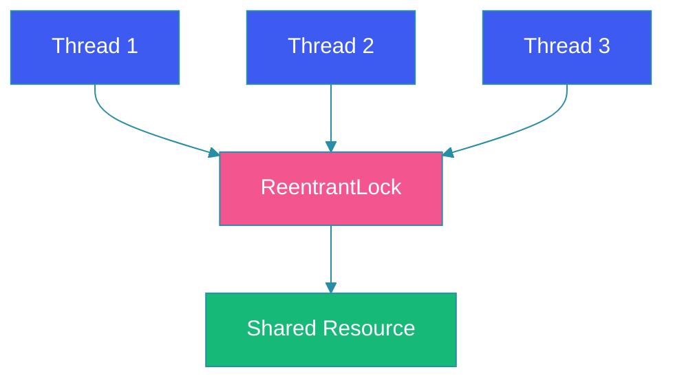
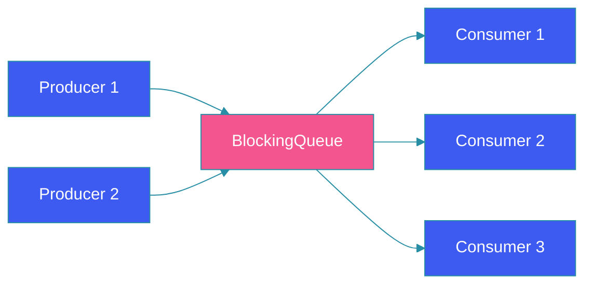
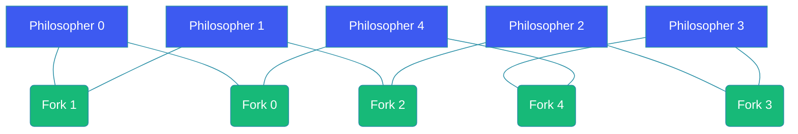

# Concurrency Patterns in Java

## Overview

Concurrency is the ability of a system to execute multiple tasks simultaneously, making efficient use of modern multi-core processors. Java provides a rich set of concurrency primitives including threads, locks, semaphores, and concurrent collections. However, writing correct concurrent code is notoriously difficult due to race conditions, deadlocks, and memory consistency issues.

This blog covers essential concurrency patterns with practical Java examples, demonstrating how to build thread-safe, scalable, and deadlock-free concurrent applications.

---

## Problem Statement

Modern applications face several concurrency challenges:

- **Race Conditions**: Multiple threads access shared data without proper synchronization, leading to inconsistent results
- **Deadlocks**: Threads wait indefinitely for resources held by each other
- **Starvation**: Threads are perpetually denied access to resources
- **Livelock**: Threads are active but cannot make progress
- **Memory Consistency**: Threads see stale or inconsistent views of shared memory

Understanding concurrency patterns is essential for building reliable multi-threaded systems.

---

## Thread Safety

Thread safety ensures that shared data is accessed correctly when multiple threads execute simultaneously. The primary mechanisms are synchronization, volatile variables, and atomic classes.

```java
public class Counter {
    private int count = 0;

    public synchronized void increment() {
        count++;
    }

    public synchronized int getCount() {
        return count;
    }
}

// Better: Using AtomicInteger
public class AtomicCounter {
    private final AtomicInteger count = new AtomicInteger(0);

    public void increment() {
        count.incrementAndGet();
    }

    public int getCount() {
        return count.get();
    }
}

// Thread-safe collection example
public class ThreadSafeCache {
    private final ConcurrentMap<String, Object> cache = new ConcurrentHashMap<>();

    public Object get(String key) {
        return cache.computeIfAbsent(key, this::loadFromDatabase);
    }

    private Object loadFromDatabase(String key) {
        // Expensive database lookup
        return new Object();
    }
}
```

---

## Locks and Explicit Synchronization

Java's `Lock` interface provides more flexible locking than synchronized blocks, supporting try-lock, timed lock, and interruptible lock acquisition.



```java
public class BankAccount {
    private final Lock lock = new ReentrantLock();
    private double balance;

    public BankAccount(double balance) {
        this.balance = balance;
    }

    public void transfer(BankAccount to, double amount) throws InterruptedException {
        // Try to acquire both locks with timeout to avoid deadlock
        if (lock.tryLock(100, TimeUnit.MILLISECONDS)) {
            try {
                if (to.lock.tryLock(100, TimeUnit.MILLISECONDS)) {
                    try {
                        if (amount <= balance) {
                            this.balance -= amount;
                            to.balance += amount;
                            System.out.println("Transferred " + amount);
                        }
                    } finally {
                        to.lock.unlock();
                    }
                } else {
                    System.out.println("Could not acquire target account lock");
                }
            } finally {
                lock.unlock();
            }
        } else {
            System.out.println("Could not acquire source account lock");
        }
    }

    // Using ReadWriteLock for better performance
    private final ReadWriteLock rwLock = new ReentrantReadWriteLock();

    public double getBalance() {
        rwLock.readLock().lock();
        try {
            return balance;
        } finally {
            rwLock.readLock().unlock();
        }
    }

    public void deposit(double amount) {
        rwLock.writeLock().lock();
        try {
            balance += amount;
        } finally {
            rwLock.writeLock().unlock();
        }
    }
}
```

---

## Semaphores

Semaphores control access to a limited number of resources. They are useful for implementing resource pools and throttling.

```java
public class ConnectionPool {
    private final Semaphore semaphore;
    private final List<Connection> connections;

    public ConnectionPool(int poolSize) {
        this.semaphore = new Semaphore(poolSize);
        this.connections = new ArrayList<>();
        for (int i = 0; i < poolSize; i++) {
            connections.add(createConnection());
        }
    }

    public Connection acquire() throws InterruptedException {
        semaphore.acquire();
        return getConnection();
    }

    public void release(Connection connection) {
        returnConnection(connection);
        semaphore.release();
    }

    private synchronized Connection getConnection() {
        return connections.remove(0);
    }

    private synchronized void returnConnection(Connection connection) {
        connections.add(connection);
    }

    private Connection createConnection() {
        return DriverManager.getConnection("jdbc:mysql://localhost:3306/mydb");
    }
}
```

---

## Producer-Consumer Pattern

The producer-consumer pattern decouples data production from consumption using a shared blocking queue. Producers generate data and add it to the queue; consumers retrieve and process it.



```java
public class ProducerConsumerExample {

    private static final BlockingQueue<Task> queue = new LinkedBlockingQueue<>(100);

    static class Producer implements Runnable {
        private final String name;
        private final AtomicInteger taskId = new AtomicInteger(0);

        public Producer(String name) {
            this.name = name;
        }

        @Override
        public void run() {
            try {
                while (!Thread.currentThread().isInterrupted()) {
                    Task task = new Task(taskId.incrementAndGet(), "Task from " + name);
                    queue.put(task);  // Blocks if queue is full
                    System.out.println(name + " produced: " + task);
                    Thread.sleep(ThreadLocalRandom.current().nextInt(100, 500));
                }
            } catch (InterruptedException e) {
                Thread.currentThread().interrupt();
            }
        }
    }

    static class Consumer implements Runnable {
        private final String name;

        public Consumer(String name) {
            this.name = name;
        }

        @Override
        public void run() {
            try {
                while (!Thread.currentThread().isInterrupted()) {
                    Task task = queue.take();  // Blocks if queue is empty
                    System.out.println(name + " consumed: " + task);
                    processTask(task);
                }
            } catch (InterruptedException e) {
                Thread.currentThread().interrupt();
            }
        }

        private void processTask(Task task) {
            // Simulate task processing
            System.out.println(name + " processing " + task.id());
        }
    }

    record Task(int id, String description) {}

    public static void main(String[] args) {
        ExecutorService producers = Executors.newFixedThreadPool(2);
        ExecutorService consumers = Executors.newFixedThreadPool(3);

        producers.submit(new Producer("Producer-1"));
        producers.submit(new Producer("Producer-2"));
        consumers.submit(new Consumer("Consumer-1"));
        consumers.submit(new Consumer("Consumer-2"));
        consumers.submit(new Consumer("Consumer-3"));
    }
}
```

---

## Reader-Writer Pattern

The reader-writer pattern allows multiple readers to access shared data simultaneously while ensuring exclusive access for writers. This improves performance in read-heavy workloads.

```java
public class ReadWriteDataStore<K, V> {
    private final ReadWriteLock lock = new ReentrantReadWriteLock();
    private final Map<K, V> data = new HashMap<>();

    public V read(K key) {
        lock.readLock().lock();
        try {
            System.out.println(Thread.currentThread().getName() + " reading " + key);
            Thread.sleep(100); // Simulate read time
            return data.get(key);
        } catch (InterruptedException e) {
            Thread.currentThread().interrupt();
            return null;
        } finally {
            lock.readLock().unlock();
        }
    }

    public void write(K key, V value) {
        lock.writeLock().lock();
        try {
            System.out.println(Thread.currentThread().getName() + " writing " + key);
            Thread.sleep(200); // Simulate write time
            data.put(key, value);
        } catch (InterruptedException e) {
            Thread.currentThread().interrupt();
        } finally {
            lock.writeLock().unlock();
        }
    }

    // Usage with multiple readers and occasional writers
    public void demonstrate() {
        ExecutorService readers = Executors.newFixedThreadPool(5);
        ExecutorService writers = Executors.newSingleThreadExecutor();

        // Multiple readers can read concurrently
        for (int i = 0; i < 5; i++) {
            int key = i;
            readers.submit(() -> read("key-" + key));
        }

        // Writer gets exclusive access
        writers.submit(() -> write("key-1", "new-value"));

        readers.shutdown();
        writers.shutdown();
    }
}
```

---

## Dining Philosophers Problem

The dining philosophers problem illustrates synchronization challenges in concurrent systems. Five philosophers sit at a table with five forks. Each philosopher needs both forks to eat. Without careful design, this can lead to deadlock.



```java
public class DiningPhilosophers {

    static class Philosopher implements Runnable {
        private final int id;
        private final Object leftFork;
        private final Object rightFork;

        public Philosopher(int id, Object leftFork, Object rightFork) {
            this.id = id;
            this.leftFork = leftFork;
            this.rightFork = rightFork;
        }

        private void think() throws InterruptedException {
            System.out.println("Philosopher " + id + " is thinking");
            Thread.sleep(ThreadLocalRandom.current().nextInt(100, 500));
        }

        private void eat() throws InterruptedException {
            System.out.println("Philosopher " + id + " is eating");
            Thread.sleep(ThreadLocalRandom.current().nextInt(100, 300));
        }

        @Override
        public void run() {
            try {
                while (!Thread.currentThread().isInterrupted()) {
                    think();

                    // Deadlock-free solution: acquire forks in order
                    // Lower-numbered fork first, then higher-numbered
                    Object first = id < (id + 1) % 5 ? leftFork : rightFork;
                    Object second = id < (id + 1) % 5 ? rightFork : leftFork;

                    synchronized (first) {
                        System.out.println("Philosopher " + id + " picked up first fork");
                        synchronized (second) {
                            System.out.println("Philosopher " + id + " picked up second fork");
                            eat();
                        }
                        System.out.println("Philosopher " + id + " put down second fork");
                    }
                    System.out.println("Philosopher " + id + " put down first fork");
                }
            } catch (InterruptedException e) {
                Thread.currentThread().interrupt();
            }
        }
    }

    public static void main(String[] args) {
        int numPhilosophers = 5;
        Object[] forks = new Object[numPhilosophers];
        for (int i = 0; i < numPhilosophers; i++) {
            forks[i] = new Object();
        }

        ExecutorService executor = Executors.newFixedThreadPool(numPhilosophers);
        for (int i = 0; i < numPhilosophers; i++) {
            executor.submit(new Philosopher(i, forks[i], forks[(i + 1) % numPhilosophers]));
        }
    }
}
```

---

## Best Practices

- Prefer higher-level concurrency utilities (Executors, ConcurrentHashMap) over manual thread management
- Use immutable objects wherever possible to eliminate synchronization needs
- Keep synchronized blocks as small as possible to minimize contention
- Acquire locks in a consistent global order to prevent deadlocks
- Use `tryLock` with timeouts instead of indefinite lock acquisition
- Prefer `CopyOnWriteArrayList` for read-heavy, write-rare scenarios
- Use `CompletableFuture` for composing asynchronous operations
- Always interrupt and clean up threads properly in shutdown hooks

---

## Common Mistakes

- Synchronizing on mutable fields instead of dedicated lock objects
- Forgetting to release locks in finally blocks
- Using `notify()` instead of `notifyAll()`, causing lost wakeups
- Calling `Thread.stop()`, `suspend()`, or `resume()` (deprecated and unsafe)
- Creating thread pools without proper sizing (too many or too few threads)
- Ignoring thread interruption status in long-running loops
- Using `volatile` on compound operations (read-modify-write) thinking it provides atomicity
- Double-checked locking without proper volatile declaration on the field
- Deadlocks from nested synchronized blocks with inconsistent ordering

---

## Summary

Concurrency patterns are essential for building correct and efficient multi-threaded Java applications. Thread safety through synchronization and atomic classes provides the foundation. Locks and semaphores offer flexible resource management, while the producer-consumer pattern decouples work distribution. The reader-writer pattern optimizes read-heavy workloads, and careful design in problems like the dining philosophers prevents deadlocks. By applying these patterns correctly, developers can harness the full power of modern multi-core processors while avoiding the pitfalls of concurrent programming.

---

## References

- [Java Concurrency in Practice - Brian Goetz](https://jcip.net/)
- [Java Documentation - Concurrency Utilities](https://docs.oracle.com/javase/tutorial/essential/concurrency/)
- [Baeldung - Java Concurrency](https://www.baeldung.com/java-concurrency)
- [Oracle - The Dining Philosophers Problem](https://docs.oracle.com/javase/tutorial/essential/concurrency/guardmeth.html)
- [Doug Lea - Concurrent Programming in Java](https://gee.cs.oswego.edu/dl/cpj/)
