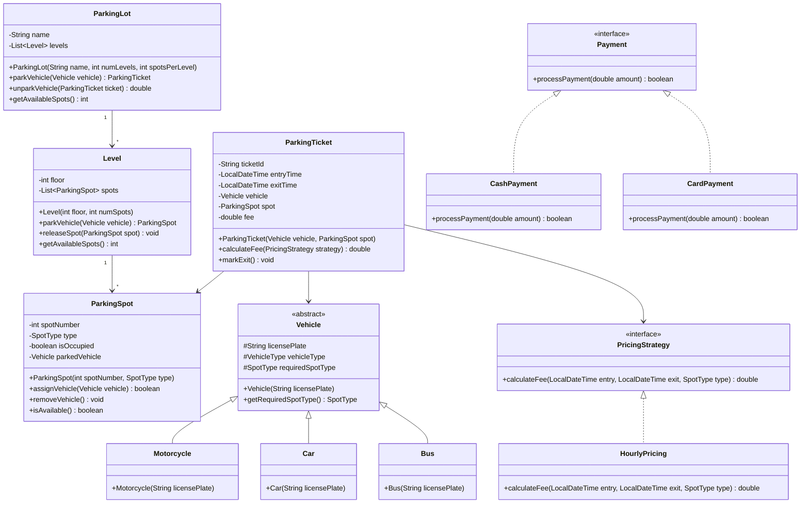

# Parking Lot System - LLD

## Overview

A parking lot system manages vehicle entry, parking spot allocation, fee calculation, and exit processing. The system must handle different vehicle types, multiple parking levels, various spot sizes, and different payment methods. Designing this system with clean OOP principles demonstrates encapsulation, inheritance, polymorphism, and composition in practice.

This blog presents a complete low-level design of a parking lot system with Java implementation and UML class diagrams.

---

## Problem Statement

Design a parking lot system that handles:

- Multiple parking levels with configurable spots per level
- Different vehicle types: motorcycle, car, bus/truck (each requiring different spot sizes)
- Spot allocation based on vehicle size and availability
- Entry and exit gate processing with ticket generation
- Hourly fee calculation with different rates for different spot types
- Payment processing (cash, card, digital wallets)

---

## Class Diagram



---

## Implementation

### Enums and Value Objects

```java
public enum VehicleType {
    MOTORCYCLE, CAR, BUS
}

public enum SpotType {
    MOTORCYCLE(1), COMPACT(2), LARGE(4);

    private final int size;

    SpotType(int size) { this.size = size; }
    public int getSize() { return size; }
}

public enum PaymentStatus {
    PENDING, COMPLETED, FAILED, REFUNDED
}
```

### Vehicle Hierarchy

```java
public abstract class Vehicle {
    protected final String licensePlate;
    protected final VehicleType vehicleType;
    protected final SpotType requiredSpotType;

    public Vehicle(String licensePlate, VehicleType type, SpotType spotType) {
        this.licensePlate = licensePlate;
        this.vehicleType = type;
        this.requiredSpotType = spotType;
    }

    public String getLicensePlate() { return licensePlate; }
    public VehicleType getVehicleType() { return vehicleType; }
    public SpotType getRequiredSpotType() { return requiredSpotType; }
}

public class Motorcycle extends Vehicle {
    public Motorcycle(String licensePlate) {
        super(licensePlate, VehicleType.MOTORCYCLE, SpotType.MOTORCYCLE);
    }
}

public class Car extends Vehicle {
    public Car(String licensePlate) {
        super(licensePlate, VehicleType.CAR, SpotType.COMPACT);
    }
}

public class Bus extends Vehicle {
    public Bus(String licensePlate) {
        super(licensePlate, VehicleType.BUS, SpotType.LARGE);
    }
}
```

### Parking Spot

```java
public class ParkingSpot {
    private final int spotNumber;
    private final SpotType type;
    private boolean isOccupied;
    private Vehicle parkedVehicle;

    public ParkingSpot(int spotNumber, SpotType type) {
        this.spotNumber = spotNumber;
        this.type = type;
        this.isOccupied = false;
    }

    public synchronized boolean assignVehicle(Vehicle vehicle) {
        if (isOccupied || !canFitVehicle(vehicle)) {
            return false;
        }
        this.parkedVehicle = vehicle;
        this.isOccupied = true;
        return true;
    }

    public synchronized Vehicle removeVehicle() {
        Vehicle vehicle = this.parkedVehicle;
        this.parkedVehicle = null;
        this.isOccupied = false;
        return vehicle;
    }

    private boolean canFitVehicle(Vehicle vehicle) {
        return vehicle.getRequiredSpotType().getSize() <= type.getSize();
    }

    public boolean isAvailable() { return !isOccupied; }
    public int getSpotNumber() { return spotNumber; }
    public SpotType getType() { return type; }
}
```

### Level

```java
public class Level {
    private final int floor;
    private final List<ParkingSpot> spots;

    public Level(int floor, int numSpots) {
        this.floor = floor;
        this.spots = new ArrayList<>();
        // Allocate spot types: 20% motorcycle, 50% compact, 30% large
        int motorcycleSpots = (int) (numSpots * 0.2);
        int compactSpots = (int) (numSpots * 0.5);

        for (int i = 1; i <= numSpots; i++) {
            SpotType type;
            if (i <= motorcycleSpots) {
                type = SpotType.MOTORCYCLE;
            } else if (i <= motorcycleSpots + compactSpots) {
                type = SpotType.COMPACT;
            } else {
                type = SpotType.LARGE;
            }
            spots.add(new ParkingSpot(i, type));
        }
    }

    public synchronized ParkingSpot parkVehicle(Vehicle vehicle) {
        for (ParkingSpot spot : spots) {
            if (spot.isAvailable() && spot.assignVehicle(vehicle)) {
                return spot;
            }
        }
        return null;
    }

    public synchronized void releaseSpot(ParkingSpot spot) {
        spot.removeVehicle();
    }

    public int getAvailableSpots() {
        return (int) spots.stream().filter(ParkingSpot::isAvailable).count();
    }
}
```

### Pricing Strategy

```java
public interface PricingStrategy {
    double calculateFee(LocalDateTime entryTime, LocalDateTime exitTime, SpotType spotType);
}

public class HourlyPricing implements PricingStrategy {
    private static final Map<SpotType, Double> RATES = Map.of(
        SpotType.MOTORCYCLE, 10.0,
        SpotType.COMPACT, 20.0,
        SpotType.LARGE, 40.0
    );

    @Override
    public double calculateFee(LocalDateTime entry, LocalDateTime exit, SpotType spotType) {
        long hours = Duration.between(entry, exit).toHours();
        if (hours == 0) hours = 1; // Minimum 1 hour charge
        return hours * RATES.getOrDefault(spotType, 20.0);
    }
}
```

### Parking Ticket

```java
public class ParkingTicket {
    private static final AtomicInteger idCounter = new AtomicInteger(0);

    private final String ticketId;
    private final LocalDateTime entryTime;
    private LocalDateTime exitTime;
    private final Vehicle vehicle;
    private final ParkingSpot spot;
    private double fee;
    private PaymentStatus paymentStatus;

    public ParkingTicket(Vehicle vehicle, ParkingSpot spot) {
        this.ticketId = "TICKET-" + idCounter.incrementAndGet();
        this.entryTime = LocalDateTime.now();
        this.vehicle = vehicle;
        this.spot = spot;
        this.paymentStatus = PaymentStatus.PENDING;
    }

    public double calculateFee(PricingStrategy strategy) {
        this.exitTime = LocalDateTime.now();
        this.fee = strategy.calculateFee(entryTime, exitTime, spot.getType());
        return fee;
    }

    public void markPaid() {
        this.paymentStatus = PaymentStatus.COMPLETED;
    }

    public String getTicketId() { return ticketId; }
    public LocalDateTime getEntryTime() { return entryTime; }
    public Vehicle getVehicle() { return vehicle; }
    public ParkingSpot getSpot() { return spot; }
    public PaymentStatus getPaymentStatus() { return paymentStatus; }
}
```

### Parking Lot - Main Controller

```java
public class ParkingLot {
    private final String name;
    private final List<Level> levels;
    private final PricingStrategy pricingStrategy;
    private final Map<String, ParkingTicket> activeTickets = new ConcurrentHashMap<>();

    public ParkingLot(String name, int numLevels, int spotsPerLevel) {
        this.name = name;
        this.levels = new ArrayList<>();
        this.pricingStrategy = new HourlyPricing();
        for (int i = 1; i <= numLevels; i++) {
            levels.add(new Level(i, spotsPerLevel));
        }
    }

    public ParkingTicket parkVehicle(Vehicle vehicle) {
        for (Level level : levels) {
            ParkingSpot spot = level.parkVehicle(vehicle);
            if (spot != null) {
                ParkingTicket ticket = new ParkingTicket(vehicle, spot);
                activeTickets.put(ticket.getTicketId(), ticket);
                System.out.println("Vehicle " + vehicle.getLicensePlate()
                    + " parked at Level " + level.getFloor()
                    + ", Spot " + spot.getSpotNumber());
                return ticket;
            }
        }
        throw new RuntimeException("No available spot for " + vehicle.getVehicleType());
    }

    public double unparkVehicle(String ticketId) {
        ParkingTicket ticket = activeTickets.get(ticketId);
        if (ticket == null) {
            throw new RuntimeException("Invalid ticket: " + ticketId);
        }

        double fee = ticket.calculateFee(pricingStrategy);
        ticket.markPaid();

        Level level = findLevel(ticket.getSpot());
        level.releaseSpot(ticket.getSpot());
        activeTickets.remove(ticketId);

        System.out.println("Vehicle " + ticket.getVehicle().getLicensePlate()
            + " unparked. Fee: $" + fee);
        return fee;
    }

    private Level findLevel(ParkingSpot spot) {
        return levels.stream()
            .filter(level -> level.getAvailableSpots() > 0)
            .findFirst()
            .orElseThrow(() -> new RuntimeException("Level not found"));
    }

    public int getAvailableSpots() {
        return levels.stream().mapToInt(Level::getAvailableSpots).sum();
    }
}
```

### Entry/Exit Gate Simulation

```java
public class EntryGate {
    private final ParkingLot parkingLot;

    public EntryGate(ParkingLot parkingLot) {
        this.parkingLot = parkingLot;
    }

    public ParkingTicket processEntry(Vehicle vehicle) {
        System.out.println("Processing entry for " + vehicle.getLicensePlate());
        return parkingLot.parkVehicle(vehicle);
    }
}

public class ExitGate {
    private final ParkingLot parkingLot;
    private final PaymentProcessor paymentProcessor;

    public ExitGate(ParkingLot parkingLot, PaymentProcessor paymentProcessor) {
        this.parkingLot = parkingLot;
        this.paymentProcessor = paymentProcessor;
    }

    public void processExit(String ticketId, Payment paymentMethod) {
        double fee = parkingLot.unparkVehicle(ticketId);
        boolean paid = paymentMethod.processPayment(fee);
        if (paid) {
            System.out.println("Payment successful. Gate opening...");
        } else {
            System.out.println("Payment failed. Please try again.");
        }
    }
}
```

---

## Best Practices

- Use enum types for spot size and vehicle type to make the system extensible
- Implement thread-safe spot allocation using synchronized methods
- Apply Strategy pattern for pricing to accommodate different rate structures
- Use dependency injection for payment processing to support multiple payment methods
- Keep the ParkingTicket immutable after creation to prevent tampering
- Use factory methods for creating different vehicle types

---

## Common Mistakes

- Not accounting for vehicles that require multiple spots (buses, trucks with trailers)
- Using sequential search for spot allocation without optimizing for proximity to exits
- Hard-coding pricing logic instead of using the Strategy pattern
- Ignoring edge cases like minimum charge, overnight parking, and lost tickets
- Not handling concurrent entry/exit requests at the same spot
- Forgetting to validate that a spot can physically fit the vehicle before assignment

---

## Summary

The parking lot design demonstrates key OOP principles: encapsulation (each class manages its own state), inheritance (Vehicle hierarchy), polymorphism (Payment interface), and composition (ParkingLot contains Levels which contain Spots). The Strategy pattern for pricing and the clear separation of concerns between entry/exit gates, ticket management, and payment processing results in a flexible, maintainable system that can be extended with new vehicle types, pricing models, or payment methods.

---

## References

- [Low Level Design - Parking Lot](https://github.com/tssovi/low-level-design)
- [Java Concurrency in Practice](https://jcip.net/)
- [Strategy Pattern - Refactoring Guru](https://refactoring.guru/design-patterns/strategy)
- [OOP Design Principles](https://www.baeldung.com/oop-design-principles)
