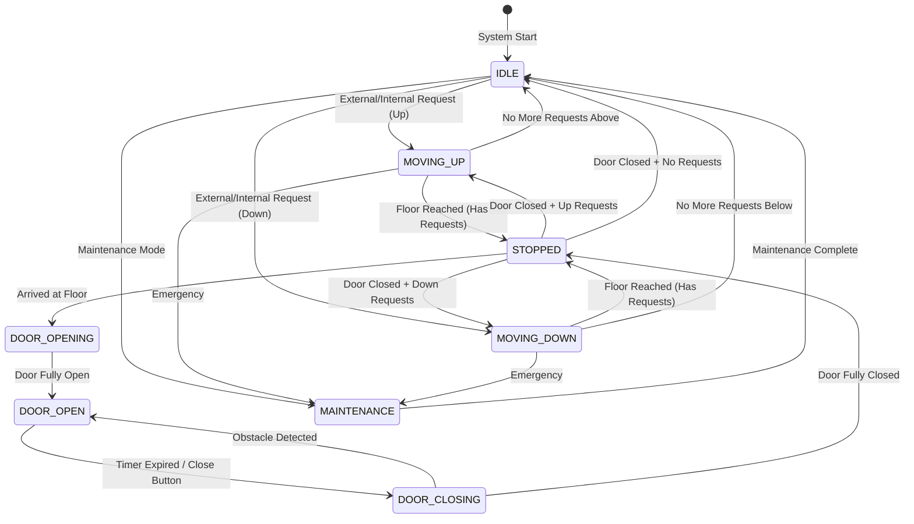

# Elevator System - LLD

## Overview

An elevator system manages the movement of multiple elevators across floors in a building, handling both internal (floor selection within the elevator) and external (call buttons on floors) requests efficiently. The core challenge lies in scheduling elevator movements to minimize waiting time, energy consumption, and passenger travel time.

This blog presents a complete low-level design of an elevator system with multiple scheduling algorithms, state management, and request handling.

---

## Problem Statement

Design an elevator system that handles:

- Multiple elevators operating simultaneously in a building
- Internal requests (passenger selects destination inside the elevator)
- External requests (passenger calls elevator from a floor)
- Different scheduling algorithms: FCFS, SCAN, LOOK
- Real-time status tracking (direction, current floor, door state)
- Emergency handling and maintenance mode
- Efficient dispatching to minimize wait times

---

## State Diagram



---

## Class Diagram

```mermaid
classDiagram
    class ElevatorController {
        -List~Elevator~ elevators
        -SchedulingStrategy strategy
        +ElevatorController(int numElevators, int numFloors)
        +requestElevator(int floor, Direction direction)
        +requestFloor(int elevatorId, int floor)
        +step() void
    }
    class Elevator {
        -int id
        -int currentFloor
        -Direction direction
        -DoorState doorState
        -Set~Integer~ internalRequests
        -Set~Integer~ externalRequests
        -ElevatorState state
        +Elevator(int id)
        +addInternalRequest(int floor) boolean
        +addExternalRequest(int floor, Direction dir) void
        +move() void
        +processNextStop() void
        +openDoors() void
        +closeDoors() void
    }
    class SchedulingStrategy {
        <<interface>>
        +getNextStop(Elevator elevator, Set~Integer~ requests) Integer
    }
    class FCFSStrategy {
        +getNextStop(Elevator elevator, Set~Integer~ requests) Integer
    }
    class SCANStrategy {
        -int numFloors
        +SCANStrategy(int numFloors)
        +getNextStop(Elevator elevator, Set~Integer~ requests) Integer
    }
    class LOOKStrategy {
        +getNextStop(Elevator elevator, Set~Integer~ requests) Integer
    }
    enum Direction {
        UP, DOWN, IDLE
    }
    enum DoorState {
        OPEN, CLOSED, OPENING, CLOSING
    }
    enum ElevatorState {
        MOVING, STOPPED, IDLE, MAINTENANCE
    }

    ElevatorController --> Elevator
    ElevatorController --> SchedulingStrategy
    SchedulingStrategy <|.. FCFSStrategy
    SchedulingStrategy <|.. SCANStrategy
    SchedulingStrategy <|.. LOOKStrategy
    Elevator --> Direction
    Elevator --> DoorState
    Elevator --> ElevatorState
```

---

## Implementation

### Enums

```java
public enum Direction {
    UP, DOWN, IDLE
}

public enum DoorState {
    OPEN, CLOSED, OPENING, CLOSING
}

public enum ElevatorState {
    IDLE, MOVING, STOPPED, MAINTENANCE
}
```

### Elevator Class

```java
public class Elevator {
    private final int id;
    private int currentFloor;
    private Direction direction;
    private DoorState doorState;
    private ElevatorState state;
    private final Set<Integer> internalRequests = new TreeSet<>();
    private final NavigableSet<Integer> upRequests = new TreeSet<>();
    private final NavigableSet<Integer> downRequests = new TreeSet<>(Collections.reverseOrder());

    public Elevator(int id) {
        this.id = id;
        this.currentFloor = 1;
        this.direction = Direction.IDLE;
        this.doorState = DoorState.CLOSED;
        this.state = ElevatorState.IDLE;
    }

    public synchronized void addInternalRequest(int floor) {
        internalRequests.add(floor);
        updateDirection();
    }

    public synchronized void addExternalRequest(int floor, Direction dir) {
        if (dir == Direction.UP) {
            upRequests.add(floor);
        } else if (dir == Direction.DOWN) {
            downRequests.add(floor);
        }
        updateDirection();
    }

    private void updateDirection() {
        if (hasRequests()) {
            if (direction == Direction.IDLE) {
                int next = getNextRequest();
                direction = (next > currentFloor) ? Direction.UP : Direction.DOWN;
            }
        }
    }

    private boolean hasRequests() {
        return !internalRequests.isEmpty() || !upRequests.isEmpty() || !downRequests.isEmpty();
    }

    private int getNextRequest() {
        // Get the closest request in current direction
        if (direction == Direction.UP || direction == Direction.IDLE) {
            Integer up = upRequests.ceiling(currentFloor);
            Integer down = downRequests.ceiling(currentFloor);
            Integer internal = ((TreeSet<Integer>) internalRequests).ceiling(currentFloor);
            int min = Integer.MAX_VALUE;
            if (up != null) min = Math.min(min, up);
            if (down != null) min = Math.min(min, down);
            if (internal != null) min = Math.min(min, internal);
            return min != Integer.MAX_VALUE ? min : getNearestRequest();
        } else {
            Integer up = upRequests.floor(currentFloor);
            Integer down = downRequests.floor(currentFloor);
            Integer internal = ((TreeSet<Integer>) internalRequests).floor(currentFloor);
            int max = Integer.MIN_VALUE;
            if (up != null) max = Math.max(max, up);
            if (down != null) max = Math.max(max, down);
            if (internal != null) max = Math.max(max, internal);
            return max != Integer.MIN_VALUE ? max : getNearestRequest();
        }
    }

    private int getNearestRequest() {
        int nearest = -1;
        int minDist = Integer.MAX_VALUE;
        for (int floor : getAllRequests()) {
            int dist = Math.abs(floor - currentFloor);
            if (dist < minDist) {
                minDist = dist;
                nearest = floor;
            }
        }
        return nearest;
    }

    private Set<Integer> getAllRequests() {
        Set<Integer> all = new HashSet<>();
        all.addAll(internalRequests);
        all.addAll(upRequests);
        all.addAll(downRequests);
        return all;
    }

    public synchronized void move() {
        if (state == ElevatorState.MAINTENANCE || doorState != DoorState.CLOSED) {
            return;
        }

        if (!hasRequests()) {
            state = ElevatorState.IDLE;
            direction = Direction.IDLE;
            return;
        }

        int nextStop = getNextRequest();
        if (nextStop == currentFloor) {
            processFloorStop(nextStop);
            return;
        }

        state = ElevatorState.MOVING;
        currentFloor += (direction == Direction.UP) ? 1 : -1;
        System.out.println("Elevator " + id + " at floor " + currentFloor);
    }

    private void processFloorStop(int floor) {
        state = ElevatorState.STOPPED;
        removeRequest(floor);
        openDoors();
        // Simulate passenger boarding/alighting
        closeDoors();
    }

    private void removeRequest(int floor) {
        internalRequests.remove(floor);
        upRequests.remove(floor);
        downRequests.remove(floor);
    }

    public synchronized void openDoors() {
        doorState = DoorState.OPENING;
        System.out.println("Elevator " + id + " opening doors at floor " + currentFloor);
        doorState = DoorState.OPEN;
    }

    public synchronized void closeDoors() {
        doorState = DoorState.CLOSING;
        System.out.println("Elevator " + id + " closing doors");
        doorState = DoorState.CLOSED;
    }

    public int getId() { return id; }
    public int getCurrentFloor() { return currentFloor; }
    public Direction getDirection() { return direction; }
    public ElevatorState getState() { return state; }
}
```

### Scheduling Strategies

```java
public interface SchedulingStrategy {
    int assignElevator(List<Elevator> elevators, int floor, Direction direction);
}

// FCFS: Assign to the nearest available elevator
public class FCFSStrategy implements SchedulingStrategy {
    @Override
    public int assignElevator(List<Elevator> elevators, int floor, Direction direction) {
        Elevator best = null;
        int minDistance = Integer.MAX_VALUE;

        for (Elevator elevator : elevators) {
            if (elevator.getState() == ElevatorState.MAINTENANCE) {
                continue;
            }
            int distance = Math.abs(elevator.getCurrentFloor() - floor);
            boolean isSameDirection = elevator.getDirection() == direction
                || elevator.getDirection() == Direction.IDLE;

            if (isSameDirection && distance < minDistance) {
                minDistance = distance;
                best = elevator;
            }
        }

        if (best == null) {
            // Fallback: nearest elevator regardless of direction
            for (Elevator elevator : elevators) {
                if (elevator.getState() == ElevatorState.MAINTENANCE) continue;
                int distance = Math.abs(elevator.getCurrentFloor() - floor);
                if (distance < minDistance) {
                    minDistance = distance;
                    best = elevator;
                }
            }
        }

        return best.getId();
    }
}

// SCAN: Sweep up then down
public class SCANStrategy implements SchedulingStrategy {
    private final int numFloors;

    public SCANStrategy(int numFloors) {
        this.numFloors = numFloors;
    }

    @Override
    public int assignElevator(List<Elevator> elevators, int floor, Direction direction) {
        Elevator best = null;
        int minScore = Integer.MAX_VALUE;

        for (Elevator elevator : elevators) {
            if (elevator.getState() == ElevatorState.MAINTENANCE) continue;

            Direction dir = elevator.getDirection();
            int curr = elevator.getCurrentFloor();
            int score;

            if (dir == Direction.IDLE) {
                score = Math.abs(curr - floor);
            } else if (dir == Direction.UP) {
                if (direction == Direction.UP && floor >= curr) {
                    score = floor - curr;
                } else {
                    score = (numFloors - curr) + (numFloors - floor);
                }
            } else { // DOWN
                if (direction == Direction.DOWN && floor <= curr) {
                    score = curr - floor;
                } else {
                    score = curr + floor;
                }
            }

            if (score < minScore) {
                minScore = score;
                best = elevator;
            }
        }
        return best.getId();
    }
}

// LOOK: Like SCAN but only goes as far as the last request
public class LOOKStrategy implements SchedulingStrategy {
    @Override
    public int assignElevator(List<Elevator> elevators, int floor, Direction direction) {
        // Simplified: nearest elevator that is or will be moving in the right direction
        return new FCFSStrategy().assignElevator(elevators, floor, direction);
    }
}
```

### Elevator Controller

```java
public class ElevatorController {
    private final List<Elevator> elevators;
    private final SchedulingStrategy strategy;
    private final ScheduledExecutorService scheduler = Executors.newScheduledThreadPool(1);

    public ElevatorController(int numElevators, int numFloors, SchedulingStrategy strategy) {
        this.strategy = strategy;
        this.elevators = new ArrayList<>();
        for (int i = 1; i <= numElevators; i++) {
            elevators.add(new Elevator(i));
        }
        // Start elevator movement simulation
        scheduler.scheduleAtFixedRate(this::step, 0, 1, TimeUnit.SECONDS);
    }

    public void requestElevator(int floor, Direction direction) {
        System.out.println("External request: Floor " + floor + ", Direction " + direction);
        int elevatorId = strategy.assignElevator(elevators, floor, direction);
        Elevator elevator = elevators.get(elevatorId - 1);
        elevator.addExternalRequest(floor, direction);
        System.out.println("Assigned Elevator " + elevatorId + " to floor " + floor);
    }

    public void requestFloor(int elevatorId, int floor) {
        elevators.get(elevatorId - 1).addInternalRequest(floor);
    }

    public void step() {
        for (Elevator elevator : elevators) {
            elevator.move();
        }
        displayStatus();
    }

    private void displayStatus() {
        System.out.println("=== Elevator Status ===");
        for (Elevator e : elevators) {
            System.out.println("Elevator " + e.getId() + ": Floor " + e.getCurrentFloor()
                + ", Direction: " + e.getDirection() + ", State: " + e.getState());
        }
    }

    public void shutdown() {
        scheduler.shutdown();
    }
}
```

### Main Simulation

```java
public class ElevatorSystemDemo {
    public static void main(String[] args) throws InterruptedException {
        ElevatorController controller = new ElevatorController(
            4,        // 4 elevators
            20,       // 20 floors
            new SCANStrategy(20)
        );

        // Simulate external requests
        controller.requestElevator(5, Direction.UP);
        controller.requestElevator(12, Direction.DOWN);
        controller.requestElevator(8, Direction.UP);

        Thread.sleep(3000);

        // Internal requests
        controller.requestFloor(1, 15);
        controller.requestFloor(2, 3);

        Thread.sleep(10000);
        controller.shutdown();
    }
}
```

---

## Scheduling Algorithm Comparison

| Algorithm | Description | Pros | Cons |
|---|---|---|---|
| FCFS | First-Come, First-Served: process requests in order | Simple, fair | High wait times, no optimization |
| SCAN | Sweep from bottom to top, then reverse | Predictable, good throughput | Floors at ends wait longer |
| LOOK | Like SCAN but reverse at last request | More efficient than SCAN | Slightly more complex |

---

## Best Practices

- Use the State pattern for elevator states to cleanly separate behavior per state
- Implement door safety features with obstacle detection sensors
- Use priority queues for request ordering to optimize scheduling
- Add load sensors to prevent overcapacity and skip floors when full
- Implement battery backup for emergency operation during power outages
- Use fire alarm override to send all elevators to ground floor
- Log all elevator events for diagnostics and performance analysis

---

## Common Mistakes

- Not handling simultaneous requests from multiple floors properly
- Ignoring door reopening logic when obstacles are detected
- Allowing direction reversal mid-travel which causes confusion
- Not accounting for elevator capacity limits
- Implementing polling-based position tracking instead of event-driven
- Forgetting to handle emergency stop and maintenance scenarios
- Using simple distance-based assignment without considering direction

---

## Summary

The elevator system design demonstrates how to model real-world concurrent systems using OOP principles. The Elevator class encapsulates state and behavior, while the Strategy pattern enables pluggable scheduling algorithms. The state machine approach for elevator states ensures all transitions are valid and safe. By separating request management, elevator control, and scheduling into distinct components, the system remains extensible and maintainable.

---

## References

- [Elevator Algorithm - Wikipedia](https://en.wikipedia.org/wiki/Elevator_algorithm)
- [SCAN/LOOK Disk Scheduling](https://en.wikipedia.org/wiki/Elevator_algorithm)
- [Java Concurrency Utilities](https://docs.oracle.com/javase/tutorial/essential/concurrency/)
- [State Design Pattern - Refactoring Guru](https://refactoring.guru/design-patterns/state)
