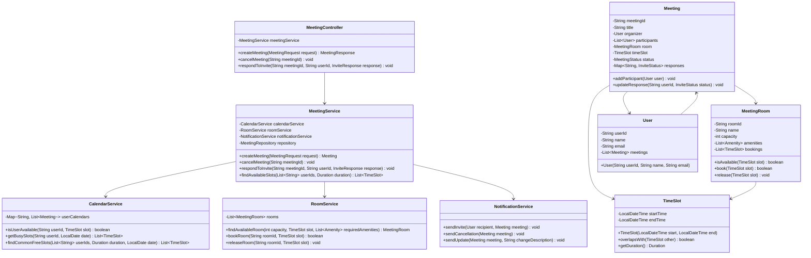

# Meeting Scheduler - LLD

## Overview

A meeting scheduler system enables users to create meetings, invite participants, reserve rooms, and manage conflicts. The system must handle overlapping meeting requests, room availability, participant availability, and notification delivery. This is a classic LLD problem that demonstrates composition, conflict detection algorithms, and clean service layers.

This blog presents a complete low-level design with Java implementation and sequence diagrams.

---

## Problem Statement

Design a meeting scheduler that supports:

- Users with calendars containing meetings
- Meeting creation with title, time range, participants, and room
- Conflict detection: time overlap for both participants and rooms
- Room management with capacity and available amenities
- Invite sending and acceptance/decline workflow
- Meeting cancellation and updates
- Querying available time slots for a group of users

---

## Sequence Diagram: Meeting Booking Flow

```mermaid
sequenceDiagram
    participant Organizer as Organizer
    participant Controller as MeetingController
    participant Service as MeetingService
    participant CalendarService as CalendarService
    participant RoomService as RoomService
    participant NotificationService as NotificationService

    Organizer->>Controller: POST /meetings
    Controller->>Service: createMeeting(request)
    Service->>CalendarService: checkParticipantAvailability(users, timeRange)
    CalendarService-->>Service: availabilityResult
    Service->>RoomService: findAvailableRoom(capacity, timeRange, amenities)
    RoomService-->>Service: availableRoom
    Service->>CalendarService: blockTimeSlots(participants, timeRange)
    CalendarService-->>Service: slotsBlocked
    Service->>RoomService: bookRoom(room, timeRange)
    RoomService-->>Service: bookingConfirmed
    Service->>NotificationService: sendInvites(meeting, participants)
    NotificationService-->>Service: invitesSent
    Service-->>Controller: meetingResponse
    Controller-->>Organizer: 201 Created

    Note over Participant,Controller: Participant accepts invite
    Organizer->>Controller: PUT /meetings/{id}/accept
    Controller->>Service: acceptMeeting(meetingId, userId)
    Service->>NotificationService: notifyOrganizer(userId, accepted)
```

---

## Class Diagram



---

## Implementation

### Value Objects

```java
public record TimeSlot(LocalDateTime startTime, LocalDateTime endTime) {
    public TimeSlot {
        if (startTime.isAfter(endTime) || startTime.equals(endTime)) {
            throw new IllegalArgumentException("Start time must be before end time");
        }
    }

    public boolean overlapsWith(TimeSlot other) {
        return this.startTime.isBefore(other.endTime)
            && this.endTime.isAfter(other.startTime);
    }

    public boolean contains(TimeSlot other) {
        return !this.startTime.isAfter(other.startTime)
            && !this.endTime.isBefore(other.endTime);
    }

    public Duration getDuration() {
        return Duration.between(startTime, endTime);
    }
}

public enum MeetingStatus {
    SCHEDULED, ONGOING, COMPLETED, CANCELLED
}

public enum InviteStatus {
    PENDING, ACCEPTED, DECLINED, TENTATIVE
}

public enum Amenity {
    PROJECTOR, WHITEBOARD, VIDEO_CONFERENCE, SPEAKER_PHONE
}
```

### User

```java
public class User {
    private final String userId;
    private final String name;
    private final String email;
    private final List<Meeting> meetings = new ArrayList<>();

    public User(String userId, String name, String email) {
        this.userId = userId;
        this.name = name;
        this.email = email;
    }

    public void addMeeting(Meeting meeting) {
        meetings.add(meeting);
    }

    public String getUserId() { return userId; }
    public String getName() { return name; }
    public String getEmail() { return email; }
    public List<Meeting> getMeetings() { return Collections.unmodifiableList(meetings); }
}
```

### MeetingRoom

```java
public class MeetingRoom {
    private final String roomId;
    private final String name;
    private final int capacity;
    private final List<Amenity> amenities;
    private final List<TimeSlot> bookings = new ArrayList<>();

    public MeetingRoom(String roomId, String name, int capacity, List<Amenity> amenities) {
        this.roomId = roomId;
        this.name = name;
        this.capacity = capacity;
        this.amenities = amenities;
    }

    public synchronized boolean isAvailable(TimeSlot slot) {
        return bookings.stream().noneMatch(booking -> booking.overlapsWith(slot));
    }

    public synchronized boolean book(TimeSlot slot) {
        if (!isAvailable(slot)) {
            return false;
        }
        bookings.add(slot);
        return true;
    }

    public synchronized void release(TimeSlot slot) {
        bookings.remove(slot);
    }

    public boolean hasAmenities(List<Amenity> required) {
        return amenities.containsAll(required);
    }

    public String getRoomId() { return roomId; }
    public String getName() { return name; }
    public int getCapacity() { return capacity; }
    public List<Amenity> getAmenities() { return amenities; }
}
```

### Meeting

```java
public class Meeting {
    private static final AtomicInteger idCounter = new AtomicInteger(0);

    private final String meetingId;
    private final String title;
    private final User organizer;
    private final List<User> participants = new ArrayList<>();
    private MeetingRoom room;
    private final TimeSlot timeSlot;
    private MeetingStatus status;
    private final Map<String, InviteStatus> responses = new ConcurrentHashMap<>();

    public Meeting(String title, User organizer, TimeSlot timeSlot) {
        this.meetingId = "MTG-" + idCounter.incrementAndGet();
        this.title = title;
        this.organizer = organizer;
        this.timeSlot = timeSlot;
        this.status = MeetingStatus.SCHEDULED;
        responses.put(organizer.getUserId(), InviteStatus.ACCEPTED);
    }

    public void addParticipant(User user) {
        participants.add(user);
        responses.put(user.getUserId(), InviteStatus.PENDING);
    }

    public void assignRoom(MeetingRoom meetingRoom) {
        this.room = meetingRoom;
    }

    public InviteStatus updateResponse(String userId, InviteStatus inviteStatus) {
        return responses.put(userId, inviteStatus);
    }

    public void cancel() {
        this.status = MeetingStatus.CANCELLED;
        if (room != null) {
            room.release(timeSlot);
        }
    }

    public String getMeetingId() { return meetingId; }
    public String getTitle() { return title; }
    public User getOrganizer() { return organizer; }
    public List<User> getParticipants() { return participants; }
    public MeetingRoom getRoom() { return room; }
    public TimeSlot getTimeSlot() { return timeSlot; }
    public MeetingStatus getStatus() { return status; }
    public Map<String, InviteStatus> getResponses() { return responses; }
}
```

### CalendarService

```java
@Service
public class CalendarService {
    private final Map<String, List<Meeting>> userCalendars = new ConcurrentHashMap<>();

    public boolean isUserAvailable(String userId, TimeSlot slot) {
        List<Meeting> meetings = userCalendars.getOrDefault(userId, List.of());
        return meetings.stream()
            .filter(m -> m.getStatus() == MeetingStatus.SCHEDULED)
            .noneMatch(m -> m.getTimeSlot().overlapsWith(slot));
    }

    public void blockTimeSlot(String userId, Meeting meeting) {
        userCalendars.computeIfAbsent(userId, k -> new ArrayList<>()).add(meeting);
    }

    public List<TimeSlot> getBusySlots(String userId, LocalDate date) {
        return userCalendars.getOrDefault(userId, List.of()).stream()
            .filter(m -> m.getTimeSlot().startTime().toLocalDate().equals(date))
            .map(Meeting::getTimeSlot)
            .collect(Collectors.toList());
    }

    public List<TimeSlot> findCommonFreeSlots(List<String> userIds, Duration duration, LocalDate date) {
        LocalDateTime start = date.atTime(9, 0); // business hours start
        LocalDateTime end = date.atTime(18, 0);  // business hours end

        List<TimeSlot> freeSlots = new ArrayList<>();
        LocalDateTime current = start;

        while (current.plus(duration).isBefore(end) || current.plus(duration).equals(end)) {
            TimeSlot candidate = new TimeSlot(current, current.plus(duration));
            boolean allAvailable = userIds.stream()
                .allMatch(id -> isUserAvailable(id, candidate));
            if (allAvailable) {
                freeSlots.add(candidate);
            }
            current = current.plusMinutes(30); // 30-minute intervals
        }
        return freeSlots;
    }
}
```

### RoomService

```java
@Service
public class RoomService {
    private final List<MeetingRoom> rooms;

    public RoomService(List<MeetingRoom> rooms) {
        this.rooms = rooms;
    }

    public MeetingRoom findAvailableRoom(int capacity, TimeSlot slot, List<Amenity> requiredAmenities) {
        return rooms.stream()
            .filter(r -> r.getCapacity() >= capacity)
            .filter(r -> r.isAvailable(slot))
            .filter(r -> r.hasAmenities(requiredAmenities))
            .findFirst()
            .orElse(null);
    }

    public boolean bookRoom(String roomId, TimeSlot slot) {
        return rooms.stream()
            .filter(r -> r.getRoomId().equals(roomId))
            .findFirst()
            .map(r -> r.book(slot))
            .orElse(false);
    }

    public void releaseRoom(String roomId, TimeSlot slot) {
        rooms.stream()
            .filter(r -> r.getRoomId().equals(roomId))
            .findFirst()
            .ifPresent(r -> r.release(slot));
    }
}
```

### MeetingService

```java
@Service
public class MeetingService {
    private final CalendarService calendarService;
    private final RoomService roomService;
    private final NotificationService notificationService;
    private final Map<String, Meeting> meetings = new ConcurrentHashMap<>();

    public MeetingService(CalendarService calendarService, RoomService roomService,
                          NotificationService notificationService) {
        this.calendarService = calendarService;
        this.roomService = roomService;
        this.notificationService = notificationService;
    }

    public Meeting createMeeting(MeetingRequest request) {
        User organizer = request.organizer();
        TimeSlot slot = request.timeSlot();

        // Check organizer availability
        if (!calendarService.isUserAvailable(organizer.getUserId(), slot)) {
            throw new ConflictException("Organizer is not available during this time");
        }

        // Check participant availability
        for (User participant : request.participants()) {
            if (!calendarService.isUserAvailable(participant.getUserId(), slot)) {
                throw new ConflictException(
                    "Participant " + participant.getName() + " is not available");
            }
        }

        // Find available room
        MeetingRoom room = roomService.findAvailableRoom(
            request.participants().size() + 1, slot, request.requiredAmenities());

        if (room == null) {
            throw new ConflictException("No available room matching requirements");
        }

        // Create meeting
        Meeting meeting = new Meeting(request.title(), organizer, slot);
        request.participants().forEach(meeting::addParticipant);
        meeting.assignRoom(room);

        // Reserve resources
        roomService.bookRoom(room.getRoomId(), slot);
        calendarService.blockTimeSlot(organizer.getUserId(), meeting);
        request.participants().forEach(p ->
            calendarService.blockTimeSlot(p.getUserId(), meeting));

        // Store and notify
        meetings.put(meeting.getMeetingId(), meeting);
        notificationService.sendInvites(meeting);

        return meeting;
    }

    public void respondToInvite(String meetingId, String userId, InviteStatus status) {
        Meeting meeting = meetings.get(meetingId);
        if (meeting == null) {
            throw new IllegalArgumentException("Meeting not found");
        }
        meeting.updateResponse(userId, status);
        notificationService.notifyOrganizer(meeting, userId, status);
    }

    public void cancelMeeting(String meetingId) {
        Meeting meeting = meetings.get(meetingId);
        if (meeting == null) {
            throw new IllegalArgumentException("Meeting not found");
        }
        meeting.cancel();
        calendarService.getBusySlots(meeting.getOrganizer().getUserId(), LocalDate.now());
        notificationService.sendCancellation(meeting);
    }
}
```

### MeetingController

```java
@RestController
@RequestMapping("/api/meetings")
public class MeetingController {
    private final MeetingService meetingService;

    public MeetingController(MeetingService meetingService) {
        this.meetingService = meetingService;
    }

    @PostMapping
    public ResponseEntity<MeetingResponse> createMeeting(@RequestBody MeetingRequest request) {
        try {
            Meeting meeting = meetingService.createMeeting(request);
            return ResponseEntity.status(HttpStatus.CREATED).body(MeetingResponse.from(meeting));
        } catch (ConflictException e) {
            return ResponseEntity.status(HttpStatus.CONFLICT)
                .body(new MeetingResponse(e.getMessage()));
        }
    }

    @PostMapping("/{meetingId}/respond")
    public ResponseEntity<Void> respondToInvite(
            @PathVariable String meetingId,
            @RequestParam String userId,
            @RequestParam InviteStatus status) {
        meetingService.respondToInvite(meetingId, userId, status);
        return ResponseEntity.ok().build();
    }

    @DeleteMapping("/{meetingId}")
    public ResponseEntity<Void> cancelMeeting(@PathVariable String meetingId) {
        meetingService.cancelMeeting(meetingId);
        return ResponseEntity.noContent().build();
    }

    @GetMapping("/available-slots")
    public ResponseEntity<List<TimeSlot>> getAvailableSlots(
            @RequestParam List<String> userIds,
            @RequestParam int durationMinutes,
            @RequestParam LocalDate date) {
        List<TimeSlot> slots = meetingService.findAvailableSlots(
            userIds, Duration.ofMinutes(durationMinutes), date);
        return ResponseEntity.ok(slots);
    }
}
```

---

## Best Practices

- Use immutable TimeSlot records to prevent accidental modification of meeting times
- Implement conflict detection at both participant and room level before committing
- Use optimistic concurrency for room booking to handle race conditions
- Store meeting responses in a ConcurrentHashMap for thread-safe updates
- Keep the notification service asynchronous to avoid delaying the booking response
- Use the builder pattern for complex MeetingRequest objects
- Validate all time ranges against business hours and holidays

---

## Common Mistakes

- Only checking room availability without checking participant availability
- Allowing double-booking of rooms due to race conditions in availability checks
- Not handling timezone conversions properly in distributed teams
- Forgetting to release room bookings when meetings are cancelled
- Sending notifications synchronously within the booking transaction
- Not supporting recurring meetings or meeting series
- Ignoring buffer times between consecutive meetings in the same room

---

## Summary

The meeting scheduler design demonstrates clean service layering with CalendarService, RoomService, and NotificationService handling distinct responsibilities. The TimeSlot value object encapsulates overlap detection logic, while the Meeting class manages its own lifecycle and participant responses. Conflict detection is performed before any resource is committed, using a two-phase reservation approach. The system is extensible to support recurring meetings, different room types, and complex availability rules.

---

## References

- [Google Calendar API Design](https://developers.google.com/calendar/api)
- [Microsoft Graph Calendar API](https://learn.microsoft.com/en-us/graph/api/resources/calendar)
- [Time Slot Management Patterns](https://martinfowler.com/eaaDev/timeSlot.html)
- [Java Concurrency for Booking Systems](https://www.baeldung.com/java-concurrency-booking)
