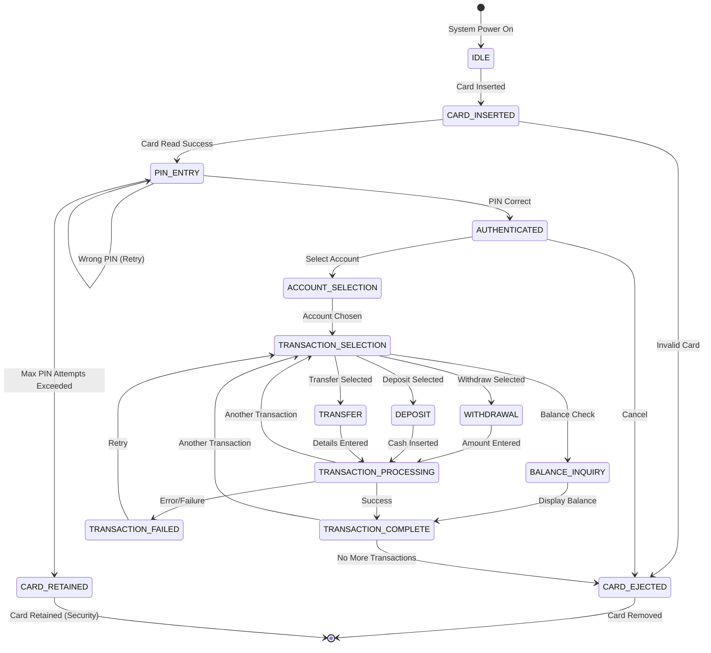

# ATM Machine - LLD

## Overview

An Automated Teller Machine (ATM) allows bank customers to perform financial transactions without a human teller. The system must handle card authentication, PIN verification, account selection, balance inquiries, withdrawals, deposits, and funds transfers—all with robust security and fault tolerance.

This blog presents a complete low-level design of an ATM system with Java implementation, covering state management, transaction processing, and security.

---

## Problem Statement

Design an ATM system that supports:

- Card insertion and PIN authentication
- Multiple accounts per user (checking, savings, credit)
- Cash withdrawals with denomination dispensing
- Cash deposits with validation
- Balance inquiries
- Funds transfers between accounts
- Transaction history
- Session management with timeout
- Error handling (insufficient funds, invalid PIN, card retention)

---

## State Diagram



---

## Class Diagram

```mermaid
classDiagram
    class ATM {
        -String atmId
        -BankingService bankingService
        -CashDispenser cashDispenser
        -CardReader cardReader
        -ATMSession currentSession
        -ATMState state
        +insertCard(Card card) void
        +enterPin(String pin) boolean
        +selectAccount(String accountNumber) void
        +withdraw(double amount) TransactionResult
        +deposit(double amount) TransactionResult
        +checkBalance() double
        +transfer(String toAccount, double amount) TransactionResult
        +ejectCard() void
    }
    class ATMSession {
        -String sessionId
        -Card card
        -Account currentAccount
        -LocalDateTime startTime
        -int pinAttempts
        -boolean authenticated
        +ATMSession(Card card)
        +incrementPinAttempt() int
        +isSessionExpired() boolean
        +setAccount(Account account) void
    }
    class Card {
        -String cardNumber
        -String bankId
        -String accountHolderName
        -LocalDate expiryDate
        -String cvv
        +Card(String cardNumber, String bankId, String name, LocalDate expiry, String cvv)
        +isExpired() boolean
    }
    class Account {
        -String accountNumber
        -AccountType accountType
        -double balance
        -String userId
        -List~Transaction~ transactions
        +Account(String accountNumber, AccountType type, String userId)
        +debit(double amount) boolean
        +credit(double amount) void
        +getBalance() double
    }
    class BankingService {
        +authenticateCard(Card card) boolean
        +validatePin(String cardNumber, String pin) boolean
        +getAccount(String accountNumber) Account
        +processTransaction(Transaction transaction) TransactionResult
        +getAccountsForCard(String cardNumber) List~Account~
    }
    class Transaction {
        -String transactionId
        -TransactionType type
        -double amount
        -LocalDateTime timestamp
        -String sourceAccount
        -String destinationAccount
        -TransactionStatus status
        +Transaction(TransactionType type, double amount, String source, String dest)
        +process() TransactionResult
    }
    class CashDispenser {
        -Map~Denomination, int~ cashAvailable
        +dispenseCash(double amount) Map~Denomination, int~
        +hasSufficientCash(double amount) boolean
        +getTotalCash() double
    }
    class TransactionResult {
        -boolean success
        -String message
        -double newBalance
        -Map~Denomination, int~ dispensedCash
        +TransactionResult(boolean success, String message, double newBalance)
    }
    enum AccountType {
        SAVINGS, CHECKING, CREDIT
    }
    enum TransactionType {
        WITHDRAWAL, DEPOSIT, TRANSFER, BALANCE_INQUIRY
    }
    enum TransactionStatus {
        PENDING, COMPLETED, FAILED, REVERSED
    }
    enum ATMState {
        IDLE, CARD_INSERTED, PIN_ENTRY, AUTHENTICATED, ACCOUNT_SELECTION,
        TRANSACTION_SELECTION, PROCESSING, COMPLETE, CARD_EJECTED
    }

    ATM --> ATMSession
    ATM --> BankingService
    ATM --> CashDispenser
    ATM --> CardReader
    ATM --> ATMState
    ATMSession --> Card
    ATMSession --> Account
    BankingService --> Account
    BankingService --> Transaction
    CashDispenser --> Denomination
    Account --> Transaction
```

---

## Implementation

### Enums

```java
public enum AccountType {
    SAVINGS, CHECKING, CREDIT
}

public enum TransactionType {
    WITHDRAWAL, DEPOSIT, TRANSFER, BALANCE_INQUIRY
}

public enum TransactionStatus {
    PENDING, COMPLETED, FAILED, REVERSED
}

public enum ATMState {
    IDLE, CARD_INSERTED, PIN_ENTRY, AUTHENTICATED,
    ACCOUNT_SELECTION, TRANSACTION_SELECTION,
    PROCESSING, COMPLETE, CARD_EJECTED, CARD_RETAINED
}
```

### Card and Cash Denomination

```java
public record Card(String cardNumber, String bankId, String accountHolderName,
                    LocalDate expiryDate, String cvv) {

    public boolean isExpired() {
        return LocalDate.now().isAfter(expiryDate);
    }
}

public enum Denomination {
    FIVE_HUNDRED(500),
    TWO_HUNDRED(200),
    ONE_HUNDRED(100),
    FIFTY(50);

    private final int value;

    Denomination(int value) { this.value = value; }
    public int getValue() { return value; }
}
```

### Account

```java
public class Account {
    private final String accountNumber;
    private final AccountType accountType;
    private final String userId;
    private double balance;
    private final List<Transaction> transactions = new ArrayList<>();

    public Account(String accountNumber, AccountType type, String userId) {
        this.accountNumber = accountNumber;
        this.accountType = type;
        this.userId = userId;
        this.balance = 0;
    }

    public synchronized boolean debit(double amount) {
        if (amount <= 0) {
            throw new IllegalArgumentException("Amount must be positive");
        }
        if (accountType == AccountType.CREDIT) {
            // Credit accounts can have negative balance up to limit
            balance -= amount;
            return true;
        }
        if (balance < amount) {
            return false;
        }
        balance -= amount;
        return true;
    }

    public synchronized void credit(double amount) {
        if (amount <= 0) {
            throw new IllegalArgumentException("Amount must be positive");
        }
        balance += amount;
    }

    public void addTransaction(Transaction transaction) {
        transactions.add(transaction);
    }

    public String getAccountNumber() { return accountNumber; }
    public AccountType getAccountType() { return accountType; }
    public double getBalance() { return balance; }
    public List<Transaction> getTransactions() { return Collections.unmodifiableList(transactions); }
}
```

### CashDispenser

```java
public class CashDispenser {
    private final Map<Denomination, Integer> cashAvailable = new ConcurrentHashMap<>();

    public CashDispenser() {
        // Initialize with cash
        cashAvailable.put(Denomination.FIVE_HUNDRED, 100);
        cashAvailable.put(Denomination.TWO_HUNDRED, 100);
        cashAvailable.put(Denomination.ONE_HUNDRED, 200);
        cashAvailable.put(Denomination.FIFTY, 200);
    }

    public synchronized boolean hasSufficientCash(double amount) {
        return getTotalCash() >= amount && canDispenseExact(amount);
    }

    public synchronized Map<Denomination, Integer> dispenseCash(double amount) {
        if (!canDispenseExact(amount)) {
            throw new IllegalArgumentException("Cannot dispense exact amount: " + amount);
        }

        Map<Denomination, Integer> toDispense = new EnumMap<>(Denomination.class);
        double remaining = amount;

        for (Denomination denom : Denomination.values()) {
            int count = (int) (remaining / denom.getValue());
            int available = cashAvailable.get(denom);
            int toTake = Math.min(count, available);
            if (toTake > 0) {
                toDispense.put(denom, toTake);
                remaining -= toTake * denom.getValue();
                cashAvailable.put(denom, available - toTake);
            }
        }

        return toDispense;
    }

    private boolean canDispenseExact(double amount) {
        double remaining = amount;
        for (Denomination denom : Denomination.values()) {
            int count = (int) (remaining / denom.getValue());
            int available = cashAvailable.get(denom);
            int toTake = Math.min(count, available);
            remaining -= toTake * denom.getValue();
        }
        return remaining == 0;
    }

    public synchronized void addCash(Denomination denom, int count) {
        cashAvailable.merge(denom, count, Integer::sum);
    }

    public double getTotalCash() {
        return cashAvailable.entrySet().stream()
            .mapToDouble(e -> e.getKey().getValue() * e.getValue())
            .sum();
    }

    public void displayAvailableCash() {
        System.out.println("Cash Available:");
        cashAvailable.forEach((denom, count) ->
            System.out.println(denom + ": " + count + " notes"));
    }
}
```

### Transaction

```java
public class Transaction {
    private static final AtomicLong idCounter = new AtomicLong(0);

    private final String transactionId;
    private final TransactionType type;
    private final double amount;
    private final LocalDateTime timestamp;
    private final String sourceAccount;
    private final String destinationAccount;
    private TransactionStatus status;

    public Transaction(TransactionType type, double amount,
                        String sourceAccount, String destinationAccount) {
        this.transactionId = "TXN-" + idCounter.incrementAndGet();
        this.type = type;
        this.amount = amount;
        this.timestamp = LocalDateTime.now();
        this.sourceAccount = sourceAccount;
        this.destinationAccount = destinationAccount;
        this.status = TransactionStatus.PENDING;
    }

    public TransactionResult process(BankingService bankingService) {
        try {
            Account source = bankingService.getAccount(sourceAccount);

            switch (type) {
                case WITHDRAWAL -> {
                    if (!source.debit(amount)) {
                        status = TransactionStatus.FAILED;
                        return new TransactionResult(false, "Insufficient funds", source.getBalance());
                    }
                }
                case DEPOSIT -> source.credit(amount);
                case TRANSFER -> {
                    Account dest = bankingService.getAccount(destinationAccount);
                    if (!source.debit(amount)) {
                        status = TransactionStatus.FAILED;
                        return new TransactionResult(false, "Insufficient funds for transfer", source.getBalance());
                    }
                    dest.credit(amount);
                }
                case BALANCE_INQUIRY -> {
                    status = TransactionStatus.COMPLETED;
                    return new TransactionResult(true, "Balance inquiry", source.getBalance());
                }
            }

            status = TransactionStatus.COMPLETED;
            source.addTransaction(this);
            return new TransactionResult(true, "Transaction successful", source.getBalance());

        } catch (Exception e) {
            status = TransactionStatus.FAILED;
            return new TransactionResult(false, "Transaction failed: " + e.getMessage(), 0);
        }
    }

    public String getTransactionId() { return transactionId; }
    public TransactionType getType() { return type; }
    public LocalDateTime getTimestamp() { return timestamp; }
    public TransactionStatus getStatus() { return status; }
}
```

### TransactionResult

```java
public record TransactionResult(boolean success, String message, double newBalance,
                                 Map<Denomination, Integer> dispensedCash) {

    public TransactionResult(boolean success, String message, double newBalance) {
        this(success, message, newBalance, Map.of());
    }
}
```

### BankingService

```java
@Service
public class BankingService {
    private final Map<String, Account> accounts = new ConcurrentHashMap<>();
    private final Map<String, String> cardPinMap = new ConcurrentHashMap<>();
    private final Map<String, List<String>> cardAccounts = new ConcurrentHashMap<>();

    public BankingService() {
        // Initialize test data
        Account savings = new Account("ACC-001", AccountType.SAVINGS, "USER-1");
        savings.credit(5000);
        Account checking = new Account("ACC-002", AccountType.CHECKING, "USER-1");
        checking.credit(2000);

        accounts.put("ACC-001", savings);
        accounts.put("ACC-002", checking);
        cardPinMap.put("CARD-001", "1234");
        cardAccounts.put("CARD-001", List.of("ACC-001", "ACC-002"));
    }

    public boolean authenticateCard(Card card) {
        return !card.isExpired() && cardAccounts.containsKey(card.cardNumber());
    }

    public boolean validatePin(String cardNumber, String pin) {
        return pin.equals(cardPinMap.get(cardNumber));
    }

    public Account getAccount(String accountNumber) {
        return accounts.get(accountNumber);
    }

    public List<Account> getAccountsForCard(String cardNumber) {
        return cardAccounts.getOrDefault(cardNumber, List.of()).stream()
            .map(accounts::get)
            .collect(Collectors.toList());
    }

    public TransactionResult processTransaction(Transaction transaction) {
        return transaction.process(this);
    }
}
```

### ATMSession

```java
public class ATMSession {
    private static final int MAX_PIN_ATTEMPTS = 3;
    private static final long SESSION_TIMEOUT_MINUTES = 5;

    private final String sessionId;
    private final Card card;
    private Account currentAccount;
    private final LocalDateTime startTime;
    private int pinAttempts;
    private boolean authenticated;

    public ATMSession(Card card) {
        this.sessionId = UUID.randomUUID().toString();
        this.card = card;
        this.startTime = LocalDateTime.now();
        this.pinAttempts = 0;
        this.authenticated = false;
    }

    public boolean incrementPinAttempt() {
        pinAttempts++;
        return pinAttempts >= MAX_PIN_ATTEMPTS;
    }

    public boolean isSessionExpired() {
        return Duration.between(startTime, LocalDateTime.now())
            .toMinutes() >= SESSION_TIMEOUT_MINUTES;
    }

    public String getSessionId() { return sessionId; }
    public Card getCard() { return card; }
    public Account getCurrentAccount() { return currentAccount; }
    public boolean isAuthenticated() { return authenticated; }
    public int getPinAttempts() { return pinAttempts; }

    public void setAuthenticated(boolean authenticated) {
        this.authenticated = authenticated;
    }

    public void setCurrentAccount(Account account) {
        this.currentAccount = account;
    }
}
```

### ATM Machine

```java
public class ATM {
    private final String atmId;
    private final BankingService bankingService;
    private final CashDispenser cashDispenser;
    private ATMSession currentSession;
    private ATMState state;
    private final Logger logger = Logger.getLogger(ATM.class.getName());

    public ATM(String atmId, BankingService bankingService, CashDispenser cashDispenser) {
        this.atmId = atmId;
        this.bankingService = bankingService;
        this.cashDispenser = cashDispenser;
        this.state = ATMState.IDLE;
    }

    public void insertCard(Card card) {
        if (state != ATMState.IDLE) {
            throw new IllegalStateException("ATM is busy");
        }

        if (!bankingService.authenticateCard(card)) {
            state = ATMState.CARD_EJECTED;
            System.out.println("Invalid or expired card. Ejecting...");
            return;
        }

        currentSession = new ATMSession(card);
        state = ATMState.CARD_INSERTED;
        System.out.println("Card accepted. Please enter your PIN.");
    }

    public boolean enterPin(String pin) {
        if (state != ATMState.CARD_INSERTED) {
            throw new IllegalStateException("No card inserted");
        }

        if (currentSession.isSessionExpired()) {
            ejectCard();
            throw new IllegalStateException("Session expired");
        }

        if (bankingService.validatePin(currentSession.getCard().cardNumber(), pin)) {
            currentSession.setAuthenticated(true);
            state = ATMState.AUTHENTICATED;
            System.out.println("PIN verified. Select an account.");
            return true;
        } else {
            if (currentSession.incrementPinAttempt()) {
                state = ATMState.CARD_RETAINED;
                System.out.println("Maximum PIN attempts exceeded. Card retained.");
                return false;
            }
            System.out.println("Invalid PIN. " + (3 - currentSession.getPinAttempts()) + " attempts remaining.");
            return false;
        }
    }

    public List<Account> selectAccount() {
        if (!currentSession.isAuthenticated()) {
            throw new IllegalStateException("Not authenticated");
        }
        List<Account> accounts = bankingService.getAccountsForCard(
            currentSession.getCard().cardNumber());
        state = ATMState.ACCOUNT_SELECTION;
        return accounts;
    }

    public void chooseAccount(String accountNumber) {
        Account account = bankingService.getAccount(accountNumber);
        if (account == null) {
            throw new IllegalArgumentException("Invalid account");
        }
        currentSession.setCurrentAccount(account);
        state = ATMState.TRANSACTION_SELECTION;
        System.out.println("Account selected: " + accountNumber);
    }

    public TransactionResult withdraw(double amount) {
        validateTransactionReady();

        if (amount <= 0 || amount % 50 != 0) {
            return new TransactionResult(false, "Amount must be multiple of 50", 0);
        }

        if (!cashDispenser.hasSufficientCash(amount)) {
            return new TransactionResult(false, "ATM has insufficient cash", 0);
        }

        state = ATMState.PROCESSING;
        Transaction txn = new Transaction(TransactionType.WITHDRAWAL, amount,
            currentSession.getCurrentAccount().getAccountNumber(), null);

        TransactionResult result = bankingService.processTransaction(txn);

        if (result.success()) {
            Map<Denomination, Integer> cash = cashDispenser.dispenseCash(amount);
            result = new TransactionResult(true, "Dispensed: " + amount,
                result.newBalance(), cash);
            System.out.println("Dispensed: " + cash);
        }

        state = ATMState.COMPLETE;
        return result;
    }

    public TransactionResult deposit(double amount) {
        validateTransactionReady();
        state = ATMState.PROCESSING;

        Transaction txn = new Transaction(TransactionType.DEPOSIT, amount,
            currentSession.getCurrentAccount().getAccountNumber(), null);
        TransactionResult result = bankingService.processTransaction(txn);

        state = ATMState.COMPLETE;
        return result;
    }

    public TransactionResult checkBalance() {
        validateTransactionReady();
        state = ATMState.PROCESSING;

        Transaction txn = new Transaction(TransactionType.BALANCE_INQUIRY, 0,
            currentSession.getCurrentAccount().getAccountNumber(), null);
        TransactionResult result = bankingService.processTransaction(txn);

        state = ATMState.COMPLETE;
        System.out.println("Current balance: $" + result.newBalance());
        return result;
    }

    public TransactionResult transfer(String toAccount, double amount) {
        validateTransactionReady();
        state = ATMState.PROCESSING;

        Transaction txn = new Transaction(TransactionType.TRANSFER, amount,
            currentSession.getCurrentAccount().getAccountNumber(), toAccount);
        TransactionResult result = bankingService.processTransaction(txn);

        state = ATMState.COMPLETE;
        return result;
    }

    public void ejectCard() {
        if (currentSession != null) {
            System.out.println("Please take your card.");
            currentSession = null;
        }
        state = ATMState.IDLE;
    }

    private void validateTransactionReady() {
        if (state != ATMState.TRANSACTION_SELECTION && state != ATMState.COMPLETE) {
            throw new IllegalStateException("Not ready for transaction");
        }
        if (currentSession == null || !currentSession.isAuthenticated()) {
            throw new IllegalStateException("No authenticated session");
        }
        if (currentSession.isSessionExpired()) {
            ejectCard();
            throw new IllegalStateException("Session expired");
        }
    }

    public ATMState getState() { return state; }
}
```

### Demo

```java
public class ATMDemo {
    public static void main(String[] args) {
        BankingService bankingService = new BankingService();
        CashDispenser cashDispenser = new CashDispenser();
        ATM atm = new ATM("ATM-001", bankingService, cashDispenser);

        // Simulate ATM session
        Card card = new Card("CARD-001", "BANK-001", "John Doe",
            LocalDate.of(2028, 12, 31), "123");

        atm.insertCard(card);

        // PIN entry
        boolean pinValid = atm.enterPin("1234");
        if (!pinValid) return;

        // Account selection
        List<Account> accounts = atm.selectAccount();
        System.out.println("Available accounts:");
        accounts.forEach(a -> System.out.println(a.getAccountNumber() + " - " + a.getAccountType()));

        atm.chooseAccount("ACC-001");

        // Balance check
        TransactionResult balance = atm.checkBalance();
        System.out.println("Balance: $" + balance.newBalance());

        // Withdrawal
        TransactionResult withdrawal = atm.withdraw(500);
        System.out.println(withdrawal.message());

        // Transfer
        TransactionResult transfer = atm.transfer("ACC-002", 200);
        System.out.println(transfer.message());

        // Final balance
        atm.checkBalance();

        atm.ejectCard();
    }
}
```

---

## Best Practices

- Use the State pattern to manage ATM states and prevent invalid operations
- Implement session timeout to automatically log out inactive users
- Use atomic transactions with rollback capability for all financial operations
- Apply the Single Responsibility Principle: separate card reading, cash dispensing, and banking logic
- Use PIN retry limits with card retention for security
- Keep audit logs of all transactions for compliance and dispute resolution
- Use withdraw-specific exceptions for insufficient funds, insufficient cash, and invalid denominations

---

## Common Mistakes

- Not handling concurrent transactions on the same account properly
- Dispensing cash before the transaction is committed in the banking system
- Allowing withdrawal amounts that cannot be dispensed with available denominations
- Not validating session state before each operation
- Exposing sensitive data like PINs in logs or error messages
- Forgetting to handle card retention scenarios properly
- Not handling network failures between ATM and banking backend gracefully

---

## Summary

The ATM system design demonstrates robust state management, secure authentication, and reliable transaction processing. The state machine ensures valid operation sequences, while the BankingService abstraction decouples ATM hardware from backend banking logic. The CashDispenser handles denomination math for exact cash dispensing, and the Transaction class provides an audit trail. Security measures include PIN retry limits, session timeouts, and card retention on suspicious activity. The design follows banking industry standards for security and reliability.

---

## References

- [ISO 8583 Financial Transaction Standard](https://en.wikipedia.org/wiki/ISO_8583)
- [Java State Design Pattern](https://refactoring.guru/design-patterns/state)
- [Banking System Design Patterns](https://www.baeldung.com/java-banking-system)
- [ATM Security Standards - PCI DSS](https://www.pcisecuritystandards.org/)
