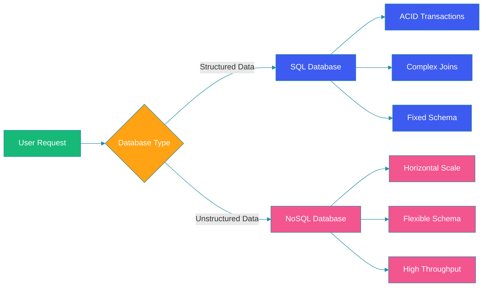

# SQL vs NoSQL Databases

## Overview

Choosing between SQL and NoSQL databases is one of the most critical decisions in system design. SQL databases offer strong consistency and ACID transactions, while NoSQL databases provide horizontal scalability and flexible schemas. This guide compares both approaches, their trade-offs, and helps you decide which fits your use case.

## ACID vs BASE

### ACID (SQL Databases)

| Property | Description |
|----------|-------------|
| **Atomicity** | All operations in a transaction succeed or all fail |
| **Consistency** | Data always satisfies schema constraints |
| **Isolation** | Concurrent transactions don't interfere |
| **Durability** | Committed data survives failures |

### BASE (NoSQL Databases)

| Property | Description |
|----------|-------------|
| **Basically Available** | System guarantees availability |
| **Soft State** | State may change without input |
| **Eventual Consistency** | System becomes consistent over time |

## Comparison Diagram



## Schema Types

### SQL Schema (Fixed)

```sql
CREATE TABLE users (
    id BIGINT PRIMARY KEY AUTO_INCREMENT,
    email VARCHAR(255) NOT NULL UNIQUE,
    name VARCHAR(100) NOT NULL,
    created_at TIMESTAMP DEFAULT CURRENT_TIMESTAMP,
    INDEX idx_email (email)
);

CREATE TABLE orders (
    id BIGINT PRIMARY KEY AUTO_INCREMENT,
    user_id BIGINT NOT NULL,
    total DECIMAL(10,2) NOT NULL,
    status ENUM('pending', 'confirmed', 'shipped') DEFAULT 'pending',
    FOREIGN KEY (user_id) REFERENCES users(id),
    INDEX idx_user (user_id)
);
```

### NoSQL Schema (Flexible - Document)

```javascript
// MongoDB document - schema-less
{
  "_id": ObjectId("..."),
  "email": "user@example.com",
  "name": "John Doe",
  "created_at": ISODate("..."),
  "orders": [
    {
      "order_id": "ORD-001",
      "total": 99.99,
      "status": "shipped",
      "items": [
        { "product": "Widget", "qty": 2, "price": 49.99 }
      ]
    }
  ]
}
```

## Use Cases

### SQL Use Cases

```java
@Service
public class TransactionService {

    @Autowired
    private JdbcTemplate jdbc;

    @Transactional
    public Order placeOrder(Long userId, List<OrderItem> items) {
        // ACID guarantee - all or nothing
        BigDecimal total = calculateTotal(items);

        jdbc.update("INSERT INTO orders (user_id, total, status) VALUES (?, ?, 'pending')",
            userId, total);

        Long orderId = jdbc.queryForObject("SELECT LAST_INSERT_ID()", Long.class);

        for (OrderItem item : items) {
            jdbc.update("INSERT INTO order_items (order_id, product_id, qty, price) VALUES (?, ?, ?, ?)",
                orderId, item.getProductId(), item.getQty(), item.getPrice());
        }

        return getOrder(orderId);
    }
}
```

### NoSQL Use Cases

```java
@Component
public class SessionManager {

    @Autowired
    private RedisTemplate<String, Object> redis;

    public void createSession(String sessionId, UserSession session) {
        // High-speed key-value storage for session data
        redis.opsForValue().set(
            "session:" + sessionId,
            session,
            Duration.ofHours(24)
        );
    }

    public UserSession getSession(String sessionId) {
        return (UserSession) redis.opsForValue()
            .get("session:" + sessionId);
    }
}
```

## When to Choose Each

| Factor | SQL | NoSQL |
|--------|-----|-------|
| **Data Structure** | Structured, relational | Unstructured, nested |
| **Consistency** | Strongly consistent | Eventually consistent |
| **Scale** | Vertical (primary) | Horizontal (native) |
| **Transactions** | Multi-row ACID | Single-document |
| **Queries** | Complex joins, aggregations | Simple key lookups |
| **Schema** | Fixed, migrations needed | Dynamic, evolvable |

## Spring Boot with Both

```java
@Configuration
@EnableTransactionManagement
public class HybridDatabaseConfig {

    @Bean
    @Primary
    @ConfigurationProperties("spring.datasource.orders")
    public DataSource sqlDataSource() {
        return DataSourceBuilder.create().build();
    }

    @Bean
    @ConfigurationProperties("spring.redis.cache")
    public LettuceConnectionFactory redisConnectionFactory() {
        return new LettuceConnectionFactory();
    }

    @Bean
    public MongoTemplate mongoTemplate(MongoDatabaseFactory factory) {
        return new MongoTemplate(factory);
    }
}
```

## Best Practices

1. **Use SQL for financial data**: ACID guarantees for transactions, ledgers, and billing.

2. **Use NoSQL for high-scale reads**: Caching, session stores, real-time counters.

3. **Polyglot persistence**: Use both SQL and NoSQL for different parts of your system.

4. **Avoid joins in NoSQL**: Embed related data or use application-level joins.

5. **Index strategically**: Both SQL and NoSQL need proper indexing for performance.

6. **Plan for migrations**: SQL schema changes require careful migration planning.

## Common Mistakes

1. **Choosing NoSQL for relational data**: Forcing non-relational patterns on inherently relational data.

2. **Ignoring consistency**: Assuming eventual consistency is acceptable for all operations.

3. **Over-normalizing in SQL**: Excessive joins hurt performance at scale.

4. **Under-indexing**: Missing indexes cause full table scans in both systems.

5. **No backup strategy**: Assuming replication replaces proper backups.

## Summary

SQL databases excel at ACID transactions, complex queries, and structured data. NoSQL databases excel at horizontal scalability, flexible schemas, and high throughput. The best approach often involves polyglot persistence—using both for different parts of your system.

---

## References

- [PostgreSQL Documentation](https://www.postgresql.org/docs/)
- [MongoDB Documentation](https://www.mongodb.com/docs/)
- [Redis Documentation](https://redis.io/documentation)
- [ACID vs BASE Explained](https://www.geeksforgeeks.org/acid-model-vs-base-model/)
