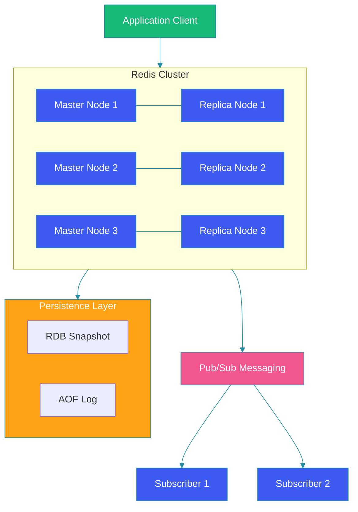

# Key-Value Stores (Redis)

## Overview

Redis is an in-memory key-value store known for its exceptional performance, rich data structures, and versatile use cases. Unlike traditional databases, Redis operates primarily in memory, delivering sub-millisecond response times. This guide covers Redis data structures, persistence options, clustering, and practical implementation patterns.

## Architecture Diagram



## Redis Data Structures

### Strings

```java
@Service
public class RedisStringOperations {

    @Autowired
    private StringRedisTemplate redis;

    public void cacheUser(String userId, User user) {
        redis.opsForValue().set(
            "user:" + userId,
            serialize(user),
            Duration.ofMinutes(30)
        );
    }

    public User getUser(String userId) {
        String data = redis.opsForValue().get("user:" + userId);
        return data != null ? deserialize(data) : null;
    }
}
```

### Lists

```java
@Service
public class RedisListOperations {

    @Autowired
    private RedisTemplate<String, String> redis;

    public void pushNotification(String userId, String notification) {
        redis.opsForList().leftPush(
            "notifications:" + userId,
            notification
        );
        // Trim to last 100 notifications
        redis.opsForList().trim("notifications:" + userId, 0, 99);
    }

    public List<String> getNotifications(String userId) {
        return redis.opsForList().range(
            "notifications:" + userId,
            0,
            -1
        );
    }
}
```

### Sorted Sets

```java
@Service
public class LeaderboardService {

    @Autowired
    private RedisTemplate<String, String> redis;

    public void updateScore(String gameId, String playerId, double score) {
        redis.opsForZSet().add(
            "leaderboard:" + gameId,
            playerId,
            score
        );
    }

    public Set<String> getTopPlayers(String gameId, int count) {
        return redis.opsForZSet().reverseRange(
            "leaderboard:" + gameId,
            0,
            count - 1
        );
    }

    public Long getRank(String gameId, String playerId) {
        Long rank = redis.opsForZSet().reverseRank(
            "leaderboard:" + gameId,
            playerId
        );
        return rank != null ? rank + 1 : null;
    }
}
```

### Hashes

```java
@Service
public class SessionStore {

    @Autowired
    private RedisTemplate<String, Object> redis;

    public void createSession(String sessionId, Map<String, Object> sessionData) {
        redis.opsForHash().putAll(
            "session:" + sessionId,
            sessionData
        );
        redis.expire("session:" + sessionId, Duration.ofHours(1));
    }

    public Object getAttribute(String sessionId, String key) {
        return redis.opsForHash().get("session:" + sessionId, key);
    }
}
```

## Persistence Strategies

### RDB (Snapshot)

```java
@Configuration
public class RedisPersistenceConfig {

    @Bean
    public RedisCacheManager cacheManager(RedisConnectionFactory factory) {
        RedisCacheConfiguration config = RedisCacheConfiguration.defaultCacheConfig()
            .entryTtl(Duration.ofMinutes(10))
            .disableCachingNullValues()
            .serializeKeysWith(
                RedisSerializationContext.SerializationPair.fromSerializer(
                    new StringRedisSerializer()))
            .serializeValuesWith(
                RedisSerializationContext.SerializationPair.fromSerializer(
                    new GenericJackson2JsonRedisSerializer()));

        return RedisCacheManager.builder(factory)
            .cacheDefaults(config)
            .build();
    }
}
```

### AOF (Append-Only File)

```java
// redis.conf configuration
// appendonly yes
// appendfsync everysec
// auto-aof-rewrite-percentage 100
// auto-aof-rewrite-min-size 64mb
```

## Rate Limiting with Redis

```java
@Component
public class RedisRateLimiter {

    @Autowired
    private StringRedisTemplate redis;

    public boolean tryAcquire(String key, int limit, Duration window) {
        String script = """
            local key = KEYS[1]
            local limit = tonumber(ARGV[1])
            local window = tonumber(ARGV[2])
            local now = tonumber(ARGV[3])
            
            redis.call('ZREMRANGEBYSCORE', key, '-inf', now - window)
            local count = redis.call('ZCARD', key)
            
            if count < limit then
                redis.call('ZADD', key, now, now .. ':' .. count)
                redis.call('EXPIRE', key, window / 1000)
                return 1
            end
            
            return 0
            """;

        Long result = redis.execute(
            new DefaultRedisScript<>(script, Long.class),
            List.of(key),
            String.valueOf(limit),
            String.valueOf(window.toMillis()),
            String.valueOf(System.currentTimeMillis())
        );

        return Long.valueOf(1).equals(result);
    }
}
```

## Redis Pub/Sub

```java
@Configuration
public class RedisPubSubConfig {

    @Bean
    public RedisMessageListenerContainer container(
            RedisConnectionFactory factory,
            MessageListenerAdapter listener) {
        RedisMessageListenerContainer container = new RedisMessageListenerContainer();
        container.setConnectionFactory(factory);
        container.addMessageListener(listener, new PatternTopic("events:*"));
        return container;
    }

    @Bean
    public MessageListenerAdapter listenerAdapter(EventSubscriber subscriber) {
        return new MessageListenerAdapter(subscriber, "onMessage");
    }
}

@Service
public class EventPublisher {

    @Autowired
    private RedisTemplate<String, Object> redis;

    public void publish(String channel, Object event) {
        redis.convertAndSend("events:" + channel, event);
    }
}

@Service
public class EventSubscriber {

    public void onMessage(String message, byte[] raw) {
        System.out.println("Received: " + message);
    }
}
```

## Clustering with Redis

```java
@Configuration
public class RedisClusterConfig {

    @Bean
    public RedisClusterConfiguration clusterConfiguration() {
        RedisClusterConfiguration config = new RedisClusterConfiguration();
        config.clusterNode("node1", 6379);
        config.clusterNode("node2", 6379);
        config.clusterNode("node3", 6379);
        config.setMaxRedirects(3);
        return config;
    }

    @Bean
    public LettuceConnectionFactory connectionFactory(
            RedisClusterConfiguration clusterConfig) {
        return new LettuceConnectionFactory(clusterConfig);
    }
}
```

## Best Practices

1. **Set TTLs**: Always set expiration keys to prevent memory leaks.

2. **Use connection pooling**: Reuse connections via Lettuce or Jedis pools.

3. **Monitor memory**: Use `INFO memory` and `MEMORY USAGE` commands.

4. **Choose persistence wisely**: RDB for backups, AOF for durability.

5. **Partition data**: Use Redis Cluster or client-side sharding for large datasets.

6. **Avoid large keys**: Keep key and value sizes reasonable.

## Common Mistakes

1. **No TTL on keys**: Unbounded key growth consumes all memory.

2. **Using Redis as primary database**: Redis is an in-memory cache/store, not a replacement for persistent DB.

3. **Blocking commands**: Avoid `KEYS *` in production; use `SCAN` instead.

4. **Ignoring network latency**: Redis is network-bound; keep it close to your application.

5. **Large value sizes**: Values over 10MB degrade performance.

## Summary

Redis is an extremely versatile key-value store that excels at caching, session management, rate limiting, and real-time data processing. Its rich data structures, persistence options, and clustering support make it suitable for a wide range of high-performance use cases.

---

## References

- [Redis Documentation](https://redis.io/documentation)
- [Redis Persistence](https://redis.io/topics/persistence)
- [Redis Cluster Tutorial](https://redis.io/topics/cluster-tutorial)
- [Spring Data Redis](https://spring.io/projects/spring-data-redis)
