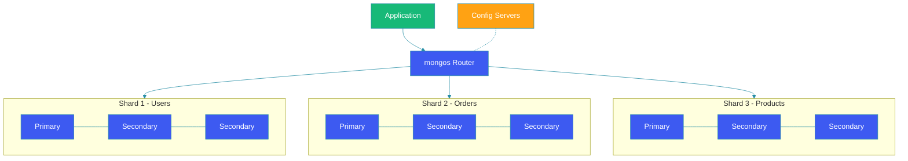

# Document Stores (MongoDB)

## Overview

Document stores like MongoDB store data as flexible, JSON-like documents. Unlike relational databases with rigid schemas, document stores allow nested structures, dynamic fields, and schema evolution. This guide explores MongoDB's document model, indexing strategies, aggregation pipeline, replication, and sharding for building scalable applications.

## Document Model

MongoDB stores data as BSON (Binary JSON) documents in collections. Documents can have varying fields and nested sub-documents.

```javascript
// MongoDB document example - product catalog
{
  "_id": ObjectId("507f1f77bcf86cd799439011"),
  "sku": "WIDGET-001",
  "name": "Premium Widget",
  "price": 29.99,
  "category": "widgets",
  "tags": ["premium", "featured"],
  "variants": [
    {
      "color": "red",
      "size": "large",
      "inventory": 50
    },
    {
      "color": "blue",
      "size": "medium",
      "inventory": 100
    }
  ],
  "reviews": [
    { "user": "alice", "rating": 5, "text": "Great product!" }
  ],
  "created_at": ISODate("2026-01-15T10:30:00Z")
}
```

## Architecture Diagram



## Collections and Indexing

### Creating Collections with Indexes

```java
@Configuration
public class MongoIndexConfig {

    @Autowired
    private MongoTemplate mongo;

    @PostConstruct
    public void createIndexes() {
        // Single field index
        mongo.indexOps("products")
            .ensureIndex(new Index().on("sku", Sort.Direction.ASC).unique());

        // Compound index
        mongo.indexOps("orders")
            .ensureIndex(
                new Index()
                    .on("userId", Sort.Direction.ASC)
                    .on("createdAt", Sort.Direction.DESC)
            );

        // Text index for full-text search
        mongo.indexOps("products")
            .ensureIndex(new Index().on("name", Sort.Direction.ASC));

        // TTL index - auto-expire documents
        mongo.indexOps("sessions")
            .ensureIndex(
                new Index()
                    .on("createdAt", Sort.Direction.ASC)
                    .expire(Duration.ofHours(24))
            );
    }
}
```

### Spring Data MongoDB Repository

```java
@Document(collection = "orders")
@Data
public class Order {
    @Id
    private String id;
    private String userId;
    private List<OrderItem> items;
    private BigDecimal total;
    private String status;
    private LocalDateTime createdAt;
}

@Data
public class OrderItem {
    private String productId;
    private String productName;
    private Integer quantity;
    private BigDecimal price;
}

public interface OrderRepository extends MongoRepository<Order, String> {
    List<Order> findByUserId(String userId);
    List<Order> findByUserIdAndStatus(String userId, String status);
    List<Order> findByCreatedAtBetween(
        LocalDateTime from, LocalDateTime to
    );
}
```

## Aggregation Pipeline

MongoDB's aggregation pipeline processes documents through sequential stages.

```java
@Service
public class OrderAnalyticsService {

    @Autowired
    private MongoTemplate mongo;

    public List<SalesSummary> getMonthlySales(int year) {
        Aggregation aggregation = Aggregation.newAggregation(
            Aggregation.match(
                Criteria.where("createdAt")
                    .gte(LocalDateTime.of(year, 1, 1, 0, 0))
                    .lt(LocalDateTime.of(year + 1, 1, 1, 0, 0))
            ),
            Aggregation.group("status")
                .count().as("orderCount")
                .sum("total").as("totalRevenue")
                .avg("total").as("averageOrderValue"),
            Aggregation.project("orderCount", "totalRevenue", "averageOrderValue")
                .and("status").previousOperation(),
            Aggregation.sort(Sort.by(Sort.Direction.DESC, "totalRevenue"))
        );

        AggregationResults<SalesSummary> results = mongo.aggregate(
            aggregation,
            "orders",
            SalesSummary.class
        );

        return results.getMappedResults();
    }
}
```

## Replication

```yaml
# Replica set configuration
replication:
  replSetName: "rs0"
  oplogSizeMB: 10240

# In Java driver
@Configuration
public class MongoReplicaConfig {

    @Bean
    public MongoClient mongoClient() {
        return MongoClients.create(
            MongoClientSettings.builder()
                .applyToClusterSettings(builder ->
                    builder.hosts(List.of(
                        new ServerAddress("primary:27017"),
                        new ServerAddress("secondary1:27017"),
                        new ServerAddress("secondary2:27017")
                    ))
                )
                .readPreference(ReadPreference.secondaryPreferred())
                .writeConcern(WriteConcern.MAJORITY)
                .readConcern(ReadConcern.MAJORITY)
                .build()
        );
    }
}
```

## Sharding

### Shard Key Selection

```java
@Service
public class ShardConfigService {

    @Autowired
    private MongoTemplate mongo;

    public void enableSharding() {
        // Enable sharding on database
        mongo.executeCommand("{ enableSharding: 'ecommerce' }");

        // Shard collection on userId (hashed for even distribution)
        mongo.executeCommand("""
            {
                shardCollection: 'ecommerce.orders',
                key: { userId: 'hashed' }
            }
            """);
    }

    // Zone-based sharding for data locality
    public void configureZones() {
        mongo.executeCommand("""
            {
                shardCollection: 'ecommerce.orders',
                key: { region: 1, userId: 1 }
            }
            """);
    }
}
```

## Transaction Support

```java
@Service
public class OrderService {

    @Autowired
    private MongoTemplate mongo;

    public void placeOrder(Order order) {
        // Start a transaction (requires replica set)
        Session session = mongo.getMongoClient().startSession();
        session.startTransaction();

        try {
            mongo.insert(order, "orders");

            mongo.updateFirst(
                query(where("_id").is(order.getUserId())),
                update("orderCount", 1),
                "userStats"
            );

            session.commitTransaction();
        } catch (Exception e) {
            session.abortTransaction();
            throw e;
        } finally {
            session.close();
        }
    }
}
```

## Best Practices

1. **Design documents for access patterns**: Model data how your application reads it.

2. **Use appropriate shard keys**: High cardinality, even distribution keys prevent hotspots.

3. **Create indexes for queries**: Always analyze query patterns and create supporting indexes.

4. **Limit document size**: Keep documents under 16MB; use references for large data.

5. **Write concern majority**: Balance durability and performance for writes.

6. **Use aggregation pipeline**: Push computation to the database layer.

## Common Mistakes

1. **Over-embedding**: Growing arrays that exceed the 16MB document limit.

2. **No indexes on query fields**: Full collection scans on large collections.

3. **Bad shard key**: Monotonically increasing keys causing write hotspots.

4. **Ignoring replica set latency**: Read preferences affect consistency.

5. **Unbounded arrays**: Arrays that grow indefinitely cause performance issues.

## Summary

MongoDB's document model provides schema flexibility and horizontal scalability ideal for content management, catalogs, and real-time analytics. Key to success: model documents around access patterns, index strategically, choose shard keys carefully, and leverage the aggregation pipeline for efficient data processing.

---

## References

- [MongoDB Documentation](https://www.mongodb.com/docs/)
- [Spring Data MongoDB Reference](https://docs.spring.io/spring-data/mongodb/)
- [MongoDB Aggregation Pipeline](https://www.mongodb.com/docs/manual/aggregation/)
- [MongoDB Sharding](https://www.mongodb.com/docs/manual/sharding/)
