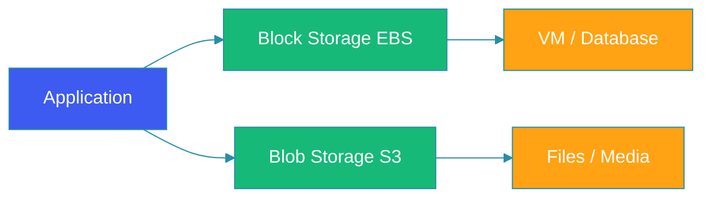

# Blob vs Block Storage

## Overview

Understanding the difference between blob storage and block storage is fundamental to designing cloud-native systems. Each storage type has distinct characteristics, performance profiles, and use cases. Choosing the right storage type directly impacts application performance, cost, and scalability.

This guide compares blob and block storage, explains when to use each, and provides implementation strategies.

## Storage Types Overview

```
┌─────────────────────────────────────────────────────────────────┐
│                   Storage Type Spectrum                         │
├─────────────────────────────────────────────────────────────────┤
│                                                          │
│  ┌────────────────────┐    ┌────────────────────┐          │
│  │   Object Storage  │    │  Block Storage     │          │
│  │    (Blob/S3)     │    │    (EBS/Disk)     │          │
│  └────────┬─────────┘    └────────┬─────────────┘          │
│           │                       │                       │
│           ▼                       ▼                       │
│  ┌───────────────────┐    ┌────────────────────┐        │
│  │ Files/Objects    │    │ Raw Device         │        │
│  │ Unlimited scale │    │ Fixed size        │        │
│  │ REST API        │    │ Block I/O         │        │
│  │ HTTP access     │    │ File system      │        │
│  │ Web, mobile    │    │ Databases, VM     │        │
│  └───────────────────┘    └────────────────────┘        │
│                                                          │
│           File Storage                                      │
│    ┌──────────────────────────────┐                     │
│    │  Hierarchical, standard    │                     │
│    │  protocols (NFS, SMB)    │                     │
│    │  Enterprise apps         │                     │
│    └──────────────────────────────┘                     │
└─────────────────────────────────────────────────────────┘
```

## Block Storage

Block storage presents raw storage as block devices:

### Characteristics

| Feature | Description |
|---------|-------------|
| **Interface** | Block I/O (read/write sectors) |
| **Protocol** | iSCSI, Fibre Channel |
| **Use Case** | Databases, VMs, OS |
| **Performance** | Low latency, high IOPS |
| **Scalability** | Limited (~16TB per volume) |
| **Access** | Single attach |

### Block Device Operations

```java
// AWS EBS Example
public class EBSOperations {
    
    @Autowired
    private AmazonEC2 ec2;
    
    // Create volume
    public String createVolume(String availabilityZone, int sizeGb) {
        CreateVolumeRequest request = CreateVolumeRequest.builder()
            .availabilityZone(availabilityZone)
            .size(sizeGiB)
            .volumeType(VolumeType.Gp3)
            .build();
        
        return ec2.createVolume(request).getVolumeId();
    }
    
    // Attach to instance
    public void attachVolume(String volumeId, String instanceId, String device) {
        AttachVolumeRequest request = AttachVolumeRequest.builder()
            .volumeId(volumeId)
            .instanceId(instanceId)
            .device(device)
            .build();
        
        ec2.attachVolume(request);
    }
    
    // Create snapshot
    public String createSnapshot(String volumeId) {
        CreateSnapshotRequest request = CreateSnapshotRequest.builder()
            .volumeId(volumeId)
            .build();
        
        return ec2.createSnapshot(request).getSnapshotId();
    }
}
```

### Use Cases for Block Storage

```
┌─────────────────────────────────────────────────────────────────┐
│                 Block Storage Use Cases                        │
├─────────────────────────────────────────────────────────────────┤
│                                                          │
│  ┌─────────────────────────────────────────────────────┐  │
│  │                  Databases                           │  │
│  │  ┌──────────┐  ┌──────────┐  ┌────────────┐        │  │
│  │  │ PostgreSQL│  │  MySQL   │  │   Oracle   │        │  │
│  │  │  (Data)  │  │ (Data)  │  │  (Data)    │        │  │
│  │  └──────────┘  └──────────┘  └────────────┘        │  │
│  │  - Needs consistent low-latency I/O                 │  │
│  │  - Random read/write patterns                      │  │
│  │  - Transactional integrity                         │  │
│  └─────────────────────────────────────────────────────┘  │
│                                                          │
│  ┌─────────────────────────────────────────────────────┐  │
│  │                  Virtual Machines                   │  │
│  │  ┌──────────┐  ┌──────────┐  ┌────────────┐        │  │
│  │  │  Linux   │  │ Windows  │  │  Containers │        │  │
│  │  │  (Root)  │  │  (C:)   │  │  Volumes    │        │  │
│  │  └──────────┘  └──────────┘  └────────────┘        │  │
│  │  - Boot disks                                     │  │
│  │  - OS installs                                   │  │
│  │  - Application data                             │  │
│  └─────────────────────────────────────────────────────┘  │
│                                                          │
│  ┌─────────────────────────────────────────────────────┐  │
│  │                  High Performance Apps                │  │
│  │  ┌──────────┐  ┌──────────┐  ┌────────────┐        │  │
│  │  │ SAP HANA │  │  VMware  │  │  Cassandra │        │  │
│  │  │ (Data)   │  │ (VMFS)  │  │   (Data)   │        │  │
│  │  └──────────┘  └──────────┘  └────────────┘        │  │
│  │  - Mission critical                             │  │
│  │  - Highest IOPS requirements                    │  │
│  │  - Consistent performance                     │  │
│  └─────────────────────────────────────────────────────┘  │
└───────────────────────────────────────────────────────────┘
```

## Blob Storage

Blob (Binary Large Object) storage manages unstructured data:

### Characteristics

| Feature | Description |
|---------|-------------|
| **Interface** | REST API, HTTP |
| **Protocol** | HTTPS/REST |
| **Use Case** | Files, images, videos, backups |
| **Performance** | High throughput, variable latency |
| **Scalability** | Unlimited |
| **Access** | Multiple readers |

### Blob Storage Operations

```java
// AWS S3 Operations
public class BlobStorageOperations {
    
    // Upload object
    public String uploadObject(String bucket, String key, byte[] data) {
        PutObjectRequest request = PutObjectRequest.builder()
            .bucket(bucket)
            .key(key)
            .body(new ByteArrayInputStream(data))
            .contentType("application/octet-stream")
            .build();
        
        return s3client.putObject(request).getETag();
    }
    
    // Download object
    public byte[] downloadObject(String bucket, String key) {
        GetObjectRequest request = GetObjectRequest.builder()
            .bucket(bucket)
            .key(key)
            .build();
        
        return s3client.getObject(request).getObjectContent()
            .readAllBytes();
    }
    
    // Generate pre-signed URL
    public String generateUrl(String bucket, String key, Duration expiry) {
        GeneratePresignedUrlRequest request = 
            GeneratePresignedUrlRequest.builder()
                .bucket(bucket)
                .key(key)
                .method(HttpMethod.GET)
                .expiration(Date.from(Instant.now().plus(expiry)))
                .build();
        
        return s3client.presignGeneratePresignedUrl(request)
            .toString();
    }
}
```

### Use Cases for Blob Storage

```
┌─────────────────────────────────────────────────────────────────┐
│                Blob Storage Use Cases                        │
├─────────────────────────────────────────────────────────────────┤
│                                                          │
│  ┌────────────────────��─��──────────────────────────────┐  │
│  │                  Media & Content                      │  │
│  │  ┌──────────┐  ┌──────────┐  ┌────────────┐        │  │
│  │  │ Images   │  │ Videos   │  │  Audio    │        │  │
│  │  │ User    │  │ Streaming│  │  Files   │        │  │
│  │  │ upload   │  │ Content │  │  Media   │        │  │
│  │  └──────────┘  └──────────┘  └────────────┘        │  │
│  │  - CDN integration                                   │  │
│  │  - Scalable for millions of files                  │  │
│  │  - Web-accessible                                │  │
│  └─────────────────────────────────────────────────────┘  │
│                                                          │
│  ┌─────────────────────────────────────────────────────┐  │
│  │                   Backups                          │  │
│  │  ┌──────────┐  ┌──────────┐  ┌────────────┐        │  │
│  │  │Database │  │  File    │  │  System   │        │  │
│  │  │backups   │  │ backups │  │  Images   │        │  │
│  │  └──────────┘  └──────────┘  └────────────┘        │  │
│  │  - Cost-effective long-term storage               │  │
│  │  - Lifecycle policies                          │  │
│  │  - Versioning support                        │  │
│  └─────────────────────────────────────────────────────┘  │
│                                                          │
│  ┌─────────────────────────────────────────────────────┐  │
│  │                   Data Lake                        │  │
│  │  ┌──────────┐  ┌──────────┐  ┌────────────┐        │  │
│  │  │  Logs   │  │  Events  │  │ Analytics │        │  │
│  │  │  Files   │  │  Stream  │  │   Data   │        │  │
│  │  └──────────┘  └──────────┘  └────────────┘        │  │
│  │  - Big data processing                              │  │
│  │  - Analytics input                              │  │
│  │  - Batch processing                           │  │
│  └─────────────────────────────────────────────────────┘  │
└───────────────────────────────────────────────────────────┘
```

## Performance Comparison

### IOPS and Throughput

| Metric | Block Storage | Blob Storage |
|--------|--------------|-------------|
| **Max IOPS** | 64,000+ (io2) | N/A (depends on access) |
| **Max Throughput** | 4,000 MB/s | 100+ GB/s (single bucket) |
| **Latency** | Sub-millisecond | 10-100ms |
| **Operations** | Read/Write blocks | GET/PUT objects |

### Cost Comparison

| Storage Type | Cost per GB/month |
|------------|---------------|
| Block (EBS GP3) | ~$0.08 |
| Block (EBS io2) | ~$0.125 |
| S3 Standard | ~$0.023 |
| S3 Infrequent Access | ~$0.01 |
| S3 Glacier | ~$0.004 |

## Implementation Decision Guide

```
┌─────────────────────────────────────────────────────────────────┐
│            Storage Type Decision Tree                            │
├─────────────────────────────────────────────────────────────────┤
│                                                          │
│              ┌───────────────────────┐                     │
│              │  What type of data?  │                     │
│              └──────────┬────────────┘                     │
│                         │                                 │
│         ┌──────────────┴──────────────┐                 │
│         ▼                              ▼                  │
│    ┌──────────────────��┐        ┌─────────────────┐      │
│    │  Unstructured    │        │   Structured   │      │
│    │  (files, imgs) │        │   (database)   │      │
│    └───────┬───────────┘        └─────┬─────────┘      │
│            │                         │                 │
│            ▼                         ▼                 │
│    ┌───────────────┐         ┌──────────────┐         │
│    │ Needs to be  │         │  Random I/O   │         │
│    │ accessed   │         │  patterns?    │         │
│    │ via HTTP?  │         └──────┬───────┘         │
│    └─────┬─────┘                │               │
│          │                     ▼               │
│          ▼              ┌─────────────┐          │
│   ┌─────────────┐     │   Yes     │          │
│   │    Yes    │     │ (Database)│          │
│   │ (Blob)   │     └────┬──────┘          │
│   └─────┬─────┘        │                 │
│        │              ▼                 │
│        │        ┌─────────────┐         │
│        ▼        │   No      │         │
│   ┌─────────┐   │ (VM/App) │         │
│   │   No   │   └──────────┘         │
│   │ (File) │          │               │
│   └───────┘          ▼               │
│              ┌──────────────┐      │
│              │  Decision: │      │
│              └─────┬──────┘      │
│                    │                                     │
│              ┌─────┴──────┐                          │
│              ▼                                            │
│    ┌──────────────────────────────────┐                 │
│    │  Block Storage (EBS/NFS/SMB)  │                 │
│    └──────────────────────────────────┘                 │
└──────────────────────────────────────────────────────────┘
```

## Hybrid Approach

Many applications use both types:

```java
public class HybridStorageService {
    
    // Database data (block storage)
    @Autowired
    private DataSource dataSource;
    
    // Media files (blob storage)
    @Autowired
    private BlobStorageService blobStorage;
    
    @Autowired
    private S3Operations s3;
    
    // Application data in database
    public User saveUser(User user) {
        return userRepository.save(user);
    }
    
    // Profile images in S3
    public String saveProfileImage(String userId, MultipartFile file) {
        String key = "profiles/" + userId + "/image";
        
        s3.putObject("my-bucket", key, file.getBytes());
        
        return key;
    }
    
    // Backup database to S3
    public void backupDatabase() throws Exception {
        // Dump database
        ProcessBuilder pb = new ProcessBuilder(
            "pg_dump", "-Fc", "mydb", "-f", "/backup/dump.sql"
        );
        
        // Upload to S3
        s3.putObject("backups", 
            "database/" + LocalDate.now() + ".sql", 
            new File("/backup/dump.sql"));
    }
}
```

## Performance Optimization

### Block Storage Optimization

```java
public class BlockStorageOptimization {
    
    // Use provisioned IOPS for databases
    public String createDatabaseVolume() {
        return ec2.createVolume(CreateVolumeRequest.builder()
            .availabilityZone("us-east-1a")
            .size(100)  // GB
            .volumeType(VolumeType.Io2)  // Provisioned IOPS
            .iops(3000)  // Provisioned IOPS
            .throughput(125)  // MB/s
            .build()
        ).getVolumeId();
    }
    
    // Use RAID for performance
    public void configureRAID() {
        // RAID 0 for striping (performance)
        // RAID 1 for mirroring (redundancy)
        // RAID 10 for both
    }
}
```

### Blob Storage Optimization

```java
public class BlobStorageOptimization {
    
    // Use appropriate storage class
    public void storeObject(String key, byte[] data) {
        if (accessFrequently(key)) {
            // Standard - frequent access
            s3.putObject(bucket, key, data);
        } else {
            // IA - infrequent access
            ObjectMetadata metadata = new ObjectMetadata();
            metadata.setStorageClass(StorageClass.StandardInfrequentAccess);
            
            s3.putObject(bucket, key, 
                new ByteArrayInputStream(data), metadata);
        }
    }
    
    // Use multipart for large objects
    public void uploadLarge(String key, File file) {
        // Automatically use multipart for files > 5MB
    }
    
    // Enable transfer acceleration
    public void enableAcceleration(String bucket) {
        s3.setBucketAccelerateConfiguration(
            bucket, 
            AccelerateConfiguration.builder()
                .withStatus(AccelerateStatus.ENABLED)
                .build()
        );
    }
}
```

## Architecture Diagram



## Best Practices

1. **Database on block storage**: Databases need low-latency, random I/O.

2. **Media on blob**: Images, videos, logs in object storage.

3. **Use appropriate classes**: IA for infrequent access files.

4. **Enable encryption**: Both types support encryption.

5. **Cross-region replication**: For disaster recovery.

6. **Lifecycle policies**: Auto-archive blob data.

7. **Monitor costs**: Right-size storage continuously.

## Common Mistakes

1. **Database on S3**: High latency, poor performance.

2. **Large files as objects**: Poor random I/O performance.

3. **No backup strategy**: Data loss risk.

4. **Wrong storage class**: Overpaying for storage.

5. **No encryption**: Security risks.

## Summary

Choose the right storage type: block storage for databases, VMs, and applications needing fast, random I/O; blob storage for files, media, backups, and web-accessible content. Many applications benefit from hybrid approaches using both types strategically.

---

## References

- [AWS EBS Documentation](https://docs.aws.amazon.com/ebs/)
- [AWS S3 Documentation](https://docs.aws.amazon.com/s3/)
- [Azure Blob Storage](https://docs.microsoft.com/azure/storage/blobs/)
- [GCP Cloud Storage](https://cloud.google.com/storage/docs)