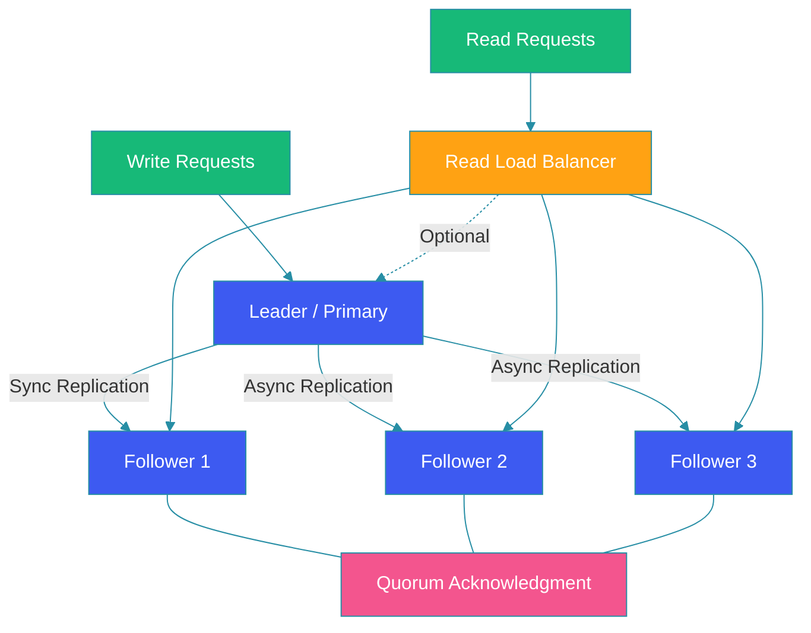

# Database Replication Strategies

## Overview

Database replication is the process of copying data from one database server to another to ensure high availability, fault tolerance, and read scalability. This guide examines replication strategies—leader-follower, multi-leader, quorum-based—and addresses replication lag, conflict resolution, and practical implementation.

## Replication Diagram



## Leader-Follower Replication

One node accepts writes; followers replicate changes.

```java
@Configuration
public class DataSourceConfig {

    @Bean
    @Primary
    @ConfigurationProperties("spring.datasource.leader")
    public DataSource leaderDataSource() {
        return DataSourceBuilder.create()
            .url("jdbc:postgresql://leader:5432/db")
            .build();
    }

    @Bean
    @ConfigurationProperties("spring.datasource.follower1")
    public DataSource follower1DataSource() {
        return DataSourceBuilder.create()
            .url("jdbc:postgresql://follower1:5432/db")
            .build();
    }

    @Bean
    public RoutingDataSource routingDataSource() {
        RoutingDataSource router = new RoutingDataSource();
        Map<Object, Object> targets = new HashMap<>();
        targets.put("leader", leaderDataSource());
        targets.put("follower1", follower1DataSource());
        router.setDefaultTargetDataSource(leaderDataSource());
        router.setTargetDataSources(targets);
        return router;
    }
}
```

### Read/Write Splitting

```java
@Component
public class ReadWriteDataSource extends AbstractRoutingDataSource {

    @Override
    protected Object determineCurrentLookupKey() {
        return TransactionSynchronizationManager
            .isCurrentTransactionReadOnly()
            ? "follower1"
            : "leader";
    }
}

@Service
public class UserService {

    @Autowired
    private JdbcTemplate jdbc;

    @Transactional(readOnly = true)
    public User findUser(Long id) {
        // Routed to follower
        return jdbc.queryForObject(
            "SELECT * FROM users WHERE id = ?",
            userRowMapper, id
        );
    }

    @Transactional
    public void updateUser(User user) {
        // Routed to leader
        jdbc.update(
            "UPDATE users SET name = ? WHERE id = ?",
            user.getName(), user.getId()
        );
    }
}
```

## Multi-Leader Replication

Multiple leaders accept writes and replicate to each other.

```java
public class MultiLeaderConfig {

    // Application handles conflict resolution
    public void replicateToOtherRegions(Entity entity) {
        // Write to local leader
        localLeader.save(entity);

        // Async replication to other regions
        asyncReplicator.submit(() -> {
            try {
                regionEastLeader.replicate(entity);
                regionWestLeader.replicate(entity);
            } catch (ConflictException e) {
                conflictResolver.resolve(entity, e.getConflictingVersion());
            }
        });
    }
}
```

### Conflict Resolution Strategies

```java
@Component
public class ConflictResolver {

    enum Strategy {
        LAST_WRITE_WINS,
        TIMESTAMP_BASED,
        CRDT,
        APPLICATION_MERGED
    }

    public Entity resolve(Entity local, Entity remote) {
        // Last-writer-wins (LWW) using timestamps
        if (local.getUpdatedAt().isAfter(remote.getUpdatedAt())) {
            return local;
        }
        return remote;
    }

    // CRDT-based merge for counters and sets
    public MergeResult merge(CRDT local, CRDT remote) {
        // CRDTs guarantee convergence without conflicts
        return local.merge(remote);
    }
}
```

## Quorum-Based Replication

Replicas acknowledge writes for consistency.

```java
@Component
public class QuorumWriter {

    private final List<ReplicaNode> replicas;
    private final int writeQuorum = 3; // W
    private final int readQuorum = 3;  // R

    public QuorumWriter(List<ReplicaNode> replicas) {
        this.replicas = replicas;
    }

    public boolean quorumWrite(Record record) {
        AtomicInteger acks = new AtomicInteger();
        CountDownLatch latch = new CountDownLatch(replicas.size());

        for (ReplicaNode replica : replicas) {
            asyncReplicator.submit(() -> {
                try {
                    replica.write(record);
                    acks.incrementAndGet();
                } catch (Exception e) {
                    log.error("Replica write failed", e);
                } finally {
                    latch.countDown();
                }
            });
        }

        try {
            latch.await(5, TimeUnit.SECONDS);
        } catch (InterruptedException e) {
            Thread.currentThread().interrupt();
        }

        return acks.get() >= writeQuorum;
    }
}
```

## Synchronous vs Asynchronous

| Aspect | Synchronous | Asynchronous |
|--------|-------------|--------------|
| **Consistency** | Strong | Eventually consistent |
| **Latency** | Higher (wait for replicas) | Lower (fire and forget) |
| **Durability** | Guaranteed | Potential data loss |
| **Availability** | Lower if replicas fail | Higher (tolerant of failures) |
| **Use Case** | Financial transactions | Logs, analytics |

## Handling Replication Lag

```java
@Component
public class ReplicationLagMonitor {

    @Autowired
    private JdbcTemplate jdbc;

    public ReplicationStatus checkLag() {
        Map<String, Duration> lags = new HashMap<>();

        for (String replica : List.of("follower1", "follower2")) {
            Duration lag = jdbc.queryForObject(
                """
                SELECT CASE
                    WHEN pg_last_wal_receive_lsn() = pg_last_wal_replay_lsn()
                    THEN 0
                    ELSE COALESCE(
                        EXTRACT(SECOND FROM NOW() - pg_last_xact_replay_timestamp()),
                        999
                    )
                END AS lag_seconds
                """,
                Duration.class
            );
            lags.put(replica, lag);
        }

        return new ReplicationStatus(lags);
    }

    @Scheduled(fixedRate = 10000)
    public void alertOnHighLag() {
        ReplicationStatus status = checkLag();
        for (var entry : status.getLags().entrySet()) {
            if (entry.getValue().toSeconds() > 30) {
                alertService.sendAlert(
                    "High replication lag on " + entry.getKey()
                        + ": " + entry.getValue().toSeconds() + "s"
                );
            }
        }
    }
}
### Stale Read Prevention

```java
@Service
public class StaleReadAvoider {

    // Route reads to leader if stale data is unacceptable
    public Order getRecentOrder(Long orderId) {
        return TransactionSynchronizationManager
            .isCurrentTransactionReadOnly()
            ? followerRepo.findById(orderId)
            : leaderRepo.findById(orderId);
    }

    // Use version numbers to detect stale reads
    public Product getProduct(String sku, long expectedVersion) {
        Product product = cache.get(sku);
        if (product != null && product.getVersion() >= expectedVersion) {
            return product;
        }
        // Cache miss or stale - read from leader
        return leaderRepo.findBySku(sku);
    }
}
```

## Best Practices

1. **Monitor replication lag**: Alert when lag exceeds acceptable thresholds.

2. **Use read replicas for scaling**: Distribute read queries across followers.

3. **Choose quorum based on consistency needs**: W+R > N for strong consistency.

4. **Plan for failover**: Automate leader election with tools like Patroni or Consul.

5. **Avoid stale reads**: Route consistency-sensitive queries to the leader.

6. **Test conflict resolution**: Especially for multi-leader setups.

## Common Mistakes

1. **Assuming synchronous everywhere**: Sync replication reduces availability.

2. **Ignoring replication lag**: Stale reads cause application bugs.

3. **No failover automation**: Manual failover results in extended downtime.

4. **Single-leader bottleneck**: All writes go through one node; plan for write scaling.

5. **Conflict resolution naivety**: LWW alone loses data; use CRDTs or application logic.

## Summary

Replication is fundamental to database high availability and scalability. Leader-follower is simplest for read scaling. Multi-leader handles multi-region writes but requires conflict resolution. Quorum-based replication offers tunable consistency. Always monitor lag, automate failover, and design for the consistency requirements of your application.

---

## References

- [PostgreSQL Replication](https://www.postgresql.org/docs/current/high-availability.html)
- [DynamoDB Replication](https://aws.amazon.com/dynamodb/)
- [Raft Consensus Protocol](https://raft.github.io/)
- [CRDTs Explained](https://crdt.tech/)
