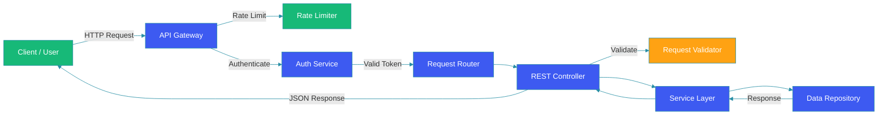

# RESTful API Design

## Overview

REST (Representational State Transfer) is an architectural style for designing networked applications. RESTful APIs use HTTP methods to operate on resources, providing a stateless, cacheable, and uniform interface. This guide covers REST principles, resource modeling, pagination, HATEOAS, versioning, and documentation with OpenAPI.

## Request Flow Diagram



## REST Principles

### Resource Modeling

```java
// Resource representation
@GetMapping("/api/v1/users/{userId}")
public ResponseEntity<UserResponse> getUser(@PathVariable Long userId) {
    User user = userService.findById(userId);
    return ResponseEntity.ok(UserResponse.from(user));
}

@PostMapping("/api/v1/users")
public ResponseEntity<UserResponse> createUser(@Valid @RequestBody CreateUserRequest request) {
    User user = userService.create(request);
    URI location = ServletUriComponentsBuilder
        .fromCurrentRequest()
        .path("/{id}")
        .buildAndExpand(user.getId())
        .toUri();
    return ResponseEntity.created(location).body(UserResponse.from(user));
}

@PutMapping("/api/v1/users/{userId}")
public ResponseEntity<UserResponse> updateUser(
        @PathVariable Long userId,
        @Valid @RequestBody UpdateUserRequest request) {
    User user = userService.update(userId, request);
    return ResponseEntity.ok(UserResponse.from(user));
}

@DeleteMapping("/api/v1/users/{userId}")
public ResponseEntity<Void> deleteUser(@PathVariable Long userId) {
    userService.delete(userId);
    return ResponseEntity.noContent().build();
}
```

## HTTP Methods and Status Codes

| Method | Action | Success Code | Error Codes |
|--------|--------|--------------|-------------|
| **GET** | Retrieve | 200 OK | 404 Not Found |
| **POST** | Create | 201 Created | 400 Bad Request |
| **PUT** | Replace | 200 OK | 404, 409 Conflict |
| **PATCH** | Partial update | 200 OK | 400, 422 |
| **DELETE** | Remove | 204 No Content | 404 |

### Error Response Handling

```java
@RestControllerAdvice
public class GlobalExceptionHandler {

    @ExceptionHandler(ResourceNotFoundException.class)
    public ResponseEntity<ErrorResponse> handleNotFound(ResourceNotFoundException ex) {
        ErrorResponse error = ErrorResponse.builder()
            .status(HttpStatus.NOT_FOUND.value())
            .code("RESOURCE_NOT_FOUND")
            .message(ex.getMessage())
            .timestamp(Instant.now())
            .build();
        return ResponseEntity.status(HttpStatus.NOT_FOUND).body(error);
    }

    @ExceptionHandler(ValidationException.class)
    public ResponseEntity<ErrorResponse> handleValidation(ValidationException ex) {
        ErrorResponse error = ErrorResponse.builder()
            .status(HttpStatus.BAD_REQUEST.value())
            .code("VALIDATION_ERROR")
            .message("Validation failed")
            .details(ex.getErrors())
            .timestamp(Instant.now())
            .build();
        return ResponseEntity.badRequest().body(error);
    }

    @ExceptionHandler(MethodArgumentNotValidException.class)
    public ResponseEntity<ErrorResponse> handleMethodArgumentNotValid(
            MethodArgumentNotValidException ex) {
        List<FieldError> fieldErrors = ex.getBindingResult()
            .getFieldErrors()
            .stream()
            .map(fe -> new FieldError(fe.getField(), fe.getDefaultMessage()))
            .toList();

        ErrorResponse error = ErrorResponse.builder()
            .status(HttpStatus.BAD_REQUEST.value())
            .code("VALIDATION_ERROR")
            .message("Validation failed")
            .details(fieldErrors)
            .timestamp(Instant.now())
            .build();
        return ResponseEntity.badRequest().body(error);
    }
}
```

## Pagination

```java
public class PageRequest {
    private int page = 0;
    private int size = 20;
    private String sort;
    private String direction = "asc";
}

@GetMapping("/api/v1/products")
public ResponseEntity<Page<ProductResponse>> getProducts(
        @RequestParam(defaultValue = "0") int page,
        @RequestParam(defaultValue = "20") int size,
        @RequestParam(defaultValue = "name") String sort,
        @RequestParam(defaultValue = "asc") String direction) {

    Pageable pageable = PageRequest.of(page, size,
        Sort.by(Sort.Direction.fromString(direction), sort));

    Page<Product> products = productService.findAll(pageable);

    // Cursor-based pagination for high-volume endpoints
    return ResponseEntity.ok()
        .header("X-Total-Count", String.valueOf(products.getTotalElements()))
        .header("Link", buildLinkHeaders(products))
        .body(products.map(ProductResponse::from));
}

private String buildLinkHeaders(Page<?> page) {
    StringBuilder links = new StringBuilder();
    if (page.hasNext()) {
        links.append("<")
            .append("/api/v1/products?page=")
            .append(page.nextPageable().getPageNumber())
            .append("&size=").append(page.getSize())
            .append(">; rel=\"next\", ");
    }
    if (page.hasPrevious()) {
        links.append("<")
            .append("/api/v1/products?page=")
            .append(page.previousPageable().getPageNumber())
            .append("&size=").append(page.getSize())
            .append(">; rel=\"prev\"");
    }
    return links.toString();
}
```

## HATEOAS

```java
@GetMapping("/api/v1/orders/{orderId}")
public EntityModel<OrderResponse> getOrder(@PathVariable Long orderId) {
    Order order = orderService.findById(orderId);

    return EntityModel.of(OrderResponse.from(order),
        linkTo(methodOn(OrderController.class).getOrder(orderId)).withSelfRel(),
        linkTo(methodOn(OrderController.class).cancelOrder(orderId))
            .withRel("cancel"),
        linkTo(methodOn(PaymentController.class)
            .getPaymentForOrder(orderId))
            .withRel("payment"),
        linkTo(methodOn(OrderController.class)
            .getOrderItems(orderId))
            .withRel("items")
    );
}
```

## API Versioning

### URI Versioning

```java
@RestController
@RequestMapping("/api/v1/users")
public class UserControllerV1 {
    // v1 implementation
}

@RestController
@RequestMapping("/api/v2/users")
public class UserControllerV2 {
    // v2 with additional fields
}
```

### Header Versioning

```java
@GetMapping(value = "/api/users", headers = "X-API-Version=1")
public ResponseEntity<UserResponseV1> getUsersV1() {
    return ResponseEntity.ok(userService.findAllV1());
}

@GetMapping(value = "/api/users", headers = "X-API-Version=2")
public ResponseEntity<UserResponseV2> getUsersV2() {
    return ResponseEntity.ok(userService.findAllV2());
}
```

## OpenAPI / Swagger Specification

```java
@Configuration
public class OpenApiConfig {

    @Bean
    public OpenAPI customOpenAPI() {
        return new OpenAPI()
            .info(new Info()
                .title("E-Commerce API")
                .version("2.0.0")
                .description("RESTful API for e-commerce platform")
                .contact(new Contact()
                    .name("API Team")
                    .email("api@company.com")))
            .addSecurityItem(new SecurityRequirement()
                .addList("bearerAuth"))
            .components(new Components()
                .addSecuritySchemes("bearerAuth",
                    new SecurityScheme()
                        .type(SecurityScheme.Type.HTTP)
                        .scheme("bearer")
                        .bearerFormat("JWT")));
    }
}
```

## Best Practices

1. **Use nouns for resources**: `/users`, not `/getUsers` or `/listUsers`.

2. **Plural resource names**: `/users`, `/products`, `/orders`.

3. **Consistent error format**: Return structured JSON errors with codes.

4. **Version your API**: Start with versioning from day one.

5. **Use pagination for lists**: Never return unbounded collections.

6. **Set proper cache headers**: Use ETag and Cache-Control for performance.

7. **Secure with HTTPS**: Always use TLS in production.

## Common Mistakes

1. **Returning raw IDs**: Encode relationships, not just IDs.

2. **No pagination**: Returning all records in one response.

3. **Inconsistent error format**: Different error shapes confuse clients.

4. **Over-fetching data**: Return only what the client needs.

5. **Ignoring idempotency**: PUT and DELETE should be idempotent.

## Summary

RESTful APIs provide a uniform, scalable way to build web services. Focus on resource modeling with nouns, use HTTP methods correctly, provide consistent error handling, and document with OpenAPI. Version early, paginate always, and leverage HATEOAS for discoverable APIs.

---

## References

- [RESTful Web Services](https://restfulapi.net/)
- [OpenAPI Specification](https://swagger.io/specification/)
- [Spring REST Docs](https://spring.io/projects/spring-restdocs)
- [Microsoft REST API Guidelines](https://github.com/microsoft/api-guidelines)
