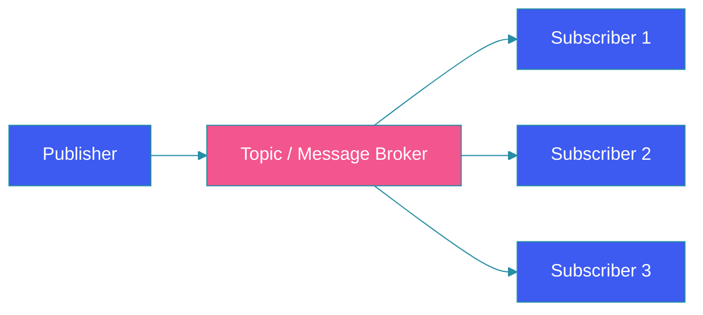

# Pub-Sub Model

## Overview

The publish-subscribe (pub-sub) pattern is a messaging pattern that enables loose coupling between message producers and consumers. In pub-sub, messages are published to topics without knowing who (if anyone) will receive them, and subscribers express interest in specific topics without knowing who (if anyone) will publish to them.

This guide explores pub-sub fundamentals, message broker implementations, pattern variations, and practical strategies for building event-driven systems.

## Problem Statement

Traditional point-to-point messaging creates tight coupling:

**Synchronous Dependencies**: The sender must know about the receiver; if the receiver changes, sender code may need changes.

**Scalability Limits**: Adding more consumers requires changing producer code.

**Failure Propagation**: If one consumer fails, it can block producers.

**Complexity**: New consumers require changes across all producers.

Pub-sub solves these by decoupling producers from consumers.

## Pub-Sub Architecture

```
┌─────────────────────────────────────────────────────────────────┐
│                 Pub-Sub Architecture                       │
├─────────────────────────────────────────────────────────────────┤
│                                                          │
│  ┌─────────────┐         ┌──────────────────────────────┐  │
│  │  Producer  │         │    Message Broker           │  │
│  │     │      │         │  ┌───────────────────────┐  │  │
│  │     │      │────────▶│  │   Topic Router      │  │  │
│  │   [Msg]   │         │  └───────────────────────┘  │  │
│  └─────────────┘         └──────────┬───────────────┘  │
│                                     │                 │
│                    ┌────────────────┼────────────────┐ │
│                    │                │                │ │
│                    ▼                ▼                ▼ │
│             ┌────────────┐  ┌────────────┐  ┌───────────┐│
│             │ Consumer 1 │  │ Consumer 2 │  │Consumer 3 ││
│             │  [Topic A] │  │  [Topic A]│  │ [Topic B] ││
│             │            │  │  [Topic B]│  │           ││
│             └────────────┘  └────────────┘  └───────────┘│
└────────────────��──────────────────────────────────────────────┘
```

## Message Broker Implementation

### Topic Subscription Model

```java
public interface MessageBroker {
    
    // Publish a message to a topic
    void publish(String topic, Message message);
    
    // Subscribe to a topic
    void subscribe(String topic, MessageConsumer consumer);
    
    // Unsubscribe
    void unsubscribe(String topic, MessageConsumer consumer);
}
```

### Basic Implementation

```java
@Component
public class SimpleMessageBroker implements MessageBroker {
    
    private final Map<String, List<MessageConsumer>> subscribers = new ConcurrentHashMap<>();
    private final Map<String, List<Message>> messageStore = new ConcurrentHashMap<>();
    
    @Override
    public void publish(String topic, Message message) {
        // Save message
        messageStore.computeIfAbsent(topic, k -> new CopyOnWriteArrayList<>())
            .add(message);
        
        // Notify subscribers
        List<MessageConsumer> topicSubs = subscribers.get(topic);
        if (topicSubs != null) {
            for (MessageConsumer consumer : topicSubs) {
                try {
                    consumer.consume(message);
                } catch (Exception e) {
                    log.error("Error consuming message", e);
                }
            }
        }
    }
    
    @Override
    public void subscribe(String topic, MessageConsumer consumer) {
        subscribers.computeIfAbsent(topic, k -> new CopyOnWriteArrayList<>())
            .add(consumer);
    }
}
```

## Message Patterns

### Point-to-Point vs Pub-Sub

| Aspect | Point-to-Point | Pub-Sub |
|--------|---------------|---------|
| **Delivery** | One consumer | All subscribers |
| **Coupling** | Sender knows receiver | Unknown consumers |
| **Timing** | Synchrounous often | Asynchronous |
| **Failure** | Blocks producer | Non-blocking |
| **Scale** | Consumer limited | Unlimited |

### Fire-and-Forget

```java
public class FireAndForgetPublisher {
    
    public void publish(String topic, Message message) {
        // Fire and forget - don't wait for acknowledgment
        asyncRunner.run(() -> broker.publish(topic, message));
    }
}
```

### Guaranteed Delivery

```java
public class GuaranteedDeliveryPublisher {
    
    public void publish(String topic, Message message) {
        // Store message with ID
        String messageId = generateId();
        MessageRecord record = MessageRecord.builder()
            .id(messageId)
            .topic(topic)
            .message(message)
            .status(PUBLISHED)
            .build();
        
        messageStore.save(record);
        
        // Publish
        broker.publish(topic, message);
        
        // Wait for acknowledgment
        awaitAcknowledgment(messageId, Duration.ofSeconds(30));
    }
}
```

### Exactly-Once Delivery

```java
public class ExactlyOnceDelivery {
    
    public void deliver(Message message) {
        String messageId = message.getId();
        
        // Check if already processed
        if (acknowledgedStore.exists(messageId)) {
            return;
        }
        
        // Process
        process(message);
        
        // Acknowledge (idempotent)
        acknowledgedStore.save(messageId);
    }
}
```

## Message Filtering

### Content-Based Filtering

```java
@Component
public class ContentBasedFilter {
    
    public void subscribe(String topic, MessageFilter filter, Consumer consumer) {
        broker.subscribe(topic, message -> {
            if (filter.matches(message)) {
                consumer.consume(message);
            }
        });
    }
}

public class MessageFilter {
    private final Map<String, Object> criteria;
    
    public boolean matches(Message message) {
        for (Map.Entry<String, Object> entry : criteria.entrySet()) {
            Object value = message.getHeader(entry.getKey());
            if (!Objects.equals(value, entry.getValue())) {
                return false;
            }
        }
        return true;
    }
}
```

### Topic Hierarchies

```
┌─────────────────────────────────────────────────────────────────┐
│                 Topic Hierarchy Example                           │
├─────────────────────────────────────────────────────────────────┤
│                                                          │
│  orders.created                                              │
│      ├── orders.created.{region}                             │
│      │   ├── orders.created.us-east                          │
│      │   ├── orders.created.eu-west                        │
│      │   └── orders.created.ap-south                     │
│      │                                                    │
│      ├── orders.created.{status}                           │
│      │   ├── orders.created.pending                       │
│      │   ├── orders.created.confirmed                     │
│      │   └── orders.created.shipped                      │
│      │                                                    │
│      └── orders.created.{customerId}                        │
│          ├── orders.created.cust123                          │
│          └── cust456                                       │
└───────────────────────────────────────────────────────────────┘
```

```java
public class TopicMatcher {
    
    public boolean matches(String subscription, String topic) {
        if (subscription.equals(topic)) {
            return true;
        }
        
        if (subscription.endsWith(".*")) {
            String prefix = subscription.substring(0, subscription.length() - 2);
            return topic.startsWith(prefix);
        }
        
        if (subscription.endsWith("#")) {
            String prefix = subscription.substring(0, subscription.length() - 1);
            return topic.startsWith(prefix);
        }
        
        return false;
    }
}
```

## Message Ordering

### FIFO (First-In-First-Out)

```java
@Component
public class OrderedPublisher {
    
    public void publishToPartition(String topic, String key, Message message) {
        // Partition by key to ensure ordering
        int partition = Math.abs(key.hashCode()) % PARTITION_COUNT;
        publishToPartition(topic, partition, message);
    }
}
```

### Partial Ordering

```java
// Within a partition, preserve order
// Between partitions, ordering not guaranteed
public class PartitionedMessageBroker {
    
    private final List<List<MessageConsumer>> partitions = new ArrayList<>();
    
    public void publish(String topic, Message message) {
        String key = message.getKey();
        int partition = getPartition(key);
        
        for (Consumer c : partitions.get(partition)) {
            c.consume(message);
        }
    }
}
```

## Message Durability

### Persistent Storage

```java
public class PersistentMessageBroker {
    
    public void publish(String topic, Message message) {
        // Store message
        String messageId = generateId();
        messageStore.save(MessageEntity.builder()
            .id(messageId)
            .topic(topic)
            .payload(message.getPayload())
            .headers(message.getHeaders())
            .status(PERSISTED)
            .build());
        
        // Notify
        notificationService.notify(topic);
    }
}
```

### Durable Subscriptions

```java
public class DurableSubscription {
    
    public void subscribe(String topic, String subscriberId, Consumer consumer) {
        // Store subscription
        subscriptionStore.save(SubscriptionEntity.builder()
            .topic(topic)
            .subscriberId(subscriberId)
            .status(ACTIVE)
            .build());
        
        // Replay missed messages
        replayMissedMessages(topic, subscriberId);
    }
}
```

## Implementation with Message Brokers

### Kafka Implementation

```java
@Configuration
public class KafkaConfig {
    
    @Bean
    public KafkaTemplate<String, byte[]> kafkaTemplate() {
        return new KafkaTemplate<>(producerFactory());
    }
    
    @Bean
    public ConsumerFactory<String, byte[]> consumerFactory() {
        return new DefaultKafkaConsumerFactory<>(consumerConfigs());
    }
    
    @Bean
    public KafkaListenerContainerFactory kafkaListenerContainerFactory() {
        ConcurrentKafkaListenerContainerFactory factory = 
            new ConcurrentKafkaListenerContainerFactory<>();
        factory.setConsumerFactory(consumerFactory());
        return factory;
    }
}
```

```java
@Service
public class KafkaPublisher {
    
    @Autowired
    private KafkaTemplate<String, byte[]> template;
    
    public void publish(String topic, String key, Message message) {
        template.send(topic, key, serialize(message));
    }
}
```

```java
@Service
public class KafkaConsumer {
    
    @KafkaListener(topics = "orders", groupId = "order-processor")
    public void consume(ConsumerRecord<String, byte[]> record) {
        Message message = deserialize(record.value());
        process(message);
    }
}
```

### RabbitMQ Implementation

```java
@Configuration
public class RabbitMQConfig {
    
    @Bean
    public TopicExchange orderExchange() {
        return new TopicExchange("orders");
    }
    
    @Bean
    public Queue orderQueue() {
        return QueueBuilder.durable("orders.queue")
            .withArgument("x-dead-letter-exchange", "orders.dlx")
            .build();
    }
    
    @Bean
    public Binding orderBinding(Queue orderQueue, TopicExchange orderExchange) {
        return BindingBuilder
            .bind(orderQueue)
            .to(orderExchange)
            .with("orders.*");
    }
}
```

```java
@Service
public class RabbitMQPublisher {
    
    @Autowired
    private RabbitTemplate template;
    
    public void publish(String routingKey, Message message) {
        template.convertAndSend("orders", routingKey, message);
    }
}
```

```java
@Service
public class RabbitMQConsumer {
    
    @RabbitListener(queues = "orders.queue")
    public void consume(Message message) {
        process(message);
    }
}
```

## Architecture Diagram



## Best Practices

1. **Use meaningful topics**: Name topics for what they represent.

2. **Version messages**: Include version in message schema.

3. **Idempotent consumers**: Process messages safely multiple times.

4. **Monitor consuming**: Track lag and errors.

5. **Handle failures**: Dead letter queues for failed messages.

## Common Mistakes

1. **Tight coupling via topics**: Subscribers knowing too much.

2. **No versioning**: Breaking changes to messages.

3. **Lost messages**: Not using durable subscriptions.

4. **No ordering**: Messages out of sequence.

## Summary

The publish-subscribe pattern is foundational for event-driven architectures. Key points: use meaningful topic names, version messages, make consumers idempotent, handle failures with dead letter queues. Combined with message durability and ordered delivery, pub-sub enables scalable, decoupled systems.

---

## References

- [Kafka Documentation](https://kafka.apache.org/)
- [RabbitMQ Tutorials](https://www.rabbitmq.com/)
- [AWS SNS](https://aws.amazon.com/sns/)
- [Google Cloud Pub/Sub](https://cloud.google.com/pubsub)