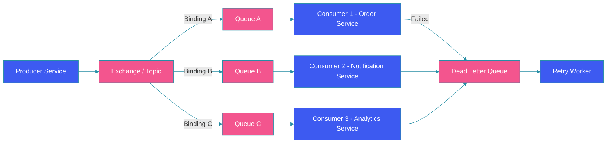

# Message Queues

## Overview

Message queues enable asynchronous communication between distributed system components. Producers send messages to a queue, and consumers process them independently. This decoupling improves reliability, scalability, and fault tolerance. This guide covers queue fundamentals, RabbitMQ and SQS, exchange types, consumer patterns, and delivery semantics.

## Architecture Diagram



## Queue Fundamentals

### Basic Queue Implementation

```java
@Component
public class MessageProducer {

    @Autowired
    private RabbitTemplate rabbitTemplate;

    public void sendOrder(OrderEvent event) {
        Message message = MessageBuilder
            .withBody(serialize(event))
            .setHeader("messageType", "ORDER_CREATED")
            .setHeader("version", "1.0")
            .setCorrelationId(event.getOrderId())
            .setDeliveryMode(MessageDeliveryMode.PERSISTENT)
            .build();

        rabbitTemplate.send("order.exchange", "order.created", message);
    }
}
```

## RabbitMQ vs SQS

| Feature | RabbitMQ | AWS SQS |
|---------|----------|---------|
| **Model** | Broker with exchanges | Fully managed queue |
| **Routing** | Multiple exchange types | Single queue |
| **Ordering** | FIFO per queue | Best-effort / FIFO |
| **Retention** | Until consumed | Up to 14 days |
| **Scale** | Vertical + clustering | Infinite horizontal |
| **Protocol** | AMQP 0-9-1 | HTTPS / HTTP |

## Exchanges, Queues, and Bindings

### Exchange Types

```java
@Configuration
public class RabbitMQConfig {

    @Bean
    public DirectExchange directExchange() {
        return new DirectExchange("order.direct");
    }

    @Bean
    public TopicExchange topicExchange() {
        return ExchangeBuilder.topicExchange("order.topic")
            .durable(true)
            .build();
    }

    @Bean
    public FanoutExchange fanoutExchange() {
        return ExchangeBuilder.fanoutExchange("event.fanout")
            .durable(true)
            .build();
    }

    @Bean
    public Queue orderQueue() {
        return QueueBuilder.durable("order.queue")
            .withArgument("x-dead-letter-exchange", "order.dlx")
            .withArgument("x-dead-letter-routing-key", "order.dead")
            .withArgument("x-message-ttl", 300000)
            .withArgument("x-max-length", 10000)
            .build();
    }

    @Bean
    public Queue notificationQueue() {
        return QueueBuilder.durable("notification.queue")
            .build();
    }

    @Bean
    public Binding orderBinding(Queue orderQueue, TopicExchange exchange) {
        return BindingBuilder
            .bind(orderQueue)
            .to(exchange)
            .with("order.*");
    }

    @Bean
    public Binding notificationBinding(Queue notificationQueue, TopicExchange exchange) {
        return BindingBuilder
            .bind(notificationQueue)
            .to(exchange)
            .with("notification.#");
    }
}
```

## Consumer Patterns

### Pull Consumer

```java
@Service
public class SQSPollingConsumer {

    @Autowired
    private SqsAsyncClient sqsClient;

    @Scheduled(fixedDelay = 100)
    public void pollMessages() {
        ReceiveMessageRequest request = ReceiveMessageRequest.builder()
            .queueUrl("https://sqs.region.amazonaws.com/account/orders")
            .maxNumberOfMessages(10)
            .waitTimeSeconds(20)
            .visibilityTimeout(30)
            .build();

        sqsClient.receiveMessage(request)
            .thenApply(ReceiveMessageResponse::messages)
            .thenCompose(messages -> {
                List<CompletableFuture<Void>> futures = messages.stream()
                    .map(this::processMessage)
                    .toList();
                return CompletableFuture.allOf(
                    futures.toArray(new CompletableFuture[0]));
            });
    }

    private CompletableFuture<Void> processMessage(Message message) {
        OrderEvent event = deserialize(message.body());
        return orderService.processOrder(event)
            .thenCompose(v -> {
                DeleteMessageRequest delete = DeleteMessageRequest.builder()
                    .queueUrl("https://sqs.region.amazonaws.com/account/orders")
                    .receiptHandle(message.receiptHandle())
                    .build();
                return sqsClient.deleteMessage(delete);
            })
            .exceptionally(e -> {
                log.error("Failed to process message", e);
                return null;
            });
    }
}
```

### Push Consumer (RabbitMQ)

```java
@Service
public class RabbitMQConsumer {

    @RabbitListener(
        queues = "order.queue",
        containerFactory = "rabbitListenerContainerFactory",
        concurrency = "3-10"
    )
    public void handleOrder(OrderEvent event, Channel channel,
                           @Header(AmqpHeaders.DELIVERY_TAG) long tag) {
        try {
            orderService.processOrder(event);
            channel.basicAck(tag, false);
        } catch (RetryableException e) {
            channel.basicNack(tag, false, true);
        } catch (NonRetryableException e) {
            channel.basicNack(tag, false, false);
        }
    }
}
```

## Delivery Semantics

### At-Most-Once

```java
@Service
public class AtMostOnceProducer {

    @Autowired
    private RabbitTemplate template;

    public void sendTelemetry(TelemetryEvent event) {
        // Fire-and-forget; message may be lost
        template.setConfirmCallback(null);
        template.convertAndSend("telemetry.topic", "telemetry.event", event);
    }
}
```

### At-Least-Once

```java
@Service
public class AtLeastOnceProducer {

    @Autowired
    private RabbitTemplate template;

    public void sendImportantNotification(Notification notification) {
        template.setConfirmCallback((correlationData, ack, cause) -> {
            if (!ack) {
                // Retry on failure
                retryQueue.add(notification);
                log.warn("Notification not acknowledged, queued for retry");
            }
        });

        CorrelationData correlation = new CorrelationData(notification.getId());
        template.convertAndSend("notification.topic", "notification.send",
            notification, correlation);
    }
}
```

### Idempotent Consumer

```java
@Component
public class IdempotentConsumer {

    @Autowired
    private RedisTemplate<String, String> redis;

    public boolean processIfNotDuplicated(String messageId, Runnable processor) {
        // SET NX ensures idempotency
        Boolean wasSet = redis.opsForValue()
            .setIfAbsent("processed:" + messageId, "1", Duration.ofHours(24));

        if (Boolean.TRUE.equals(wasSet)) {
            processor.run();
            return true;
        }
        return false; // Already processed
    }
}
```

## Dead Letter Queues

```java
@Configuration
public class DeadLetterConfig {

    @Bean
    public DirectExchange deadLetterExchange() {
        return new DirectExchange("order.dlx");
    }

    @Bean
    public Queue deadLetterQueue() {
        return QueueBuilder.durable("order.dlq")
            .build();
    }

    @Bean
    public Binding deadLetterBinding() {
        return BindingBuilder
            .bind(deadLetterQueue())
            .to(deadLetterExchange())
            .with("order.dead");
    }
}
```

## Best Practices

1. **Use dead letter queues**: Capture failed messages for analysis and retry.

2. **Set message TTL**: Prevent messages from living indefinitely.

3. **Implement idempotent consumers**: Handle duplicate deliveries safely.

4. **Use appropriate concurrency**: Tune consumer threads based on workload.

5. **Monitor queue depth**: Alert on growing backlogs.

6. **Batch where possible**: Reduce overhead by processing messages in batches.

## Common Mistakes

1. **No DLQ configuration**: Failed messages are lost forever.

2. **Unbounded queue growth**: No TTL or max-length leads to memory issues.

3. **Blocking consumers**: Slow consumers back up the entire queue.

4. **Missing idempotency**: Duplicates cause data corruption.

5. **Sync processing**: Blocking on downstream services defeats queue purpose.

## Summary

Message queues decouple producers and consumers, improving system resilience and scalability. Choose RabbitMQ for rich routing and SQS for fully managed scale. Always configure DLQs, implement idempotent consumers, and monitor queue depth. Delivery semantics—at-most-once, at-least-once, exactly-once—define your reliability guarantees.

---

## References

- [RabbitMQ Documentation](https://www.rabbitmq.com/documentation.html)
- [AWS SQS Documentation](https://aws.amazon.com/sqs/)
- [AMQP 0-9-1 Specification](https://www.amqp.org/)
- [Spring AMQP Reference](https://docs.spring.io/spring-amqp/reference/)
