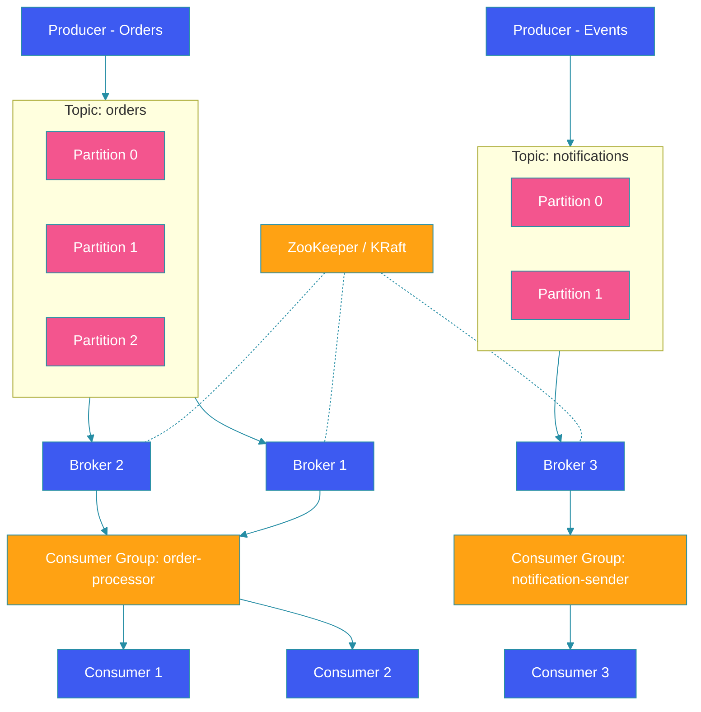

# Apache Kafka Deep Dive

## Overview

Apache Kafka is a distributed streaming platform for building real-time data pipelines and streaming applications. Unlike traditional message queues, Kafka provides durable storage, replayability, and horizontal scalability. This guide covers topics, partitions, consumer groups, offset management, exactly-once semantics, Kafka Connect, and Kafka Streams.

## Kafka Architecture Diagram



## Topics and Partitions

### Creating Topics

```java
@Configuration
public class KafkaTopicConfig {

    @Bean
    public NewItem ordersTopic() {
        return TopicBuilder.name("orders")
            .partitions(6)
            .replicas(3)
            .config(TopicConfig.RETENTION_MS_CONFIG, "604800000")
            .config(TopicConfig.COMPRESSION_TYPE_CONFIG, "snappy")
            .config(TopicConfig.CLEANUP_POLICY_CONFIG, "delete")
            .build();
    }

    @Bean
    public NewItem eventsTopic() {
        return TopicBuilder.name("user-events")
            .partitions(12)
            .replicas(3)
            .config(TopicConfig.RETENTION_MS_CONFIG, "2592000000")
            .config(TopicConfig.COMPRESSION_TYPE_CONFIG, "lz4")
            .build();
    }
}
```

### Producing Messages

```java
@Service
public class OrderEventProducer {

    @Autowired
    private KafkaTemplate<String, OrderEvent> kafkaTemplate;

    public void sendOrderCreated(OrderEvent event) {
        // Partition by orderId for ordering guarantees
        ProducerRecord<String, OrderEvent> record = new ProducerRecord<>(
            "orders",
            event.getOrderId(),
            event
        );

        record.headers().add("eventType", "ORDER_CREATED".getBytes());
        record.headers().add("version", "1.0".getBytes());

        kafkaTemplate.send(record)
            .whenComplete((result, ex) -> {
                if (ex != null) {
                    log.error("Failed to send order event", ex);
                    failedEventsStore.save(event);
                } else {
                    log.info("Order event sent offset={} partition={}",
                        result.getRecordMetadata().offset(),
                        result.getRecordMetadata().partition());
                }
            });
    }
}
```

## Consumer Groups and Offset Management

```java
@Service
public class OrderConsumer {

    @KafkaListener(
        topics = "orders",
        groupId = "order-processor",
        concurrency = "3",
        containerFactory = "kafkaListenerContainerFactory"
    )
    @RetryableTopic(
        attempts = "3",
        backoff = @Backoff(delay = 1000, multiplier = 2),
        dltTopicSuffix = "-dlt"
    )
    public void processOrder(
            @Payload OrderEvent event,
            @Header(KafkaHeaders.OFFSET) long offset,
            @Header(KafkaHeaders.RECEIVED_PARTITION) int partition,
            Acknowledgment acknowledgment) {

        try {
            orderService.process(event);
            acknowledgment.acknowledge();
        } catch (Exception e) {
            log.error("Error processing order offset={} partition={}",
                offset, partition, e);
            throw e; // Triggers retry
        }
    }
}
```

### Manual Offset Management

```java
@Component
public class ManualOffsetConsumer {

    @Autowired
    private ConsumerFactory<String, OrderEvent> consumerFactory;

    public void consumeWithManualCommit() {
        try (Consumer<String, OrderEvent> consumer = consumerFactory.createConsumer()) {
            consumer.subscribe(List.of("orders"));

            while (true) {
                ConsumerRecords<String, OrderEvent> records =
                    consumer.poll(Duration.ofMillis(100));

                for (ConsumerRecord<String, OrderEvent> record : records) {
                    process(record);
                }

                // Commit offsets after batch processing
                consumer.commitSync(Duration.ofSeconds(5));
            }
        }
    }
}
```

## Exactly-Once Semantics

### Idempotent Producer

```java
@Configuration
public class KafkaProducerConfig {

    @Bean
    public ProducerFactory<String, OrderEvent> producerFactory() {
        Map<String, Object> props = new HashMap<>();
        props.put(ProducerConfig.ENABLE_IDEMPOTENCE_CONFIG, true);
        props.put(ProducerConfig.ACKS_CONFIG, "all");
        props.put(ProducerConfig.RETRIES_CONFIG, Integer.MAX_VALUE);
        props.put(ProducerConfig.MAX_IN_FLIGHT_REQUESTS_PER_CONNECTION, 5);
        props.put(ProducerConfig.TRANSACTIONAL_ID_CONFIG, "order-producer-1");

        return new DefaultKafkaProducerFactory<>(props);
    }

    @Bean
    public KafkaTemplate<String, OrderEvent> kafkaTemplate(
            ProducerFactory<String, OrderEvent> factory) {
        return new KafkaTemplate<>(factory);
    }
}
```

### Transactional Writes

```java
@Service
public class TransactionalOrderService {

    @Autowired
    private KafkaTemplate<String, OrderEvent> kafkaTemplate;

    public void placeOrderAndPublish(Order order) {
        kafkaTemplate.executeInTransaction(operations -> {
            // Save to database
            orderRepository.save(order);

            // Publish event within same transaction
            OrderEvent event = OrderEvent.from(order);
            operations.send("orders", order.getId(), event);
            operations.send("audit-log", order.getId(), AuditEvent.from(order));

            return true;
        });
    }
}
```

## Kafka Connect

```java
@Configuration
public class KafkaConnectConfig {

    @Bean
    public SourceConnector jdbcSourceConnector() {
        return new JdbcSourceConnector();
    }

    // JDBC Source Connector Configuration
    @Bean
    public Map<String, String> sourceConnectorProps() {
        return Map.of(
            "connector.class", "io.confluent.connect.jdbc.JdbcSourceConnector",
            "connection.url", "jdbc:postgresql://localhost:5432/orders",
            "table.whitelist", "orders",
            "mode", "incrementing",
            "incrementing.column.name", "id",
            "topic.prefix", "jdbc-",
            "poll.interval.ms", "5000"
        );
    }
}
```

## Kafka Streams

```java
@Component
public class OrderAggregationStream {

    @Autowired
    private StreamsBuilderFactoryBean streamsBuilder;

    @PostConstruct
    public void buildTopology() {
        StreamsBuilder builder = streamsBuilder.getObject();

        KStream<String, OrderEvent> orders = builder
            .stream("orders", Consumed.with(Serdes.String(), orderSerde()));

        // Aggregate by userId
        KTable<String, Long> orderCounts = orders
            .groupBy((key, order) -> order.getUserId())
            .count(Materialized.as("order-counts"));

        // Filter high-value orders
        KStream<String, OrderEvent> highValueOrders = orders
            .filter((key, order) ->
                order.getTotal().compareTo(new BigDecimal("1000")) > 0);

        // Join with user enrichment stream
        KTable<String, UserProfile> users = builder
            .table("users", Consumed.with(Serdes.String(), userSerde()));

        KStream<String, EnrichedOrder> enriched = highValueOrders
            .join(users,
                (order, user) -> new EnrichedOrder(order, user),
                Joined.with(Serdes.String(), orderSerde(), userSerde()));

        // Send to output topic
        enriched.to("high-value-orders",
            Produced.with(Serdes.String(), enrichedSerde()));
    }
}
```

## Spring Boot Kafka Configuration

```yaml
spring:
  kafka:
    bootstrap-servers: localhost:9092,localhost:9093
    producer:
      key-serializer: org.apache.kafka.common.serialization.StringSerializer
      value-serializer: org.springframework.kafka.support.serializer.JsonSerializer
      properties:
        enable.idempotence: true
        acks: all
        compression.type: snappy
        linger.ms: 5
        batch.size: 16384
    consumer:
      group-id: order-processor
      auto-offset-reset: earliest
      enable-auto-commit: false
      key-deserializer: org.apache.kafka.common.serialization.StringDeserializer
      value-deserializer: org.springframework.kafka.support.serializer.JsonDeserializer
      properties:
        spring.json.trusted.packages: "*"
        isolation.level: read_committed
```

## Best Practices

1. **Choose partition count wisely**: More partitions = more parallelism but more overhead.

2. **Set appropriate retention**: Balance storage costs against replay needs.

3. **Use idempotent producers**: Prevent duplicate messages from retries.

4. **Monitor consumer lag**: Alert on growing lag to detect processing issues.

5. **Use compacted topics for state**: Log-compacted topics maintain the latest value per key.

6. **Size your cluster**: Consider throughput, replication, and retention requirements.

## Common Mistakes

1. **Too many partitions**: Each partition adds overhead to leaders and ZooKeeper.

2. **Ignoring consumer lag**: Growing lag indicates processing bottlenecks.

3. **No schema registry**: Schema evolution becomes impossible without Avro/Protobuf.

4. **Single consumer group per topic**: Limits parallelism and throughput.

5. **Not handling rebalances**: Ungraceful rebalances cause processing delays.

## Summary

Apache Kafka is the backbone of event-driven architectures. Topics with partitions enable horizontal scaling; consumer groups enable parallel processing. Exactly-once semantics with idempotent producers and transactions ensure data integrity. Kafka Connect integrates with external systems, while Kafka Streams enables stream processing without external frameworks.

---

## References

- [Apache Kafka Documentation](https://kafka.apache.org/documentation/)
- [Kafka Streams Reference](https://kafka.apache.org/documentation/streams/)
- [Confluent Documentation](https://docs.confluent.io/)
- [Spring Kafka Reference](https://docs.spring.io/spring-kafka/reference/)
