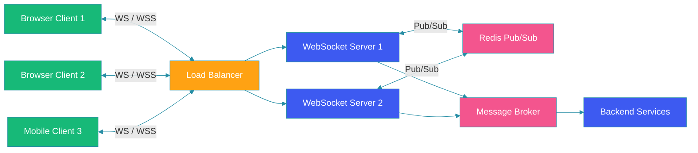

# WebSockets & Real-Time Communication

## Overview

WebSockets provide full-duplex communication channels over a single TCP connection, enabling real-time data exchange between clients and servers. Unlike HTTP polling, WebSockets maintain persistent connections for low-latency, bidirectional messaging. This guide covers WebSocket handshake, frames, STOMP protocol, Spring WebSocket implementation, and scaling strategies.

## Architecture Diagram



## WebSocket Handshake

The WebSocket handshake upgrades an HTTP connection to a WebSocket connection.

```java
@Component
public class WebSocketHandshakeInterceptor implements HandshakeInterceptor {

    @Override
    public boolean beforeHandshake(
            ServerHttpRequest request,
            ServerHttpResponse response,
            WebSocketHandler wsHandler,
            Map<String, Object> attributes) {

        // Extract authentication token
        String token = request.getHeaders()
            .getFirst("Authorization");

        if (token != null) {
            // Validate JWT and store user info in session attributes
            UserInfo user = jwtService.validateToken(token);
            attributes.put("userId", user.getId());
            attributes.put("userRoles", user.getRoles());
            return true;
        }

        response.setStatusCode(HttpStatus.UNAUTHORIZED);
        return false;
    }

    @Override
    public void afterHandshake(
            ServerHttpRequest request,
            ServerHttpResponse response,
            WebSocketHandler wsHandler,
            Exception exception) {
        // Handshake completed
    }
}
```

## Spring WebSocket Handler

```java
public class ChatWebSocketHandler extends TextWebSocketHandler {

    private final Map<String, WebSocketSession> sessions = new ConcurrentHashMap<>();
    private final ObjectMapper objectMapper;

    public ChatWebSocketHandler(ObjectMapper objectMapper) {
        this.objectMapper = objectMapper;
    }

    @Override
    public void afterConnectionEstablished(WebSocketSession session) {
        String userId = (String) session.getAttributes().get("userId");
        sessions.put(userId, session);
        log.info("WebSocket connected: userId={}, sessionId={}",
            userId, session.getId());
    }

    @Override
    protected void handleTextMessage(
            WebSocketSession session,
            TextMessage message) throws Exception {

        ChatMessage chatMessage = objectMapper.readValue(
            message.getPayload(), ChatMessage.class);

        // Route to recipient
        String recipientId = chatMessage.getRecipientId();
        WebSocketSession recipientSession = sessions.get(recipientId);

        if (recipientSession != null && recipientSession.isOpen()) {
            recipientSession.sendMessage(
                new TextMessage(objectMapper.writeValueAsString(chatMessage)));
        } else {
            // Store for offline delivery
            messageStore.saveOfflineMessage(recipientId, chatMessage);
        }
    }

    @Override
    public void afterConnectionClosed(
            WebSocketSession session,
            CloseStatus status) {
        String userId = (String) session.getAttributes().get("userId");
        sessions.remove(userId);
        log.info("WebSocket disconnected: userId={}", userId);
    }
}
```

## STOMP Protocol with Spring

STOMP provides a messaging protocol on top of WebSockets.

### Configuration

```java
@Configuration
@EnableWebSocketMessageBroker
public class WebSocketConfig implements WebSocketMessageBrokerConfigurer {

    @Override
    public void configureMessageBroker(MessageBrokerRegistry config) {
        // Enable simple broker for queues and topics
        config.enableSimpleBroker("/queue", "/topic");

        // Application destination prefix
        config.setApplicationDestinationPrefixes("/app");

        // User destination prefix for point-to-point
        config.setUserDestinationPrefix("/user");
    }

    @Override
    public void registerStompEndpoints(StompEndpointRegistry registry) {
        registry.addEndpoint("/ws")
            .setAllowedOriginPatterns("*")
            .withSockJS();

        registry.addEndpoint("/ws")
            .setAllowedOriginPatterns("*");
    }
}
```

### STOMP Controller

```java
@Controller
public class ChatController {

    @Autowired
    private SimpMessagingTemplate messagingTemplate;

    @MessageMapping("/chat.send")
    @SendTo("/topic/public")
    public ChatMessage sendPublicMessage(@Payload ChatMessage message) {
        message.setTimestamp(Instant.now());
        return message;
    }

    @MessageMapping("/chat.private")
    public void sendPrivateMessage(@Payload ChatMessage message) {
        messagingTemplate.convertAndSendToUser(
            message.getRecipientId(),
            "/queue/private",
            message
        );
    }

    @MessageMapping("/chat.room.{roomId}")
    public void sendToRoom(
            @DestinationVariable String roomId,
            @Payload ChatMessage message) {
        messagingTemplate.convertAndSend(
            "/topic/room." + roomId,
            message
        );
    }
}
```

### Client-Side STOMP

```javascript
const socket = new SockJS('/ws');
const stompClient = Stomp.over(socket);

stompClient.connect(
    { Authorization: `Bearer ${token}` },
    frame => {
        console.log('Connected: ' + frame);

        // Subscribe to public topic
        stompClient.subscribe('/topic/public', message => {
            showMessage(JSON.parse(message.body));
        });

        // Subscribe to private queue
        stompClient.subscribe('/user/queue/private', message => {
            showPrivateMessage(JSON.parse(message.body));
        });

        // Send message
        stompClient.send('/app/chat.send', {}, JSON.stringify({
            senderId: userId,
            content: 'Hello!'
        }));
    },
    error => {
        console.error('STOMP error: ' + error);
    }
);
```

## Scaling WebSockets with Redis Pub/Sub

```java
@Configuration
public class RedisPubSubConfig {

    @Bean
    public MessageListenerAdapter messageListener(
            RedisWebSocketMessageSubscriber subscriber) {
        return new MessageListenerAdapter(subscriber, "onMessage");
    }

    @Bean
    public RedisMessageListenerContainer container(
            RedisConnectionFactory factory,
            MessageListenerAdapter listener) {
        RedisMessageListenerContainer container =
            new RedisMessageListenerContainer();
        container.setConnectionFactory(factory);
        container.addMessageListener(
            listener, new PatternTopic("websocket:*"));
        return container;
    }
}

@Service
public class RedisWebSocketMessageSubscriber {

    @Autowired
    private SimpMessagingTemplate messagingTemplate;

    public void onMessage(Message message, byte[] pattern) {
        WebSocketMessage msg = deserialize(message.getBody());

        // Forward to the appropriate destination
        if (msg.isPrivate()) {
            messagingTemplate.convertAndSendToUser(
                msg.getRecipientId(),
                "/queue/private",
                msg
            );
        } else {
            messagingTemplate.convertAndSend(
                "/topic/" + msg.getRoomId(),
                msg
            );
        }
    }
}
```

## WebSocket Frames

```java
@Component
public class WebSocketFrameLogger {

    private final WebSocketHandler decorator = new WebSocketHandlerDecorator(
        new ChatWebSocketHandler(objectMapper)) {

        @Override
        public void handleMessage(
                WebSocketSession session,
                WebSocketMessage<?> message) {

            log.info("Frame type={} size={} from session={}",
                message.getType(),
                message.getPayloadLength(),
                session.getId());

            super.handleMessage(session, message);
        }
    };
}
```

## Best Practices

1. **Use WSS always**: Encrypt WebSocket connections in production.

2. **Implement heartbeat**: Ping/pong frames detect dead connections.

3. **Handle reconnection**: Clients should automatically reconnect on disconnect.

4. **Authenticate at handshake**: Validate tokens before upgrading the connection.

5. **Scale with Redis pub/sub**: Share messages across WebSocket server instances.

6. **Throttle messages**: Rate-limit client messages to prevent abuse.

7. **Monitor connections**: Track active WebSocket sessions and message rates.

## Common Mistakes

1. **No reconnection logic**: Clients fail to recover from network interruptions.

2. **Session affinity**: Requiring sticky sessions prevents horizontal scaling.

3. **Broadcasting to all sessions**: Not filtering by user or room wastes bandwidth.

4. **No backpressure**: Allowing one client to overwhelm the server.

5. **Blocking the event loop**: Expensive operations on WebSocket threads.

## Summary

WebSockets enable real-time, bidirectional communication for chat, live updates, and gaming. STOMP provides a messaging protocol layer with destinations like topics and queues. For production scaling, use Redis pub/sub to broadcast messages across multiple WebSocket servers. Always implement authentication, heartbeats, and reconnection logic.

---

## References

- [WebSocket RFC 6455](https://datatracker.ietf.org/doc/html/rfc6455)
- [STOMP Protocol Specification](https://stomp.github.io/stomp-specification-1.2.html)
- [Spring WebSocket Reference](https://docs.spring.io/spring-framework/reference/web/websocket.html)
- [SockJS Documentation](https://github.com/sockjs/sockjs-client)
