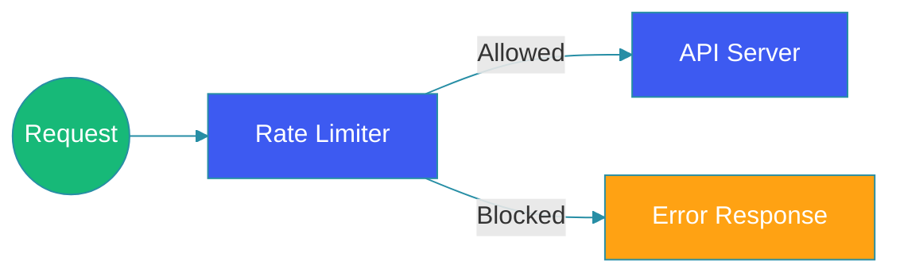

# Rate Limiting

## Overview

Rate limiting is a critical technique for protecting systems from abuse, ensuring fair resource allocation, and maintaining service quality. Without rate limiting, a single user orbot can consume disproportionate resources, causing degradation for all other users. This guide explores rate limiting fundamentals, algorithms, distributed implementations, and practical strategies.

Rate limiting protects against: excessive API calls, DoS attacks, cost overruns from runaway clients, and ensures fair resource distribution.

## Problem Statement

Without rate limiting, systems face several challenges:

**Resource Exhaustion**: Malicious or runaway clients can exhaust server resources—connections, memory, CPU—impacting all users.

**Service Degradation**: Traffic spikes from one client degrade performance for others.

**Cost Overruns**: Cloud resources are finite; runaway clients can cause significant cost overruns.

**API Abuse**: Without limits, scrapers, bots, and abuse go unchecked.

**Security Risks**: Brute force attacks, credential stuffing, and scraping attacks.

## Rate Limiting Metrics

Key metrics to track:

| Metric | Description |
|--------|-------------|
| Requests per window | Total requests in time window |
| Tokens consumed | Tokens spent in window |
| Remaining tokens | Current token balance |
| Rejection rate | Percentage of rejected requests |
| Queue time | Time waiting for token availability |

## Rate Limiting Algorithms

### Token Bucket

The token bucket algorithm allows for burst traffic while limiting the average rate:

```
┌─────────────────────────────────────────────────────┐
│                  Token Bucket                     │
├─────────────────────────────────────────────────────┤
│  ┌─────────────────────────────────────────┐    │
│  │           Bucket (capacity N)         │    │
│  │  █████░░░░░░░░░░░░░                    │    │
│  │  ██████████████████████████              │    │
│  └─────────────────────────────────────────┘    │
│                  │                              │
│            ┌─────┘                              │
│            ▼ token added each (rate R)          │
│      Add rate: R tokens/second                  │
│      Burst: Up to bucket capacity                │
└─────────────────────────────────────────────────────┘
       Request arrives
             │
             ▼
    ┌─────────────────┐
    │  Has tokens?    │───┐ No │─▶ Queue or reject
    └────────┬────────┘   │
             │ Yes          │
             ▼            │
    ┌─────────────────┐  │
    │  Consume token   │  │
    └────────┬────────┘  │
             │           │
             ▼           ▼
       Process request
```

**Implementation**:
```java
public class TokenBucket {
    private final double capacity;
    private final double refillRate;
    private double tokens;
    private Instant lastRefill;
    
    public synchronized boolean tryConsume(int tokens) {
        refill();
        
        if (this.tokens >= tokens) {
            this.tokens -= tokens;
            return true;
        }
        
        return false;
    }
    
    private void refill() {
        long now = Instant.now().toEpochMilli();
        long elapsed = now - lastRefill.toEpochMilli();
        double tokensToAdd = (elapsed / 1000.0) * refillRate;
        
        tokens = Math.min(capacity, tokens + tokensToAdd);
        lastRefill = Instant.now();
    }
}
```

**Advantages**: Allows burst traffic, smooth rate limiting, simple implementation.

**Disadvantages**: Not ideal for hard limits, token calculation overhead.

### Leaky Bucket

Leaky bucket processes requests at a fixed rate regardless of arrival pattern:

```
┌─────────────────────────────────────────────────────┐
│                  Leaky Bucket                     │
├─────────────────────────────────────────────────────┤
│  ┌─────────────────────────────────────────┐    │
│  │           Bucket (overflow drops)        │    │
│  │  ┌──┐┌──┐┌──┐                        │    │
│  │  │▓▓││▓▓││  │ (full, drop excess)     │    │
│  │  └──┘└──┘└──┘                        │    │
│  └─────────────────────────────────────────┘    │
│           │ Leaks at constant rate              │
│           ▼                                     │
│      Process at: fixed requests/second          │
└─────────────────────────────────────────────────────┘
```

**Implementation**:
```java
public class LeakyBucket {
    private final long capacity;
    private final long leakRate; // per second
    private final Queue<Request> bucket;
    private Instant lastLeak;
    
    public synchronized boolean add(Request request) {
        if (bucket.size() < capacity) {
            bucket.add(request);
            return true;
        }
        
        // Bucket full, drop request
        return false;
    }
    
    @Scheduled(fixedRate = 1000 / leakRate)
    public void leak() {
        if (!bucket.isEmpty()) {
            Request request = bucket.poll();
            process(request);
        }
    }
}
```

**Advantages**: Constant output rate, handles traffic spikes gracefully.

**Disadvantages**: Not suitable for burst traffic, more complex.

### Fixed Window

Simple time-based windows:

```
┌─────────────────────────────────────────────────────┐
│                  Fixed Window                    │
├─────────────────────────────────────���───────────────┤
│  Window: 1 minute                                 │
│  ┌──────────────────────────────┐                │
│  │ Window 1: [00-01)            │ 100 requests   │
│  │ Window 2: [01-02)            │ 120 requests   │
│  │ Window 3: [02-03)            │ 90 requests    │  
│  └──────────────────────────────┘                │
│  - Boundary issue: 199 requests in 2 windows!   │
└─────────────────────────────────────────────────────┘
```

**Implementation**:
```java
public class FixedWindow {
    private final int limit;
    private final Duration window;
    private int count;
    private Instant windowStart;
    
    public synchronized boolean tryConsume() {
        Instant now = Instant.now();
        
        if (now.isAfter(windowStart.plus(window))) {
            // New window
            windowStart = now;
            count = 0;
        }
        
        if (count < limit) {
            count++;
            return true;
        }
        
        return false;
    }
}
```

**Advantages**: Simple, predictable.

**Disadvantages**: Boundary issues allow 2x rate at edges.

### Sliding Window

Better than fixed window—smooth edge transitions:

```
┌─────────────────────────────────────────────────────┐
│                 Sliding Window                     │
├─────────────────────────────────────────────────────┤
│  ┌─────────────────────────────────────────┐    │
│  │  Timeline                              │    │
│  │  ──────────────────────────────────────│    │
│  │  [   old requests   ]←──→[ new req   ] │    │
│  │  <- 1 minute window (sliding)          │    │
│  └─────────────────────────────────────────┘    │
│  - More accurate counting                      │
│  - Smooth at boundaries                        │
└─────────────────────────────────────────────────────┘
```

**Implementation**:
```java
public class SlidingWindow {
    private final int limit;
    private final Duration window;
    private final Deque<Instant> requests;
    
    public synchronized boolean tryConsume() {
        Instant now = Instant.now();
        Instant windowStart = now.minus(window);
        
        // Remove expired requests
        while (!requests.isEmpty() && requests.peekFirst().isBefore(windowStart)) {
            requests.pollFirst();
        }
        
        if (requests.size() < limit) {
            requests.addLast(now);
            return true;
        }
        
        return false;
    }
}
```

### Sliding Window Log

Most accurate—counts individual requests:

```java
public class SlidingWindowLog {
    private final int limit;
    private final Duration window;
    private final Map<String, Deque<Instant>> clientRequests;
    
    public boolean tryConsume(String clientId) {
        Instant now = Instant.now();
        Instant windowStart = now.minus(window);
        
        Deque<Instant> timestamps = clientRequests.computeIfAbsent(clientId, k -> new LinkedList<>());
        
        // Remove expired
        while (!timestamps.isEmpty() && timestamps.peekFirst().isBefore(windowStart)) {
            timestamps.pollFirst();
        }
        
        if (timestamps.size() < limit) {
            timestamps.addLast(now);
            return true;
        }
        
        return false;
    }
}
```

## Rate Limiting Types

### Per-Client Rate Limiting

```java
@Configuration
public class RateLimitConfig {
    
    @Bean
    public Filter rateLimitFilter() {
        return new RateLimitFilter(
            RateLimitRule.builder()
                .target("client_ip")
                .limit(100)
                .window(Duration.ofMinutes(1))
                .build(),
            RateLimitRule.builder()
                .target("api_key")
                .limit(1000)
                .window(Duration.ofMinutes(1))
                .build()
        );
    }
}
```

### Per-API Rate Limiting

```java
public class PerApiRateLimiter {
    
    // Different limits per endpoint
    private final Map<String, RateLimitRule> apiLimits = Map.of(
        "/api/search", RateLimitRule.of(10, MINUTE),
        "/api/upload", RateLimitRule.of(5, MINUTE),
        "/api/graphql", RateLimitRule.of(100, MINUTE)
    );
    
    public boolean allowRequest(String apiPath) {
        return apiLimits.get(apiPath).tryConsume();
    }
}
```

### Per-User Rate Limiting

```java
public class UserRateLimiter {
    
    public RateLimitResult checkRateLimit(String userId, String api) {
        UserTier tier = userService.getUserTier(userId);
        
        // Different limits for different tiers
        int limit = switch (tier) {
            case FREE -> 100;
            case PREMIUM -> 10000;
            case ENTERPRISE -> 1000000;
        };
        
        return rateLimiter.tryConsume(userId, limit);
    }
}
```

### Global Rate Limiting

For entire service:

```java
public class GlobalRateLimiter {
    
    private final int maxRequestsPerSecond = 100000;
    private final AtomicInteger counter = new AtomicInteger();
    
    public boolean allowGlobalRequest() {
        int count = counter.incrementAndGet();
        
        if (count > maxRequestsPerSecond) {
            counter.decrementAndGet();
            return false;
        }
        
        // Reset every second
        return true;
    }
}
```

## Distributed Rate Limiting

### Redis-Based Rate Limiting

```java
@Component
public class RedisRateLimiter {
    
    @Autowired
    private StringRedisTemplate redis;
    
    public boolean tryConsume(String key, int limit, Duration window) {
        String script = """
            local key = KEYS[1]
            local limit = tonumber(ARGV[1])
            local window = tonumber(ARGV[2])
            local now = tonumber(ARGV[3])
            
            redis.call('ZREMRANGEBYSCORE', key, '-inf', now - window)
            local count = redis.call('ZCARD', key)
            
            if count < limit then
                redis.call('ZADD', key, now, now .. ':' .. count)
                redis.call('EXPIRE', key, window / 1000)
                return 1
            end
            
            return 0
            """;
        
        Long result = redis.execute(
            new RedisScript<>(script, Long.class),
            List.of(key),
            String.valueOf(limit),
            String.valueOf(window.toMillis()),
            String.valueOf(System.currentTimeMillis())
        );
        
        return result != null && result == 1;
    }
}
```

### Token Bucket with Redis

```java
public class DistributedTokenBucket {
    
    public boolean tryConsume(String key, int capacity, int refillPerSecond) {
        String script = """
            local key = KEYS[1]
            local capacity = tonumber(ARGV[1])
            local refill = tonumber(ARGV[2])
            local now = tonumber(ARGV[3])
            
            local tokens = tonumber(redis.call('GET', key .. ':tokens') or 0)
            local lastRefill = tonumber(redis.call('GET', key .. ':last') or 0)
            
            local elapsed = now - lastRefill
            local toAdd = (elapsed / 1000.0) * refill
            tokens = math.min(capacity, tokens + toAdd)
            
            if tokens >= 1 then
                tokens = tokens - 1
                redis.call('SET', key .. ':tokens', tokens)
                redis.call('SET', key .. ':last', now)
                return 1
            end
            
            return 0
            """;
        
        return executeScript(key, capacity, refillPerSecond);
    }
}
```

### Consistent Hashing for Rate Limiting

When you need rate limiting across distributed services:

```java
public class ConsistentHashRateLimiter {
    
    private final TreeMap<Long, RateLimiterNode> ring = new TreeMap<>();
    
    public boolean tryConsume(String clientId) {
        // Find the node responsible for this client
        long hash = hash(clientId);
        Map.Entry<Long, RateLimiterNode> entry = ring.ceilingEntry(hash);
        
        if (entry == null) {
            entry = ring.firstEntry();
        }
        
        return entry.getValue().tryConsume();
    }
}
```

## HTTP Response Headers

Standard headers for rate limit information:

```
X-RateLimit-Limit: 1000           // Maximum requests
X-RateLimit-Remaining: 999        // Remaining in window
X-RateLimit-Reset: 1640000000     // Window reset time

HTTP/1.1 429 Too Many Requests
Retry-After: 60                  // Seconds to wait
```

```java
public class RateLimitResponseBuilder {
    
    public Response build(RateLimitResult result) {
        return Response.status(429)
            .header("X-RateLimit-Limit", result.getLimit())
            .header("X-RateLimit-Remaining", result.getRemaining())
            .header("X-RateLimit-Reset", result.getResetTime())
            .header("Retry-After", result.getRetryAfterSeconds())
            .build();
    }
}
```

## Implementation Examples

### Spring Boot Rate Limiting

```java
@Component
public class RateLimitInterceptor implements HandlerInterceptor {
    
    @Autowired
    private RateLimiterService rateLimiter;
    
    @Override
    public boolean preHandle(HttpServletRequest request, 
                           HttpServletResponse response, 
                           Object handler) {
        
        String clientId = getClientId(request);
        
        RateLimitResult result = rateLimiter.checkRateLimit(clientId);
        
        response.setHeader("X-RateLimit-Limit", String.valueOf(result.getLimit()));
        response.setHeader("X-RateLimit-Remaining", 
            String.valueOf(result.getRemaining()));
        
        if (!result.isAllowed()) {
            response.setHeader("Retry-After", 
                String.valueOf(result.getRetryAfterSeconds()));
            response.setStatus(429);
            return false;
        }
        
        return true;
    }
}
```

### NGINX Rate Limiting

```nginx
http {
    # Define rate limit zone
    limit_req_zone $binary_remote_addr zone=mylimit:10m rate=10r/s;
    
    server {
        location /api/ {
            # Apply rate limiting
            limit_req zone=mylimit burst=20 nodelay;
            
            proxy_pass http://backend;
        }
    }
}
```

### API Gateway Rate Limiting

```java
@Service
public class RateLimitPolicy {
    
    public List<RateLimitRule> getPolicyFor(ApiContract api) {
        if (api.isPremium()) {
            return List.of(
                RateLimitRule.builder()
                    .target("user_id")
                    .limit(10000)
                    .window(Duration.ofMinutes(1))
                    .build()
            );
        }
        
        return List.of(
            RateLimitRule.builder()
                .target("user_id")
                .limit(1000)
                .window(Duration.ofMinutes(1))
                .build(),
            RateLimitRule.builder()
                .target("ip")
                .limit(100)
                .window(Duration.ofMinutes(1))
                .build()
        );
    }
}
```

## Architecture Diagram



## Handling Rate Limit Exceeded

```java
public class RateLimitExceptionHandler {
    
    @ExceptionHandler(RateLimitExceededException.class)
    public Response handleRateLimit(RateLimitExceededException ex) {
        
        RateLimitInfo info = ex.getRateLimitInfo();
        
        return Response.status(429)
            .entity(ErrorResponse.builder()
                .error("rate_limit_exceeded")
                .message("Rate limit exceeded")
                .retryAfter(info.getRetryAfterSeconds())
                .build())
            .header("Retry-After", String.valueOf(info.getRetryAfterSeconds()))
            .build();
    }
```

## Monitoring and Metrics

### Key Metrics

```java
public class RateLimitMetrics {
    
    @Metered(name = "ratelimit.attempts")
    private Meter attempts;
    
    @Metered(name = "ratelimit.rejections")
    private Meter rejections;
    
    @Gauge(name = "ratelimit.tokens")
    private double getAvailableTokens();
}
```

### Alerting

```yaml
alerts:
  - name: high_rejection_rate
    condition: rejection_rate > 0.1
    severity: warning
    
  - name: rate_limit_approaching
    condition: remaining_ratio < 0.1
    severity: info
```

## Best Practices

1. **Use tiered limits**: Different limits for different user tiers.

2. **Include rate limit headers**: Inform clients of their limits.

3. **Allow some burst**: Don't be too aggressive—allow spikes.

4. **Graceful degradation**: Return 429, don't crash.

5. **Redis for distributed**: Ensure consistency across nodes.

6. **Monitor**: Track rejection rates and adjust limits.

7. **Client-side limits**: Respect server limits in client SDKs.

## Common Mistakes

1. **No rate limiting**: Systems vulnerable to abuse.

2. **Too strict**: Legitimate users get blocked.

3. **Single server only**: Not consistent across instances.

4. **Ignoring headers**: Clients don't know their limits.

5. **No tiered approach**: Same limits for all users.

## Summary

Rate limiting is essential for system protection. The key is choosing the right algorithm—token bucket for burst tolerance, leaky bucket for constant rates—and implementing it consistently across all distributed instances. Always expose rate limit headers so clients can adapt, and tune limits based on real traffic patterns.

---

## References

- [Stripe Rate Limiting](https://stripe.com/blog/rate-limiters)
- [Google Cloud Rate Limiting](https://cloud.google.com/rate-limit)
- [NGINX Rate Limiting](https://nginx.com/)
- [Redis Rate Limiting](https://redis.io/)