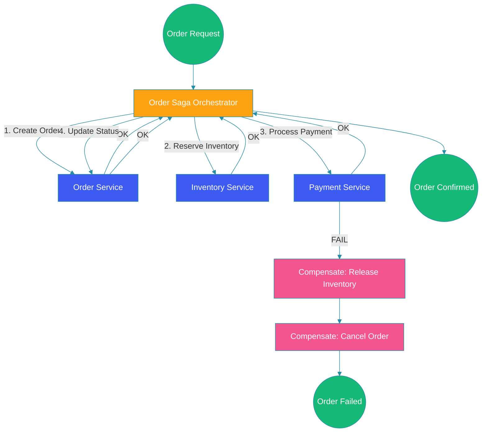

# Saga Pattern

## Overview

The saga pattern manages distributed transactions across microservices by breaking them into a sequence of local transactions with compensating actions for rollback. Unlike traditional two-phase commits (2PC), sagas are designed for eventual consistency and high availability in distributed systems. This guide covers choreography and orchestration sagas, compensating transactions, and failure handling.

## Saga Flow Diagram



## Choreography Saga

Services communicate via events; each service performs its transaction and publishes events.

```java
@Service
public class OrderService {

    @Autowired
    private EventPublisher eventPublisher;

    @Autowired
    private OrderRepository orderRepository;

    @Transactional
    public void createOrder(OrderRequest request) {
        Order order = new Order(request);
        order.setStatus(OrderStatus.PENDING);
        orderRepository.save(order);

        // Publish event to trigger next step
        eventPublisher.publish(new OrderCreatedEvent(
            order.getId(), order.getItems(), order.getTotal()));
    }

    @EventListener
    public void onPaymentProcessed(PaymentProcessedEvent event) {
        orderRepository.findById(event.getOrderId())
            .ifPresent(order -> {
                order.setStatus(OrderStatus.CONFIRMED);
                orderRepository.save(order);
            });
    }

    @EventListener
    public void onPaymentFailed(PaymentFailedEvent event) {
        orderRepository.findById(event.getOrderId())
            .ifPresent(order -> {
                order.setStatus(OrderStatus.FAILED);
                orderRepository.save(order);
            });
    }
}

@Service
public class InventoryService {

    @EventListener
    public void onOrderCreated(OrderCreatedEvent event) {
        try {
            for (Item item : event.getItems()) {
                inventoryRepository.reserve(item.getProductId(), item.getQuantity());
            }
            eventPublisher.publish(new InventoryReservedEvent(event.getOrderId()));
        } catch (Exception e) {
            eventPublisher.publish(new InventoryReservationFailedEvent(
                event.getOrderId(), e.getMessage()));
        }
    }

    @EventListener
    public void onPaymentFailed(PaymentFailedEvent event) {
        // Compensating action: release inventory
        Order order = orderRepository.findById(event.getOrderId()).orElseThrow();
        for (Item item : order.getItems()) {
            inventoryRepository.release(item.getProductId(), item.getQuantity());
        }
    }
}
```

## Orchestration Saga

A central orchestrator coordinates the saga steps.

```java
@Component
public class OrderSagaOrchestrator {

    public enum SagaState {
        ORDER_CREATED,
        INVENTORY_RESERVED,
        PAYMENT_PROCESSED,
        COMPLETED,
        COMPENSATING,
        FAILED
    }

    private final Map<String, SagaState> sagaStates = new ConcurrentHashMap<>();

    public void startSaga(OrderRequest request) {
        String sagaId = UUID.randomUUID().toString();
        sagaStates.put(sagaId, SagaState.ORDER_CREATED);

        // Step 1: Create order
        OrderResponse order = orderServiceClient.createOrder(request);
        sagaStates.put(sagaId, SagaState.INVENTORY_RESERVED);

        try {
            // Step 2: Reserve inventory
            inventoryServiceClient.reserveInventory(order.getId(), request.getItems());
            sagaStates.put(sagaId, SagaState.PAYMENT_PROCESSED);

            // Step 3: Process payment
            paymentServiceClient.processPayment(order.getId(), request.getPaymentInfo());

            // Success
            orderServiceClient.confirmOrder(order.getId());
            sagaStates.put(sagaId, SagaState.COMPLETED);

        } catch (InventoryReservationException e) {
            compensateOrderCreation(sagaId, order.getId());
        } catch (PaymentException e) {
            compensateAfterPayment(sagaId, order.getId());
        }
    }

    private void compensateAfterPayment(String sagaId, Long orderId) {
        sagaStates.put(sagaId, SagaState.COMPENSATING);
        inventoryServiceClient.releaseInventory(orderId);
        orderServiceClient.cancelOrder(orderId);
        sagaStates.put(sagaId, SagaState.FAILED);
    }

    private void compensateOrderCreation(String sagaId, Long orderId) {
        sagaStates.put(sagaId, SagaState.COMPENSATING);
        orderServiceClient.cancelOrder(orderId);
        sagaStates.put(sagaId, SagaState.FAILED);
    }
}
```

## Compensating Transactions

Each step must have a compensating action that semantically undoes it.

```java
@Service
public class CompensatingActionHandler {

    @Autowired
    private PaymentService paymentService;

    public void refund(Payment payment) {
        PaymentRefund refund = PaymentRefund.builder()
            .transactionId(payment.getTransactionId())
            .amount(payment.getAmount())
            .reason("Order cancelled")
            .build();

        RetryTemplate retryTemplate = RetryTemplate.builder()
            .maxAttempts(3)
            .exponentialBackoff(1000, 2, 10000)
            .build();

        retryTemplate.execute(context -> {
            paymentService.processRefund(refund);
            return null;
        });
    }
}
```

## Resilience4j Saga Support

```java
@Component
public class SagaOrchestratorWithResilience {

    @Autowired
    private OrderServiceClient orderClient;

    @Autowired
    private InventoryServiceClient inventoryClient;

    @Autowired
    private PaymentServiceClient paymentClient;

    @Retry(name = "inventoryRetry", fallbackMethod = "inventoryFallback")
    @CircuitBreaker(name = "inventoryCB")
    @TimeLimiter(name = "inventoryTimeout")
    public CompletableFuture<Boolean> reserveInventory(Long orderId, List<Item> items) {
        return CompletableFuture.supplyAsync(() -> {
            inventoryClient.reserve(orderId, items);
            return true;
        });
    }

    public CompletableFuture<Boolean> inventoryFallback(
            Long orderId, List<Item> items, Exception e) {
        log.error("Inventory reservation failed, starting compensation", e);
        orderClient.cancelOrder(orderId);
        return CompletableFuture.completedFuture(false);
    }
}
```

## Best Practices

1. **Design compensating actions carefully**: Each saga step needs a semantic undo.

2. **Use orchestration for complex sagas**: Choreography works for simple chains; orchestration for complex flows.

3. **Implement idempotent handlers**: Saga steps may be retried; handle duplicates safely.

4. **Store saga state**: Persist saga state for recovery from failures.

5. **Monitor saga progress**: Track completed, pending, and failed sagas.

6. **Set timeouts**: Sagas should not hang indefinitely; add timeout mechanisms.

## Common Mistakes

1. **No compensating transactions**: Partial failures leave the system inconsistent.

2. **Ignoring idempotency**: Retry causes duplicate operations.

3. **Missing timeout handling**: Sagas stall indefinitely on downstream failures.

4. **Overly complex choreography**: Too many services in event chains makes debugging hard.

5. **Synchronous compensation**: Compensations should be async to avoid cascading failures.

## Summary

The saga pattern manages distributed transactions without distributed locks. Choreography sagas use events for service coordination; orchestration sagas use a central coordinator. Each step must have a compensating action. Implement idempotency, persistence, and monitoring for production reliability.

---

## References

- [Saga Pattern - Microsoft](https://docs.microsoft.com/en-us/azure/architecture/patterns/saga)
- [Caitie McCaffrey - Applying Saga Pattern](https://www.youtube.com/watch?v=xDuwrtwYHu8)
- [Eventuate Tram Sagas](https://github.com/eventuate-tram/eventuate-tram-sagas)
- [Resilience4j Documentation](https://resilience4j.readme.io/)
