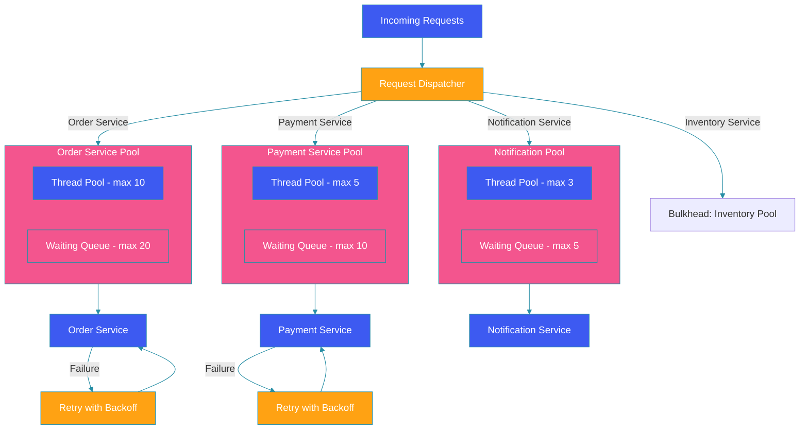

# Bulkhead & Retry Patterns

## Overview

The bulkhead pattern isolates system components into separate thread pools so that a failure in one component doesn't cascade to others. The retry pattern with exponential backoff handles transient failures by reattempting operations with increasing delays. Combined with timeouts, these patterns form a robust resilience strategy for distributed systems.

## Bulkhead Architecture Diagram



## Bulkhead Pattern with Resilience4j

### Configuration

```yaml
resilience4j:
  bulkhead:
    configs:
      default:
        max-concurrent-calls: 10
        max-wait-duration: 500ms
    instances:
      order-service:
        max-concurrent-calls: 10
        max-wait-duration: 200ms
      payment-service:
        max-concurrent-calls: 5
        max-wait-duration: 500ms
      notification-service:
        max-concurrent-calls: 3
        max-wait-duration: 1000ms
```

### Thread Pool Bulkhead

```java
@Configuration
public class BulkheadConfig {

    @Bean
    public BulkheadRegistry bulkheadRegistry() {
        BulkheadConfig orderConfig = BulkheadConfig.custom()
            .maxConcurrentCalls(10)
            .maxWaitDuration(Duration.ofMillis(200))
            .fairCallHandlingStrategyEnabled(true)
            .build();

        BulkheadConfig paymentConfig = BulkheadConfig.custom()
            .maxConcurrentCalls(5)
            .maxWaitDuration(Duration.ofMillis(500))
            .writableStackTraceEnabled(false)
            .build();

        BulkheadRegistry registry = BulkheadRegistry.ofDefaults();
        registry.addConfiguration("order-service", orderConfig);
        registry.addConfiguration("payment-service", paymentConfig);
        return registry;
    }
}
```

### Usage with Annotations

```java
@Service
public class OrderServiceClient {

    @Bulkhead(name = "order-service", type = Bulkhead.Type.THREADPOOL)
    @Async
    public CompletableFuture<OrderResponse> processOrder(OrderRequest request) {
        return CompletableFuture.completedFuture(
            orderServiceClient.call(request)
        );
    }

    @Bulkhead(name = "payment-service", fallbackMethod = "paymentFallback")
    public PaymentResponse processPayment(PaymentRequest request) {
        return paymentClient.process(request);
    }

    private PaymentResponse paymentFallback(PaymentRequest request, Exception e) {
        log.warn("Payment service bulkhead full, using fallback: {}", e.getMessage());
        return PaymentResponse.builder()
            .status(PaymentStatus.QUEUED)
            .message("Payment queued for later processing")
            .build();
    }
}
```

### Programmatic Usage

```java
@Service
public class InventoryServiceClient {

    private final Bulkhead bulkhead;

    public InventoryServiceClient(BulkheadRegistry registry) {
        this.bulkhead = registry.bulkhead("inventory-service");
    }

    public InventoryResponse checkInventory(String productId) {
        Supplier<InventoryResponse> decorated = Bulkhead
            .decorateSupplier(bulkhead, () -> {
                return inventoryClient.check(productId);
            });

        return Try.ofSupplier(decorated)
            .recover(e -> {
                log.error("Inventory check failed", e);
                return InventoryResponse.defaultUnavailable();
            })
            .get();
    }
}
```

## Retry Pattern with Exponential Backoff

### Configuration

```yaml
resilience4j:
  retry:
    configs:
      default:
        max-attempts: 3
        wait-duration: 1s
        exponential-backoff-multiplier: 2
        retry-exceptions:
          - java.io.IOException
          - org.springframework.web.client.HttpServerErrorException
        ignore-exceptions:
          - com.example.BusinessException
    instances:
      external-api:
        max-attempts: 5
        wait-duration: 500ms
        exponential-backoff-multiplier: 2
        max-wait-duration: 10s
```

### Usage with Annotations

```java
@Service
public class RetryableService {

    @Retry(name = "external-api", fallbackMethod = "fallback")
    public ExternalData fetchData(String id) {
        return externalApiClient.getData(id);
    }

    @Retry(name = "database", fallbackMethod = "dbFallback")
    public Entity saveEntity(Entity entity) {
        return repository.save(entity);
    }

    private ExternalData fallback(String id, Exception e) {
        log.warn("Fetch failed after retries, returning cached data: {}", id);
        return cacheService.get(id);
    }

    private Entity dbFallback(Entity entity, Exception e) {
        log.error("Database save failed after retries, queuing: {}", entity);
        retryQueue.add(entity);
        return null;
    }
}
```

### Custom Retry Template

```java
@Component
public class RetryTemplateFactory {

    public RetryTemplate defaultRetry() {
        return RetryTemplate.builder()
            .maxAttempts(3)
            .exponentialBackoff(1000, 2, 10000)
            .retryOn(IOException.class, TimeoutException.class)
            .build();
    }

    public RetryTemplate aggressiveRetry() {
        return RetryTemplate.builder()
            .maxAttempts(5)
            .exponentialBackoff(500, 2, 5000)
            .uniformRandomBackoff()
            .build();
    }

    public void executeWithRetry(Runnable operation) {
        RetryTemplate template = RetryTemplate.builder()
            .maxAttempts(3)
            .exponentialBackoff(1000, 2)
            .build();

        template.execute(context -> {
            log.info("Attempt {} of {}", context.getRetryCount(),
                context.getMaxRetries());
            operation.run();
            return null;
        });
    }
}
```

## Combining Bulkhead, Retry, and Timeout

```java
@Service
public class ResilientServiceClient {

    @Bulkhead(name = "critical-api", type = Bulkhead.Type.THREADPOOL)
    @Retry(name = "critical-api", fallbackMethod = "fallback")
    @CircuitBreaker(name = "critical-api")
    @TimeLimiter(name = "critical-api")
    public CompletableFuture<ApiResponse> callCriticalApi(Request request) {
        return CompletableFuture.supplyAsync(() -> {
            return restTemplate.postForObject(url, request, ApiResponse.class);
        });
    }

    private CompletableFuture<ApiResponse> fallback(
            Request request, Exception e) {
        log.warn("Critical API call failed: {}", e.getMessage());
        return CompletableFuture.completedFuture(
            ApiResponse.cachedResponse(cacheService.get(request.getId()))
        );
    }
}
```

## Timeout Pattern

```java
@Configuration
public class TimeoutConfig {

    @Bean
    public TimeLimiterRegistry timeLimiterRegistry() {
        TimeLimiterConfig config = TimeLimiterConfig.custom()
            .timeoutDuration(Duration.ofSeconds(2))
            .cancelRunningFuture(true)
            .build();

        return TimeLimiterRegistry.of(config);
    }
}

@Service
public class TimeoutAwareClient {

    @TimeLimiter(name = "external-api", fallbackMethod = "timeoutFallback")
    public CompletableFuture<ExternalData> fetchWithTimeout(String id) {
        return CompletableFuture.supplyAsync(() ->
            externalClient.fetch(id)
        );
    }

    private CompletableFuture<ExternalData> timeoutFallback(
            String id, TimeoutException e) {
        log.warn("Request timed out for id: {}", id);
        return CompletableFuture.completedFuture(
            cacheService.getCachedData(id)
        );
    }
}
```

## Monitoring and Metrics

```java
@Component
public class ResilienceMetrics {

    @EventListener
    public void onBulkheadEvent(BulkheadOnCallRejectedEvent event) {
        metricsCollector.increment(
            "bulkhead.rejected",
            "bulkhead", event.getBulkheadName()
        );
    }

    @EventListener
    public void onRetryEvent(RetryOnRetryEvent event) {
        metricsCollector.increment(
            "retry.attempt",
            "retry", event.getRetryName()
        );
    }

    @Scheduled(fixedRate = 15000)
    public void reportMetrics() {
        bulkheadRegistry.getAllBulkheads().forEach(bulkhead -> {
            Metrics metrics = bulkhead.getMetrics();
            log.info("Bulkhead {}: available={}, waiting={}",
                bulkhead.getName(),
                metrics.getAvailableConcurrentCalls(),
                metrics.getNumberOfWaitingThreads());
        });
    }
}
```

## Best Practices

1. **Isolate by dependency**: Each external dependency gets its own bulkhead.

2. **Set appropriate pool sizes**: Tune based on dependency latency and throughput.

3. **Exponential backoff with jitter**: Prevent thundering herd on retry.

4. **Combine with circuit breakers**: Stop retrying when the service is down.

5. **Set timeouts**: Retries without timeouts can hang indefinitely.

6. **Monitor bulkhead states**: Track rejections and queue depths.

7. **Fallback on exhaustion**: Always provide a fallback when bulkhead is full.

## Common Mistakes

1. **Single bulkhead for all**: One pool shared across all dependencies defeats isolation.

2. **Infinite retries**: Unlimited retries can overwhelm the downstream service.

3. **No jitter in backoff**: Client retries synchronize, creating thundering herd.

4. **Retry on non-transient errors**: 4xx errors won't succeed on retry.

5. **Ignoring timeouts**: Retries without timeouts compound failures.

## Summary

Bulkhead isolation prevents cascading failures by separating resources per dependency. Retry with exponential backoff handles transient failures gracefully. Combine with timeouts and circuit breakers for a comprehensive resilience strategy. Monitor rejections and retry attempts to tune configurations and detect issues early.

---

## References

- [Resilience4j Documentation](https://resilience4j.readme.io/)
- [Netflix Hystrix Bulkhead](https://github.com/Netflix/Hystrix/wiki/How-it-Works#Bulkhead)
- [Microsoft Bulkhead Pattern](https://docs.microsoft.com/en-us/azure/architecture/patterns/bulkhead)
- [AWS Exponential Backoff](https://docs.aws.amazon.com/general/latest/gr/api-retries.html)
