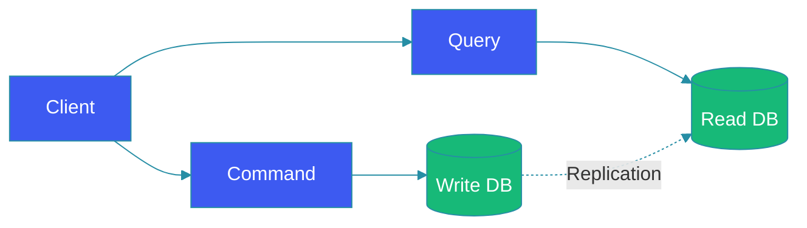

# CQRS Pattern

## Overview

The Command Query Responsibility Segregation (CQRS) pattern is an architectural pattern that separates read and write operations for a data store. Instead of a single model handling both reads and writes, CQRS creates distinct models—one optimized for reading (queries) and another for writing (commands). This separation enables independent scaling, optimization, and evolution of each side.

This guide explores CQRS fundamentals, implementation strategies, when to use it, and practical patterns for building high-performance systems.

## Problem Statement

Traditional CRUD with single model creates challenges:

**Single Model Compromise**: Read-optimized and write-optimized schemas are different; compromising hurts both.

**Scaling Limits**: Reads and writes scale differently; can't scale independently.

**Complex Queries**: Reporting queries interfere with transactional writes.

**Schema Evolution**: Changing read model requires schema migration.

**Domain Complexity**: Single model handles both reading and business logic.

## CQRS Architecture

```
┌─────────────────────────────────────────────────────────────────┐
│                 CQRS Architecture                         │
├─────────────────────────────────────────────────────────────────┤
│                                                          │
│  ┌────────────────┐                    ┌────────────────┐  │
│  │    Client     │                    │    Client       │  │
│  └──────┬────────┘                    └───────┬────────┘  │
│         │ Command                        Query          │
│         ▼                                    ▼          │
│  ┌────────────────┐                    ┌────────────────┐  │
│  │   Commands     │                    │    Queries     │  │
│  │   (Writes)    │                    │    (Reads)     │  │
│  └───────┬────────┘                    └───────┬────────┘  │
│          │                                     │            │
│          ▼                                     ▼            │
│  ┌────────────────┐                    ┌────────────────┐  │
│  │ Command Model  │                    │  Query Model   │  │
│  │   (Write DB)  │                    │   (Read DB)   │  │
│  │              │                    │               │  │
│  │ - Normalized │                    │ - Denormalized │  │
│  │ - Complex   │                    │ - Optimized   │  │
│  │ - Business ���                    │ - Simple     │  │
│  └───────┬────────┘                    └───────┬────────┘  │
│          │                                     │            │
│          │       ┌────────────────┐           │            │
│          │       │ Event Store   │           │            │
│          └───────│ (Optional)   │───────────┘            │
│                  └─────────────┘                     │
└───────────────────────────────────────────────────────┘
```

## Key Concepts

### Commands

Operations that change state:

```java
public class CreateOrderCommand {
    private String orderId;
    private List<OrderItem> items;
    private String customerId;
    private BigDecimal total;
}

public class UpdateInventoryCommand {
    private String productId;
    private int quantityChange;
}

public class CancelOrderCommand {
    private String orderId;
    private String reason;
}
```

### Queries

Operations that read without side effects:

```java
public class GetOrderQuery {
    private String orderId;
}

public class ListCustomerOrdersQuery {
    private String customerId;
    private LocalDate fromDate;
    private LocalDate toDate;
}

public class SearchProductsQuery {
    private String searchTerm;
    private List<String> filters;
    private int page;
    private int pageSize;
}
```

### Event Sourcing

Store events, not current state:

```java
@Entity
public class OrderEvent {
    private String orderId;
    private String eventType;
    private Instant timestamp;
    private Map<String, Object> payload;
}

public class Order {
    private String orderId;
    private List<OrderEvent> events;
    
    public void apply(OrderEvent event) {
        switch (event.getType()) {
            case "ORDER_CREATED":
                applyCreated(event);
                break;
            case "ITEM_ADDED":
                applyItemAdded(event);
                break;
            case "ORDER_SHIPPED":
                applyShipped(event);
                break;
        }
        events.add(event);
    }
    
    public static Order reconstruct(List<OrderEvent> events) {
        Order order = new Order();
        for (OrderEvent event : events) {
            order.apply(event);
        }
        return order;
    }
}
```

## Implementation

### Command Side

```java
@Service
public class CommandHandler {
    
    @Autowired
    private EventStore eventStore;
    
    public void handle(CreateOrderCommand command) {
        // Validate
        OrderValidator.validate(command);
        
        // Create event
        OrderCreatedEvent event = OrderCreatedEvent.builder()
            .orderId(command.getOrderId())
            .items(command.getItems())
            .customerId(command.getCustomerId())
            .build();
        
        // Save to event store
        eventStore.save(event);
        
        // Update write model
        writeRepository.save(toOrder(command));
    }
}
```

### Query Side

```java
@Service
public class QueryHandler {
    
    @Autowired
    private ReadModelRepository readRepository;
    
    public List<OrderDTO> handle(ListOrdersQuery query) {
        return readRepository.findByCustomerId(
            query.getCustomerId(),
            query.getPageable()
        );
    }
}
```

### Synchronization

Sync write to read model:

```java
@Service
public class ModelSynchronizer {
    
    @Autowired
    private EventStore eventStore;
    
    @Autowired
    private ReadModelRepository readRepository;
    
    @Scheduled(fixedRate = 1000)
    public void synchronize() {
        Long lastProcessedVersion = getLastProcessedVersion();
        
        List<OrderEvent> events = eventStore.findAfter(lastProcessedVersion);
        
        for (OrderEvent event : events) {
            updateReadModel(event);
            markProcessed(event);
        }
    }
    
    private void updateReadModel(OrderEvent event) {
        switch (event.getType()) {
            case "ORDER_CREATED":
                readRepository.save(toOrderDTO(event));
                break;
            case "ORDER_UPDATED":
                readRepository.update(toOrderDTO(event));
                break;
            case "ORDER_CANCELLED":
                readRepository.delete(event.getOrderId());
                break;
        }
    }
}
```

## Read Model Projections

### Materialized Views

```java
@Component
public class OrderMaterializedView {
    
    @Autowired
    private ReadModelRepository readRepository;
    
    @EventListener
    public void onOrderCreated(OrderCreatedEvent event) {
        OrderDTO dto = OrderDTO.builder()
            .orderId(event.getOrderId())
            .customerId(event.getCustomerId())
            .items(event.getItems())
            .total(event.getTotal())
            .status(ORDERED)
            .createdAt(event.getTimestamp())
            .build();
        
        readRepository.save(dto);
    }
}
```

### Multiple Read Models

```java
@Component
public class MultiModelProjector {
    
    // For customer view
    public void projectCustomerView(OrderEvent event) {
        CustomerOrderView view = CustomerOrderView.builder()
            .orderId(event.getOrderId())
            .customerId(event.getCustomerId())
            .items(event.getItems())
            .build();
        customerViewRepository.save(view);
    }
    
    // For analytics
    public void projectAnalyticsView(OrderEvent event) {
        AnalyticsView view = AnalyticsView.builder()
            .orderId(event.getOrderId())
            .timestamp(event.getTimestamp())
            .total(event.getTotal())
            .itemCount(event.getItems().size())
            .build();
        analyticsViewRepository.save(view);
    }
}
```

## CQRS with Event Sourcing

### Event Store

```java
@Entity
public class EventStoreEntry {
    private String aggregateId;
    private String aggregateType;
    private String eventType;
    private Instant timestamp;
    private int version;
    private String payload; // JSON
}

@Service
public class EventStoreService {
    
    @Autowired
    private EventStoreRepository eventStoreRepository;
    
    public void append(String aggregateId, DomainEvent event) {
        int currentVersion = getCurrentVersion(aggregateId);
        
        EventStoreEntry entry = EventStoreEntry.builder()
            .aggregateId(aggregateId)
            .aggregateType(event.getAggregateType())
            .eventType(event.getType())
            .timestamp(Instant.now())
            .version(currentVersion + 1)
            .payload(serialize(event))
            .build();
        
        eventStoreRepository.save(entry);
    }
    
    public List<DomainEvent> getEvents(String aggregateId) {
        return eventStoreRepository.findByAggregateId(aggregateId)
            .stream()
            .map(this::deserialize)
            .collect(Collectors.toList());
    }
}
```

### Aggregate Reconstruction

```java
public class Order {
    
    public void transition(OrderAggregate aggregate, DomainEvent event) {
        aggregate.apply(event);
        aggregate.getUncommittedChanges().add(event);
    }
    
    public static Order reconstruct(List<DomainEvent> events) {
        Order order = new Order();
        for (DomainEvent event : events) {
            order.apply(event);
        }
        return order;
    }
}
```

## Architecture Diagram



## When to Use CQRS

### Good Use Cases

| Scenario | Benefit |
|----------|---------|
| Multiple read views | Different read models for different consumers |
| Complex domains | Separate complex write logic |
| High read scale | Scale reads independently |
| Event sourcing | Natural fit with events |
| Reporting | Optimized reporting queries |

### Avoid for Simple Cases

| Scenario | Why Avoid |
|----------|---------|
| Simple CRUD | Unnecessary complexity |
| Low scale | Single model works fine |
| Both sides similar | No benefit from separation |

## Best Practices

1. **Separate read models**: Create optimized models for each read use case.

2. **Eventual consistency**: Accept lag between write and read.

3. **Version events**: Handle event schema evolution.

4. **Idempotent consumers**: Make event processing idempotent.

5. **Monitor consistency**: Track sync lag between models.

6. **Separate teams**: Can have different teams work on each side.

## Common Mistakes

1. **Using for simple cases**: CQRS adds complexity.

2. **No synchronization**: Write and read never sync.

3. **Tight coupling**: Query side knows too much about write side.

4. **No versioning**: Events break over time.

5. **Ignoring consistency**: Not accepting eventual consistency.

## Summary

CQRS separates reads and writes for independent optimization. Best for complex domains with multiple read patterns, high read scale, or event sourcing requirements. Key: create separate read models, handle synchronization, and accept eventual consistency. Avoid for simple CRUD applications.

---

## References

- [Martin Fowler CQRS](https://martinfowler.com/bliki/CQRS.html)
- [Event Store Documentation](https://eventstore.org/)
- [Axon Framework](https://axoniq.io/)
- [Greg Young Event Sourcing](https:// cqrs.nu/)
