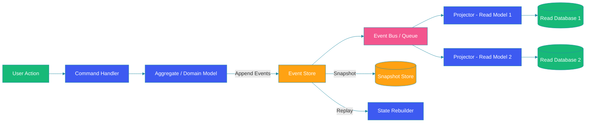

# Event Sourcing Pattern

## Overview

Event sourcing stores state changes as a sequence of events rather than the current state. Instead of updating a row in a database, you append an event describing what happened. The current state is derived by replaying events. This provides a complete audit trail, temporal queries, and the ability to rebuild state. This guide covers event stores, replay, snapshots, CQRS integration, and event versioning.

## Event Flow Diagram



## Event Store Implementation

```java
@Repository
public class EventStoreRepository {

    @Autowired
    private JdbcTemplate jdbc;

    @Autowired
    private ObjectMapper objectMapper;

    public void appendEvent(String aggregateId, DomainEvent event, long expectedVersion) {
        String sql = """
            INSERT INTO events (aggregate_id, aggregate_type, event_type, 
                                version, data, metadata, created_at)
            SELECT ?, ?, ?, ?, ?, ?, ?
            WHERE NOT EXISTS (
                SELECT 1 FROM events 
                WHERE aggregate_id = ? AND version = ?
            )
            """;

        int inserted = jdbc.update(sql,
            aggregateId,
            event.getAggregateType(),
            event.getClass().getSimpleName(),
            expectedVersion + 1,
            objectMapper.writeValueAsString(event),
            objectMapper.writeValueAsString(event.getMetadata()),
            Instant.now(),
            aggregateId,
            expectedVersion + 1
        );

        if (inserted == 0) {
            throw new ConcurrencyException(
                "Concurrent modification detected for aggregate: " + aggregateId);
        }
    }

    public List<DomainEvent> getEvents(String aggregateId) {
        return jdbc.query(
            "SELECT data, event_type, version, metadata FROM events " +
            "WHERE aggregate_id = ? ORDER BY version ASC",
            new EventRowMapper(),
            aggregateId
        );
    }

    public List<DomainEvent> getEventsSince(String aggregateId, long sinceVersion) {
        return jdbc.query(
            "SELECT data, event_type, version, metadata FROM events " +
            "WHERE aggregate_id = ? AND version > ? ORDER BY version ASC",
            new EventRowMapper(),
            aggregateId,
            sinceVersion
        );
    }
}
```

## Aggregate with Event Sourcing

```java
public class OrderAggregate {

    private String id;
    private OrderStatus status;
    private BigDecimal total;
    private List<OrderItem> items;
    private long version;

    public OrderAggregate(List<DomainEvent> events) {
        // Rebuild state from events
        for (DomainEvent event : events) {
            apply(event);
        }
    }

    public void createOrder(String orderId, List<OrderItem> items) {
        if (status != null) {
            throw new IllegalStateException("Order already exists");
        }
        applyChange(new OrderCreatedEvent(orderId, items));
    }

    public void confirmOrder() {
        if (status != OrderStatus.PENDING) {
            throw new IllegalStateException("Order must be pending");
        }
        applyChange(new OrderConfirmedEvent(id));
    }

    public void cancelOrder(String reason) {
        if (status == OrderStatus.SHIPPED || status == OrderStatus.DELIVERED) {
            throw new IllegalStateException("Cannot cancel shipped order");
        }
        applyChange(new OrderCancelledEvent(id, reason));
    }

    private void applyChange(DomainEvent event) {
        apply(event);
        version++;
    }

    private void apply(DomainEvent event) {
        switch (event) {
            case OrderCreatedEvent e -> {
                this.id = e.getOrderId();
                this.items = e.getItems();
                this.total = e.getTotal();
                this.status = OrderStatus.PENDING;
            }
            case OrderConfirmedEvent e -> this.status = OrderStatus.CONFIRMED;
            case OrderCancelledEvent e -> this.status = OrderStatus.CANCELLED;
            case OrderShippedEvent e -> this.status = OrderStatus.SHIPPED;
            default -> throw new IllegalArgumentException(
                "Unknown event: " + event.getClass().getSimpleName());
        }
    }
}
```

## Event Replay and Snapshots

### Snapshot Strategy

```java
@Component
public class SnapshotManager {

    @Autowired
    private EventStoreRepository eventStore;

    @Autowired
    private AggregateStore aggregateStore;

    private static final int SNAPSHOT_FREQUENCY = 100;

    public OrderAggregate loadOrder(String orderId) {
        // Try loading from snapshot
        AggregateSnapshot snapshot = aggregateStore.loadSnapshot(orderId);

        if (snapshot != null) {
            // Replay only events after the snapshot
            List<DomainEvent> newEvents = eventStore.getEventsSince(
                orderId, snapshot.getVersion());
            OrderAggregate aggregate = deserializeSnapshot(snapshot);
            for (DomainEvent event : newEvents) {
                aggregate.apply(event);
            }
            return aggregate;
        }

        // Full replay from all events
        List<DomainEvent> allEvents = eventStore.getEvents(orderId);
        return new OrderAggregate(allEvents);
    }

    @Scheduled(fixedRate = 3600000) // Every hour
    public void createSnapshots() {
        aggregateStore.findAggregatesNeedingSnapshot(SNAPSHOT_FREQUENCY)
            .forEach(aggregateId -> {
                OrderAggregate aggregate = loadOrder(aggregateId);
                aggregateStore.saveSnapshot(aggregateId, aggregate);
            });
    }
}
```

## CQRS Integration

```java
@Service
public class OrderCommandHandler {

    @Autowired
    private EventStoreRepository eventStore;

    @Autowired
    private SnapshotManager snapshotManager;

    @Autowired
    private EventBus eventBus;

    public void handle(CreateOrderCommand command) {
        OrderAggregate aggregate = new OrderAggregate(List.of());
        aggregate.createOrder(command.getOrderId(), command.getItems());

        for (DomainEvent event : aggregate.getUncommittedChanges()) {
            eventStore.appendEvent(
                command.getOrderId(), event, aggregate.getVersion());
            eventBus.publish(event);
        }
    }
}

@Service
public class OrderProjection {

    @Autowired
    private ReadModelRepository readModel;

    @EventListener
    public void onOrderCreated(OrderCreatedEvent event) {
        OrderReadModel model = new OrderReadModel();
        model.setId(event.getOrderId());
        model.setStatus("PENDING");
        model.setItems(event.getItems());
        model.setTotal(event.getTotal());
        model.setCreatedAt(Instant.now());
        readModel.save(model);
    }

    @EventListener
    public void onOrderConfirmed(OrderConfirmedEvent event) {
        readModel.findById(event.getOrderId())
            .ifPresent(model -> {
                model.setStatus("CONFIRMED");
                readModel.save(model);
            });
    }
}
```

## Event Versioning

```java
public class EventUpcaster {

    private final Map<String, EventUpgrader> upgraderMap = Map.of(
        "OrderCreatedEvent", new OrderCreatedEventUpgrader(),
        "PaymentProcessedEvent", new PaymentProcessedEventUpgrader()
    );

    public DomainEvent upgrade(String eventType, int version, JsonNode data) {
        EventUpgrader upgrader = upgraderMap.get(eventType);
        if (upgrader != null) {
            return upgrader.upgrade(version, data);
        }
        // No upgrade needed
        return objectMapper.treeToValue(data, DomainEvent.class);
    }
}

class OrderCreatedEventUpgrader implements EventUpgrader {

    @Override
    public DomainEvent upgrade(int version, JsonNode data) {
        return switch (version) {
            case 1 -> upgradeV1ToV2(data);
            case 2 -> objectMapper.treeToValue(data, OrderCreatedEvent.class);
            default -> throw new IllegalArgumentException(
                "Unknown version: " + version);
        };
    }

    private DomainEvent upgradeV1ToV2(JsonNode v1Data) {
        // v1 had total as part of the event; v2 computes it from items
        return new OrderCreatedEvent(
            v1Data.get("orderId").asText(),
            extractItems(v1Data)
        );
    }
}
```

## Best Practices

1. **Use semantic event names**: Events should describe what happened in the past tense (e.g., `OrderConfirmedEvent`).

2. **Event versioning**: Events evolve; implement upcasting for backward compatibility.

3. **Snapshot frequently**: Prevent long replay times with periodic snapshots.

4. **Separate read and write models**: CQRS pairs naturally with event sourcing.

5. **Immutable events**: Events should never be deleted or modified after appending.

6. **Idempotent event handlers**: Replaying events should produce the same result.

## Common Mistakes

1. **No snapshot strategy**: Replaying millions of events is slow.

2. **Mutable events**: Allowing event modification breaks the audit trail.

3. **Synchronous projections**: Updating read models synchronously defeats the purpose.

4. **Events with business logic**: Events are facts; business logic belongs in aggregates.

5. **Schema evolution ignored**: Breaking changes to event schemas without upcasting.

## Summary

Event sourcing stores state as a sequence of immutable events, providing audit trails, temporal queries, and state rebuild capabilities. Paired with CQRS, event sourcing enables scalable, event-driven systems. Key considerations: snapshot frequency, event versioning with upcasting, and idempotent projections.

---

## References

- [Martin Fowler - Event Sourcing](https://martinfowler.com/eaaDev/EventSourcing.html)
- [Event Sourcing with Axon](https://docs.axoniq.io/)
- [Greg Young - CQRS & Event Sourcing](https://www.youtube.com/watch?v=JHGkaShoyNs)
- [Event Store Documentation](https://www.eventstore.com/docs/)
