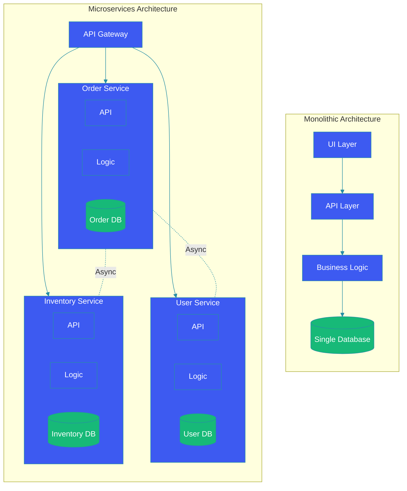

# Monolith vs Microservices

## Overview

Choosing between monolithic and microservices architecture is one of the most consequential decisions in software design. Monoliths offer simplicity and performance for smaller teams; microservices provide scalability and autonomy for larger ones. This guide compares both approaches, when to use each, migration strategies, and how Domain-Driven Design (DDD) guides service boundaries.

## Architecture Comparison Diagram



## Comparison

| Aspect | Monolith | Microservices |
|--------|----------|---------------|
| **Deployment** | Single unit | Independent services |
| **Scaling** | Scale entire app | Scale per service |
| **Team** | Single team | Multiple teams |
| **Complexity** | Lower initially | Higher initially |
| **Performance** | No network overhead | Network latency |
| **Testing** | Easier E2E tests | Contract tests needed |
| **Data** | Single database | Database per service |
| **Release** | Coordinated | Independent releases |

## When to Use Monolith

```java
@SpringBootApplication
public class MonolithicApplication {

    public static void main(String[] args) {
        SpringApplication.run(MonolithicApplication.class, args);
    }

    // All in one application
    @RestController
    @RequestMapping("/api")
    public class UnifiedController {
        @Autowired
        private OrderService orderService;
        @Autowired
        private UserService userService;
        @Autowired
        private InventoryService inventoryService;

        @PostMapping("/orders")
        public ResponseEntity<Order> placeOrder(@RequestBody OrderRequest request) {
            User user = userService.findById(request.getUserId());
            inventoryService.reserveItems(request.getItems());
            Order order = orderService.create(user, request);
            return ResponseEntity.ok(order);
        }
    }
}
```

## When to Use Microservices

```java
// Order Service
@SpringBootApplication
@EnableEurekaClient
public class OrderServiceApplication {

    public static void main(String[] args) {
        SpringApplication.run(OrderServiceApplication.class, args);
    }
}

@RestController
@RequestMapping("/api/orders")
public class OrderController {

    @Autowired
    private OrderService orderService;

    @Autowired
    private UserServiceClient userClient;

    @Autowired
    private InventoryServiceClient inventoryClient;

    @PostMapping
    public ResponseEntity<Order> createOrder(@RequestBody CreateOrderRequest request) {
        User user = userClient.getUser(request.getUserId());
        inventoryClient.reserveItems(request.getItems());
        Order order = orderService.create(user.getId(), request);
        return ResponseEntity.ok(order);
    }
}
```

## Bounded Contexts with DDD

```java
// Bounded Context: Ordering
public class OrderContext {

    @Entity
    @Table(name = "orders")
    public class Order {
        @Id
        private Long id;
        private String customerId; // References User context
        private Money total;
        private List<OrderLine> lines;
        private OrderStatus status;

        public void addItem(Product product, int quantity) {
            // Only concerned with ordering, not inventory
            lines.add(new OrderLine(product.getId(), quantity, product.getPrice()));
            recalculateTotal();
        }
    }

    public class OrderLine {
        private String productId; // References Product context
        private int quantity;
        private Money unitPrice;
    }
}

// Bounded Context: Inventory
public class InventoryContext {

    @Entity
    @Table(name = "inventory")
    public class StockItem {
        @Id
        private String productId;
        private int quantityOnHand;
        private int reservedQuantity;

        public boolean canReserve(int quantity) {
            return quantityOnHand - reservedQuantity >= quantity;
        }

        public void reserve(int quantity) {
            if (!canReserve(quantity)) {
                throw new InsufficientStockException(productId);
            }
            reservedQuantity += quantity;
        }
    }
}
```

## Strangler Fig Migration Pattern

```java
@Component
public class StranglerFigRouter {

    @Autowired
    private OrderService orderService; // Monolith

    @Autowired
    private NewOrderService newOrderService; // New microservice

    public OrderResponse getOrder(String orderId) {
        // Route new orders to new service, old to monolith
        if (isNewOrder(orderId)) {
            return newOrderService.getOrder(orderId);
        }
        return orderService.getOrder(orderId);
    }

    public OrderResponse createOrder(OrderRequest request) {
        // Gradually migrate to new service
        if (shouldRouteToNewService(request)) {
            return newOrderService.createOrder(request);
        }
        return orderService.createOrder(request);
    }

    @Scheduled(fixedDelay = 60000)
    public void migrateData() {
        // Copy data from monolith to new service
        List<Order> pendingOrders = orderService.getOrdersOlderThan(Duration.ofDays(30));
        for (Order order : pendingOrders) {
            if (!newOrderService.exists(order.getId())) {
                newOrderService.migrateOrder(order);
            }
        }
    }
}
```

## Communication Patterns

```java
// Synchronous (REST/Feign)
@FeignClient(name = "inventory-service", fallback = InventoryFallback.class)
public interface InventoryServiceClient {

    @PostMapping("/api/inventory/reserve")
    InventoryResponse reserveItems(@RequestBody ReserveRequest request);
}

// Asynchronous (Messaging)
@Service
public class EventDrivenCommunication {

    @Autowired
    private KafkaTemplate<String, OrderEvent> kafkaTemplate;

    public void orderCreated(Order order) {
        // Publish event; inventory service subscribes
        OrderCreatedEvent event = new OrderCreatedEvent(
            order.getId(), order.getItems());

        kafkaTemplate.send("order-events", order.getId(), event);
    }
}
```

## Operational Complexity

```yaml
# docker-compose for microservices orchestration
version: '3.8'
services:
  gateway:
    image: api-gateway:latest
    ports:
      - "8080:8080"
    environment:
      - EUREKA_URL=http://discovery:8761/eureka

  order-service:
    image: order-service:latest
    deploy:
      replicas: 3
    environment:
      - DB_URL=jdbc:postgresql://order-db:5432/orders
      - KAFKA_URL=kafka:9092

  user-service:
    image: user-service:latest
    deploy:
      replicas: 3

  inventory-service:
    image: inventory-service:latest
    deploy:
      replicas: 5

  discovery:
    image: eureka-server:latest
    ports:
      - "8761:8761"

  monitoring:
    image: prom/prometheus
    ports:
      - "9090:9090"
```

## Best Practices

1. **Start with monolith**: Don't start with microservices unless you have clear service boundaries.

2. **Identify bounded contexts**: Use DDD workshop to find natural service boundaries.

3. **Use strangler fig**: Gradually extract services from the monolith.

4. **Database per service**: Shared databases create coupling between services.

5. **Automate everything**: CI/CD, infrastructure as code, and container orchestration.

6. **Observability first**: Distributed tracing, metrics, and centralized logging.

## Common Mistakes

1. **Premature microservices**: Starting with microservices before understanding domain boundaries.

2. **Shared database**: Multiple services accessing the same database schema.

3. **Chatty communication**: Too many synchronous calls between services.

4. **Ignoring network failures**: Not implementing circuit breakers and retries.

5. **No monitoring**: Unable to debug distributed failures.

## Summary

Monoliths are simpler, faster to develop, and appropriate for small teams and early-stage products. Microservices offer independent scaling, team autonomy, and fault isolation but at the cost of operational complexity. Start monolithic, identify bounded contexts with DDD, and extract services gradually using the strangler fig pattern.

---

## References

- [Martin Fowler - Microservices](https://martinfowler.com/articles/microservices.html)
- [Sam Newman - Building Microservices](https://samnewman.io/books/building-microservices/)
- [DDD by Eric Evans](https://domainlanguage.com/ddd/)
- [Strangler Fig Pattern](https://martinfowler.com/bliki/StranglerFigApplication.html)
