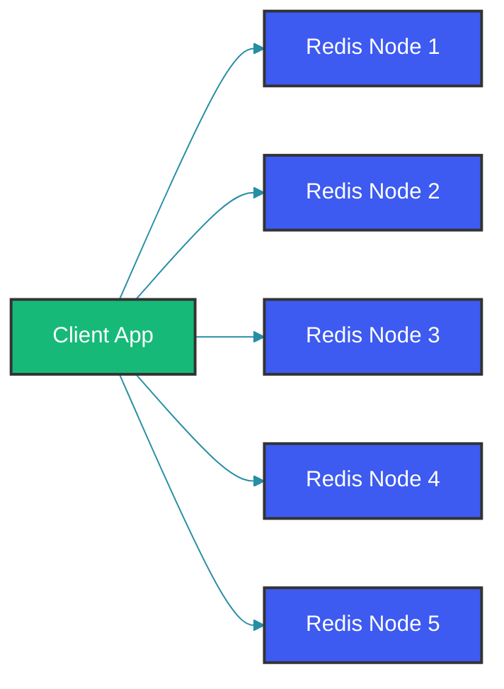
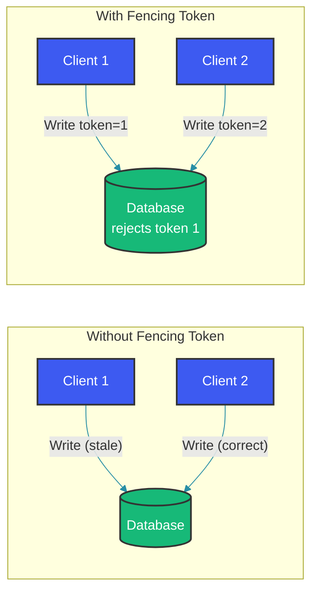

# Distributed Locks

## Overview

Distributed locks coordinate access to shared resources across multiple processes running on different machines. Unlike single-process locks (ReentrantLock, synchronized), distributed locks must handle network partitions, process crashes, clock skew, and partial failures. This guide covers the major distributed locking algorithms, their implementations, and the subtle pitfalls that can compromise correctness.

## Why Distributed Locks

In a distributed system, multiple services may need exclusive access to a shared resource:

- Scheduled job execution (only one instance should run a cron job)
- Resource allocation (assign unique IDs, acquire database partitions)
- Rate limiting coordination
- Leader election for cluster management

## Redis Redlock Algorithm

Redlock is a distributed lock implementation using Redis, designed to work correctly even when individual Redis nodes fail.



### Redlock Implementation

```java
public class Redlock {
    private static final int MAJORITY = 3; // Out of 5 nodes
    private static final int DEFAULT_TTL_MS = 10000;
    private static final int RETRY_DELAY_MS = 200;
    private static final int CLOCK_DRIFT_FACTOR = 3;
    
    private final List<RedisClient> redisNodes;
    
    public Redlock(List<RedisClient> redisNodes) {
        this.redisNodes = redisNodes;
    }
    
    public Optional<Lock> acquire(String resource, int ttlMs) {
        String lockValue = UUID.randomUUID().toString();
        long startTime = System.currentTimeMillis();
        int acquiredCount = 0;
        
        // Phase 1: Acquire lock on all nodes
        for (RedisClient node : redisNodes) {
            String result = node.set(
                resource, 
                lockValue, 
                SetArgs.Builder
                    .nx()    // Only set if not exists
                    .px(ttlMs) // Expire after TTL
                    .build()
            );
            
            if ("OK".equals(result)) {
                acquiredCount++;
            }
        }
        
        // Phase 2: Check if majority acquired
        long elapsed = System.currentTimeMillis() - startTime;
        long validity = ttlMs - elapsed - (ttlMs / CLOCK_DRIFT_FACTOR);
        
        if (acquiredCount >= MAJORITY && validity > 0) {
            return Optional.of(new Lock(resource, lockValue, validity));
        } else {
            // Release locks if we couldn't acquire majority
            release(resource, lockValue);
            return Optional.empty();
        }
    }
    
    public void release(String resource, String lockValue) {
        // Use Lua script to ensure we only release our own lock
        String luaScript = """
            if redis.call("get", KEYS[1]) == ARGV[1] then
                return redis.call("del", KEYS[1])
            else
                return 0
            end
            """;
        
        for (RedisClient node : redisNodes) {
            node.eval(luaScript, Collections.singletonList(resource), 
                      Collections.singletonList(lockValue));
        }
    }
}
```

## ZooKeeper Locks

ZooKeeper provides strong consistency guarantees, making it suitable for distributed locking via ephemeral sequential nodes.

```java
public class ZooKeeperDistributedLock implements AutoCloseable {
    private final ZooKeeper zk;
    private final String lockPath;
    private String lockedNodePath;
    
    public ZooKeeperDistributedLock(ZooKeeper zk, String lockPath) {
        this.zk = zk;
        this.lockPath = lockPath;
    }
    
    public void lock() throws Exception {
        // Create ephemeral sequential node
        lockedNodePath = zk.create(
            lockPath + "/lock-",
            new byte[0],
            ZooDefs.Ids.OPEN_ACL_UNSAFE,
            CreateMode.EPHEMERAL_SEQUENTIAL
        );
        
        while (true) {
            List<String> children = zk.getChildren(lockPath, false);
            Collections.sort(children);
            
            String currentNode = lockedNodePath.substring(lockPath.length() + 1);
            int currentIndex = children.indexOf(currentNode);
            
            if (currentIndex == 0) {
                // We hold the lock
                return;
            }
            
            // Watch the preceding node
            String watchedNode = lockPath + "/" + children.get(currentIndex - 1);
            
            CountDownLatch latch = new CountDownLatch(1);
            zk.exists(watchedNode, event -> latch.countDown());
            
            // Check again if the watched node is already gone
            if (zk.exists(watchedNode, false) != null) {
                latch.await(); // Wait for the node to be deleted
            }
        }
    }
    
    @Override
    public void close() {
        if (lockedNodePath != null) {
            try {
                zk.delete(lockedNodePath, -1);
            } catch (Exception e) {
                Thread.currentThread().interrupt();
            }
        }
    }
}
```

## Lease-Based Locking

Leases prevent deadlocks when a lock holder crashes. The lease gives the holder exclusive access for a limited duration, after which the lock is automatically released.

```java
public class LeaseManager {
    private final ConcurrentHashMap<String, Lease> activeLeases = new ConcurrentHashMap<>();
    
    public Lease acquireLease(String resourceId, String ownerId, long durationMs) {
        Lease lease = new Lease(resourceId, ownerId, 
            System.currentTimeMillis() + durationMs);
        
        Lease existing = activeLeases.putIfAbsent(resourceId, lease);
        if (existing != null && existing.isExpired()) {
            // Override expired lease
            activeLeases.replace(resourceId, existing, lease);
        } else if (existing != null) {
            throw new LockAcquisitionException("Resource already locked");
        }
        
        // Schedule automatic expiration
        scheduler.schedule(() -> releaseExpiredLease(resourceId, ownerId), 
            durationMs, TimeUnit.MILLISECONDS);
        
        return lease;
    }
    
    public boolean renewLease(String resourceId, String ownerId, long extensionMs) {
        return activeLeases.computeIfPresent(resourceId, (key, lease) -> {
            if (!lease.getOwnerId().equals(ownerId)) {
                return lease; // Not authorized to renew
            }
            if (lease.isExpired()) {
                return null; // Already expired, cannot renew
            }
            return lease.renew(extensionMs);
        }) != null;
    }
    
    static class Lease {
        private final String resourceId;
        private final String ownerId;
        private volatile long expiryTime;
        
        boolean isExpired() {
            return System.currentTimeMillis() > expiryTime;
        }
        
        Lease renew(long extensionMs) {
            this.expiryTime = System.currentTimeMillis() + extensionMs;
            return this;
        }
    }
}
```

## Fencing Tokens

Fencing tokens protect against a lock holder that has been paused (GC pause, network delay) and continues running after the lock has expired.



```java
public class FencingTokenService {
    private final AtomicLong tokenGenerator = new AtomicLong(0);
    
    public LockWithFence acquireWithFencing(String resourceId, String ownerId) {
        long token = tokenGenerator.incrementAndGet();
        
        boolean acquired = distributedLock.acquire(resourceId, ownerId);
        if (!acquired) {
            return null;
        }
        
        return new LockWithFence(resourceId, ownerId, token, 
            System.currentTimeMillis() + LEASE_DURATION_MS);
    }
}

// The resource server validates the fencing token
@Service
public class ProtectedResourceService {
    
    public void writeData(WriteRequest request) {
        LockWithFence fence = request.getFencingToken();
        
        // Validate token is monotonically increasing
        long lastToken = tokenStore.getLastToken(fence.getResourceId());
        if (fence.getToken() <= lastToken) {
            throw new StaleLockException("Fencing token rejected");
        }
        
        tokenStore.recordToken(fence.getResourceId(), fence.getToken());
        // Proceed with the write...
    }
}
```

## Spring Boot Distributed Lock Example

```java
@Service
public class ScheduledTaskService {
    
    @Autowired
    private Redlock redlock;
    
    @Scheduled(cron = "0 0 * * * *") // Every hour
    public void runHourlyReport() {
        Lock lock = redlock.acquire("report-generation-lock", 30000)
            .orElseThrow(() -> new LockNotAcquiredException(
                "Could not acquire distributed lock for report generation"));
        
        try {
            // Only one instance executes this
            generateReport();
        } finally {
            redlock.release(lock.getResource(), lock.getValue());
        }
    }
}
```

## Best Practices

- Always use fencing tokens when the lock protects writes to a resource that tracks monotonic sequence numbers
- Set lock TTL generously but enforce heartbeats for long-running operations to avoid premature expiration
- Use Lua scripts for atomic lock release in Redis to prevent deleting another client's lock
- Implement exponential backoff with jitter for lock acquisition retries to avoid thundering herd
- Prefer ZooKeeper/etcd for locks requiring strong consistency; use Redis for performance-critical but slightly less strict scenarios
- Monitor lock acquisition latency and lease expiration rates as key operational metrics

## Common Mistakes

- Using a single Redis node for locks (single point of failure breaks the lock entirely)
- Not using unique lock values or UUIDs, making it impossible to distinguish lock owners
- Ignoring clock drift in Redlock implementations (assumes synchronized clocks across Redis nodes)
- Releasing a lock that another client has acquired after the lease expired (the "lock but not lease" problem)
- Using synchronous lock release without timeout handling, causing thread pool exhaustion

## Summary

Distributed locks are essential for coordinating access to shared resources but are notoriously difficult to implement correctly. Redlock offers a practical approach with Redis, while ZooKeeper provides stronger guarantees at the cost of performance. The critical insight is that locks without fencing tokens or leases are vulnerable to correctness failures during network partitions and process pauses. Choose the approach that matches your consistency requirements and accept the inherent trade-offs.

## References

- [Redis Redlock Specification](https://redis.io/topics/distlock)
- [ZooKeeper Recipes: Locks](https://zookeeper.apache.org/doc/current/recipes.html)
- [Martin Kleppmann: How to do distributed locking](https://martin.kleppmann.com/2016/02/08/how-to-do-distributed-locking.html)
- [etcd: A strongly consistent distributed lock](https://etcd.io/docs/v3.5/dev-guide/grpc_lock/)
