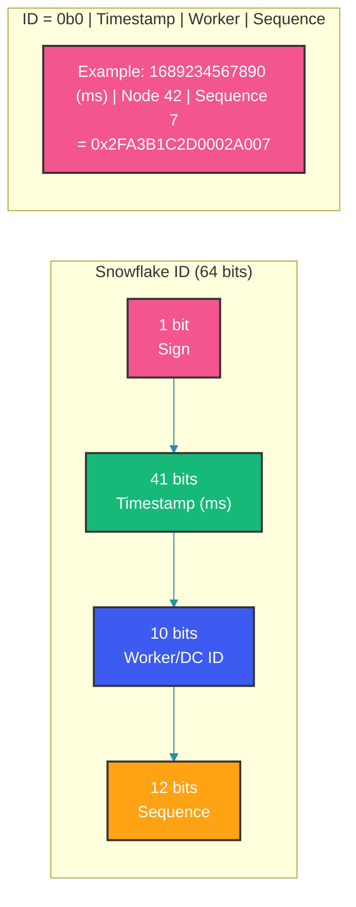

# Distributed ID Generation

## Overview

Generating unique identifiers across distributed systems without a single coordination point is a fundamental challenge. Whether you need auto-incrementing IDs for a database, globally unique IDs for tracing, or time-sortable IDs for event streams, the choice of ID generation strategy impacts performance, scalability, and system complexity.

## Problem Statement

In a single-node database, auto-increment IDs work perfectly. But in distributed systems, we need IDs that are:
- **Globally unique**: No two nodes generate the same ID
- **Time-sortable**: Monotonically increasing for efficient indexing
- **Scalable**: Generate millions of IDs per second without coordination
- **Compact**: Fit in 64-bit integers or short string representations

## Twitter Snowflake

Snowflake generates 64-bit, time-sortable, unique IDs without any coordination between nodes.



### Snowflake Implementation

```java
public class SnowflakeIdGenerator {
    private static final long EPOCH = 1700000000000L; // Custom epoch
    
    private static final long WORKER_ID_BITS = 10L;
    private static final long SEQUENCE_BITS = 12L;
    
    private static final long MAX_WORKER_ID = ~(-1L << WORKER_ID_BITS);
    private static final long SEQUENCE_MASK = ~(-1L << SEQUENCE_BITS);
    
    private static final long WORKER_ID_SHIFT = SEQUENCE_BITS;
    private static final long TIMESTAMP_SHIFT = SEQUENCE_BITS + WORKER_ID_BITS;
    
    private final long workerId;
    private long lastTimestamp = -1L;
    private long sequence = 0L;
    private final Object lock = new Object();
    
    public SnowflakeIdGenerator(long workerId) {
        if (workerId < 0 || workerId > MAX_WORKER_ID) {
            throw new IllegalArgumentException("Invalid worker ID");
        }
        this.workerId = workerId;
    }
    
    public long nextId() {
        synchronized (lock) {
            long timestamp = System.currentTimeMillis();
            
            if (timestamp < lastTimestamp) {
                // Clock moved backwards - reject or wait
                long drift = lastTimestamp - timestamp;
                if (drift > 5000) {
                    throw new IllegalStateException(
                        "Clock moved backwards by " + drift + "ms");
                }
                // Wait until clock catches up
                while (timestamp <= lastTimestamp) {
                    timestamp = System.currentTimeMillis();
                }
            }
            
            if (timestamp == lastTimestamp) {
                sequence = (sequence + 1) & SEQUENCE_MASK;
                if (sequence == 0) {
                    // Sequence exhausted, wait for next millisecond
                    while (timestamp <= lastTimestamp) {
                        timestamp = System.currentTimeMillis();
                    }
                }
            } else {
                sequence = 0L;
            }
            
            lastTimestamp = timestamp;
            
            return ((timestamp - EPOCH) << TIMESTAMP_SHIFT)
                 | (workerId << WORKER_ID_SHIFT)
                 | sequence;
        }
    }
}
```

## UUID Variants

UUIDs are 128-bit identifiers. Different versions serve different purposes.

```java
public class UUIDDemo {
    
    // UUID v1: Time-based + MAC address (128-bit, sortable but leaks MAC)
    public UUID generateUUIDv1() {
        // Uses current timestamp + clock sequence + node (MAC)
        return UUID.randomUUID(); // Java doesn't support v1 natively
    }
    
    // UUID v4: Random (most common, 122 random bits)
    public UUID generateUUIDv4() {
        return UUID.randomUUID();
        // Example: 550e8400-e29b-41d4-a716-446655440000
    }
    
    // UUID v7: Time-ordered random (draft, time-sortable)
    public UUID generateUUIDv7() {
        long timestamp = System.currentTimeMillis();
        long msb = (timestamp & 0xFFFFFFFFFFFFL) << 16 
                 | 0x7000 // Version 7
                 | (ThreadLocalRandom.current().nextLong(0x0FFF) & 0x0FFF);
        
        long lsb = 0x8000000000000000L // Variant 1
                 | ThreadLocalRandom.current().nextLong(0x3FFFFFFFFFFFFFFFL);
        
        return new UUID(msb, lsb);
    }
}
```

| Version | Description | Sortable | Size | Uniqueness |
|---|---|---|---|---|
| UUID v1 | Time + MAC | Yes (coarse) | 128 bits | Guaranteed (MAC unique) |
| UUID v4 | Random | No | 128 bits | Probabilistic |
| UUID v7 | Time + Random | Yes (ms precision) | 128 bits | Probabilistic |

## ULID

ULID (Universally Unique Lexicographically Sortable Identifier) is a 128-bit, 26-character Crockford-base32 encoded identifier.

```java
public class UlidGenerator {
    private static final char[] ENCODING = 
        "0123456789ABCDEFGHJKMNPQRSTVWXYZ".toCharArray();
    private static final long RANDOM_MASK = 0xFFFFFFFFFFFFL;
    
    public String generate() {
        long timestamp = System.currentTimeMillis();
        long random = SecureRandom.getSeed(10); // 80 bits of randomness
        
        return encode(timestamp, random);
    }
    
    private String encode(long timestamp, long random) {
        char[] ulid = new char[26];
        
        // Timestamp (10 chars, 48 bits)
        long ts = timestamp;
        for (int i = 9; i >= 0; i--) {
            ulid[i] = ENCODING[(int)(ts & 0x1F)];
            ts >>= 5;
        }
        
        // Randomness (16 chars, 80 bits)
        long rand = random;
        for (int i = 25; i >= 10; i--) {
            ulid[i] = ENCODING[(int)(rand & 0x1F)];
            rand >>= 5;
        }
        
        return new String(ulid);
    }
}
```

## Database Sequences with Coordination

For systems that need strict sequential ordering, database sequences with coordination tiers offer a pragmatic approach.

```java
@Service
public class DistributedSequenceGenerator {
    
    // Segment-based ID allocation
    private static final int ALLOCATION_SIZE = 1000;
    
    private final JdbcTemplate jdbcTemplate;
    private final Map<String, IdSegment> segments = new ConcurrentHashMap<>();
    
    public long nextId(String sequenceName) {
        IdSegment segment = segments.computeIfAbsent(sequenceName, this::allocateSegment);
        
        long id = segment.nextId();
        if (id == -1) {
            segment = allocateSegment(sequenceName);
            segments.put(sequenceName, segment);
            id = segment.nextId();
        }
        return id;
    }
    
    private IdSegment allocateSegment(String sequenceName) {
        // Atomically increment the sequence range in DB
        jdbcTemplate.update(
            "UPDATE id_sequences SET next_id = next_id + ? WHERE name = ?",
            ALLOCATION_SIZE, sequenceName
        );
        
        Long nextId = jdbcTemplate.queryForObject(
            "SELECT next_id - ? FROM id_sequences WHERE name = ?",
            Long.class, ALLOCATION_SIZE, sequenceName
        );
        
        return new IdSegment(nextId, nextId + ALLOCATION_SIZE);
    }
    
    static class IdSegment {
        private final long start;
        private final long end;
        private final AtomicLong current;
        
        IdSegment(long start, long end) {
            this.start = start;
            this.end = end;
            this.current = new AtomicLong(start);
        }
        
        long nextId() {
            long id = current.getAndIncrement();
            return id < end ? id : -1; // Segment exhausted
        }
    }
}
```

## Trade-Off Analysis

| Method | Uniqueness | Ordering | Performance | Complexity |
|---|---|---|---|---|
| Snowflake | Guaranteed (coordinated) | Time-based | 1M+/sec per node | Moderate |
| UUID v4 | Probabilistic (collision ~2^122) | None | 10M+/sec | None |
| UUID v7 | Probabilistic | Time-based | 10M+/sec | Low |
| ULID | Probabilistic | Time-based | 5M+/sec | Low |
| DB Sequence | Guaranteed | Strictly sequential | 10K/sec per DB | High (coordination) |
| Segment-based | Guaranteed | Sequential per segment | 100K+/sec per node | High |

## Best Practices

- Use Snowflake-style IDs when you need 64-bit integers for storage efficiency and time-based ordering
- Prefer ULID or UUID v7 over UUID v4 when lexicographic sorting in databases is required
- Implement clock drift monitoring for Snowflake generators and fail closed if drift exceeds thresholds
- Use segment-based ID generation for database tables requiring strict sequential ordering with high throughput
- Never expose raw Snowflake IDs in URLs if the total number of IDs matters for security (they leak creation time and worker identity)
- Consider using hashids or similar encoding when exposing IDs externally while keeping internal IDs sequential

## Common Mistakes

- Using UUID v4 as primary keys in B-tree indexes, causing index fragmentation and page splits
- Assuming Snowflake IDs are monotonically increasing across workers (they're only monotonic per worker)
- Not handling clock skew in Snowflake implementations, resulting in duplicate IDs or crashes
- Using UUID v1 without considering that MAC address leaks expose internal network topology
- Over-allocating ID ranges with segment-based generators, wasting ID space in services that rarely use allocations

## Summary

Distributed ID generation requires balancing uniqueness guarantees, ordering properties, performance, and operational complexity. Snowflake remains the gold standard for systems needing compact, time-sortable IDs at massive scale. ULID and UUID v7 offer simpler alternatives with similar ordering properties. For systems that trade ordering for simplicity, UUID v4 is hard to beat. The key is understanding your workload's ordering requirements and choosing the right trade-off.

## References

- [Twitter Snowflake Blog Post](https://blog.twitter.com/engineering/en_us/a/2010/announcing-snowflake)
- [UUID RFC 9562 (v7)](https://datatracker.ietf.org/doc/rfc9562/)
- [ULID Specification](https://github.com/ulid/spec)
- [Flickr: Ticket Servers for Distributed Primary Keys](https://code.flickr.net/2010/02/08/ticket-servers-distributed-unique-primary-keys-on-the-cheap/)
