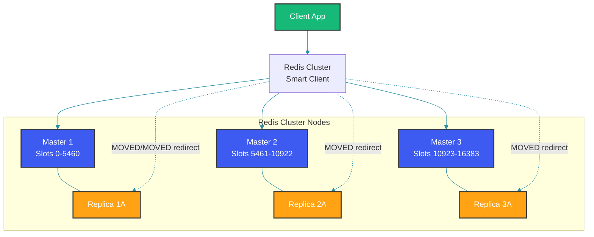

# Distributed Caching with Redis Cluster

## Overview

Redis Cluster provides a way to run Redis across multiple nodes, automatically sharding data across them while maintaining availability during partial failures. This guide covers Redis Cluster's architecture, hash slot distribution, sharding algorithms, failover, consistency guarantees, and efficient client patterns for building scalable caching layers.

## Redis Cluster Architecture

Redis Cluster uses a decentralized architecture where every node knows about the entire cluster topology.



### Hash Slot Distribution

Redis Cluster divides the key space into 16,384 hash slots. The slot for a key is computed as `CRC16(key) mod 16384`.

```java
public class RedisClusterRouter {
    private static final int HASH_SLOTS = 16384;
    private static final int[] SLOT_TO_NODE = new int[HASH_SLOTS];
    
    // CRC16 lookup table for Redis cluster slot calculation
    private static final int[] CRC16_TABLE = new int[256];
    static {
        for (int i = 0; i < 256; i++) {
            int crc = i;
            for (int j = 0; j < 8; j++) {
                if ((crc & 1) != 0) {
                    crc = (crc >>> 1) ^ 0xA001;
                } else {
                    crc = crc >>> 1;
                }
            }
            CRC16_TABLE[i] = crc;
        }
    }
    
    public static int getSlot(String key) {
        // Hash slot tags: keys with {tag} use only the tag for slot calculation
        String hashKey = key;
        int start = key.indexOf('{');
        if (start >= 0) {
            int end = key.indexOf('}', start + 1);
            if (end > start + 1) {
                hashKey = key.substring(start + 1, end);
            }
        }
        return crc16(hashKey.getBytes()) % HASH_SLOTS;
    }
    
    private static int crc16(byte[] bytes) {
        int crc = 0;
        for (byte b : bytes) {
            crc = (crc >>> 8) ^ CRC16_TABLE[(crc ^ b) & 0xFF];
        }
        return crc;
    }
    
    public RedisNode getNodeForKey(String key) {
        int slot = getSlot(key);
        int nodeIndex = SLOT_TO_NODE[slot];
        return clusterNodes.get(nodeIndex);
    }
}
```

## Sharding and Data Distribution

### Smart Client Implementation

```java
public class RedisClusterClient {
    private final ConcurrentHashMap<Integer, RedisNode> slotCache = new ConcurrentHashMap<>();
    private final Set<RedisNode> nodes = ConcurrentHashMap.newKeySet();
    
    public String get(String key) {
        int slot = RedisClusterRouter.getSlot(key);
        RedisNode node = getNodeForSlot(slot);
        
        try {
            return node.get(key);
        } catch (MovedRedirectionException e) {
            // Update slot cache and retry
            slotCache.put(slot, e.getTargetNode());
            return e.getTargetNode().get(key);
        } catch (AskRedirectionException e) {
            // Temporary migration in progress
            return e.getTargetNode().get(key);
        }
    }
    
    private RedisNode getNodeForSlot(int slot) {
        return slotCache.computeIfAbsent(slot, s -> {
            // Query cluster nodes for slot mapping
            for (RedisNode node : nodes) {
                ClusterInfo info = node.clusterInfo();
                if (info.slotInRange(s)) {
                    return node;
                }
            }
            throw new IllegalStateException("No node found for slot " + slot);
        });
    }
}
```

### Hash Tag Pattern

Hash tags let you force multiple keys into the same slot for multi-key operations:

```java
@Service
public class UserCacheService {
    
    // With hash tags, user:123:profile and user:123:sessions
    // end up in the same slot because {user:123} is the hash key
    
    private static final String PROFILE_KEY = "user:{userId}:profile";
    private static final String SESSIONS_KEY = "user:{userId}:sessions";
    
    public UserProfile getProfileWithSessions(String userId) {
        String profileKey = PROFILE_KEY.replace("{userId}", userId);
        String sessionsKey = SESSIONS_KEY.replace("{userId}", userId);
        
        // Both keys are on the same node (hash tag {userId})
        // Allowing atomic operations across both keys
        return redisClusterClient.eval(
            "local p = redis.call('GET', KEYS[1]) " +
            "local s = redis.call('SMEMBERS', KEYS[2]) " +
            "return {p, s}",
            Arrays.asList(profileKey, sessionsKey)
        );
    }
}
```

## Failover and High Availability

```java
public class ClusterFailoverHandler {
    private final ScheduledExecutorService healthChecker = 
        Executors.newScheduledThreadPool(2);
    private final Map<String, RedisNode> replicaMap = new ConcurrentHashMap<>();
    
    public void startHealthCheck() {
        healthChecker.scheduleAtFixedRate(() -> {
            for (RedisNode node : clusterNodes) {
                if (!node.ping()) {
                    handleNodeFailure(node);
                }
            }
        }, 1, 1, TimeUnit.SECONDS);
    }
    
    private void handleNodeFailure(RedisNode failedNode) {
        // Find a replica to promote
        for (Map.Entry<String, RedisNode> entry : replicaMap.entrySet()) {
            if (entry.getValue().getMasterId().equals(failedNode.getId())) {
                // Initiate failover
                entry.getValue().clusterFailover();
                
                // Update slot mapping
                int[] slots = failedNode.getSlots();
                for (int slot : slots) {
                    slotCache.put(slot, entry.getValue());
                }
                break;
            }
        }
    }
}
```

## Consistency and Trade-offs

Redis Cluster provides eventual consistency by default. Asynchronous replication means writes acknowledged to the client may not yet be on the replica.

```java
@Configuration
public class RedisClusterConfig {
    
    @Bean
    public RedisClusterConfiguration redisClusterConfig() {
        RedisClusterConfiguration config = new RedisClusterConfiguration();
        config.clusterNode("node1:6379", "node2:6379", "node3:6379");
        
        // Wait for replication acknowledgment
        // WAIT <numreplicas> <timeout> - wait for N replicas to acknowledge
        config.setMaxRedirects(3);
        
        return config;
    }
    
    @Bean
    public LettuceConnectionFactory redisConnectionFactory() {
        return new LettuceConnectionFactory(redisClusterConfig());
    }
}
```

## Client-Side Caching (Redis 6+ Tracking)

```java
@Service
public class ClientSideCacheService {
    private final Cache<String, String> localCache = Caffeine.newBuilder()
        .maximumSize(10_000)
        .expireAfterWrite(10, TimeUnit.SECONDS)
        .build();
    
    private final StatefulRedisClusterConnection<String, String> connection;
    
    @PostConstruct
    public void enableClientTracking() {
        // Enable client-side caching with RESP3
        connection.setAutoFlushCommands(true);
        connection.async().clientTracking(true)
            .thenAccept(v -> {
                // Listen for invalidation messages
                connection.reactive()
                    .observeChannels()
                    .subscribe(message -> {
                        String invalidatedKey = message.getUnicastTarget();
                        localCache.invalidate(invalidatedKey);
                    });
            });
    }
    
    public String getValue(String key) {
        String cached = localCache.getIfPresent(key);
        if (cached != null) {
            return cached; // Return from local cache
        }
        
        // Fetch from Redis Cluster
        return connection.sync().get(key);
    }
}
```

## Spring Boot Redis Cluster Example

```java
@Service
public class ProductCacheService {
    
    private final StringRedisTemplate redisTemplate;
    
    public ProductCacheService(StringRedisTemplate redisTemplate) {
        this.redisTemplate = redisTemplate;
    }
    
    public Product getProduct(String productId) {
        String cacheKey = "product:" + productId;
        
        // Try cache first
        String cached = redisTemplate.opsForValue().get(cacheKey);
        if (cached != null) {
            return deserialize(cached);
        }
        
        // Cache miss - load from DB
        Product product = productRepository.findById(productId);
        
        // Store in cache with TTL
        redisTemplate.opsForValue().set(
            cacheKey, 
            serialize(product), 
            30, TimeUnit.MINUTES
        );
        
        return product;
    }
    
    public void updateProduct(Product product) {
        // Update database first (write-through)
        productRepository.save(product);
        
        // Invalidate cache
        redisTemplate.delete("product:" + product.getId());
    }
}
```

## Best Practices

- Use hash tags `{...}` sparingly; overuse defeats the purpose of sharding and creates hot spots
- Monitor cluster node memory and set `maxmemory-policy allkeys-lru` for eviction strategy
- Implement connection pooling with connection validation to handle MOVED/ASK redirections gracefully
- Use pipeline operations within the same hash slot to batch operations efficiently
- Configure `cluster-require-full-coverage no` to keep the cluster available during partial failures
- Set appropriate timeouts for cluster node heartbeats: `cluster-node-timeout` should reflect your failover requirements
- Use client-side caching for read-heavy workloads to reduce network round trips

## Common Mistakes

- Using Redis Cluster with cross-slot multi-key operations (MSET, SUNION, DEL) without hash tags, causing CROSSSLOT errors
- Setting `cluster-require-full-coverage yes` in production, making the entire cluster unavailable when a node fails
- Ignoring MOVED and ASK redirections in client implementations, leading to data inconsistencies
- Oversharding with many small nodes, wasting memory on cluster bus overhead and replication buffers
- Not configuring `cluster-slave-validity-factor` correctly, allowing stale replicas to be promoted
- Using transactions (MULTI/EXEC) across different slots in a cluster, which is not supported

## Summary

Redis Cluster delivers horizontal scalability through hash slot-based sharding and automatic failover. Its decentralized architecture eliminates single points of failure while maintaining sub-millisecond latency. Success with Redis Cluster requires understanding the slot routing mechanism, using hash tags appropriately for multi-key operations, implementing robust redirect handling, and accepting its eventual consistency model. For workloads that require strong consistency across shards, consider alternatives like Redis Enterprise or multi-region configurations.

## References

- [Redis Cluster Specification](https://redis.io/docs/reference/cluster-spec/)
- [Redis Cluster Tutorial](https://redis.io/topics/cluster-tutorial)
- [Lettuce Redis Cluster Client](https://github.com/lettuce-io/lettuce-core)
- [Redis Cluster in Production](https://redis.io/docs/management/scaling/)
