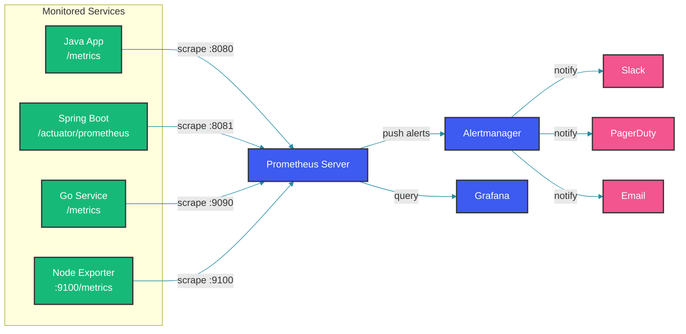

# Monitoring with Prometheus & Grafana

## Overview

Prometheus and Grafana form the most popular open-source monitoring stack. Prometheus handles metrics collection and alerting using a pull model, while Grafana provides rich visualization and dashboarding. This guide covers the architecture, PromQL query language, alerting rules, and patterns for monitoring microservices in production.

## Monitoring Architecture

Prometheus pulls metrics from instrumented targets at configured intervals (pull model), stores them in a time-series database, and evaluates alerting rules against the collected data.



## Instrumenting Spring Boot Applications

```java
@Configuration
public class MicrometerConfig {
    
    @Bean
    public MeterRegistry meterRegistry() {
        return new PrometheusMeterRegistry(PrometheusConfig.DEFAULT);
    }
    
    @Bean
    public TimedAspect timedAspect(MeterRegistry registry) {
        return new TimedAspect(registry);
    }
}

@Service
public class OrderService {
    private final MeterRegistry meterRegistry;
    private final Counter orderCounter;
    private final Timer orderTimer;
    
    public OrderService(MeterRegistry meterRegistry) {
        this.meterRegistry = meterRegistry;
        this.orderCounter = Counter.builder("orders.created.total")
            .description("Total number of orders created")
            .register(meterRegistry);
        this.orderTimer = Timer.builder("orders.processing.duration")
            .description("Time taken to process orders")
            .publishPercentiles(0.5, 0.95, 0.99)
            .register(meterRegistry);
    }
    
    @Timed(value = "orders.create", percentiles = {0.5, 0.95, 0.99})
    public Order createOrder(OrderRequest request) {
        return orderTimer.record(() -> {
            // Business logic
            orderCounter.increment();
            meterRegistry.counter("orders.value.total")
                .increment(request.getAmount());
            
            // Track order status transitions
            meterRegistry.gauge("orders.pending.queue", 
                pendingOrders, List::size);
            
            return processOrder(request);
        });
    }
}
```

## PromQL: Query Language

### Basic Queries

```promql
// Rate of HTTP requests per second
rate(http_requests_total[5m])

// 95th percentile latency
histogram_quantile(0.95, 
  sum(rate(http_request_duration_seconds_bucket[5m])) by (le))

// Error rate percentage
sum(rate(http_requests_total{status=~"5.."}[5m])) 
  / sum(rate(http_requests_total[5m])) * 100

// CPU utilization by service
avg by(service) (rate(process_cpu_seconds_total[1m]))
```

### Advanced Queries

```java
// Alert rule: High error rate
// prometheus.rules
groups:
  - name: service_errors
    rules:
      - alert: HighErrorRate
        expr: |
          sum(rate(http_requests_total{status=~"5.."}[5m])) 
          / sum(rate(http_requests_total[5m])) > 0.01
        for: 5m
        labels:
          severity: critical
        annotations:
          summary: "High error rate on {{ $labels.service }}"
          description: "Error rate is {{ $value | humanizePercentage }}"
```

## Alerting Rules

```java
@Configuration
public class AlertRuleConfiguration {
    
    // Programmatic approach to alert rule generation
    public List<AlertRule> createAlertRules() {
        return List.of(
            AlertRule.builder()
                .name("HighLatency")
                .expression("""
                    histogram_quantile(0.99, 
                      rate(http_request_duration_seconds_bucket[5m])
                    ) > 2.0
                    """)
                .duration("5m")
                .severity("warning")
                .build(),
            
            AlertRule.builder()
                .name("ServiceDown")
                .expression("up == 0")
                .duration("1m")
                .severity("critical")
                .build(),
            
            AlertRule.builder()
                .name("MemoryThreshold")
                .expression("""
                    (container_memory_usage_bytes / 
                     container_spec_memory_limit_bytes) > 0.9
                    """)
                .duration("10m")
                .severity("warning")
                .build()
        );
    }
}
```

## Grafana Dashboard Configuration

```java
@Service
public class DashboardProvisioner {
    
    public Dashboard createServiceDashboard(String serviceName) {
        return Dashboard.builder()
            .title(serviceName + " Monitoring")
            .panels(List.of(
                // RPS Panel
                TimeSeries.builder()
                    .title("Requests Per Second")
                    .target(Query.builder()
                        .expr("sum(rate(http_requests_total{service='" 
                            + serviceName + "'}[5m]))")
                        .legendFormat("RPS")
                        .build())
                    .unit("reqps")
                    .build(),
                
                // Latency Panel
                HeatMap.builder()
                    .title("Latency Distribution")
                    .target(Query.builder()
                        .expr("rate(http_request_duration_seconds_bucket{service='"
                            + serviceName + "'}[5m])")
                        .build())
                    .build(),
                
                // Error Rate Panel
                Stat.builder()
                    .title("Error Rate")
                    .target(Query.builder()
                        .expr("""
                            sum(rate(http_requests_total{
                              service='""" + serviceName + """'
                              ,status=~'5..'}[5m])) 
                            / sum(rate(http_requests_total{
                              service='""" + serviceName + """'}[5m])) 
                            * 100
                            """)
                        .build())
                    .unit("percent")
                    .thresholds("80,90")
                    .build()
            ))
            .build();
    }
}
```

## SLO Monitoring Pattern

```java
public class SloCalculator {
    
    // Calculate error budget over 30-day window
    public double calculateErrorBudgetRemaining(
            MeterRegistry registry, String serviceName, double slo) {
        
        double totalRequests = registry.get("http.requests.total")
            .tag("service", serviceName)
            .counter()
            .count();
        
        double errorRequests = registry.get("http.requests.errors")
            .tag("service", serviceName)
            .counter()
            .count();
        
        double currentAvailability = 1.0 - (errorRequests / totalRequests);
        double budgetUsed = (1.0 - currentAvailability) / (1.0 - slo);
        
        return Math.max(0, 1.0 - budgetUsed);
    }
}
```

## Best Practices

- Use the USE (Utilization, Saturation, Errors) and RED (Rate, Errors, Duration) methods for choosing what to monitor
- Label wisely: keep cardinality low (under 10 label combinations per metric) to avoid TSDB explosion
- Configure recording rules for expensive PromQL queries that run on every dashboard refresh
- Set up proper retention and downsampling: raw data for 7-14 days, aggregated data for months
- Use Grafana provisioners (YAML/JSON) to manage dashboards as code version-controlled alongside your services
- Implement structured alert routing: route critical alerts to PagerDuty, warnings to Slack
- Add SLO burn rate alerts to detect gradual degradation before it exhausts error budgets

## Common Mistakes

- High cardinality labels (user_id, request_id, session_id in metric labels) causing OOM in Prometheus TSDB
- Using `count` and `sum` without proper rate functions, producing misleading counters on service restarts
- Setting alert thresholds too tight without considering normal traffic variability, causing alert fatigue
- Scraping all targets at the same interval without considering the overhead of metric exposition
- Not configuring Alertmanager inhibition rules, causing cascading alerts for dependent service failures
- Forgetting to add `for` duration in alert rules, triggering on transient blips rather than sustained issues

## Summary

Prometheus and Grafana provide a battle-tested monitoring stack that scales from single services to large microservice deployments. The pull model simplifies service discovery and makes monitoring resilient to target failures. Success requires careful metric instrumentation following RED/USE patterns, well-structured PromQL queries, and alerting rules that balance sensitivity with noise reduction. Treat dashboards and alerts as code to maintain consistency across teams and environments.

## References

- [Prometheus Documentation](https://prometheus.io/docs/)
- [Grafana Documentation](https://grafana.com/docs/)
- [PromQL Cheat Sheet](https://promlabs.com/promql-cheat-sheet/)
- [SRE Book: Monitoring Distributed Systems](https://sre.google/sre-book/monitoring-distributed-systems/)
