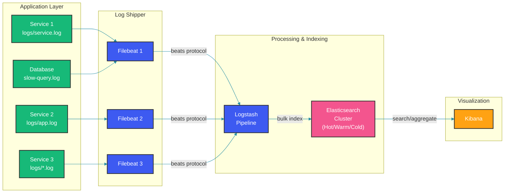

# Centralized Logging with ELK Stack

## Overview

Centralized logging consolidates logs from distributed services into a single searchable platform. The ELK Stack (Elasticsearch, Logstash, Kibana) combined with Filebeat provides a scalable pipeline for log collection, parsing, storage, and visualization. This guide covers the architecture, structured logging patterns, and production deployment considerations.

## ELK Pipeline Architecture

Logs flow from application instances through lightweight shippers to the processing and storage tiers.



## Structured Logging in Spring Boot

### Logback Configuration with Structured Format

```xml
<configuration>
    <appender name="STRUCTURED" class="ch.qos.logback.core.ConsoleAppender">
        <encoder class="net.logstash.logback.encoder.LogstashEncoder">
            <includeContext>true</includeContext>
            <customFields>{"application":"order-service","environment":"production"}</customFields>
            <fieldNames>
                <timestamp>@timestamp</timestamp>
                <version>[ignore]</version>
                <logger>logger.name</logger>
                <thread>thread</thread>
                <level>level</level>
                <message>message</message>
                <stackTrace>stack_trace</stackTrace>
            </fieldNames>
        </encoder>
    </appender>
    
    <root level="INFO">
        <appender-ref ref="STRUCTURED"/>
    </root>
</configuration>
```

### Structured Logging with Context

```java
@Service
public class OrderService {
    private static final Logger log = LoggerFactory.getLogger(OrderService.class);
    
    public Order createOrder(OrderRequest request) {
        // Add structured fields to MDC
        MDC.put("orderId", request.getOrderId());
        MDC.put("userId", request.getUserId());
        MDC.put("amount", String.valueOf(request.getAmount()));
        
        try {
            log.info("Creating order");
            
            Order order = processOrder(request);
            
            // Structured key-value pairs
            log.info("Order created successfully",
                "orderId", order.getId(),
                "status", order.getStatus(),
                "processingTimeMs", order.getProcessingTime());
            
            return order;
        } catch (Exception e) {
            log.error("Order creation failed",
                "error", e.getMessage(),
                "errorCode", e.getClass().getSimpleName());
            throw e;
        } finally {
            MDC.clear();
        }
    }
}
```

### Aspect-Oriented Logging

```java
@Aspect
@Component
public class LoggingAspect {
    
    @Around("@annotation(Logged)")
    public Object logMethodExecution(ProceedingJoinPoint joinPoint) throws Throwable {
        MethodSignature signature = (MethodSignature) joinPoint.getSignature();
        String methodName = signature.getMethod().getName();
        String className = signature.getDeclaringType().getSimpleName();
        
        long startTime = System.currentTimeMillis();
        
        log.info("Method started: {}.{}", className, methodName,
            "args", joinPoint.getArgs());
        
        try {
            Object result = joinPoint.proceed();
            long duration = System.currentTimeMillis() - startTime;
            
            log.info("Method completed: {}.{}", className, methodName,
                "duration_ms", duration,
                "result", result);
            
            return result;
        } catch (Exception e) {
            long duration = System.currentTimeMillis() - startTime;
            
            log.error("Method failed: {}.{}", className, methodName,
                "duration_ms", duration,
                "exception", e.getMessage());
            throw e;
        }
    }
}
```

## Logstash Pipeline Configuration

### Parsing and Transformation

```ruby
input {
  beats {
    port => 5044
    ssl => true
    ssl_certificate => "/etc/logstash/certs/logstash.crt"
    ssl_key => "/etc/logstash/certs/logstash.key"
  }
}

filter {
  # Multi-line handling for stack traces
  multiline {
    pattern => "^\\s"
    what => "previous"
  }
  
  # Parse structured JSON logs
  json {
    source => "message"
    target => "parsed"
    remove_field => ["message"]
  }
  
  # Add environment metadata
  mutate {
    add_field => {
      "[@metadata][index_prefix]" => "logs-%{+YYYY.MM.dd}"
    }
  }
  
  # GeoIP for access logs
  geoip {
    source => "[parsed][client_ip]"
    target => "geo"
    add_tag => ["geoip_lookup"]
  }
}

output {
  elasticsearch {
    hosts => ["${ELASTICSEARCH_HOSTS}"]
    index => "%{[@metadata][index_prefix]}"
    user => "${ELASTICSEARCH_USER}"
    password => "${ELASTICSEARCH_PASSWORD}"
    
    # Data stream for better lifecycle management
    data_stream => true
    data_stream_type => "logs"
    data_stream_dataset => "spring.boot"
    data_stream_namespace => "production"
    
    # Throttle bulk requests
    flush_size => 500
    idle_flush_time => 5
  }
}
```

## Elasticsearch Index Management

### Index Lifecycle Policy

```java
@Configuration
public class ElasticsearchIndexConfig {
    
    @Bean
    public PutLifecyclePolicyRequest indexLifecyclePolicy() {
        return PutLifecyclePolicyRequest.builder()
            .name("logs-policy")
            .policy(new LifecyclePolicy(
                new Phases(
                    // Hot phase: indexing and recent search
                    new HotPhase("30gb", null, 
                        new RolloverActions(null, null, 30L, null)),
                    
                    // Warm phase: frequent reads, compressed storage
                    new WarmPhase("30d", 
                        new AllocateAction(null, 1, null),
                        new ForceMergeAction(1),
                        null),
                    
                    // Cold phase: rare reads, highly compressed
                    new ColdPhase("90d", 
                        new FreezeAction(),
                        null),
                    
                    // Delete phase: remove old data
                    new DeletePhase("180d", null, null)
                )
            )).build();
    }
}
```

## Searching and Visualizing Logs

### Kibana Query Examples

```
# Find errors in specific service
service: "order-service" AND level: "ERROR"

# Trace a specific transaction
trace_id: "abc123xyz"

# Find slow queries (response time > 2s)
response_time_ms: > 2000

# Group errors by exception type
level: "ERROR" | stats count by exception_type

# Time-based analysis
@timestamp: [now-1h TO now] AND status: 500
```

## Spring Boot Integration with Filebeat

```java
// application.yml
logging:
  file:
    path: /var/log/orders
    name: ${logging.file.path}/order-service.log
  pattern:
    console: "%d{ISO8601} %-5level [%thread] %logger{36} - %msg%n"
    file: "%d{ISO8601} %-5level [%thread] %logger{36} : %msg%n"
  level:
    root: INFO
    com.example.orders: DEBUG
```

## Best Practices

- Use structured logging (JSON) from the start rather than parsing unstructured text later; it's more reliable and faster
- Include correlation IDs (traceId, spanId) in every log entry to correlate logs across services
- Configure Logstash pipelines with persistent queues to buffer logs during Elasticsearch outages
- Use Elasticsearch data streams with ILM for automatic index lifecycle management (hot-warm-cold-delete)
- Add rate limiting in Filebeat to prevent backpressure on application nodes during log spikes
- Monitor ELK pipeline health: Filebeat registration, Logstash queue depth, Elasticsearch indexing rate and search latency
- Implement log sampling for high-volume debug logs during normal operation, switching to full capture during incidents

## Common Mistakes

- Logging sensitive data (passwords, PII, credit cards) without redaction or masking filters
- Using unstructured log messages that require complex regex parsing and break when log format changes
- Sending all debug-level logs to production Elasticsearch, causing excessive storage costs and slow searches
- Not configuring index rollover limits, causing oversized shards that degrade cluster performance
- Skipping Logstash persistent queues, resulting in log loss during Elasticsearch restarts or network issues
- Setting too few Elasticsearch shards (single shard capped at 50GB) or too many (shard overhead)

## Summary

The ELK Stack provides a complete centralized logging solution from collection through visualization. Structured JSON logging from Spring Boot services feeds into Filebeat, which forwards to Logstash for parsing and enrichment, then to Elasticsearch for indexing. Kibana enables powerful search and dashboarding across billions of log entries. Success requires careful planning of index lifecycle management, Logstash pipeline robustness, and consistent structured logging practices across all services.

## References

- [Elasticsearch Guide](https://www.elastic.co/guide/en/elasticsearch/reference/current/index.html)
- [Logstash Configuration](https://www.elastic.co/guide/en/logstash/current/index.html)
- [Filebeat Documentation](https://www.elastic.co/guide/en/beats/filebeat/current/index.html)
- [Logstash Logback Encoder](https://github.com/logstash/logstash-logback-encoder)
